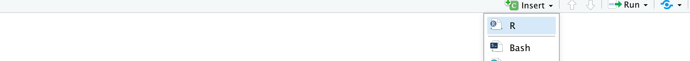
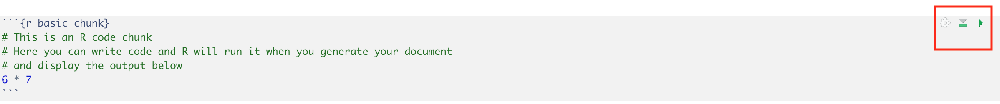

# Week 2 {}

## Introduction to RMarkdown

```{r setup, include=FALSE}
knitr::opts_chunk$set(echo = TRUE)
```

```{r task_fun, echo=FALSE}
t <- 1 # Task counter
task <- function(x = t) {
  t <<- x + 1
  return(paste0("**Task ", x, ": **"))
}
```

Welcome to the second lab of dapR 1.

This week, we will introduce **R Markdown (Rmd)**, an extremely versatile and powerful tool for writing reproducible documents of all sorts and formats. We promise you that once you get the hang of it, you will never again want to use your ordinary word processor/text editor for writing reports and notes that are based on data analysis.
In fact, all the teaching materials in this course, from the lecture slides to these lab sheets, have been written in Rmd.

Apart from Rmd, this week we will also have a bit of a closer look at the little bits of RStudio and walk you through environment, packages, libraries and editing spaces. Once again, do not worry if you do not remember everything at once, we will continue using various Rstudio panels each week and soon enough it will become a habit.


##  What is R Markdown?

Well, it is a language - or a system - for telling computers how to process and format text.
At this point you might be thinking “why on Earth should I be learning this when I can just use the text editor or Word on my computer?!”.
That is a good question and the answer to it is that, when it comes to Rmd, its integration with R Studio makes it an incredibly useful tool for writing documents that include the results of a statistical analysis or data visualisations. You can easily write text and include code where you need to. Compared to R scripts that we showed you last week, we have more flexibility here.  


## Getting things ready

Before you do anything else, open R Studio and install the rmarkdown package if you have not yet done so. This package will enable you to convert files written in Rmd to output of your choice.

`r task()`Type *exactly* the following command into the console and press <kbd>&crarr; Enter</kbd>:

```{r install_rmd, eval = F}
install.packages("rmarkdown")
```

\ 

\ 
 Once you have done the step above, you do not need to repeat it again, unless you update your R or work on another computer.


`r task()`Download and open the Week2_pratice.Rmd file (you can find it [here](https://uoe-psychology.github.io/uoe_psystats/dapr1/labsheets/week2_practice.Rmd) and on Learn) and have a look what you can see in there. We will walk you through the first steps - there is some practice for you to try as well.

## R Markdown basics

 Once you have done the step above, you do not need to repeat it again, unless you update your R or work on another computer.

## Headings

First, lets look at how you would make headings using #:

 # Section 1 

 ## Subsection 1 

 ### Sub subsection 1 


## Text

You can also vary the format of your text:

`*italics*` returns *italics*
  
`**bold**` returns **bold**
  
`~~strikethrough~~` returns ~~strikethrough~~
  
`superscript^2` returns superscript^2

`subscript^~2~` returns subscript^~2~


##  Tables

An example of simple table that can be produced using RMarkdown is presented below. You will get an illustration on how to build one in your practice template.

Operation       | R code                | Example Input    | Example Output
-------------   | -------------         |--------------    | -------------
Square root     | `sqrt( )`             | sqrt(100)        | 10
Absolute value  | `abs( )`              | abs(-100)        | 100
Round           | `round(x, digits = )` | round(12.345, 2) | 12.35
Min             | `min(...)`            | min(2.21, 2.22)  | 2.21
Max             | `max(...)`            | max(2.21, 2.22)  | 2.22


## Lists
We can list items pretty easily.

### Unordered 
- Item
- Item
- Item

### Ordered
1. Item 1
2. Item 2
+ Sub-item 2.1
3. Item 3

\ 

\ 


\ 

And most importantly, we can include chunks of code which will produce the required output when we compile our document all together.
Find a button `insert’ on the top right corner of your Rmd editor. Choose ‘R’.


 
```{r, echo = FALSE}

```
 
You will be able to see a chunk where you can put a comment and an example of an operation (say multiplication - try to vary those as you go). Press the green button on the right in the code chunk. 


```{r basic_chunk}
# This is an R code chunk
# Here you can write code and R will run it when you generate your document
# and display the output below
6 * 7
```


```{r, echo = FALSE}

```
 
\ 

\ 

\ 


For a quick reference guide to Rmd, see this cool [cheat sheet](https://www.rstudio.com/wp-content/uploads/2016/03/rmarkdown-cheatsheet-2.0.pdf){target="_blank"}.


##  Rmd documents

OK, now that you understand simple editing, let’s look at the .Rmd file step-by-step.
The first thing to realise is that an .Rmd file is just a plain **text file** (such as .txt). You could open it in Notepad, MS Word, or OpenOffice and you would basically see the same thing as in R Studio. The only reason for the special .Rmd extension is for R Studio to know to put all the nice colours in to aid readability and offer you options associated with R Markdown, such as the option to actually generate a document from the file.

With that out of the way, but let’s scroll all the way up in the .Rmd file. There, you can see this header:


```
---

pdf_document: default
title: "Introducing R Markdown"
author: "dapR 1 -- Lab 2"
output:
  html_document: default
  pdf_document: default

```


In our document, we set the title and author and define the output to be html and pdf (we will show you what we mean by that!) Setting your output file to HTML file is equivalent to the format of websites, which is why we can easily put it online like our book. You can also try out to create PDF of even Word from your Rmd file and save it in your folder. For this semester and perhaps, this year - lets stick to HTML output.


## Code chunks

Let’s talk a little more about code chunks, since they are the main reason why Rmd is so useful when it comes to reports of statistical analysis. For one, they are great for creating tables and figures. As a basic demonstration, we can create a simple **histogram**. 
Again, at this point, you don’t have to worry about understanding the code itself. The important bit is that, once you know how to create fancy plots and tables, you can create them directly in your .Rmd file to put them in your paper/report/presentation.
We can first create some data.


```{r}
# create a made up sequence of numbers and pretend they are the ages of our participants
age <- c(34, 22, 26, 25, 43,19, 19, 20, 33, 27, 27, 26, 54)
```

We can then try to plot it (say using histogram for now). We will teach you more about plots in week 4.

```{r}
hist(age) # basic quick histogram
```

This feature has a very useful consequence: you can write a document in such a way that, if something about your data or analysis changes, you can simply edit the code in the appropriate chunks, re-generate the output file and all the values will get updated including your plots.

Imagine having to redo a table of 40, 50 or 100 numbers – that’s an awfully tedious task and it’s prone to human error. With a proper use of R Markdown you will never have to do it! Imagine how many hours of work that will save you (trust us, it’s a lot).

\

## Common Code Chunks Options
For now, you can stick to simple code chunks without worrying too much about adding extra options. For future reference, the specifications below could be added to your code chunks.

**Important note: When provided with a template each week sometimes we will add some modifications to your chunks, please do not edit them or delete anything there as this may affect how your final document looks.**

If you are keen to learn more about what these settings do, see below:

* `name` - This allows you to name your code chunks, but is not necessary unless you want to reference them later
* `echo` - Whether to display the code chunk or just show the results. `echo=FALSE` will embed the code in the document, but the reader won't be able to see it
* `eval` - Whether to run the code in the code chunk. `eval=FALSE` will display the code but not run it
* `warning` - Whether to display warning messages in the document
* `message` - Whether to display code messages in the document
* `results` - Whether and how to display the computation of the results


## Including images or links

### Adding links

You can add links to your text quite easily, using square brackets and including the webpage link e.g. [here] (LINK). In practice, just remove the space.

See our book [here] (https://bookdown.org/animestina/dapr1_labs/)


### Adding figures & pictures
Include a picture from online or from your working directory (more on the latter later). With link it’s pretty simple:

```{r, echo=TRUE, caption='Source:DataCamp', fig.align="center"}
knitr::include_graphics("https://imgs.xkcd.com/comics/correlation.png")
```

You can try to add another one in your practice Rmd file as well.

## Generating documents

Now that you have an understanding of the basics of Rmd along with some nifty tricks and can read the source file, let’s talk about how to generate output from the .Rmd files.
The simplest way of turning the source file into output is by using the ‘Knit’ button at the top left of your Rmd file.


```{r, echo=FALSE, fig.align="center"}
knitr::include_graphics("images/compile.gif")
```

The first time you generate a document like this, it can take a while for R to install and run all the tools necessary to produce your output. After a moment, the result should pop out in R Studio’s internal viewer. Take a minute to marvel at your creation!

OK, that’s plenty for now! Close the viewer window and check your “Week_2” folder.
Therein, you should find a file called “Week2_practice.html”.  This is your actual output. Every time you adjust your Rmd file and compile it again, your output file will get updated as well.

If you open it, it should appear in your default web browser because HTML files are the stuff websites are made from.
 

That is all we have in store for you for this lab. We suggest you go over what you learnt today to help your newly acquired knowledge settle. We will be using an Rmd template each week and soon enough you will get used to compiling one at the end of each lab.


## Extra: Open/Save files on Rstudio Cloud  (Chrome users)

If you are using Chrome Books you will find that there is slight difference with respect to how you would load/save files in RStudio. To provide you with an example on how to open and save the file for this week please use the guide below:


```{r, echo=FALSE, fig.align="center"}
knitr::include_graphics("images/cloud_load.gif")
```

