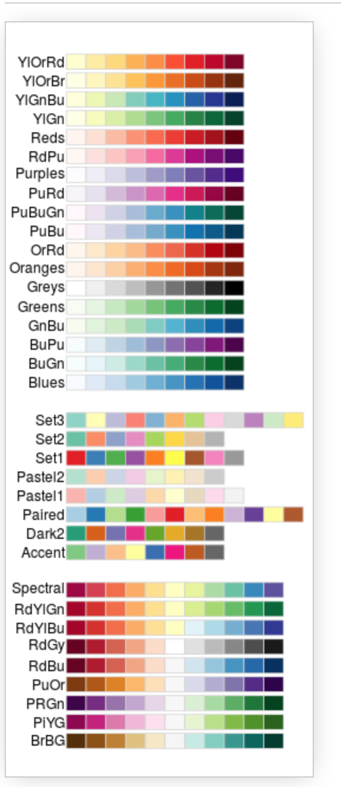

# Week 4 {}

## Introduction to plots & geoms (ggplot)
This week we will walk you through both simple and slightly advanced visualisations in R. Visualisations can in fact be a very creative task and you can let yourself go wild with colours and shapes to visualise your data. :) 

Good visualisations can also be very powerful when it comes to telling a story with your data. Watch out next time you are reading a news article that uses data. Check how they present the data, what types of graphics they use and how easy it is to read the message. Some cool examples of visualisations made in R for the BBC can be found [here](https://medium.com/bbc-visual-and-data-journalism/how-the-bbc-visual-and-data-journalism-team-works-with-graphics-in-r-ed0b35693535).

```{r, echo = FALSE}
knitr::include_graphics("images/BBC_R.png")
```

Below we will show you quite a few examples of what you can do with R. This week we want to focus mainly on one-variable visualisations using ggplot(). We will leave some extra materials for you to work through in your own time on how to plot two or more variables. You will need those later in your courses so bookmark the page for the future. :)

```{r}
# Load tidyverse
library(tidyverse)
```

## Visualisations

Remember that last week we created some data.  But what does it *look* like? Visualising data is one of the most important tasks facing the data analyst or researcher. It's important to be able to display your data clearly and coherently, as it makes it easier for the reader to understand. Plus, it helps **you** to understand your data.

The best way to learn plots is by practicing building and modifying simple visualisations. This week we will focus on the key plots you will need to visualise a continuous and a categorical variable, plus a plot that allows you to combine the two.

## Get our data sorted

Before we get into using specialised graphics, let's start by drawing a few very simple graphs to get a feel for what it's like to draw pictures using `R`. 

We will need first to have data. Luckily, there are some in-built datasets that we can use for this illustration. We will use diamonds.

## Numerical data

```{r}
# Get diamonds dataset
data <- diamonds
```

We can use help to find out more about this dataset. Try to run the code below:

```{r}
?diamonds
```

You will see some information in your right-hand pane. It is handy to use `? ... ` for anything you may want clarification on. 

```{r}
# Glimpse
glimpse(diamonds)
```

We have quite detailed information about each diamond. Take note of the number of observations and the number of variables.  Let's try to visualise some of the key variables. We will focus on **price** and **cut**.

## Simple one-variable plot using ggplot()

We can start by creating a space in R where we will map our data. Let's start by specifying the dataset we want and the variable we are interested in plotting.

### Continuous variable

```{r}
# Simple histogram plot for variable 'price' - baseline
ggplot(data = data, aes(x = price)) 
```

Note the key components of the specification above:

*  `data:` where we provide the name of the dataset. 
*  `aes: ` where we provide the aesthetics, i.e. the 'x-scale' or more precisely, what we are mapping. 

We will now need to add geometry - this will be the way our data will be mapped to the space we have just defined:

* `geometry:` specifies which type of plot we want to use (i.e geom_bar(), geom_histogram()).

Some of the key plot specifications we may need are: 

*For one variable*:

* `+ geom_bar()` adds a bar plot geometry to the graph.
* `+ geom_histogram()` adds a histogram geometry to the graph.
* `+ geom_boxplot()` adds a boxplot geometry to the graph.
* `+ geom_violin()` adds a violin plot geometry to the graph.

*For two variables*:

* `+ geom_point()` adds a point (scatter plot) geometry to the graph (use with two continuous variables).
* `+ geom_boxplot()` adds a boxplot geometry to the graph (great for plotting a continuous variable which is grouped).

```{r}
# Simple histogram for variable 'price'
ggplot(data = data,aes(x = price)) +
  geom_histogram()
```

Check carefully what you are seeing. We have an x axis (price) and a y axis (count). We can see that we have more diamonds of the price below $10,000 and fewer very expensive ones.

From the first look, I feel the plot could be nicer. Perhaps we could edit our axes, provide a title or change the background? Well, we can do all of these things!

Let's start with the axes and the title.

```{r}
# Simple histogram for variable 'price'
ggplot(data = data, aes(x = price)) +
  geom_histogram() + 
  labs(x = "Price of the diamond ($)",  # Add x axis label
       title = 'Histogram of diamond prices' ) # Add title
```

We can now modify what our histogram looks like. We will work within `geom_histogram()`. Note how we leave brackets empty when we are going with the default option. By adding specifications we can modify the look of our graph.

I will use `color` and `fill` arguments. Try varying these to see how they change:

The key colours that are available are (there are more if you need!):

```{r, echo = FALSE}
knitr::include_graphics("images/col.png")
```

Let's pick some which are good for the reader. If you find that certain colours create certain associations with the data you are plotting that could be helpful or confusing - so please be careful about which ones you choose. We are going with classic:

```{r}
# Simple histogram for variable 'price'
ggplot(data = data, aes(x = price)) +
  geom_histogram(color = "black", fill = "white") +  # I would like to change the fill to white
  labs(x = "Price of the diamond ($)",  # Add x axis label
       title = 'Histogram of diamond prices') # Add title
```

Try to vary the colours (you could make it quite bright):

```{r}
# Simple histogram for variable 'price'
ggplot(data = data, aes(x = price)) +
       geom_histogram(color = "red", fill = "blue") +  # I would like to change the fill to blue
       labs(x = "Price of the diamond ($)",  # Add x axis label
            title = 'Histogram of diamond prices') # Add title
```

Whilst we are here, we can also add density to our plot to better visualise the underlying distribution of our variable:

```{r}
# Simple histogram for variable 'price'
ggplot(data = data, aes(x = price)) + 
  geom_histogram(aes(y = ..density..), color = "brown", fill = "grey") + 
  geom_density() + # Note that I have now added aes(y=..density..) 
  labs(x = "Price of the diamond ($)",  # Add x axis label
       title = 'Histogram of diamond prices') # Add title
```

We can also adjust the line type around our bins in the histogram, note how we can add `linetype=` argument inside of geom_histogram().

```{r}
# Simple histogram for variable 'price'
ggplot(data = data,aes(x = price)) +
  geom_histogram(aes(y = ..density..), color = "brown", fill = "grey", linetype = "dashed") +  
  geom_density() + # Note that I have now added aes(y = ..density..) 
  labs(x = "Price of the diamond ($)",  # Add x axis label
       title = 'Histogram of diamond prices' ) # Add title
```

Lastly, to reflect on some new knowledge, we can also add a line to indicate where the mean of the variable is. We will use `geom_vline`.

```{r}
# Simple histogram for variable 'price'
ggplot(data = data, aes(x = price)) +
  geom_histogram(aes(y = ..density..), color = "brown", fill = "grey",  linetype = "dashed") +        
  geom_density() + # Note that I have now added aes(y = ..density..) and geom_density() 
  geom_vline(aes(xintercept = mean(price)), # Note how we provide x intercept using mean(x)
             linetype = "dashed")+  # You can modify the line here as well (change size, colour)
  labs(x = "Price of the diamond ($)",  # Add x axis label
       title = 'Histogram of diamond prices') # Add title
```

I want to make the line a bit bigger and maybe red so it's easier to see:

```{r}
# Simple histogram for variable 'price'
ggplot(data = data, aes(x = price)) + 
  geom_histogram(aes(y = ..density..), color = "brown", fill = "grey", linetype = "dashed") +         
  geom_density() + # Note that I have now added aes(y = ..density..) 
  geom_vline(aes(xintercept = mean(price)), # Note how we provide x intercept using mean(x)
             linetype = "dashed", color = 'red', size = 2) + # You can modify the line here as well (change size, colour)
  labs(x = "Price of the diamond ($)",  # Add x axis label
       title = 'Histogram of diamond prices' ) # Add title
```

Nice! Now let's see how we can work with categorical data.

## Categorical variables

In the dataset we are working with we have one interesting categorical variable, the `cut` of the diamond. It has five levels (Fair, Good, Very Good, Premium, Ideal). Check what it looks like:

```{r}
# Check 'cut'
select(data, cut)
```

One way to visualise the data would be to start with a simple bar plot. Note how I again specified the data, the x axis and the type of plot I am interested in.

```{r}
# Simple bar plot for variable 'cut'
ggplot(data = data, aes(x = cut)) +
  geom_bar()
```

Nice! Let's do some edits as before. I will do them now in one go. Try to breakdown each modification that was added. I added something new here, namely `theme_minimal()`  so take a note how it changes the plot. 

```{r}
# Simple bar plot for variable 'cut'
ggplot(data = data, aes(x = cut)) + geom_bar(color = "grey", fill = "cornsilk") + 
  theme_minimal() + #use different theme
  labs(x = "Quality of the diamond cut", # Add x axis label
  title = 'Bar plot for the quality of diamonds cut') # Add title
```

There are a few others you can try as well (try them out):

 -   `theme_classic()`
 -   `theme_dark()`
 -   `theme_void()`
  
## Continuous variables grouped by a categorical one

Sometimes you may want to provide visualisation of continuous variables using groups. In our case, we could check how the price varies by the **cut** of the diamond. Note, now I will add `aes(x = cut, y = price)`. I have reversed the axis because I am now interested to show how **price** varies by **cut**. 

**Note:** This is a sneak peak into what you will be working on in Semester 2 - you will have an actual test to compare these groups for statistical differences but for now, let's carry on with our plots. ;)

I will now build a simple boxplot for price only, note that price is now in the argument as `y`.

```{r}
# Simple boxplot for variable price
ggplot(data = data, aes (y = price)) +
  geom_boxplot()
```
Now let's provide visualisations where we also include **cut**:

```{r}
# Simple boxplot for variable price by cut
ggplot(data = data, aes(x = cut, y = price)) +
  geom_boxplot()
```

Quite cool, don't you think? We can see that the average price is not that different and some diamonds are just very expensive regardless of the quality of the cut. This could be due to many reasons: carat, shape, clarity, etc.

Let's focus on editing the plot above. Here we can do even more editing - adjusting the colours to differentiate the type of diamond when visualising the price.

Let's first add fill to our `aes()`:
```{r}
# Simple boxplot for variable price by cut
ggplot(data = data, aes(x = cut, y = price, fill = cut)) +
  geom_boxplot() + theme_minimal() + 
  labs(x = "Quality of the diamond cut", y = "Price of the diamond ($)", # Add x and y axes labels
       title = 'Box plot of diamonds price by the cut' ) # Add title

```

We can also play with the colours using a palette, some of the common ones are below:

```{r, echo = FALSE}

```

You can now see that we can really edit the colours to our liking. Let's try using the palette 'Blues':

```{r}
# Simple boxplot for variable price by cut
ggplot(data = data, aes(x = cut, y = price, fill = cut)) +
  geom_boxplot() + theme_minimal() + 
  scale_fill_brewer(palette = "Blues") + #note the palette
  labs(x = "Quality of the diamond cut",
       y = "Price of the diamond ($)", # Add x and y axes label
       title = 'Box plot of diamonds price by the cut' ) # Add title
```

## Even more advanced

We can also provide visualisations  of **price** distribution by **cut** all in one go. Check this one out, you will need an extra package so make sure to run `install.packages('ggridges')`:

```{r, warning=FALSE, message=FALSE}
# Load the package after installation
library(ggridges)

# Now create fancy plot
ggplot(data, aes(x = price, y = cut)) +
  geom_density_ridges(aes(fill = cut)) + # Note how we add mutiple densities
  scale_fill_brewer(palette = "Blues") + # We can assign colours using pallette again
  labs(x = "Price of the diamond ($)",
       y = "Quality of the diamond cut", # Add x and y axes label
       title = 'Distributions of diamonds price by the cut') #Add title
```

Nice! Now you have seen some of the basics, we want you to try to build your own plots. Download the **Week4_practice.Rmd** file (download [here](https://uoe-psychology.github.io/uoe_psystats/dapr1/labsheets/week4_practice.Rmd) or from Learn) and use the notes above to help you where needed. 


## Practice.Rmd Solutions

Before the start, make sure that you have `tidyverse` loaded.

```{r}
# Load tidyverse
library(tidyverse)
```

### Exercise 1

For your first practice we want you to build a plot based on the example you have seen in the tutorial. We will work with `diamonds` again. 

```{r}
# Get diamonds dataset
data <- diamonds
```

Can you check which variables we have?

```{r}
# Glimpse at your data
glimpse(data)
```

Select variable **carat**.

```{r}
# Check carat
select(data, carat)
```

Produce a simple histogram (finish the expression below).

```{r}
# ggplot of carat
ggplot(data = data, aes(x = carat)) + geom_histogram()
```

Once you are happy with what you see above, try to add labels and change colours. 

```{r}
# Complete ggplot for carat
ggplot(data = data,aes(x = carat)) + 
  geom_histogram(aes(y =..density..), color = "cadetblue", fill = "bisque") + 
  geom_density() +   
  labs(x = "Weight of the diamond (carat)", 
       title = 'Histogram of diamond weight (carat)') 
```

If you want to put both plots side by side:

```{r}
# Assign your plots to specific objects
# plot1
plot1 <- ggplot(data = data,aes(x = carat)) +
  geom_histogram()

# plot2
plot2 <- ggplot(data = data,aes(x = carat)) +
  geom_histogram(aes(y = ..density..), color = "cadetblue", fill = "bisque") +
  geom_density() +   
  labs(x = "Weight of the diamond (carat)",  
       title = 'Histogram of diamond weight (carat)') 
```

You can then `install.packages('cowplot')` and use the following code:

```{r}
# Load package
library(cowplot)

# Set theme
theme_set(theme_grey())

# Put plots side by side
plot_grid(plot1, plot2)
```

### Exercise 2 

Now I am keen again to look at the categorical variable **cut** and ideally, I want to plot the differences in weight of the diamond by  **cut**.

Let's first produce a plot for **cut**, you need to use `geom_bar` here:

```{r}
# ggplot for cut
ggplot(data = data, aes(x = cut)) +
  geom_bar()
```

Try to make it a little nicer. 

```{r}
# ggplot for cut (with labels, title, colours)
# Simple bar plot for variable 'cut'
ggplot(data = data, aes(x = cut)) +
  geom_bar(color = "grey", fill = "blue") +
  labs(x = "Quality of the diamond cut", 
       title = 'Bar plot for the quality of diamonds cut') +
  theme_minimal()
```

Finally, get the visualisation of **carat** by **cut**:

```{r}
# ggplot for carat by cut (add labels, title, colours) - I started this one  for you:
ggplot(data = data, aes(x = cut, y = carat, fill = cut)) +
  geom_boxplot() +
  theme_minimal() +
  scale_fill_brewer(palette="Pastel2") +
  labs(x = "Quality of the diamond cut", y = "Weight of the diamond (carat)",  
       title = 'Box plot of diamond weight (carat) by the cut') 
```

### Exercise 3 -  Advanced 

Here is the plot which is based on slighly different data. For this task you will need to get the data and explore it yourself. You will then want to work with key variables that are visible on the plot below. Your task is to recreate the plots. 


```{r}
# Load data
data2 <- iris

```

Check what each variable means:
```{r}
?iris
```

```{r}
# Simple plot of sepal length
ggplot(data = data2, aes(y = Sepal.Length)) +
  geom_boxplot()  

```
```{r}
# Sepal length by species
ggplot(data = data2, aes(x = Species, y = Sepal.Length)) +
  geom_boxplot()
```

Note that here we also adjusted the position of the legend and the theme.

```{r}
# Advanced plot
ggplot(data = data2, aes(x = Species, y = Sepal.Length)) +
  geom_boxplot(aes(fill = Species)) + 
  ylab("Sepal Length") +
  ggtitle("Iris Data Boxplot: Sepal Length by Species") +
  scale_fill_brewer(palette="YlGn") +
  theme_dark()
```

```{r}
# Even more advanced plot
library(ggridges)

ggplot(data2, aes(x = Sepal.Length, y = Species)) +
  geom_density_ridges(aes(fill = Species)) + # Note how we add mutiple densities
  scale_fill_brewer(palette = "YlGn") + # We can assign colours using pallette again
  labs(x = "Sepal Length", y = "Species",
       title = 'Distributions of sepal length  by  species') # Add title
```
