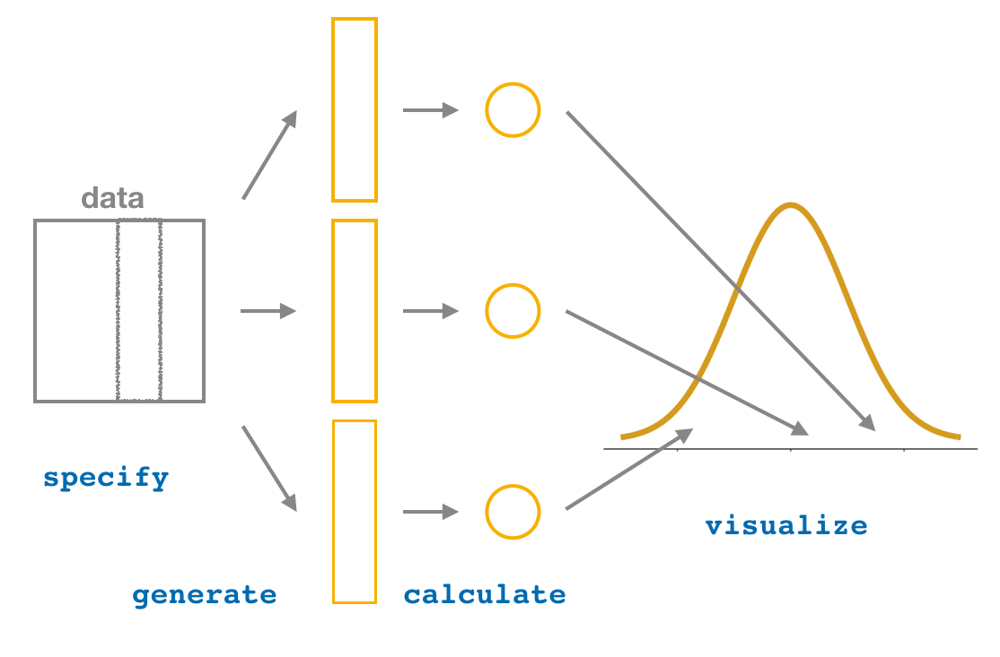

```{r, echo=FALSE}
HIDDEN_SOLS=FALSE
set.seed(987)

ggplot2::theme_set(ggplot2::theme_gray(base_size=13))
```

# Bootstrapping and Confidence Intervals  

<div class="lo">
#### Instructions {-}

- In this two-hour lab we will go through worked examples in the first hour, and you will attempt to answer some questions in the second hour.
- The Rmarkdown file for this week is [here](https://uoe-psychology.github.io/uoe_psystats/dapr1/labsheets/week_12_practice.Rmd).


#### Learning outcomes {-}

**LO1.** Understand how bootstrap resampling with replacement can be used to approximate a sampling distribution.

**LO2.** Understand how the bootstrap distribution can be used to derive a range of highly plausible values (a **confidence interval**).

#### Reading {-}
This week's reading is [Chapter 8](https://moderndive.com/8-confidence-intervals.html) of the book by Chester Ismay and Albert Y. Kim. *Statistical Inference via Data Science: A ModernDive into R and the Tidyverse*. Chapman and Hall/CRC, 2019. Freely available online at: https://moderndive.com/
</div>

## Recap

Last week, we learnt about how we can take a **statistic** from a sample to draw conclusions about a **parameter** of the population from which the sample is drawn. 
We then focused on how these sample statistics will vary from sample to sample. We saw that by taking lots of samples we could create a **sampling distribution** for a statistic, allowing us to quantify the variation in the sample statistics due to sampling. Specifically, we learnt that the standard deviation of the sampling distribution is known as the **standard error**. 
Finally, we saw how the size of our samples influences the sampling variation, with bigger samples leading to narrower sampling distributions, and more precise estimates.  

This week, we are going to continue to think about how we can quantify sampling variation, but specifically when we have only a single sample (which is often the case in real life). We will also see how, just as we can take a sample in order to calculate a single point estimate of a population parameter, we can use sampling variation to construct a *range of plausible values* which, in the case of uncertain estimates, might be more meaningful than a single value. 

## From Sampling to Resampling  

We mentioned last week that we often have neither the time nor the resources to collect data from the entire population (a **census**). It is also often infeasible to get *many samples* of size $n$ in order to get an idea of how accurate our estimate of the population parameter is. 

*How can we study the variability of our sample statistic with only one sample?*   

It turns out that we can mimick the act of sampling $n$ units from the population, by *resampling with replacement* $n$ units from our original sample of $n$ units. This is broadly known as **bootstrapping**.

<div class="def">
#### Bootstrapping {-}
**Bootstrap definition:** Random sampling *with replacement* from the original sample, *using the same sample size.*
</div>

`r msmbstyle::question_begin(header="&#x25BA; The NFL Example")`
Think back to last week. We saw a dataset of *all* the National Football League players at the beginning of 2015, along with their yearly salaries. 

This was our **population** (in real life we often don't have data on the entire population). 

We took multiple samples of 50 players in order to study how the mean salaries of those samples varied (this allowed us to determine the accuracy of using a mean from a sample of 50 players, $\bar{x}$, as an estimate of the population parameter, $\mu$). 
In fact, we took 2000 samples of 50 players, which is not at all feasible in practice.  

Now let's imagine we only collect one sample of 50 players. 
We can approximate the sampling distribution of $\bar{x}$ (the mean salary of our sample) by **bootstrapping**. 
To do this, we:

1. collect a sample of 50 players;
2. compute the mean salary of the sample;
3. take a random sample *with replacement* of 50 players *from our original sample* (this is known as a **resample**), and compute the mean of the resample;
4. re-do step three many times. 

<div class="red">
#### Think {-}  

What do we mean by *"with replacement"*, and why is it necessary?
`r msmbstyle::solution_begin(header = "&#x25BA; Answer", hidden=FALSE)`
*"With replacement"* simply means that as we take our sample, we replace the first item before we choose the second.. and so on.  
**If we resampled our 50 player sample *without* replacement, we would simply end up with the same 50 players, and therefore the same mean!**
`r msmbstyle::solution_end()`
</div>

`r msmbstyle::question_end()`

`r msmbstyle::solution_begin(hidden=FALSE, toggle=FALSE)`
1. Take a sample. We have a sample of 50 players and their salaries, which we can read in to R as follows:  
```{r message=FALSE}
library(tidyverse)
library(moderndive)

nfl_sample <- read_csv("https://edin.ac/2NATDCQ")

nfl_sample
```

2. Compute the mean salary of our sample:
```{r}
nfl_sample %>%
  summarise(avg_salary = mean(YearlySalary))
```

3. Sample our original sample, with replacement, and compute the mean:
```{r}
nfl_resample1 <- nfl_sample %>%
  rep_sample_n(size = 50, replace = TRUE)

nfl_resample1

nfl_resample1 %>% 
  summarise(avg_salary = mean(YearlySalary))
```

4. and again..
```{r}
nfl_resample2 <- nfl_sample %>%
  rep_sample_n(size = 50, replace = TRUE)

nfl_resample2

nfl_resample2 %>% 
  summarise(avg_salary = mean(YearlySalary))
```
and so on...  

```{r echo=FALSE}
data.frame(
  sample = c("Original Sample","Resample 1","Resample 2"),
  statistic = c(mean(nfl_sample$YearlySalary),mean(nfl_resample1$YearlySalary),mean(nfl_resample2$YearlySalary))
) %>% knitr::kable()
```
`r msmbstyle::solution_end()`

## Getting to the bootstrap distribution  

<div class="red">
##### Key point {-}  

If we resample with replacement from our original sample enough times, then the distribution of all the means of these *resamples* begins to approximate the sampling distribution. 
</div>

We can speed up this process by getting R to take many resamples for us, in the same way that last week we asked it to take many samples from a population.
```{r}
nfl_2000resamples <- nfl_sample %>% 
  rep_sample_n(size = 50, replace = TRUE, reps = 2000)
```
The above line of code takes 2000 samples of size 50, by sampling with replacement from our original sample of size 50. $2000 \times 50 = 100,000$, so this results in a tibble with $100,000$ rows.  
```{r}
nfl_2000resamples
```

We can compute the mean of each of the 2000 *resamples* drawn from the original sample (just like last week when we computed the mean of each of 2000 samples drawn from the population).
```{r}
nfl_resample_means <- nfl_2000resamples %>%
  group_by(replicate) %>%
  summarise(avg_salary = mean(YearlySalary))
```

and we can plot them:
```{r message=FALSE}
ggplot(nfl_resample_means, aes(x = avg_salary)) + 
  geom_histogram(color = "white") + 
  labs(x = "resample mean")
```

`r msmbstyle::question_begin()`
Where do you think that this histogram is centred?

+ The mean salary of the population ($\mu$).
+ The mean salary of the original sample ($\bar{x}$).
+ Somewhere else.
`r msmbstyle::question_end()`

`r msmbstyle::solution_begin(hidden=FALSE)`
The distribution of means of resamples will be centred around the *mean of our original sample*, which was 2.11.
```{r}
nfl_resample_means %>%
  summarise(mean_of_means = mean(avg_salary))
```
`r msmbstyle::solution_end()`

`r msmbstyle::question_begin()`
Last week we looked at the **standard error** (the standard deviation of the sampling distribution). 
We have seen how the **boostrap distribution** is an approximation of the **sampling distribution**. 

TRUE or FALSE: The standard deviation of the bootstrap distribution is an approximation of the standard error of $\bar{x}$.
`r msmbstyle::question_end()`
`r msmbstyle::solution_begin(hidden=FALSE)`
TRUE!
`r msmbstyle::solution_end()`


## More generally...

Now let's think more generally about what we did there... 

1. We were interested in estimating some unknown parameter of a population.
1. We had a sample of size $n$ drawn at random from the population.
1. We took lots of *resamples* (of size $n$) from our original sample, and calculated a statistic for each one. 
1. We then visualised the distribution of those statistics. 

The tool below will help to conceptualise these steps:

+ **The big blue distribution at the top**: The population.  
+ **The vertical blue line**: The population parameter $\mu$.
+ **The yellow sample button**: Takes a sample from the population (note you can change the sample $n$).
+ **The green resample button**: Samples with replacement from the original sample (the yellow one), and calculates the mean (which is then dropped into the bottom panel).
+ **The bottom panel**: The distribution of resample means - the bootstrap distribution!

Spend 10 minutes changing things such as the sample size. If you have any questions about what is happening, then please ask either now or during the lab.  
`r knitr::include_url("https://web.archive.org/web/20160807193104/http://wise1.cgu.edu/vis/bootstrap/", height="650px")`
**source: [https://web.archive.org/web/20160807193104/http://wise1.cgu.edu/vis/bootstrap/](https://web.archive.org/web/20160807193104/http://wise1.cgu.edu/vis/bootstrap/)**

## Confidence Intervals

Take a look again at the bootstrap distribution we constructed (Figure \@ref(fig:bootstrap-dist), below). 
```{r bootstrap-dist, echo=FALSE, fig.cap="Bootstrap resampling distribution based on 2000 resamples", message=FALSE}
ggplot(nfl_resample_means, aes(x = avg_salary)) + 
  geom_histogram(color = "white") + 
  labs(x = "resample mean")
```
`r msmbstyle::question_begin()`
Roughly, between what two values do *most* of the resample means lie?
`r msmbstyle::question_end()`
`r msmbstyle::solution_begin(hidden=FALSE)`
"Most" is very vague. Just eyeballing, most of the distribution lies between 1.5 and 2.7. 
```{r message=FALSE}
ggplot(nfl_resample_means, aes(x = avg_salary)) + 
  geom_histogram(color = "white") + 
  labs(x = "resample mean") +
  geom_vline(xintercept = c(1.5, 2.7))
```
`r msmbstyle::solution_end()`

**Confidence intervals** simply answer more exactly where "most" sample means lie - they give us a *range of plausible values* for our population parameter. 

To construct a confidence interval, we need two things:  

1. a confidence level;  
1. a measure of sampling variability.  

We have the latter, in the form of our bootstrap distribution. The confidence level, instead, needs to be set by us.
For instance, we might ask between which values the middle 95% (or 90%, or 80%, etc.) of our distribution falls. 
In other words, the confidence level is the "success rate": the proportion of all samples whose intervals contain the true parameter.

<div class="def">
#### How exactly do we interpret a confidence interval? {-}

If we were to do this whole process over and over again: 

+ take a random sample of size $n$;
+ sample with replacement from that sample;
+ construct a 95% confidence interval.

Then about 95% of the confidence intervals we created would contain the population mean.  

So if we did this 100 times, we would expect about five of our 95% confidence intervals to not contain the true population mean. 

And if we had been constructing 80% confidence intervals instead, we would expect roughly 80 of them to contain the population mean.  
```{r eval=FALSE, echo=FALSE}
#nfl <- read_tsv('https://edin.ac/2TexAFA')
mu=mean(nfl$YearlySalary)

ci_100 <-
  nfl %>% rep_sample_n(size = 50, reps=100) %>%
  nest_legacy() %>%
  mutate(
    bs = map(data, ~rep_sample_n(., 50, replace = TRUE, reps=1000)),
    bs_sts = map(bs, ~summarise(., stat=mean(YearlySalary))),
    bs_ci = map(bs_sts, ~infer::get_confidence_interval(., level = 0.95, type = "percentile"))
  ) %>% select(replicate, bs_ci) %>%
  unnest_legacy() %>%
  mutate(containspop = ifelse(`2.5%`<= mu & `97.5%` >= mu, "in","out"))

ggplot(ci_100, aes(xmin=`2.5%`,xmax=`97.5%`, y=replicate))+
  geom_errorbarh(aes(col=containspop))+
  geom_vline(xintercept=mean(nfl$YearlySalary), col="red")
```
</div>

### Calculating confidence intervals using a bootstrap standard error

We can construct confidence intervals using the **standard error**. 
However, we *can not* compute standard errors from just one sample, so we need to estimate the standard error of a statistic using bootstrap. 

We also use the following rules of thumb: 

<div class="red">
##### If the distribution is symettric and bell-shaped... {-}
+ 68% of values will lie within 1 standard deviation of the mean.
+ 95% of values will lie within 1.96 standard deviations of the mean.
+ 99.7% of values will lie within 3 standard deviations of the mean.
```{r echo=FALSE}
knitr::include_graphics('images/normal.png')
```
</div>

We have our sample mean, and we can calculate the standard deviation of our bootstrap distribution (to approximate the standard error of the sample mean).
We therefore have all the information we need to calculate, for instance, a 95% confidence interval - it is simply $1.96 \times \text{standard error}$ above and below our mean. 

Formally, we can write this 95% interval as:   
  
<center>$\text{Statistic} \pm 1.96 \times SE$</center>  
  
  
And in R...
```{r}
# Recall that our original sample mean was 2.11496
original_sample_mean <- nfl_sample %>% 
  summarise(avg = mean(YearlySalary)) %>%
  pull(avg)

original_sample_mean

nfl_resample_means %>%
  summarise(
    est_SE = sd(avg_salary), 
    ci_lower = original_sample_mean - (1.96 * est_SE),
    ci_upper = original_sample_mean + (1.96 * est_SE)
  ) %>% select(ci_lower, ci_upper)
```


## Summary

Let's recap what we've done today:

1. We started with a **sample** from a **population**.
1. We calculated a **statistic** from our sample to estimate a **parameter** in our population.
1. We used **bootstrapping** (random sampling with replacement from our original sample) to estimate the **standard error** of the statistic.  
1. We constructed a range of plausible values (a **confidence interval**) by combining the sample statistic and the bootstrap estimate of the standard error of the statistic. 

We constructed our bootstrap distribution using code like below:
```{r}
bootstrap_distribution <- 
  nfl_sample %>%
  rep_sample_n(size = 50, replace = TRUE, reps = 2000) %>%
  group_by(replicate) %>%
  summarise(avg = mean(YearlySalary))
```

and we used the standard deviation of our bootstrap resample means... 
```{r}
bootstrap_distribution %>%
  summarise(est_SE = sd(avg))
```
to calculate some 95% confidence intervals using the formula:
<br>
<center>$\bar{x} \pm 1.96 \times SE$</center>
<br>
which became:  
<br>
<center>$2.11 \pm 1.96 \times 0.29$</center>
<br>
giving us a confidence interval of $[1.54, 2.68]$.  

<div class="red">
##### Stop and think {-}

What we did today entailed **specifying** what variable we were interested in, **generating** replicates, **calculating** the statistic for each replicate, and finally, we **visualised** the distribution. This is an important framework for understanding how to estimate sampling variation to evaluate the accuracy of our statistical inferences. The steps for this are visualised in Figure \@ref(fig:bootstrap-pipeline) below.  
```{r bootstrap-pipeline, echo=FALSE, fig.align='center', out.width='75%', fig.cap='Pipeline of bootstrapping-based inference'}

```
**Source: [https://moderndive.com/8-confidence-intervals.html](https://moderndive.com/8-confidence-intervals.html)**
</div>


## Take-home message

Using just one sample, it is possible to quantify estimation error by taking repeated resamples with replacement from our original sample. 
We can use this to construct ranges of plausible values of the parameter we are estimating. 

__This teaches us a standardised way of reporting uncertainty in our estimates.__

## Lab 

### Exercise 1: Hollywood Movies {-}

The following code chunk reads in a **sample** of the Hollywood movies data we saw last week. 
```{r, message=FALSE}
hollywood_sample <- read_tsv('https://edin.ac/2N9yHms') %>% # read the data
  select(Movie, Genre, RottenTomatoes) %>% # selects relevant variables
  drop_na %>% # removes all the NAs
  sample_n(size=25) # takes our sample
```

`r msmbstyle::question_begin()`
This week, we're interested in the average Rotten Tomatoes rating for all Hollywood movies between 2007 and 2013.   
What is our best estimate of this with the data we just read in?
`r msmbstyle::question_end()`
`r msmbstyle::solution_begin(hidden=HIDDEN_SOLS)`
$\bar{x}$, the mean Rotten Tomatoes rating for our sample.
`r msmbstyle::solution_end()`

`r msmbstyle::question_begin()`
Calculate the sample statistic.
`r msmbstyle::question_end()`
`r msmbstyle::solution_begin(hidden=HIDDEN_SOLS)`
```{r}
hollywood_sample %>% 
  summarise(avg_rating = mean(RottenTomatoes))
```
`r msmbstyle::solution_end()`

`r msmbstyle::question_begin()`
Generate 1000 bootstrap resamples to create the bootstrap distribution. 
`r msmbstyle::question_end()`
`r msmbstyle::solution_begin(hidden=HIDDEN_SOLS)`
```{r}
hwood_bs_distribution <- hollywood_sample %>%
  rep_sample_n(25, replace = TRUE, reps = 1000) %>%
  group_by(replicate) %>%
  summarise(avg_rating = mean(RottenTomatoes))

hwood_bs_distribution
```
`r msmbstyle::solution_end()`

`r msmbstyle::question_begin()`
Estimate the standard error of the sample statistic from your bootstrap distribution.
`r msmbstyle::question_end()`
`r msmbstyle::solution_begin(hidden=HIDDEN_SOLS)`
```{r}
hwood_bs_distribution %>%
  summarise(estimated_SE = sd(avg_rating))
```
`r msmbstyle::solution_end()`

`r msmbstyle::question_begin()`
Compute the 95% confidence intervals around our estimate of the average Rotten Tomatoes rating, and plot the bootstrap distribution and the confidence interval.
`r msmbstyle::question_end()`
`r msmbstyle::solution_begin(hidden=HIDDEN_SOLS)`
```{r}
hwood_samplemean <- hollywood_sample %>% 
  summarise(avg_rating = mean(RottenTomatoes)) %>%
  pull(avg_rating)

hwood_se <- hwood_bs_distribution %>%
  summarise(estimated_SE = sd(avg_rating)) %>%
  pull(estimated_SE)

hwood_ci_lower <- hwood_samplemean - 1.96 * hwood_se
hwood_ci_upper <- hwood_samplemean + 1.96 * hwood_se

ggplot(hwood_bs_distribution, aes(x=avg_rating)) +
  geom_histogram() +
  geom_vline(xintercept = c(hwood_ci_lower, hwood_ci_upper)) +
  labs(x = "bootstrap avg rating")
```
`r msmbstyle::solution_end()`

`r msmbstyle::question_begin(header = "&#x25BA; Extra")`
Go back to the top where we read in the data, and change the sample you are collecting from 25 to 50. Run the previous tasks again - how has the confidence interval changed?
`r msmbstyle::question_end()`

### Exercise 2: NFL Players {-}

`r msmbstyle::question_begin()`
Look back to last week. What was the **population** mean yearly salary for all NFL players at the beginning of 2015? 
`r msmbstyle::question_end()`
`r msmbstyle::solution_begin(hidden=HIDDEN_SOLS)`
2.238 (million dollers!)
`r msmbstyle::solution_end()`

`r msmbstyle::question_begin(header="&#x25BA; A bigger Question")`
A researcher lives in Boston. They want to estimate salaries of NFL players, and in 2015 they go around and ask 50 players about their yearly salaries.  
The code below reads in the sample they collected.
```{r message=FALSE}
nflboston <- read_csv("https://edin.ac/35QVPwp")
```
Compute the sample mean, and calculate 99% confidence intervals via bootstrap standard error
`r msmbstyle::question_end()`
`r msmbstyle::solution_begin(hidden=HIDDEN_SOLS)`
```{r}
nflb_samplemean <- nflboston %>% 
  summarise(avg_salary = mean(YearlySalary)) %>%
  pull(avg_salary)

nflb_bs_distribution <- nflboston %>%
  rep_sample_n(50, replace = TRUE, reps = 1000) %>%
  group_by(replicate) %>%
  summarise(avg_salary = mean(YearlySalary))

nflb_se <- nflb_bs_distribution %>%
  summarise(estimated_SE = sd(avg_salary)) %>%
  pull(estimated_SE)

nflb_ci_lower <- nflb_samplemean - 3 * nflb_se
nflb_ci_upper <- nflb_samplemean + 3 * nflb_se

ggplot(nflb_bs_distribution, aes(x=avg_salary)) +
  geom_histogram() +
  geom_vline(xintercept = c(nflb_ci_lower, nflb_ci_upper)) +
  labs(x = "bootstrap avg salary")
```
`r msmbstyle::solution_end()`

`r msmbstyle::question_begin()`
This confidence does not include the population mean. Why not?  

*Hint:* Look at your data, and think about what you know about how it was collected - why might this not be a good sample?
`r msmbstyle::question_end()`
`r msmbstyle::solution_begin(hidden=HIDDEN_SOLS)`
The researcher, living in Boston, seems to have sampled a lot of players from the New England Patriots (a local team).  

The key thing here is that the statistical inference we are making (that the sample mean is an estimate of the population mean) *assumes* that the sample is an unbiased representation. In this case it is not a truly random sample!
`r msmbstyle::solution_end()`


## Glossary

- *Population.* The entire collection of units of interest.
- *Sample.* A subset of the entire population.
- *Parameter.* A fixed but typically unknown quantity describing the population.
- *Statistic.* A quantity computed on a sample.
- *Sampling distribution.* The distribution of the values that a statistic takes on different samples of the same size and from the same population.
- *Standard error.* The standard error of a statistic is the standard deviation of the sampling distribution of the statistic.

- *Resample.* To sample again from your original sample
- *Bootstrapping.* Repeated random sampling with replacement
- *Bootstrap distribution.* The distribution of statistics calculated on random **re**samples. Approximates the sampling distribution of the sample statistic.
- *Confidence interval (CI).* A range of plausible values around an estimate (e.g., a sample statistic), taking into account uncertainty in the statistic (e.g., sampling variability)
- *Confidence level.* The percentage of confidence intervals which will contain the true population parameter **in the long run** (i.e., if you sampled the population and constructed confidence intervals many times over). The proportion of all samples whose intervals contain the true parameter.

## References

- Ismay, C., & Kim, A. Y. (2019). *Statistical Inference via Data Science: A ModernDive into R and the Tidyverse*. CRC Press. Freely available online at: https://moderndive.com/
