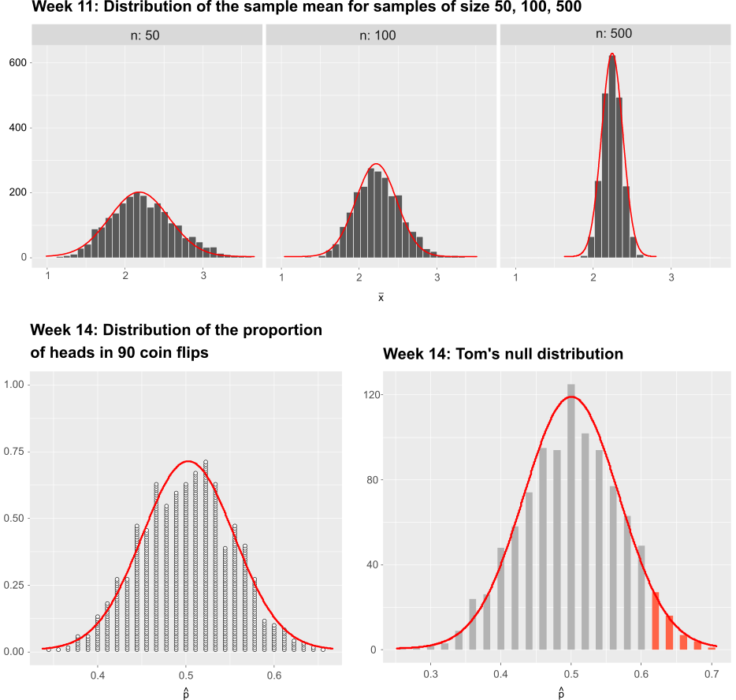

```{r, echo=FALSE}
HIDDEN_SOLS=FALSE
set.seed(15732)
ggplot2::theme_set(ggplot2::theme_gray(base_size=13))
```

# Normal distribution & probability {#chap-normal}


<div class="lo">
#### Instructions {-}
  
- In this two-hour lab we will go through worked examples in the first hour, and you will attempt to answer some questions in the second hour.
- The Rmarkdown file for this week is [here](https://uoe-psychology.github.io/uoe_psystats/dapr1/labsheets/week_15_practice.Rmd).


#### Learning outcomes {-}

**LO1.** Understand the normal distribution

**LO2.** Compute probabilities using the uniform and normal density functions

**LO3.** Understand the link between simulation-based standard errors and theory-based standard errors

#### Reading {-}


</div>


## Recap

- Flow-chart revising how to perform hypothesis testing using the [p-value method](images/recap_pvalues.pdf)

- Flow-chart revising how to perform hypothesis testing using the [critical value or rejection region method](images/recap_rr.pdf))


## Walkthrough


### From histograms to normal curves

In the past four weeks, we plotted many histograms and dotplots. All these plots showed how, in different scenarios, a given statistic varied due to sampling variation:

- [Week 11](#chap-sampling-distributions) displayed the variability due to sampling from the population (_sampling distribution_)
- [Week 12](#bootstrapping-and-confidence-intervals) displayed the variability due to sampling with replacement from the only available sample (_bootstrap distribution_)
- [Week 13](#chap-hyp-test) displayed the variability when sampling from a population assuming the null hypothesis to be true (_null distribution_)

Pretty much all of the distributions we saw were symmetric and bell-shaped. This typically is the case when the sample size is large enough.

Figure \@ref(fig:normal-fits) shows some of the distributions we plotted in the past four weeks, with a red curve superimposed on top. Note how the red curve closely approximates the histograms:

```{r normal-fits, echo=FALSE, out.width='100%', fig.align='center', fig.cap='Sampling distributions with their corresponding normal curves shown in red.'}

```

The symmetric and bell-shaped red curve is known as the __normal curve__ and is a mathematical model (i.e. an equation or graph) which is used to describe reality.

A continuous variable is said to be a __normally distributed__, or to have a __normal distribution__, if its distribution has the shape of a normal curve.


Consider the top-left plot in Figure \@ref(fig:normal-fits). Each bar in the histogram shows how many statistics fall in a given interval, such as the count of sample means between 2.2 and 2.3. For your information, they are 180.

If we divide the counts by the total number of samples, we obtain the proportion of statistics in the interval considered. Going back to the top-left plot, the proportion of sample means between 2.2 and 2.3 is given by 180 / 2,000 = 0.09.

The proportion can be interpreted as a probability. So, the proportion of sample means between 2.2 and 2.3 has two possible interpretations:

- the proportion of samples with a mean between 2.2 and 2.3 is 9%.
- there is a 9% probability that a randomly selected sample from the population has a mean between 2.2 and 2.3


### The relation between area and probability {#sec-area-and-prob}

We start by discussing the __Uniform distribution__ to see the relation between area and probability.

Suppose that you are studying the time to loss of attention focus and you monitor this from a starting point coded as 0 up for 30 minutes later.
Furthermore, suppose the subject can lose focus immediately (time = 0) or up to 30 minutes of observation, with all intervals between 0 and 30 being equally likely.
The subject is equally likely to lose attention after 3-4 minutes as they are likely after 25-26 minutes.
Such a random variable is said to follow a __uniform distribution__.

For discrete random variables, i.e. random variables whose possible values are only whole numbers without decimals, we compute probabilities by dividing the number of favourable cases by the total number of possibilities.

The probability of seeing an even face when throwing a die is obtained by dividing the number of ways such an event can occurr (3 even faces in a die: ⚁, ⚃, ⚅) by the total number of possibilities (in total there are 6 faces in a die: ⚀, ⚁, ⚂, ⚃, ⚄, ⚅):
$$
P(\textrm{even face}) = \frac{n_\textrm{even faces}}{n_\textrm{faces}} = \frac{3}{6} = 0.5
$$

`r msmbstyle::question_begin()`
Can we compute probabilities in the same way for continuous random variables?
`r msmbstyle::question_end()`

`r msmbstyle::solution_begin()`
The answer is no.

A continuous random variable can take an infinite number of values.
For this reason, the probability of observing a specific value is zero.

For example, the probability of your subject losing focus after exactly 3.9483627298 minutes is zero. There is only one particular way to observe 3.9483627298, and there is an infinite number of total possibilites. 
`r msmbstyle::solution_end()`

__For continuous random variables, we can only compute the probability of intervals of values.__


### Density curves

In order to find probabilities fpr continuous random variables, we use probability density functions.

<div class="def">
#### Probability density function {-}

A probability density function is an equation used to compute the probabilities for continuous random variables.

It must satisfy the following properties:

1. The total area under the graph of the equation must be equal to 1
1. The graph of the equation must be greater than or equal to zero for all possible values.
</div>

For discrete random variables, property 1 is similar to saying that the sum of all probabilities must be equal to 100%. Property 2 is similar to saying that probabilities can not be negative.

```{r unif-distr, echo=FALSE, out.width='60%', fig.align='center', fig.cap='Uniform distribution between 0 and 30 minutes.'}
knitr::include_graphics('images/unif_distr.png')
```

Figure \@ref(fig:unif-distr) shows the uniform distribution for the [loss in attention example](#sec-area-and-prob). Let's analyse it in more detail. Each value between 0 and 30 minutes is equally likely, so the graph is a rectangle with width 30.
Property 1 of density functions states that the total area under the graph must be 1. 
We will use this relationship to find what the heigh of the rectangle should be.

Recalling that the area of a rectangle is given by the width times the height,

$$
\begin{aligned}
A &= w \times h \\
1 &= 30 \times h
\end{aligned}
$$

we find that the density is given by the height:
$$
h = \frac{1}{30} = \textrm{density}
$$


__How can we use this density function to calculate probabilities?__

In order to find the probability of your subject losing attention between 10 and 20 minutes after the start of the experiment, we must calculate the shaded area in Figure \@ref(fig:unif-shaded).

The width of the shaded region is 20-10 = 10.
The height of the shaded region is 1/30.
The area between 10 and 20 is $10 \times \frac{1}{30} = \frac{1}{3}$.

So, the probability of the subject losing attention between 10 and 20 minutes from the beginning of the study is 1/3.

```{r unif-shaded, echo=FALSE, out.width='60%', fig.align='center', fig.cap='Uniform distribution between 0 and 30 minutes.'}
knitr::include_graphics('images/unif_shaded.png')
```


`r msmbstyle::question_begin()`
How would you calculate the probability of the subject losing focus either in the first 10 minutes or the last 10 minutes?
In other words, between 0-10 minutes and 20-30 minutes?
`r msmbstyle::question_end()`

`r msmbstyle::solution_begin()`
Since the total area of the rectangle is 1 (the total probability must be 1), we can compute this area as 1 - the shaded area.

The probability of losing focus between 0-10 minutes or 20-30 minutes is $1 - \frac{1}{3} = \frac{2}{3}$.
`r msmbstyle::solution_end()`


We have introduced the uniform distribution to link the concepts of probability and area under a curve.

Now, strong in what we have learned, we will move towards a more widely used model for continuous random variables: the normal distribution.


### The Normal distribution

We used a rectangle to find the probability of a uniformly distributed variable being in a given range.
However, only few continuous random variables follow such a graph.

More common is to see random variables whose distribution is symmetric and bell-shaped.
This is the case for aptitude-test scores, the birth weights of newborns, and so on...

<div class="def">
#### Normal distribution {-}

If the histogram of a continuous random variable shows a distribution which is symmetric and bell-shaped, we say that the random variable is __normally distributed__ or that it has a __normal probability distribution__.
</div>

An histogram might be centred at 6 say, another might be centred at 1.
Similarly, an histogram could have a standard deviation of 5 or have a standard deviation of 0.3

```{r hist-mean-sd, echo=FALSE, fig.width=8, fig.height=4.5, fig.align='center', fig.cap='Different histograms have different centres and standard deviations.', message=FALSE, warning=FALSE}
library(tidyverse)
library(patchwork)

p1 <- qplot(rnorm(10000, 6, 1), geom='histogram', color = I('white')) + xlim(-10, 10) + xlab('') + ggtitle('(a) mean = 6')
p2 <- qplot(rnorm(10000, 1, 1), geom='histogram', color = I('white')) + xlim(-10, 10) + xlab('') + ggtitle('(b) mean = 1')
p3 <- qplot(rnorm(10000, 20, 5), geom='histogram', color = I('white')) + xlim(10, 30) + xlab('') + ggtitle('(c) sd = 5')
p4 <- qplot(rnorm(10000, 20, 0.3), geom='histogram', color = I('white')) + xlim(10, 30) + xlab('') + ggtitle('(d) sd = 0.3')

(p1 | p3) / (p2 | p4)
```

<div class="red">
#### Key question {-}

How can we make sure that the normal curve can adapt to any symmetric and bell-shaped histogram?
</div>

Every histogram can be centred at a different value and have a different spread.
We can specify the normal curve appropriate for each histogram by saying where it should be centred at, and what should its spread be.

Hence, the normal density curve depends on two quantities called __parameters__:

1. the mean of the distribution, $\mu$, specifying the centre of the distribution
1. the standard deviation of the distribution, $\sigma$, specifying the spread of the distribution


**The effect of varying the mean and the standard deviation**:

```{r vary-params, echo=FALSE, fig.width=8, fig.height=4.5, fig.align='center', fig.cap='The effect of the mean on the location of the normal distribution.'}
library(tidyverse)
library(patchwork)

x <- seq(-5, 6, by = 0.05)

p1 <- ggplot(data = data.frame(x = x), aes(x)) +
  stat_function(fun = dnorm, args = list(mean = 0, sd = 1), size = 1, mapping = aes(color = '0')) + 
  stat_function(fun = dnorm, args = list(mean = 2, sd = 1), size = 1, mapping = aes(color = '1')) + 
  labs(y = "", title = "Changing the mean") + 
  scale_colour_manual("mean", values = c("0"="dodgerblue", "1"="darkorange")) +
  theme(legend.position = 'bottom')

p2 <- ggplot(data = data.frame(x = x), aes(x)) +
  stat_function(fun = dnorm, args = list(mean = 0, sd = 2), size = 1, mapping = aes(color = '2')) + 
  stat_function(fun = dnorm, args = list(mean = 0, sd = 0.5), size = 1, mapping = aes(color = '0.5')) + 
  labs(y = "", title = "Changing the sd") + 
  scale_colour_manual("sd", values = c("2"="dodgerblue", "0.5"="darkorange")) +
  theme(legend.position = 'bottom')

p1 | p2
```


### Fitting a Normal curve

In this section we will try to fit a normal curve to the sampling distribution of the mean.

Consider again the [example from Week 11](#sec-sampling-distributions) on the average yearly salary of a National Football League player.
We have data on 2,099 players, including their name, position, team they played for, total money while on a NFL payroll and the yearly salary.
Since we are only interested in the yearly salary we can select the relevant columns:

```{r, message=FALSE, warning=FALSE}
# Step 1: load the required libraries
library(tidyverse)
library(moderndive)

# Step 2: load the data and select the columns of interest
nfl <- read_tsv('https://edin.ac/2TexAFA')

# Step 3: look at the first rows of the data
head(nfl)

# Step 4: check the dimensions of the tibble
dim(nfl)

# Step 5: select relevant variables
nfl <- nfl %>%
  select(Player, YearlySalary)
```

Let's compute the sampling distribution of the mean for samples of size $n = 100$. We will use 10,000 repeated samples:

```{r nfl-hist-norm, warning=FALSE, message=FALSE, fig.align='center', fig.cap='Sampling distribution of the mean.'}
# Step 1: obtain many samples of size 100 and compute the mean of each sample
sampling_distrib_of_mean <- nfl %>%
  rep_sample_n(size = 100, reps = 10000) %>%
  group_by(replicate) %>%
  summarise(avg = mean(YearlySalary))

# Step 2: plot the sampling distribution of the mean for samples of size 100
ggplot(sampling_distrib_of_mean) +
  geom_histogram(aes(x = avg, y = stat(density)), 
                 color = "white", boundary = 2.0, binwidth = 0.1) +
  xlim(1, 3.5) +
  labs(x = expr(bar(x)))
```

The histogram in Figure \@ref(fig:nfl-hist-norm) shows the sampling distribution of the mean for samples of size 100, using 10,000 repetitions.

The distribution of the sample means seems to be symmetric and bell-shaped. 
Let's try fitting a normal curve to the histogram, and display it as a red curve.

The required steps are:

1. Compute the mean of the sample, which is used to specify where the normal curve should be centred at
1. Compute the standard deviation of the sample, which is used to specify the spread of the normal curve

```{r, message=FALSE, warning=FALSE}
# sample mean
mean_of_distrib <- sampling_distrib_of_mean %>%
  pull(avg) %>%
  mean()
mean_of_distrib

# sample sd
sd_of_distrib <- sampling_distrib_of_mean %>%
  pull(avg) %>%
  sd()
sd_of_distrib

# Plot the histogram of the sampling distribution and the fitted normal curve
ggplot(sampling_distrib_of_mean) +
  geom_histogram(aes(x = avg, y = stat(density)), color = "white") +
  stat_function(fun = dnorm, args = list(mean = mean_of_distrib, sd = sd_of_distrib), color = 'red', size = 1) +
  labs(x = expr(bar(x)))
```


Let's look again at the mean of the sampling distribution (mean of the 10,000 means) and the standard deviation of the sampling distribution (sd of the 10,000 means) which we called the standard error:

```{r}
mean_of_distrib
sd_of_distrib
```

Furthermore, let's recalculate as we did in Week 11 the population mean and standard deviation:
```{r}
mu <- nfl %>% 
  pull(YearlySalary) %>% 
  mean()
mu

sigma <- nfl %>% 
  pull(YearlySalary) %>% 
  sd()
sigma
```


The distribution of sample means is centred at the population mean $\mu =$ `r mean_of_distrib %>% round(2)` and has standard deviation $\sigma_{\bar{x}} =$ `r sd_of_distrib %>% round(2)`.


It has been mathematically proved that the distribution of the sample mean, when calculated on samples of size $n$ from a population which has mean $\mu$ and standard deviation $\sigma$ is a normal distribution with mean = $\mu$ and sd = $\frac{\sigma}{\sqrt{n}}$.

The standard deviation of the sampling distribution is also known as the standard error. So we can say that the standard error of the mean is:
$$
SE(\bar{x}) = \frac{\sigma}{\sqrt{n}}
$$

This means that we could have completely avoided the steps of

- repeatedly sampling from the population
- calculating the sample mean for each sample
- plotting the histogram of the sample means

```{r}
mu <- nfl %>% pull(YearlySalary) %>% mean()
sigma <- nfl %>% pull(YearlySalary) %>% sd()

n = 100

gridpoints <- tibble(x = seq(1, 3.5, length.out = 100)) %>%
  mutate(dens = dnorm(x, mean = mu, sd = sigma / sqrt(n)))

ggplot(gridpoints, aes(x = x, y = dens)) +
  geom_line(color = 'red', size = 1) +
  labs(x = expr(bar(x)))
```


_Table 1. Sampling distribution of the mean_

|           | Simulation-based approach | Theory-based approach |
|:---------:|:-------------------------:|:---------------------:|
| Mean      | `r mean_of_distrib %>% round(2)` | `r mu %>% round(2)` |
| SE        | `r sd_of_distrib %>% round(2)`   | `r (sigma / sqrt(100)) %>% round(2)` |


### Computing probabilities using the normal density

Recall from Section \@ref(sec-area-and-prob) that for continuous random variables we compute the probability of observing a value in a given range as the area under the density curve in that range.

---

As the red curve closely approximates the histograms, we will use the red curve to **model** the proportion of statistics in a given interval. This will let us calculate the probability of obtaining a statistic between two given values such as 3 and 3.2, say.

You can divide the counts by the total number of statistics that we have, obtaining the proportion (a.k.a. __relative frequency__) of sample means which are between 2.0 and 2.1, say, and this relative frequency is an estimate of the probability.


In mathematics, a model is an equation or a graph which is used to describe and recreate the behavior of something happening in reality.
The red curve in Figure \@ref(fig:normal-fits) is known as the **normal curve**, and it is used to describe the typical values we would see for continuous variables which are said to be **normally distributed**.


### Example: Cognitive scores

An example of a continuous random variable whose distribution is symmetric and bell-shaped is cognitive scores.
The following histogram shows the IQ scores of 10,000 randomly selected UK adults:
```{r}
set.seed(1)
n <- 10000
iq_sample <- tibble(ID = 1:n, IQ = rnorm(n, mean = 100, sd = 15) %>% round(2))
write_csv(iq_sample, 'data/iq_sample.csv')
```

```{r}
library(tidyverse)
data <- read_csv('data/iq_sample.csv', col_names = TRUE)
data

ggplot(data, aes(x = IQ)) +
  geom_histogram(color = 'white')
```


