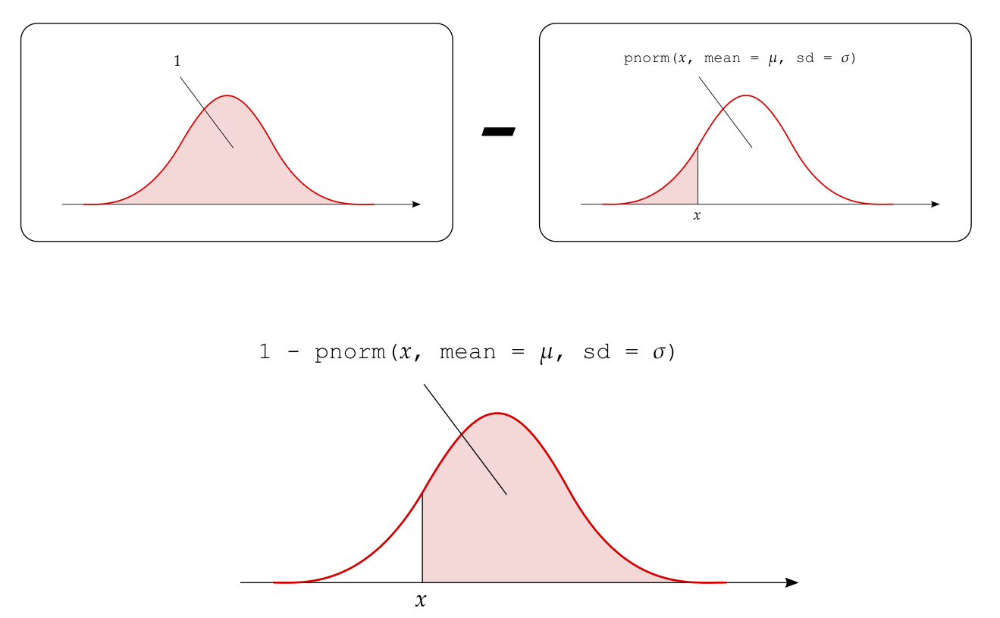

```{r, echo=FALSE}
HIDDEN_SOLS=FALSE
set.seed(15732)
ggplot2::theme_set(ggplot2::theme_gray(base_size=13))
```

# Normal distribution & probability {#chap-normal}


<div class="lo">
#### Instructions {-}
  
- In this two-hour lab we will go through worked examples in the first hour, and you will attempt to answer some questions in the second hour.
- The Rmarkdown file for this week is [here](https://uoe-psychology.github.io/uoe_psystats/dapr1/labsheets/week_15_practice.Rmd).


#### Learning outcomes {-}

**LO1.** Understand the normal distribution

**LO2.** Compute probabilities using density functions

**LO3.** Understand the link between simulation-based standard errors and theory-based standard errors

</div>


## Recap

- Flow-chart revising how to perform hypothesis testing using the [p-value method](images/recap_pvalues.pdf)

- Flow-chart revising how to perform hypothesis testing using the [critical value or rejection region method](images/recap_rr.pdf))


## Walkthrough


### From histograms to normal curves

In the past four weeks, we plotted many histograms and dotplots. These plots helped us understand the __distribution__ of a variable or a statistic.

<div class="def">
#### Distribution {-}

The distribution of a variable shows how frequently different values of the variable occur. 

The graph showing the distribution of a variable shows us where the values are centred, how the values vary, and gives some information about where a typical value might fall. It can also alert you to the presence of outliers (unexpected observations).
</div>

<!-- By looking at the distribution of a given statistic we saw how, in different scenarios, the statistic varied due to sampling variation: -->

<!-- - [Week 11](#chap-sampling-distributions) displayed the variability due to sampling from the population (__sampling distribution__) -->
<!-- - [Week 12](#bootstrapping-and-confidence-intervals) displayed the variability due to sampling with replacement from the only available sample (__bootstrap distribution__) -->
<!-- - [Week 13](#chap-hyp-test) displayed the variability when sampling from a population assuming the null hypothesis to be true (__null distribution__) -->

Pretty much all of the distributions we saw were __symmetric__ and __bell-shaped__. This typically is the case when the sample size is large enough.

Figure \@ref(fig:normal-fits) shows some of the distributions we plotted in the past four weeks, with a red curve superimposed on top. Note how the red curve closely approximates the histograms.

(a) NFL example: sampling distribution of the mean for sample size $n = 50$;
(b) NFL example: sampling distribution of the mean for sample size $n = 500$;
(c) Coin example: sampling distribution of the proportion of heads in $n = 50$ tosses with probability of heads $p = 0.3$;
(d) Coin example: sampling distribution of the proportion of heads in $n = 50$ tosses with probability of heads $p = 0.7$.

```{r normal-fits, message=FALSE, warning=FALSE, echo=FALSE, out.width='100%', fig.height=7, fig.align='center', fig.cap='Different distributions with their corresponding normal curves shown in red.'}
set.seed(1)

library(tidyverse)
library(patchwork)

nfl <- read_tsv('https://edin.ac/2TexAFA')

mu = mean(nfl$YearlySalary)
sigma = sd(nfl$YearlySalary)


# a

n = 50
x = rnorm(10000, mu, sigma / sqrt(n))

a = ggplot(tibble(x=x)) +
  geom_histogram(aes(x = x, y = stat(density)), color = 'white') +
  stat_function(fun = dnorm, args = list(mean = mu, sd = sigma / sqrt(n)), color = 'red', size = 1) +
  labs(x = expr(bar(x)), y = '', title = expr((a) ~ n == !!n)) +
  theme(plot.title = element_text(hjust = 0.5))

xlim = ggplot_build(a)$layout$panel_params[[1]]$x.range


# b

n = 500
x = rnorm(10000, mu, sigma / sqrt(n))

b = ggplot(tibble(x=x)) +
  geom_histogram(aes(x = x, y = stat(density)), color = 'white') +
  stat_function(fun = dnorm, args = list(mean = mu, sd = sigma / sqrt(n)), color = 'red', size = 1) +
  labs(x = expr(bar(x)), y = '', title = expr((b) ~ n == !!n)) +
  theme(plot.title = element_text(hjust = 0.5)) + 
  xlim(xlim[1], xlim[2])


# C

n = 50
p = 0.3

x = 0:n
y = dbinom(x, n, p)

c = ggplot(tibble(x=x, y=y)) +
  geom_segment(aes(x=x, xend=x, y=0, yend=y), size = 1) +
  stat_function(fun = dnorm, args = list(mean = n*p, sd = sqrt(n * p * (1-p))), color = 'red', size = 1) +
  labs(x = expr(hat(p)), y = '', title = expr((c) ~ n == !!n ~ ',' ~ p == !!p)) +
  theme(plot.title = element_text(hjust = 0.5)) +
  scale_x_continuous(limits = c(0, n), labels = function(x) round(x/n, 2))


# d
n = 50
p = 0.7

x = 0:n
y = dbinom(x, n, p)

d = ggplot(tibble(x=x, y=y)) +
  geom_segment(aes(x=x, xend=x, y=0, yend=y), size = 1) +
  stat_function(fun = dnorm, args = list(mean = n*p, sd = sqrt(n * p * (1-p))), color = 'red', size = 1) +
  labs(x = expr(hat(p)), y = '', title = expr((d) ~ n == !!n ~ ',' ~ p == !!p)) +
  theme(plot.title = element_text(hjust = 0.5)) +
  scale_x_continuous(limits = c(0, n), labels = function(x) round(x/n, 2))


(a + b) / (c + d)
```

The symmetric and bell-shaped red curve is known as the __normal curve__ and is a mathematical model (i.e. an equation or graph) which is used to describe reality (see Figure \@ref(fig:normal-curve)).

```{r normal-curve, echo=FALSE, fig.cap='Normal curve.', fig.align='center', out.width='60%'}
curve(dnorm(x, 0, 1), -4, 4, col = 'red', lwd = 2, xaxt="n", yaxt="n", axes=F, xlab='', ylab='')
```


<div class="def">
#### Normal distribution {-}

A continuous variable is said to be a __normally distributed__, or to have a __normal probability distribution__, if its distribution has the shape of a normal curve (i.e. it is symmetric and bell-shaped).
</div>


<div class="red">
#### Key question {-}

How can we make sure that the normal curve can adapt to any symmetric and bell-shaped histogram?
</div>


__Every histogram can be centred at a different value and have a different spread.__

We can specify the normal curve appropriate for each histogram by specifying

1. where it should be centred at,
1. and what should its spread be.


Hence, the normal curve depends on two quantities called the __parameters__ of the normal distribution:

1. the mean $\mu$, specifying the centre of the distribution;
1. the standard deviation $\sigma$, specifying the spread of the distribution.


```{r vary-params, echo=FALSE, fig.width=8, fig.height=4.5, fig.align='center', fig.cap='Normal curves for different means and standard deviations.'}
library(tidyverse)
library(patchwork)

x <- seq(-5, 6, by = 0.05)

p1 <- ggplot(data = data.frame(x = x), aes(x)) +
  stat_function(fun = dnorm, args = list(mean = 0, sd = 1), size = 1, mapping = aes(color = '0')) + 
  stat_function(fun = dnorm, args = list(mean = 2, sd = 1), size = 1, mapping = aes(color = '1')) + 
  labs(y = "", title = expr(Varying~mu)) + 
  scale_colour_manual(expr(mu), values = c("0"="dodgerblue", "1"="darkorange")) +
  theme(legend.position = 'bottom')

p2 <- ggplot(data = data.frame(x = x), aes(x)) +
  stat_function(fun = dnorm, args = list(mean = 0, sd = 2), size = 1, mapping = aes(color = '2')) + 
  stat_function(fun = dnorm, args = list(mean = 0, sd = 0.5), size = 1, mapping = aes(color = '0.5')) + 
  labs(y = "", title = expr(Varying~sigma)) + 
  scale_colour_manual(expr(sigma), values = c("2"="dodgerblue", "0.5"="darkorange")) +
  theme(legend.position = 'bottom')

p1 | p2
```


`r msmbstyle::question_begin()`
What happens when we vary the mean and the standard deviation parameters?
`r msmbstyle::question_end()`

`r msmbstyle::solution_begin()`
By varying the mean only, we can model histograms that are centred at different values but have the same spread.

By varying the standard deviation only, we can model histograms with different spreads but have the same mean.

By varying both the mean and the standard deviation we can model any symmetric and bell-shaped histogram.
`r msmbstyle::solution_end()`


<div class="def">
#### Notation {-}

We will write that a random variable $X$ follows a normal distribution with mean $\mu$ and standard deviation $\sigma$ as: 
$$X \sim N(\mu, \sigma)$$
</div>


### The relation between area and probability {#sec-area-and-prob}

```{r, echo=FALSE}
library(tidyverse)
library(patchwork)

set.seed(1)

mu = mean(nfl$YearlySalary)
sigma = sd(nfl$YearlySalary)

n = 50
x = rnorm(10000, mu, sigma / sqrt(n))

prop = mean(x >= 2.2 & x <= 2.3)
```

Consider Panel (a) in Figure \@ref(fig:normal-fits).
Each bar in the histogram shows the proportion of all the generated statistics falling in a given interval. For example, the proportion of sample means between 2.2 and 2.3 is equal to `r prop %>% round(2)`.

This proportion can be interpreted as a probability. So, the proportion of means between 2.2 and 2.3 has two possible interpretations:

- the proportion of all samples with a mean between 2.2 and 2.3 is 9%.
- there is a 9% probability that a randomly selected sample from the population has a mean between 2.2 and 2.3


We will now discuss the __uniform distribution__ to understand the relation between area and probability.

Suppose that you are performing an experiment to study the time until loss of attention.
You are currently monitoring a subject from a starting point, coded as time = 0, until up to 30 minutes later.
Furthermore, suppose the subject can lose focus immediately (time = 0) or up to 30 minutes of observation, with all intervals of the same length being equally likely.
This means, for example, that the subject is equally likely to lose attention after 3-4 minutes as they are likely after 25-26 minutes.
Such a random variable is said to follow a __uniform distribution__.

For discrete random variables, i.e. random variables whose possible values are only whole numbers without decimals, we compute probabilities as the __number of favourable cases divided by the total number of possibilities__.

The probability of seeing an even face when throwing a die is obtained by dividing the number of ways the event "even face" can occur (3 even faces in a die: ⚁, ⚃, ⚅) by the total number of possibilities (6 total faces in a die: ⚀, ⚁, ⚂, ⚃, ⚄, ⚅):
$$
P(\textrm{even face}) = \frac{n_\textrm{even faces}}{n_\textrm{faces}} = \frac{3}{6} = 0.5
$$

`r msmbstyle::question_begin()`
For continuous random variables, can we compute probabilities in the same way?
`r msmbstyle::question_end()`

`r msmbstyle::solution_begin()`
The answer is no.

A continuous random variable can take an infinite number of values.
For this reason, the probability of observing a specific value is zero.

For example, the probability of your subject losing focus after exactly 3.9483627298 minutes is zero. There is only one particular way to observe 3.9483627298, and there is an infinite number of values between 0 and 30. 
`r msmbstyle::solution_end()`

<div class="red">
#### Key point {-}

For continuous random variables, we can only compute the probability of __intervals__ of values.
</div>


In order to find probabilities for continuous random variables, we use __probability density functions__.

<div class="def">
#### Probability density function {-}

A __probability density function__ is an equation used to compute the probabilities for continuous random variables.

It must satisfy the following properties:

1. The total area under the graph of the equation must be equal to 1
1. The graph of the equation must be greater than or equal to zero for all possible values.
</div>

For discrete random variables, property 1 is similar to saying that the sum of all probabilities must be equal to 100%. Property 2 is similar to saying that probabilities can not be negative.

```{r unif-distr, echo=FALSE, out.width='60%', fig.align='center', fig.cap='Uniform distribution between 0 and 30 minutes.'}
knitr::include_graphics('images/unif_distr.png')
```

Figure \@ref(fig:unif-distr) shows the uniform distribution for the [loss of attention example](#sec-area-and-prob). Let's analyse it in more detail. Each value between 0 and 30 minutes is equally likely, so the graph is a rectangle.
The width of the rectangle is 30 as the possible values of the random variable are 0 to 30.
Property 1 of density functions states that the total area under the graph must be 1. 
We will use this relationship to find what the height of the rectangle should be.

Recalling that the area of a rectangle is given by the width times height,

$$
\begin{aligned}
a &= w \times h \\
1 &= 30 \times h
\end{aligned}
$$

we find that the density is given by the height:
$$
h = \frac{1}{30} = \textrm{density}
$$


__How can we use this density function to calculate probabilities?__

In order to find the probability of your subject losing attention between 10 and 20 minutes after the start of the experiment, we must calculate the shaded area in Figure \@ref(fig:unif-shaded).

The width of the shaded region is $20-10 = 10$.
The height of the shaded region is $1/30$.
The area between 10 and 20 is $10 \times \frac{1}{30} = \frac{1}{3}$.

So, the probability of the subject losing attention between 10 and 20 minutes from the beginning of the study is $1/3$.

```{r unif-shaded, echo=FALSE, out.width='60%', fig.align='center', fig.cap='Probability of losing attention after 10 to 20 minutes.'}
knitr::include_graphics('images/unif_shaded.png')
```


`r msmbstyle::question_begin()`
How would you calculate the probability of the subject losing focus either in the first 10 minutes or the last 10 minutes?
In other words, between 0-10 minutes and 20-30 minutes?
`r msmbstyle::question_end()`

`r msmbstyle::solution_begin()`
Since the total area of the rectangle is 1 (the total probability must be 1), we can compute this area as 1 - the shaded area.

The probability of losing focus between 0-10 minutes or 20-30 minutes is $1 - \frac{1}{3} = \frac{2}{3}$.
`r msmbstyle::solution_end()`


We have introduced the uniform distribution to link the concepts of probability and area under a curve.


Now, strong in what we have learned, we will move towards a more widely used model for continuous random variables: the normal distribution, which we have previously introduced.


### Probabilities for normally distributed random variables

We used a rectangle to find the probability of a uniformly distributed variable being in a given range.
However, only few continuous random variables follow such a graph.

More common is to see random variables whose distribution is symmetric and bell-shaped.
This is the case for aptitude-test scores, the birth weights of newborns, and so on...
We previously learned that if a random variable has a histogram which is symmetric and bell-shaped, we say that the variable follows a normal distribution.


Consider the following sample of 10,000 people, for which we have recorded their score on a cognitive test.
```{r echo=FALSE}
set.seed(1)
n <- 10000
cognitive <- tibble(SubjectID = 1:n, CognitiveScore = rnorm(n, mean = 100, sd = 15) %>% round(2))
write_csv(cognitive, 'data/cognitive_sample.csv')
```

Let's load the data and inspect them:
```{r, message=FALSE, warning=FALSE}
library(tidyverse)

# Load the sample
cognitive <- read_csv('https://edin.ac/39jPFa5', col_names = TRUE)

# Display the first six rows
head(cognitive)

# Check the dimensions of the tibble
dim(cognitive)
```

We have 10,000 rows (subjects) and 2 columns (measured variables).

Let's plot the distribution of the variable of interest, `CognitiveScore`, as a histogram.
However, on the y-axis, instead of the absolute counts of the values we ask for the density or proportion.
This makes it easier to compare across samples of different sizes, as the range of the y-axis won't change with the sample size.

We plot the density by specifying `y = stat(density)` in the `aes()` function:
```{r, message=FALSE, warning=FALSE, out.width='70%', fig.align='center'}
ggplot(cognitive, aes(x = CognitiveScore, y = stat(density))) +
  geom_histogram(color = 'white')
```

We can see that the distribution of cognitive scores is symmetric, around 100 approximately, and bell-shaped. We can therefore try to fit a normal curve to it.

We must specify:

- where the normal curve should be centred at. This should be the centre of the histogram/data;
- how spread or narrow should the normal curve be. This should be the spread of the histogram, i.e. the standard deviation of the data.

__Centre:__
```{r}
sample_mean <- cognitive %>%
  pull(CognitiveScore) %>%
  mean()

sample_mean
```

__Spread:__
```{r}
sample_sd <- cognitive %>%
  pull(CognitiveScore) %>%
  sd()

sample_sd
```

Hence the normal curve should be centred at the mean of the data, `r sample_mean %>% round(2)` and have standard deviation `r sample_sd %>% round(2)`.


The equation of the normal density curve is provided by the following function:
```{r, eval=FALSE}
dnorm(x, mean, sd)
```

where:

- `x` represents the value of the random variable
- `mean` the mean of the normal curve
- `sd` the standard deviation of the curve


Let's add the red curve on top of the histogram using `stat_function()`. It takes as arguments:

- `fun`: the function to plot
- `args`: parameters of the function to be plotted
- plotting specifications

```{r, out.width='70%', fig.align='center', message=FALSE, warning=FALSE}
ggplot(cognitive) +
  geom_histogram(aes(x = CognitiveScore, y = stat(density)), color = 'white') +
  stat_function(fun = dnorm, 
                args = list(mean = sample_mean, sd = sample_sd), 
                color = 'red', size = 2)
```


We can now calculate the probability that a randomly selected individual has a cognitive score between 120 and 130 as the area under the normal curve between 120 and 130:

```{r, echo=FALSE, out.width='70%', fig.align='center', message=FALSE, warning=FALSE}
ggplot(cognitive, aes(x = CognitiveScore)) +
  # geom_histogram(aes(x = CognitiveScore, y = stat(density)), color = 'white') +
  stat_function(fun = dnorm, 
                args = list(mean = sample_mean, sd = sample_sd), 
                color = 'red', size = 2) +
   stat_function(fun = dnorm, args = list(mean = sample_mean, sd = sample_sd), xlim = c(120, 130),
                  geom = "area", fill = "red", alpha = 0.3)
```


---

We compute areas for normal curves using the function `pnorm(x, mean, sd)`. 

This function computes the area to the left of `x` in a normal curve centred at `mean` and having standard deviation `sd`.

**1. Area to the left of a value $x$**
```{r, echo=FALSE, out.width='80%', fig.align='center'}
knitr::include_graphics('images/pnorm_left.png')
```

**2. Area between the values $x_l$ and $x_u$**
```{r, echo=FALSE, out.width='100%', fig.align='center'}
knitr::include_graphics('images/pnorm_interval.png')
```

**3. Area to the right of $x$**
```{r, echo=FALSE, out.width='100%', fig.align='center'}

```

---


The probability that a randomly selected individual has a cognitive score between 120 and 130 is the area under the normal curve between 120 and 130:
```{r}
theory_prob <- pnorm(130, mean = sample_mean, sd = sample_sd) - 
  pnorm(120, mean = sample_mean, sd = sample_sd)
theory_prob
```

Let's compare that with the proportion obtained from the histogram:
```{r}
sample_prob <- cognitive %>%
  summarise(prop = sum(CognitiveScore >= 120 & CognitiveScore <= 130) / n())
sample_prob
```

As we can see the theoretical probability and the sample estimate, rounded to 2 decimal places, are similar:

| Simulation-based             | Theory-based                 |
|:----------------------------:|:----------------------------:|
| `r sample_prob %>% round(2)` | `r theory_prob %>% round(2)` |


To summarise, the calculation of probabilities for normally distributed random variables follows 3 steps:

1. Find the mean of the variable

2. Find the standard deviation of the variable

3. Compute the probability as the area under the normal curve with the mean found in (1) and the standard deviation found in (2).


### Z-scores

Instead of always specifying the mean and the standard deviation of the normal curve, we can work with a reference normal curve that has mean = 0 and sd = 1. This is known as the **standard normal distribution**. 

<div class="def">
#### Standard normal distribution {-}

A standard normal distribution, denoted $N(0, 1)$, is a normal distribution with mean = 0 and sd = 1.
</div>

The functions `dnorm` and `pnorm` assume that the mean = 0 and the sd = 1 if not provided, i.e. they assume a standard normal distribution by default.

In order to transform a value $x$ from a normal distribution with mean $\mu$ and sd $\sigma$ to a score on the standard normal scale, we must use the z-score transformation:
$$
z = \frac{x - \mu}{\sigma}
$$

Let's compute again the probability that a randomly selected individual has a cognitive score between 120 and 130 using standard normal distributions. 
First we must convert the values to z-scores by subtracting the mean and the standard deviation of the distribution. Then we use the function `pnorm()`:
```{r}
z_u <- (130 - sample_mean) / sample_sd
z_l <- (120 - sample_mean) / sample_sd

pnorm(z_u) - pnorm(z_l)
```

As you can see, this is exactly the same value we found before with the shifted and scaled normal distribution.


## Summary

When a histogram shows that a variable's distribution is symmetric and bell-shaped, we can say that the variable is normally distributed and we can model the distribution with a mathematical curve called the normal probability distribution.

We saw that the normal distribution depends on two parameters, that control the centre and spread of the normal curve:

- the mean,
- and the standard deviation.

These two parameters let the normal curve model histograms that have different centres and different spreads.

In R, the equation of the normal density curve is given by the function `dnorm(x, mean, sd)`.

We can use the normal curve to compute the probability of intervals as the area under the curve in that interval.

The function to compute the area under a normal curve to the left of `x` is `pnorm(x, mean, sd)`.

| Probability | R command |
|:------------|:----------|
| Probability of observing a value less than or equal `x` | `pnorm(x, mean, sd)` |
| Probability of observing a value between `xl` and `xu`  | `pnorm(xu, mean, sd) - pnorm(xl, mean, sd)` |
| Probability of observing a value greater than `xu`      | `1 - pnorm(xu, mean, sd)` |


## Lab


In today's lab we will fit a normal curve to the sampling distribution of the mean using the [NFL example](#sec-sampling-distributions) introduced in Week 11.

Consider again the dataset with the yearly salaries of National Football League (NFL) players. We are interested in the average yearly salary of a NFL player.

We have data on 2,099 players: their name, position, team they played for, total money while on a NFL payroll, and yearly salary.

Since we are only interested in the yearly salary we can select the relevant columns:

```{r, message=FALSE, warning=FALSE}
# Step 1: load the required libraries
library(tidyverse)
library(moderndive)

# Step 2: load the data and select the columns of interest
nfl <- read_tsv('https://edin.ac/2TexAFA')

# Step 3: look at the first rows of the data
head(nfl)

# Step 4: check the dimensions of the tibble
dim(nfl)

# Step 5: select relevant variables
nfl <- nfl %>%
  select(Player, YearlySalary)
```


`r msmbstyle::question_begin(header = "&#x25BA; Question 1")`
Compute the sampling distribution of the mean using 10,000 samples of 100 players each.

Display the sampling distribution using a density histogram.

_**Hint**. Remember to use `y = stat(density)` inside the function `aes()`._
`r msmbstyle::question_end()`

`r msmbstyle::solution_begin()`
Let's compute the sampling distribution of the mean for samples of size $n = 100$, using 10,000 samples:
```{r nfl-hist-norm, warning=FALSE, message=FALSE, fig.align='center', fig.cap='Sampling distribution of the mean.'}
# Step 1: obtain many samples of size 100 and compute the mean of each sample
sampling_distrib_of_mean <- nfl %>%
  rep_sample_n(size = 100, reps = 10000) %>%
  group_by(replicate) %>%
  summarise(avg = mean(YearlySalary))

# Step 2: plot the sampling distribution of the mean for samples of size 100
ggplot(sampling_distrib_of_mean) +
  geom_histogram(aes(x = avg, y = stat(density)), color = "white") +
  labs(x = expr(bar(x)))
```
`r msmbstyle::solution_end()`


`r msmbstyle::question_begin(header = "&#x25BA; Question 2")`
Does the sampling distribution of the mean for samples of size 100 follow a normal curve?
`r msmbstyle::question_end()`


`r msmbstyle::solution_begin()`
The distribution of sample means seems to be symmetric and bell-shaped, hence the sample mean is a normally distributed random variable.
`r msmbstyle::solution_end()`


`r msmbstyle::question_begin(header = "&#x25BA; Question 3")`
Find the normal probability density function that models the sampling distribution of the mean for samples of size $n = 100$.

Plot the normal curve in red on top of the histogram.
`r msmbstyle::question_end()`


`r msmbstyle::solution_begin()`
The required steps are:

1. Compute the mean of the sample means, which is used to specify where the normal curve should be centred at;
1. Compute the standard deviation of the sample means, which is used to specify the spread of the normal curve.

```{r, message=FALSE, warning=FALSE}
# sample mean
mean_of_distrib <- sampling_distrib_of_mean %>%
  pull(avg) %>%
  mean()
mean_of_distrib

# sample sd
sd_of_distrib <- sampling_distrib_of_mean %>%
  pull(avg) %>%
  sd()
sd_of_distrib

# Plot the histogram of the sampling distribution and the fitted normal curve
ggplot(sampling_distrib_of_mean) +
  geom_histogram(aes(x = avg, y = stat(density)), color = "white") +
  stat_function(fun = dnorm, 
                args = list(mean = mean_of_distrib, sd = sd_of_distrib), 
                color = 'red', size = 2) +
  labs(x = expr(bar(x)))
```
`r msmbstyle::solution_end()`


`r msmbstyle::question_begin(header = "&#x25BA; Question 4")`
What are the population mean and standard deviation?
`r msmbstyle::question_end()`

`r msmbstyle::solution_begin()`
```{r}
mu <- nfl %>% 
  pull(YearlySalary) %>% 
  mean()
mu

sigma <- nfl %>% 
  pull(YearlySalary) %>% 
  sd()
sigma
```

- The population mean is $\mu =$ `r mu %>% round(2)`
- The population standard deviation $\sigma =$ `r sigma %>% round(2)`.
`r msmbstyle::solution_end()`


`r msmbstyle::question_begin(header = "&#x25BA; Question 5")`
What are the mean and the standard deviation of the sampling distribution of the mean?
`r msmbstyle::question_end()`

`r msmbstyle::solution_begin()`
We have already calculated them to find the centre and spread of the normal curve:
```{r}
mean_of_distrib
sd_of_distrib
```

- the distribution of sample means has mean `r mean_of_distrib %>% round(2)` 
- the distribution of sample means has standard deviation `r sd_of_distrib %>% round(2)`.
`r msmbstyle::solution_end()`


`r msmbstyle::question_begin(header = "&#x25BA; Question 6")`
What is the relation between the population mean and the mean of the sampling distribution?
`r msmbstyle::question_end()`

`r msmbstyle::solution_begin()`
The sampling distribution of the mean is centred at the population mean, $\mu =$ `r mu %>% round(2)`. In other words, the average of the sampling distribution of the mean is equal to the population mean.
`r msmbstyle::solution_end()`


`r msmbstyle::question_begin(header = "&#x25BA; Question 7")`
Do you notice any relation between the population standard deviation and the standard error of the mean?

_**Hint.** If the population standard deviation is $\sigma$, the sampling distribution of the mean should have standard deviation $\frac{\sigma}{\sqrt{n}}$, where $n$ is the sample size._
`r msmbstyle::question_end()`

`r msmbstyle::solution_begin()`
- Population standard deviation: $\sigma =$ `r sigma %>% round(2)`
- Standard error of the mean: $SE(\bar{x}) =$ `r sd_of_distrib %>% round(2)`

It looks like the SE of the mean is the population standard deviation divided by 10. However, recall that the sample size was 100, so $10 = \sqrt{100}$.

In general, assume that the population has mean $\mu$ and standard deviation $\sigma$.

It is possible to prove that the distribution of the mean, computed on samples of size $n$, has mean equal to the population mean, $\mu$, and standard error $$SE(\bar{x}) = \frac{\sigma}{\sqrt{n}}$$.

```{r}
sd_of_distrib

sigma / sqrt(100)
```

`r msmbstyle::solution_end()`


`r msmbstyle::question_begin(header = "&#x25BA; Question 8")`
Compare the mean and the standard error computed using the simulation-based approach and the theory-based approach.
`r msmbstyle::question_end()`

`r msmbstyle::solution_begin()`
|           | Simulation-based approach | Theory-based approach |
|:---------:|:-------------------------:|:---------------------:|
| Mean      | `r mean_of_distrib %>% round(2)` | $\mu =$ `r mu %>% round(2)` |
| SE        | `r sd_of_distrib %>% round(2)`   | $\frac{\sigma}{\sqrt{n}} =$ `r (sigma / sqrt(100)) %>% round(2)` |

The simulation-based approach and the theory-based approach lead to very similar results.
`r msmbstyle::solution_end()`


This is an important result. It means that, in order to show the sampling distribution of the mean, we would just:

1. load the data
2. find the population mean $\mu$
3. find the population sd $\sigma$
4. plot a normal curve with mean = $\mu$ and sd = $\frac{\sigma}{\sqrt{n}}$


This avoids us the burden of

- repeatedly sampling from the population
- calculating the sample mean for each sample
- plotting the histogram of the sample means


`r msmbstyle::question_begin(header = "&#x25BA; Question 9")`
The lengths of human pregnancies are normally distributed with mean $\mu = 266$ days and standard deviation $\sigma = 16$ days.

Plot the distribution of the length of human pregnancies.
`r msmbstyle::question_end()`

`r msmbstyle::solution_begin()`
First we need to create a grid of days for the plot.

Remember from [Week 12](#calculating-confidence-intervals-using-a-bootstrap-standard-error) that 99.7% of all values lie between the mean plus or minus 3 standard deviations. 

To capture all of the values, we will use 4 times the standard deviation:

```{r}
mu <- 266
sigma <- 16

df <- tibble(
  x = seq(mu - 4 * sigma, mu + 4 * sigma, by = 0.1),
  y = dnorm(x, mu, sigma)
)

ggplot(df, aes(x = x, y = y)) +
  geom_line(color = 'red', size = 2) +
  labs(x = 'length of pregnancy (in days)', y = 'normal density')
```

`r msmbstyle::solution_end()`


`r msmbstyle::question_begin(header = "&#x25BA; Question 10")`
What is the proportion of the population with length of pregnancy greater than 280 days?
`r msmbstyle::question_end()`

`r msmbstyle::solution_begin()`
Careful, you must use the distribution of the length of pregnancy to answer this question, not the distribution of the sample mean.

```{r}
1 - pnorm(280, mean = mu, sd = sigma)
```

The proportion of the population with length of pregnancy greater than 280 days is 19%.
Another way to say this is, the probability that a randomly selected person from the population will have a length of pregnancy greater than 280 days is 0.19.
`r msmbstyle::solution_end()`


`r msmbstyle::question_begin(header = "&#x25BA; Question 11")`
What is the proportion of the population with length of pregnancy between 230 and 260 days?
`r msmbstyle::question_end()`

`r msmbstyle::solution_begin()`
```{r}
pnorm(260, mean = mu, sd = sigma) - pnorm(230, mean = mu, sd = sigma)
```

The proportion of the population with length of pregnancy between 230 and 260 days is 34%.
Another way to say this is, the probability that a randomly selected person from the population will have a length of pregnancy between 230 and 260 days is 0.19.
`r msmbstyle::solution_end()`


`r msmbstyle::question_begin(header = "&#x25BA; Question 12")`
Using the theory-based approach, write down:

1. the mean of the sampling distribution of the average length of pregnancy using samples of size 50;
2. the standard error of the mean.

Plot the sampling distribution of the mean for samples of size 50.
`r msmbstyle::question_end()`

`r msmbstyle::solution_begin()`
```{r}
n <- 50
SE <- sigma / sqrt(n)
SE
```

1. the sampling distribution is centred at the population mean, $\mu = 266$;
2. the standard error of the mean is $SE(\bar{x}) = \frac{\sigma}{\sqrt{n}} = \frac{16}{\sqrt{50}} = 2.26$.

Let's plot the sampling distribution of the mean:
```{r}
x <- seq(mu - 4 * SE, mu + 4 * SE, by = 0.1)
y <- dnorm(x, mu, SE)
df <- tibble(x, y)

ggplot(df, aes(x = x, y = y)) +
  geom_line(color = 'red', size = 2) +
  labs(x = expr(bar(x)), y = 'normal density')
```

`r msmbstyle::solution_end()`


## Glossary

- _Normal curve._ A density curve used to model symmetric and bell-shaped distributions of continuous random variables.
- _Simulation-based SE of the mean._ The standard deviation of the sampling distribution of the mean, obtained by generating many random samples and calculating the mean for each sample.
- _Theory-based SE of the mean._ For a population with mean $\mu$ and standard deviation $\sigma$, the SE of the mean computed on samples of size $n$ is $SE(\bar{x}) = \frac{\sigma}{\sqrt{n}}$.

