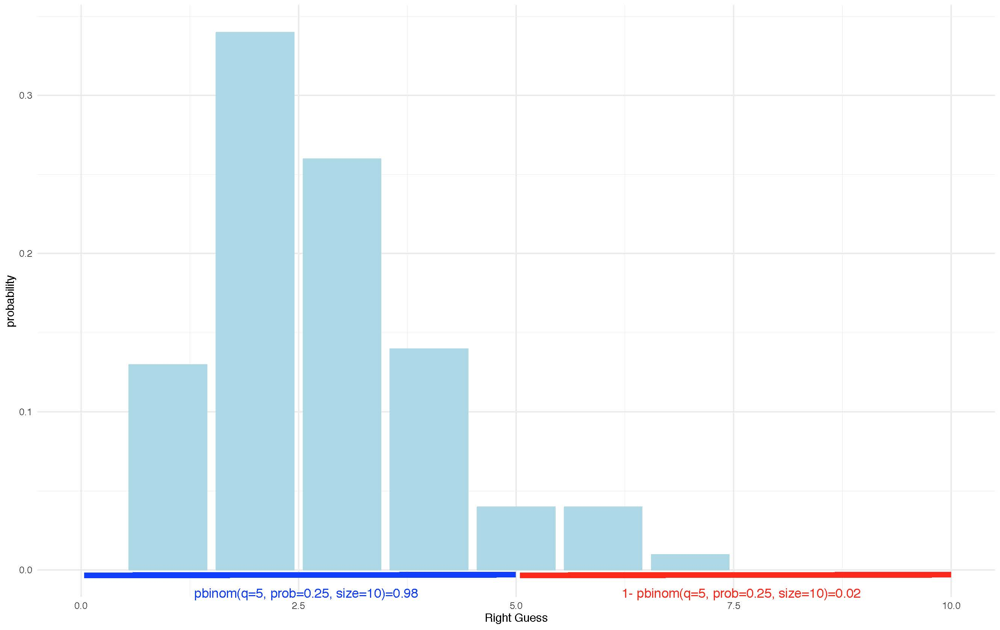

# Week 9 {}  

An .Rmd with extra probability practice can be downloaded [here](https://uoe-psychology.github.io/uoe_psystats/dapr1/labsheets/week9_extra_prob_practice.Rmd) or from Learn.  
A revision practice .Rmd can be downloaded [here](https://uoe-psychology.github.io/uoe_psystats/dapr1/labsheets/week9_revision_practice.Rmd) or from Learn. Data for this can be found [here](https://uoe-psychology.github.io/uoe_psystats/dapr1/labsheets/week9.csv) or on Learn.  

## Introduction to Probability Distributions and Revision

The essential reading for this week can be found in [Navarro's  Chapter 9](https://bookdown.org/ekothe/navarro26/probability.html)

This week we will extend the probability content to probability distributions. We have already had a glance at coin flips last week. We will extend on the concept this week by talking more about sequences of the events.

Last week we were working towards building your intuition about random and independent events. The beauty of the independent variable is that we can construct distributions of the values the variable can take (e.g. outcomes of the coin toss) which we can then study to evaluate the likelihood of certain events happening (e.g. Kobe and his 'hot hand').

We will continue today by working with discrete distributions and the task is to sample from the outcomes, visualise, and attempt to determine the likelihood of an event from the distributions.

## Discrete example (guessing homework answers)

Imagine that you are working on your weekly homework quiz on Learn which has **10 multiple choice questions** with **4 answers** and you want to see what is the likelihood of getting the answer right if you randomly pick the answer each time with your eyes closed. Assume that there is only one correct option.

We can study the probability of getting all the questions right or, say, of getting only half of questions right, by generating the distribution of the likely outcomes.

If you pick an answer **at random** then the probability of getting it right should be $\frac{1}{4}=0.25$. Such would be true also for question two, assuming that your answer for question one is independent of question two.

We can generate samples for each trial (n = 10 questions) and will check what is the probability of getting one, two, three, and so on  questions out of 10 right. We will use the `rbinom()` function in R to generate the distribution of a number of attempts.

We can work with it directly in R using the extensions: 

- `rbinom()` to generate the distribution ('r' for random) for discrete outcomes
- `dbinom()` to study the probability of the outcome
- `pbinom()` to study the cumulative probability (also can be described as the area under the curve)

The key arguments we will use are:

- **x** is a vector of numbers.

- **p** is a vector of probabilities.

- **n** is number of observations.

- **size** is the number of trials.

- **prob** is the probability of success of each trial.

## Generate a homework attempt

```{r}
# We can generate an attempt for 10 questions
rbinom(n = 10, # 10 attempts
       size = 10, # 10 questions)
       prob = 0.25) # Probability that one is correct (1/4)
```


```{r}
# We can generate an attempt for 100 questions/trials
rbinom(n = 100, # 100 times of 10
       size = 10, 
       prob = 0.25) 
```

Let's assign it to a tibble so we can calculate the proportions and make a plot.

```{r}
library(tidyverse)
homework_guess <- tibble(right_guess = rbinom(n = 100, 
       size = 10, 
       prob = 0.25))
```

```{r}
homework_guess %>%
  count(right_guess)
```


```{r}
ggplot(data = homework_guess, aes(x = right_guess)) + 
  geom_bar(fill = 'lightblue') + 
  labs(x = 'Right Guess', y = 'Count') + 
  theme_minimal()
```

We can change the scale on the graph to see all the options:

```{r}
ggplot(data = homework_guess, aes(x = right_guess)) + 
  geom_bar(fill = 'lightblue') + 
  xlim(0,10) +  #note how we add xlim()
  labs(x = 'Right Guess', y = 'Count') + 
  theme_minimal()
```

What's more, we can also change y units to probability.

```{r}
ggplot(data = homework_guess, aes(x = right_guess)) + 
  geom_bar(aes(y = (..count..)/sum(..count..)), # we will work with the function of count, hence we use'..'
           fill = 'lightblue') + 
  xlim(0,10) + 
  labs(x = 'Right Guess', y = 'Probability') + 
  theme_minimal()
```
 
## Changing the probability (TRUE/FALSE)

What if the multiple choice had only two choices for the answer (i.e. TRUE or FALSE questions) - the right answer will now have a probability of 0.5 instead.  Let's reflect on that and create a new `tibble()`:

```{r}
#Homework guess distribution with TRUE/FALSE
homework_guess_true_false <- tibble(right_guess = rbinom(n = 100, 
       size = 10, 
       prob = 0.5)) # Note that the probability of getting the right answer has gone up
```

```{r}
homework_guess_true_false %>%
  count(right_guess)
```

Your chances are higher! Can you see why? 

```{r}
ggplot(data = homework_guess_true_false, aes(x = right_guess)) + 
  geom_bar(fill = 'lightgreen')  +  
  xlim(0,10) + 
  labs(x = 'Right Guess', y = 'Count') + 
  theme_minimal()
```

We have less options now, hence a higher chance of picking the correct ones.

Let's also plot with probabilities:

```{r}
ggplot(data = homework_guess_true_false, aes(x = right_guess)) + 
  geom_bar(aes(y = (..count..)/sum(..count..)), fill = 'lightgreen') + 
  xlim(0,10) + 
  labs(x = 'Right Guess', y = 'Probability') + 
  theme_minimal()
```

## Studying the distribution

What's great about learning probability disitributions is that we can use the distribution above to find exact probability of guessing different numbers of questions correctly. We will use `dbinom()`.

Check what the probability is of getting at least one question right when guessing at random:

```{r}
dbinom(1, # Number of outcomes that we got right
       size=10, # 10 trials (we have 10 questions)
       prob=0.25) # Probability of getting the right answer (1/4) 
```

Or for two correct answers:

```{r}
dbinom(2, # Number of outcomes that we got right
       size = 10, # 10 trials (we have 10 questions)
       prob = 0.25) # Probability of getting the right answer (1/4) 
```

Or three: 

```{r}
dbinom(3, # Number of outcomes that we got right
       size = 10, # 10 trials (we have 10 questions)
       prob = 0.25) # Probability of getting the right answer (1/4) 
```

And so on....

What if we want to find the probability of guessing all 10 questions correctly? That's a magical result!

```{r}
dbinom(10, size = 10,  prob = 0.25)  
```

```{r}
#Round to 2 d.p.
round(dbinom(10, size = 10,  prob = 0.25), 2)
```

**So rare that it is almost zero, so never try to do the quiz just relying on your luck! :)**

## Cumulative Probability (Advanced)

By adding the above we can also get a cumulative probability, meaning that we can study what would be the chance to get four or less right, meaning that you want to include the chances of getting zero, one, two, and three right as well.

Graphically, we really want to analyse the probability mass here, given that all should sum up to one. To know the chances of getting one or two questions right we can sum the probabilities:

```{r}
dbinom(1, size = 10,  prob = 0.25) +
  dbinom(1, size = 10,  prob = 0.25) +
  dbinom(2, size = 10,  prob = 0.25)
```

A faster way to see all the probabilities at once would be:

```{r}
all_probs <- round(dbinom(x = c(0,1,2,3,4,5,6,7,8,9,10), prob = 0.25, size = 10),2) # Note that we use round to see the values to two decimal places 
all_probs
```

You can then find out what the probability is of getting five or less answers right versus five or more answers right:

```{r}
# Five or less
pbinom(q = 5, prob = 0.25, size = 10)
```

Quite high chances :)

```{r}
# Five or more
1 - pbinom(q = 5, prob = 0.25, size = 10 )
```

Not that much! Can you see what we did? We found the probability of outcomes that are equal or less than five and then substracted it from total.

Graphically we can show this as following:

```{r}

```

There is an exercise for you to try this yourself with the distribution for TRUE/FALSE questions. 
**Make sure that you revise this before coming back to the course in January as it will remind you of where we ended. **


## Revision Practice Rmd. Solutions

This week's practice is built around the key material we covered during the past eight weeks. You will need to load the data from Learn and then work with the key variables to provide descriptive statistics and visualisations. There is an extra practice at the end for you to work on the discrete probability distribution example as well. 

The dataset has information on participants that took part in the memory experiment: ' IDs, Age, Memory score on three different tasks (Task A, Task B, and Placebo), and data on whether the participant received saw information/text twice.

We are trying to explore whether treament (i.e. task) and seeing information twice may affect the memory scores.

- `ID`: 1 to 143
- `Age`: 18-51
- `Memory Score`: 1-100 (100 when remembered everything)
-  `Task`: Task A, Task B, Placebo
-  `Saw_twice`: Yes/No (if participant saw the text twice)

```{r}
# Load tidyverse
library(tidyverse)
```

```{r}
# Read data in
data <- read.csv('week_9.csv')
```

```{r}
# Check what's inside
head(data)
```

### Provide descriptive statistics for age and memory score variables

There are different ways to do so using what we have learned so far: 

Look at each variable separately: 
```{r}
# First age
data %>%
  summarise(mean = mean(Age),
            median = median(Age),
            sd = sd(Age))
```

```{r}
# Then memory
data %>%
  summarise(mean = mean(Memory_score),
            median = median(Memory_score),
            sd = sd(Memory_score))
```

Or do it all in one go:
```{r}
data %>%
  summarise(mean_age = mean(Age),
            mean_memory = mean(Memory_score),
            median_age = median(Age),
            median_memory = median (Memory_score),
            sd_age = sd(Age),
            sd_memory = sd(Memory_score))
```


### Descriptives by groups
Provide descriptives of the memory scores by task, and by whether someone saw the information on the task twice:

```{r}
# By treatment/task
data %>%
  group_by(Task) %>% #note that we are adding group_by() to differentiate by a variable
    summarise(mean = mean(Memory_score),
            median = median(Memory_score),
            sd = sd(Memory_score))
```

```{r}
# By whether someone saw information on the task twice
data %>%
  group_by(Saw_twice) %>%
    summarise(mean = mean(Memory_score),
            median = median(Memory_score),
            sd = sd(Memory_score))
```

### Visualise

Provide distributions of age and memory scores.

```{r}
# Age
ggplot(data = data, aes(x = Age)) + 
  geom_histogram(colour = 'grey', fill = 'cornsilk') + 
  labs(x = 'Age (Years)', y = 'Frequency', title = 'Histogram of Age') + 
  theme_minimal()
```

```{r}
# Memory Scores
ggplot(data = data, aes(x = Memory_score)) + 
  geom_histogram(colour = 'grey', fill = 'cornsilk') + 
  labs(x = 'Memory Score (1-100)', y = 'Frequency', title = 'Histogram of Memory Scores') + 
  theme_minimal()
```

### Visualise a subset
What about memory scores only for Task A?

```{r}
# Memory Scores for Task A
ggplot(data = subset(data, Task %in% c('Task A')), aes(x = Memory_score)) + 
  geom_histogram(colour = 'grey', fill = 'cornsilk') + 
  labs(x = 'Memory Score (1-100)', y = 'Frequency', title = 'Histogram of Memory Scores (Task A)') + 
  theme_minimal()
```

We can also use `%>%` to do the same. Check this out:

```{r}
# Memory Scores for Task A
data %>%
  filter (Task == 'Task A') %>%
ggplot(data = ., #note how we replace the data with `.` which will allow us to use the specification above as our input
       aes(x = Memory_score)) + 
  geom_histogram(colour = 'grey', fill = 'cornsilk') + 
  labs(x = 'Memory Score (1-100)', y = 'Frequency', title = 'Histogram of Memory Scores (Task A)') + 
  theme_minimal()
```

### Variable by a group

What about a plot of Memory Score by Task?

```{r}
ggplot(data = data, aes(x = Task, y = Memory_score, fill = Task)) + 
  geom_boxplot() 
```

Anything more advanced? Maybe you could try ggridges?

```{r}
library(ggridges)
ggplot(data = data, aes(x = Memory_score, y = Task,  fill=Task)) + geom_density_ridges()
```


### Create a new variable using mutate()

Let's change memory scores into percentages. How would you add an extra variable that converts scores (1-100) into percentages??

```{r}
# We can use mutate (try first adding the new variable via piping)
data %>%
  mutate(Memory_score=Memory_score/100)
```

We can see a new variable  above but if you head your data it won't appear:
```{r}
head(data)
```

That's because we have not assigned it to a dataset. To do so, we will need to use `<-` in the following way:

```{r}
new_data <- data %>%
  mutate(Memory_score=Memory_score/100)
```

Check now:
```{r}
head(new_data)
```

### Subset observations using filter()

Can you subset only `Task A` and `Placebo` from the data? We can use filter and then assign the filtered observations to an object too:

```{r}
data %>%
  filter(Task == 'Task A' | Task== 'Placebo') 
```

Now, put it inside a new dataset, called `reduced`, you can also specify which variables you may want to keep.

```{r}
reduced_data <- data %>%
   filter(Task == 'Task A' | Task== 'Placebo')  %>%
  select(ID, Age, Memory_score, Task, Saw_twice)
```

### Sort via arrange() 

We can check the lowest and highest memory scores  via sorting in each group:

```{r}
# Task A (lowest)
data %>% 
  filter(Task == "Task A") %>%
  arrange(Memory_score) 
```

What about the highest in Task B?

```{r}
# Task B (the highest)
data %>%
    filter(Task == "Task B") %>%
  arrange(desc(Memory_score)) 
```

### Let's do some specific count() using filter() 

- First check how many people we have in each Task group:

```{r}
data %>%
  count(Task)
```

- Can you show how many people above 40 years of age and saw the information on the task twice in each Task  group?

```{r}
data %>%
  filter(Age >40) %>%
  filter(Saw_twice == 'Yes') %>%
  count(Task)
```
- For the last one, show how people with the highest memory scores are split by task. Use a memory score threshold of 50 out of 100:

```{r}
data %>%
  filter(Memory_score > 50) %>%
  count(Task)
```
Task A has greater queanity of high memory scores.

Nicely done! If you got to the end, you have now succefully practiced all the key code and functions we have learnt in previous weeks. Play more if you like for the practice.


## Extra Probability Practice

Work with the distribution we created in the tutorial for guessing on homework quizzes. We want to analyse how likely you are to get specific numbers of question right.

### TRUE/FALSE questions

Work with the TRUE/FALSE example we have seen in the tutorial.
What if the multiple choice had only two choices for the answer (i.e. TRUE or FALSE questions)? The right answer will now have a probability of 0.5 if you were to guess at random. Create a tibble() to show this:

```{r}
homework_guess_true_false <- tibble(right_guess = rbinom(n = 100, 
       size = 10, 
       prob = 0.5)) 
```

### Count the occurencies

```{r}
homework_guess_true_false %>%
  count(right_guess)
```

### Plot

```{r}
ggplot(data = homework_guess_true_false, aes(x = right_guess)) + 
  geom_bar(fill = 'lightgreen') + 
  xlim(0,10) + 
  labs(x = 'Right Guess', y = 'count') + 
  theme_minimal()
```

Plot with y being a probability:

```{r}
ggplot(data = homework_guess_true_false, aes(x = right_guess)) + 
  geom_bar(aes(y = (..count..)/sum(..count..)), fill = 'lightgreen') + 
  xlim(0,10) + 
  labs(x = 'Right Guess', y = 'Probability') + 
  theme_minimal()
```

### Use dbinom() to study the probability

Check what the probability is of getting only one question right when guessing at random:

```{r}
dbinom(1, size = 10, prob = 0.5) 
```

Or for five correct answers:

```{r}
dbinom(5, size = 10, prob = 0.5) 
```

Or eight: 

```{r}
dbinom(8, size = 10, prob = 0.5) 
```

Or put it all together at once (make sure that the probability is 0.5):

```{r}
all_probs <- round(dbinom(x = c(0,1,2,3,4,5,6,7,8,9,10), prob = 0.5, size = 10),2) # Note that we use round to see the values to two decimal places 
all_probs
```

### Less than five or more than five?

We can also study what the chances are of getting less than five questions right versus more than five questions right in a TRUE/FALSE setting (check your notes online).

```{r}
# Five or less
pbinom(q = 5, prob = 0.5, size = 10)
```

```{r}
# Five or more
1 - pbinom(q = 5, prob = 0.5, size = 10)
```

Better chances compared to when you are doing a quiz with four options! :)
