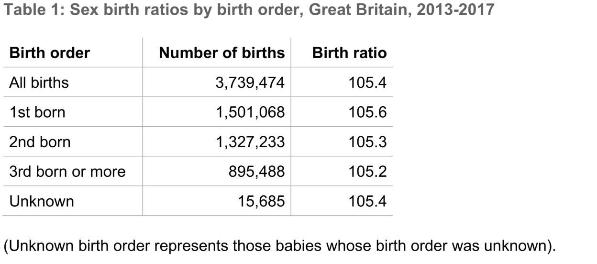
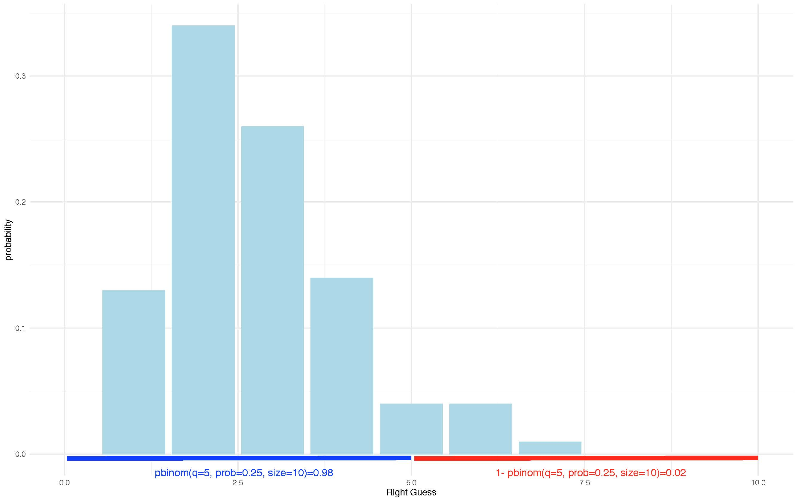
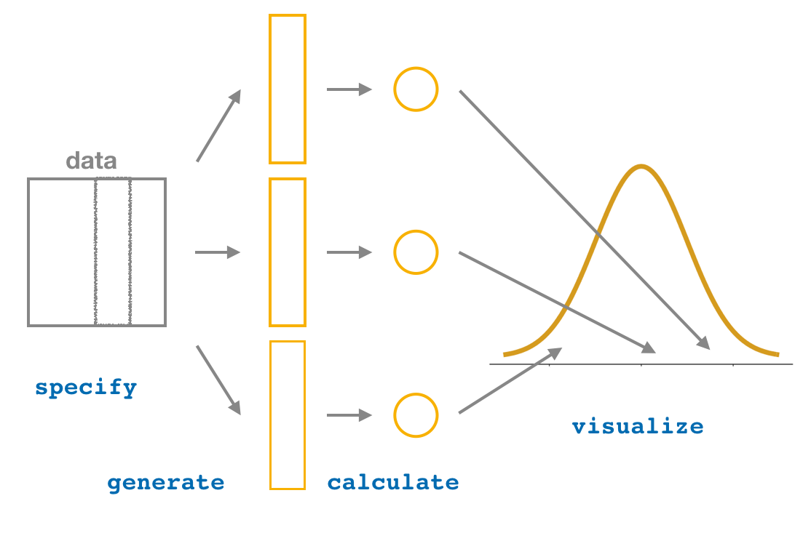

--- 
title: "Data Analysis for Psychology in R (dapR1) - Labs"
author: "Department of Psychology, University of Edinburgh"
date: " 2019-2020"
site: bookdown::bookdown_site
output: 
  bookdown::gitbook:
    includes:
      in_header: logo.html
    config:
      toc:
        collapse: section
      sharing:
        facebook: false
        twitter: false
documentclass: book
github-repo: rstudio/bookdown-demo
description: "This is the page that contains the course labs materials"
---


# Overview of the Course{-}

**Data Analysis for Psychology in R 1 (dapR1) **is your first step on the road to being a data, programming and applied statistics guru! 

This course provides a introduction to data, R and statistics. It is designed to work slowly through conceptual content that form the basis of understanding and working with data to perform statistical testing. At the same time, we will be introducing you to basic programming in R, covering the fundamentals of working with data, visualization and simple statistical tests. The overall aim of the course is to provide you with all the necessary skills to feel confident working with R and data, before we move on to discuss a broader array of statistical methods in year 2.

On this page you will find the notes for your weekly labs including practice exercises and solutions. You can also read a gentle introduction to R and installation guide. As you progress through the course, the content will build up. Find the general overview of topics below so you know where we are heading:

```{r, echo = FALSE, eval=FALSE}

```


#### SEMESTER 1 {-}

| Week | Lecture | Lab topic |
|:----:|:-------:|:---------:|
| 1 | Introduction lecture: research process, planning and design | What is R and installation |
| 2 | Measurement: types of data | RStudio environment, libraries, packages, scrips and notebooks. Introduction to Rmarkdown |
| 3 | Organising data: data sets, tables, plots | Assignment: vectors, lists, data frames, data types |
| 4 | Describing data: central tendency | Introduction to plots and geoms |
| 5 | Describing data: variability | Central tendency & variability |
| **Break** | |
| 6 | Functions & data transformation | Hand plotting functions. Introduction to data transformation |
| 7 | Statistical models, chance and probability | R practice: read in data, merge |
| 8 | Fundamentals of probability | Introduction to probability. Sampling in R |
| 9 | Probability & probability distributions | Introduction to probability distributions. Revision |
| 10 | Probability distributions: Binomial & Normal | Lab test 1 |


#### SEMESTER 2 {-}


| Week | Topic |
|:----:|:------|
| 11 | Sampling | 
| 12 | Bootstrapping and confidence intervals |
| 13 | Hypothesis testing  | 
| 14 | Type I and Type II Errors, and Power | 
| 15 | Normal distribution and probability | 
| **Break** | |
| 16 | Test for one mean | 
| 17 | Test for two means (independent samples) | 
| 18 | Test for two means (paired samples) |
| 19 | Chi-squared |  
| 20 | Covariance & correlation | 


## The team{-}

 |  |  
----------------------| ------------------------| --------------------------
**Dr Tom Booth**      | Tom.Booth@ed.ac.uk      | Lecturer and Course Organiser 
**Dr Umberto Noe**    | ug.ppls.stats@ed.ac.uk  | Senior Teching Coordinator (Labs)
**Dr Josiah King**    | ug.ppls.stats@ed.ac.uk  | Senior Teching Coordinator (Labs)
**Ms Emma Waterston** | Emma.Waterston@ed.ac.uk | PhD student in Psychology (Labs)


(with special thanks to Dr Anastasia Ushakova)


## R Cheatsheets{-}
You can find a collection of cheatshets that summarise some of the most useful commands you will be using for tasks such as data transformation, visualisation, RMarkdown and many others [here](https://www.rstudio.com/resources/cheatsheets/)/

The key ones you will need to get for this year are:

- [RMarkdown](https://github.com/rstudio/cheatsheets/raw/master/rmarkdown-2.0.pdf)
- [Data Visualisation (ggplot2)](https://github.com/rstudio/cheatsheets/raw/master/data-visualization-2.1.pdf)
- [Data transformation with dplyr](https://github.com/rstudio/cheatsheets/raw/master/data-transformation.pdf)
- [Data Import](https://github.com/rstudio/cheatsheets/raw/master/data-import.pdf)


## R Community{-}
R has great representation in Edinburgh. Check out these pages to find out more:

- [R Ladies Edinburgh](https://www.meetup.com/rladies-edinburgh/)
- [EdinburghR](http://edinbr.org)

And worldwide you have:

- [R Studio Community](https://community.rstudio.com)


<!--chapter:end:index.Rmd-->

# Week 1{}

## Introduction to R and RStudio

Welcome to Data Analysis for Psychology in R! This week we would like to focus on getting you started in R, get your software installation issues sorted and attempt some very quick and basic practice.  There is a lot to cover as we will be moving through the year so if something may look overwhelming, just bear with us, we will make sure that we cover as much as possible so by the end of the year you will become a confident user of R.

Everyone in our team really likes R and we hope that you will love it too :) 

R has a great community built over years and includes researchers, industry practitioners and curious minds across disciplines and fields. R also has been getting better and better over the years and now R has a large online community which shares solutions to any issues/encounters while you are learning R during your time at UoE and  after the university. 

If unsure about something, don't be afraid to simply Google it! If getting an error, sometimes the fastest you can do is to actually copy and paste it and let Google find you an explanation of what happened. **But before doing that, come to labs regularly, ask questions, read the course materials carefully. R can be confusing at the start but we all have been there so stay with us ;) **


## Install the recent version of R and R Studio

### First Step 

Depending on the operating system you may check the right version you need. You will need first to install the body of R.

- For MacOS press [here](https://cran.r-project.org/bin/macosx/) - select R 3.6.1
- For Windows press [here](https://cran.r-project.org/bin/windows/base/)


### Second Step

We then will install RStudio. Rsudio is a useful interface that allows us to interact with R and where can see our data, results from analyses and various plots/visualisations. 

Get a right version for your operating system  [here](https://www.rstudio.com/products/rstudio/download/#download)

- For Windows pick **RStudio 1.2.1335 - Windows 7+ (64-bit)**
- For MacOS pick **RStudio 1.2.1335 - macOS 10.12+ (64-bit)**

Any issues? Let us know!

**Quick note:** *it is useful to update your R from now and then. As you progress in your degree, try to update you R every year you are back to dapR.*


## Getting Started in RStudio

RStudio is what is called an Integrated Development Environment for `R`. It is dependent on `R` but separate from it. There are several ways of using `R` but R Studio is arguably the most popular and convenient. It's time to open it up and get started! When you first open up *RStudio*, this is what you should see:

```{r, echo = FALSE}
knitr::include_graphics("images/RStudio.png")
```

There's a whole lot of text that (1) isn't very interesting, and (2) generally isn't that important so you don't need to pay much attention to it. 

## R as an interactive environment

RStudio has four panels: Current file (Editor), Console, Environment, and Viewer. We will focus on using those more in the upcoming labs.

```{r, echo = FALSE}
knitr::include_graphics("images/Understanding_R.jpeg")
```
[^1]

[^1]: Jessica Ward (https://twitter.com/RLadiesNCL/status/1138812826917724160).

The *Information* area (all of the right-hand side of RStudio) shows you useful information about the state of your project. 

The top panel of the *Information* side of RStudio contains the *Environment* and *History* panes. *History* contains the history (unsurprising I know) of commands that have been typed into the console. The *Environment* is virtual storage of all objects you create in `R`, and contains your list of variables, data frames, strings, etc., which `R` has been told to save from previous commands. The bottom panel of the *Information* section contains a number of different panes - *Files*, *Plots*, *Packages*, *Help*, and *Viewer*. In other words, you have a file manager (where you can view which files are loaded into your project), a panel to show plots and graphs, a list of packages, help on the functions available within `R`, and viewer allows you to view local web content.

On the left-hand area of RStudio, you have your Current File (*Editor*) and *Console*. The "heart of `R`" is the *Console* window. This is where instructions are sent to `R`, and its responses are given. It's the place to try things out, but don't want to save. Finally, the *Editor* is where you write more complicated scripts without having to run each command. When you run such a script file, it gets interpreted by `R` in a line by line fashion. This means that your data cleaning, processing, visualization, and analysis needs to be written up *in sequence* otherwise `R` won't be able to make sense of your script. There is an important practical distinction between the Console and the Editor: In the Console, the Enter key runs the command. In the Editor, it just adds a new line. 

The hash (`#`) marks everything to the right of it as comment. Using comments can be very useful for annotating your code, and it improves the readability too. It will also help you to remember why/what you done months later, when you return to your code that you have inevitably forgotten!


## Check your settings

Before we get to some work in R, let us first make sure that everything works the way we want. Some of you may want to change the appearance of your R, adjust fonts or colors so you find it easier to use R on your computer.

### Disable automatic saving of your workspace

We will need this to make sure that we clear up our working space each time you close you RStudio so you can start afresh each week without piling up staff in your environment. You will see what we mean as we practice. For now, let's do the following:
```{r, echo = FALSE}
knitr::include_graphics("images/glob_opt.gif")
```


### Adjust fonts/colours if you like
 Depending what works better for your vision and experience, there are number of choices to personalise the look of your R. Try these out here:
 
```{r, echo = FALSE}

```


## Setting Up Your Working Directory 

Step 1. Create a folder (sub-directory) named **dapR1** on your "Desktop” folder

Step 2. From RStudio, use the menu to change your working directory under Session > Set Working Directory > Choose Directory

Step 3. Choose the directory you’ve just created in Step 1

Step 4: Select *File* -> *New File* -> *R Script*. In the window that appears, click on the disk icon just below *Untitled1* and save the blank script as **Lab1.R**. Make sure that this saves in your **DAPR1** folder. 

For the purpose of this course, we're going to be using scripts and RMarkdown files (more on that next week), but first, lets have a play around with the console so you can familiarise yourself with it. 

## The Console

Click on the console, type `1+1`, and hit enter
```{r}
1 + 1
```

It should have hopefully returned the answer 2. Next type `2*1`, and hit enter. This should return the sum value. 

```{r}
2*1
```

Now, hit ctrl + uparrow (cmd + uparrow on mac). This is a useful shortcut, and allows you to quickly re-run or edit previous code used in the console. This handy little shortcut isn't needed in the script, as you'll be able to easily copy, change, or run code as needed. 

## Spacing
You can use spaces to make code easier to read, and although `R` is pretty good at ignoring large gaps, it does have to *guess* and *make the assumption* that the spacing was unintended. Try to keep your code neat and tidy!

```{r}
2              *             1
```

What you can't do is insert spaces into the middle of a word, or `R` will get upset with you.

## Typos
You'll also need to be careful to avoid typos, as `R` will not know that it is producing unintended output. Instead, it will assume that you meant *exactly* what you typed. For example, suppose you forget to press the shift key when typing the `+` sign. Your command would then be `20 = 10`, as opposed to `20+10`. Here is what would happen:

```{r, error = T}
20 = 10
```

And there you have it - your first error message! This happens when what you type doesn't make any sense to `R`. It's a pretty touchy programme, and can't spot these kinds of simple *human* mistakes. Sometimes, `R` will produce the right answer, but to the wrong question, if you are not careful with what you type. Sticking with the same example, suppose your hand slipped and you pressed the "-" key next to the `+`. `R` has no way of knowing that you intended to *add* 10 to 20, not to *subtract*. This time you'd get:

```{r}
20 - 10
```

This can be a little more dangerous, especially when you are working on more advanced stuff, as it can become more difficult to spot mistakes in output. The take home message is simple: You **must** be precise and accurate with what you say to `R`. It's mindlessly obedient, and doesn't have auto correct. Be careful with what you type!

## Unfinishe.... d

Sometimes, you might get a little too excited and hit enter when you haven't actually finished a command. Because `R` is so obedient, it will just keep waiting. For example, if you type `20 +` and then press enter, `R` will know that you probably want to put another number at the end of that command.

.png)

and there in the console you should see a blinking cursor on the right of your `+` sign. This tells you that `R` is still waiting for you to finish your command, and the `+` sign is another command prompt. If you now type `10` and press enter, you will get:

.png)

## Basic Arithmetic 

Table 1 lists the operators that correspond to the basic arithmetic:

Operation     | Operator      | Example Input | Example Output
------------- | ------------- |-------------- | -------------
Addition      | +             | 20 + 10       | 30
Subtraction   | -             | 20 - 10       | 10
Multiplication| *             | 20 * 10       | 200
Division      | /             | 20 / 10       | 2
Power         | ^             | 20 ^ 10       | 1.024e+13

The one important thing to remember when using `R` to calculate sums is that brackets always come first. One easy way to remember this is to enclose what you want to happen first in brackets e.g. `(20/10) * 2`. In this example, `R` would have done the division first anyway, but its always important to make sure that `R` is doing exactly what you want!

## Using Functions for Calculations

As you will have seen above, there are lots of calculations you can do with very basic operators. If you wanted to do more advanced calculations, you need to use *functions*. Lets run through a few of the simple ones that are handy to use in `R`.

Operation       | R code                | Example Input    | Example Output
-------------   | -------------         |--------------    | -------------
Square root     | `sqrt( )`             | sqrt(100)        | 10
Absolute value  | `abs( )`              | abs(-100)        | 100
Round           | `round(x, digits = )` | round(12.345, 2) | 12.35
Minimum         | `min(...)`            | min(2.21, 2.22)  | 2.21
Max  Maximum    | `max(...)`            | max(2.21, 2.22)  | 2.22

It's also useful to note that you can use multiple functions together and combine them if desired. For example:
```{r}
sqrt(100 + abs(-44))
```

`R` has started out by calculating `abs(44)`, and then simplifies the command to `sqrt(100+44)`. To solve the sum, it then needs to add 100 and 44, before evaluating the `sqrt(144)`, and returning the value of 12.

*Top Tip*: Lets take an example from above, and say that we wanted to round a value. This time, in the console, start typing the name of the function, and then hit the 'tab' key. RStudio will display the below window.

.png)

There are two panels: one gives a list of variables that starts with the letters I've typed, and the other tells you what it does. If you have the name of the function written, `R` will recognise this, and instead pop up with the arguments for that function instead.

.png)

## R Scripts

Now that you are hopefully familiar with the console, lets try out writing in a script! `R` will continue to provide the output in the console, and hitting enter won't make `R` run any command. You now need to press Ctrl + Enter (Cmd + Enter).

`R` operates on named data structures, and you can create very simple to very complex structures. 

```{r}
# In your script, create an object a and assign it the value of 1
a <- 1

# In the above, we would say "the variable (object) a is assigned to 1", or "a gets 1"

# increment a by 1
a + 1

# OK, now see what the value of a is
a
```

So, `R` returned us output as if it forgot we asked it to do `a + 1` and didn't change its value. That's because we weren't clear in what we wanted! The only way to keep this new value is to *put it in an object*. 

```{r}
b <- a + 1

# now let's see
b
# success!
```

*Quick Note*: The `<-` operator is used to 'point' to the object receiving the stated value. In most cases `=` can be used instead but we advise that you stick to `<-`. You can also make assignments in the other direction too:

```{r}
b + 1 -> c
c
```

Now, lets create a *vector* (or string) of numbers. This is a single entity that consists of a list of ordered numbers. If we wanted to create a vector called *x*, containing five numbers (2, 4, 6, 8, 10), we would use the R command:

```{r}
x <- c(2, 4, 6, 8, 10)
```

In simple words, we have now created a list of the five numbers, and assigned them to the object `x`. We made use of the *c()* function, as we were giving R a list of values. Let's take a look at `x`.

```{r}
x
```

You can now use these objects in other commands. For example, lets say you wanted to square each of the values in `x`, or multiply by `b`:

```{r}
x^2
x*b
```

## Short Example 
Now that you've created your first variables to store some numbers, lets try an example. Say that you have all found that this course was extremely helpful as an introduction to `R`, and that you wanted to recommend to your friend to buy the materials online.  Firstly, I'd want to calculate how many copies I'd sell if we actually turned this into a proper book. Since there are (roughly) 170 students in the whole class, and you all loved it, I'm going to assume 170 sales, and create a variable called `sales`. So, how do I do this? 

```{r}
sales <- 170
```

Now to work out how much money I'm going to make per book. I need to create another variable called `royalty`, which we will use to indicate how much money I will get per copy sold. Let's say I get £5 per copy and book get sold for £25.

```{r}
royalty <- 5
```

The last thing I want to do is calculate how much money I'll make from sales in this class. We now need to create our `revenue` variable, and ask `R` to print out the total value of revenue.

```{r}
revenue <- sales * royalty
revenue
```

And there we have it - £850. As far as `R` thinks, the `sales*royalty` is the exact same as `170*5`. What if at last minute a student decides to buy 10 copies for their friends too? That would mean that we need to update our revenue. The easiest way to do this is to *overwrite* the value.

```{r}
revenue_simple<- revenue + 50
revenue_simple
```

But we can also be smarter:

```{r}
revenue_smarter <- revenue + 10*royalty
revenue_smarter
```


## Naming variables
You might have noticed so far that I've used very simple letters or names for my variables, and that they have all been written in lower case. `R` does have more flexibility in what you can name your variables, but it also has some rules...

* Variable names cannot include spaces: my revenue is not a valid name, but my_revenue is
* Variable names are case sensitive: Revenue and revenue are different names
* Variable names must be started with a letter or a full stop: You couldn't use something like 1revenue or _revenue
* There are some reserved keywords that cannot be used to name variables with: These include, `if`, `else`, `for`, `in`, `next`, `TRUE`, `FALSE`, `NULL`, `NA`, `NaN`, `repeat`, `function`, `NA_integer_`, `NA_real_`, `NA_complex_`. Don't worry about remembering these, `R` will tell you if you make the mistake of trying to name a variable after one of these.

There are a few other things you'd want to consider too, such as using meaningful names, using short names, and using a conventional style for multiword names when necessary. Consistency is key!


## Now over to you

You have seen a few basic operations you can do in R. Now it is time to try some yourself. These should be easy-peasy. 

### Exercise 1

 -  Calculate the product of 155*12
 -  Store the result in the 'results' object (check that it now appears in your environment)
 -  Now take a square root of the results
 -  Save the results in the object 'final_results'
 
 
### Exercise 2
 
 - Go back to the revenues example 
 - Assuming that our book did not sell that great after all and we only sold 50 copies.
 - Our publisher did not like it so they decrease the royalties that we get from sales so publisher can cover the cost of book production (new royalty is £3)
 - What is the total revenue now?
 
 
## Solutions

```{r, eval=FALSE}
#Exercise 1
155*2
#Store the results
results<-155*12
#sqrt
sqrt(results)
#New object
final_results<- sqrt(results)

```

```{r, eval=FALSE}
#Exercise 2
#New sales
new_sales <- 50
#New royalty
new_royalty <- 3
#New revenue
new_revenue <- new_sales * new_royalty
new_revenue
#Your new revenue should be 150

```
 


<!--chapter:end:01_Week_1.Rmd-->

# Week 2 {}

## Introduction to RMarkdown

```{r setup, include=FALSE}
knitr::opts_chunk$set(echo = TRUE)
```

```{r task_fun, echo=FALSE}
t <- 1 # Task counter
task <- function(x = t) {
  t <<- x + 1
  return(paste0("**Task ", x, ": **"))
}
```

Welcome to the second lab of dapR 1.

This week, we will introduce **R Markdown (Rmd)**, an extremely versatile and powerful tool for writing reproducible documents of all sorts and formats. We promise you that once you get the hang of it, you will never again want to use your ordinary word processor/text editor for writing reports and notes that are based on data analysis.
In fact, all the teaching materials in this course, from the lecture slides to these lab sheets, have been written in Rmd.

Apart from Rmd, this week we will also have a bit of a closer look at the little bits of RStudio and walk you through environment, packages, libraries and editing spaces. Once again, do not worry if you do not remember everything at once, we will continue using various Rstudio panels each week and soon enough it will become a habit.


##  What is R Markdown?

Well, it is a language - or a system - for telling computers how to process and format text.
At this point you might be thinking “why on Earth should I be learning this when I can just use the text editor or Word on my computer?!”.
That is a good question and the answer to it is that, when it comes to Rmd, its integration with R Studio makes it an incredibly useful tool for writing documents that include the results of a statistical analysis or data visualisations. You can easily write text and include code where you need to. Compared to R scripts that we showed you last week, we have more flexibility here.  


## Getting things ready

Before you do anything else, open R Studio and install the rmarkdown package if you have not yet done so. This package will enable you to convert files written in Rmd to output of your choice.

`r task()`Type *exactly* the following command into the console and press <kbd>&crarr; Enter</kbd>:

```{r install_rmd, eval = F}
install.packages("rmarkdown")
```

\ 

\ 
 Once you have done the step above, you do not need to repeat it again, unless you update your R or work on another computer.


`r task()`Download and open the Week2_pratice.Rmd file (you can find it [here](https://uoe-psychology.github.io/uoe_psystats/dapr1/labsheets/week2_practice.Rmd) and on Learn) and have a look what you can see in there. We will walk you through the first steps - there is some practice for you to try as well.

## R Markdown basics

 Once you have done the step above, you do not need to repeat it again, unless you update your R or work on another computer.

## Headings

First, lets look at how you would make headings using #:

 # Section 1 

 ## Subsection 1 

 ### Sub subsection 1 


## Text

You can also vary the format of your text:

`*italics*` returns *italics*
  
`**bold**` returns **bold**
  
`~~strikethrough~~` returns ~~strikethrough~~
  
`superscript^2` returns superscript^2

`subscript^~2~` returns subscript^~2~


##  Tables

An example of simple table that can be produced using RMarkdown is presented below. You will get an illustration on how to build one in your practice template.

Operation       | R code                | Example Input    | Example Output
-------------   | -------------         |--------------    | -------------
Square root     | `sqrt( )`             | sqrt(100)        | 10
Absolute value  | `abs( )`              | abs(-100)        | 100
Round           | `round(x, digits = )` | round(12.345, 2) | 12.35
Min             | `min(...)`            | min(2.21, 2.22)  | 2.21
Max             | `max(...)`            | max(2.21, 2.22)  | 2.22


## Lists
We can list items pretty easily.

### Unordered 
- Item
- Item
- Item

### Ordered
1. Item 1
2. Item 2
+ Sub-item 2.1
3. Item 3

\ 

\ 


\ 

And most importantly, we can include chunks of code which will produce the required output when we compile our document all together.
Find a button `insert’ on the top right corner of your Rmd editor. Choose ‘R’.


 
```{r, echo = FALSE}
knitr::include_graphics("images/insert.png")
```
 
You will be able to see a chunk where you can put a comment and an example of an operation (say multiplication - try to vary those as you go). Press the green button on the right in the code chunk. 


```{r basic_chunk}
# This is an R code chunk
# Here you can write code and R will run it when you generate your document
# and display the output below
6 * 7
```


```{r, echo = FALSE}
knitr::include_graphics("images/run_chunk.png")
```
 
\ 

\ 

\ 


For a quick reference guide to Rmd, see this cool [cheat sheet](https://www.rstudio.com/wp-content/uploads/2016/03/rmarkdown-cheatsheet-2.0.pdf){target="_blank"}.


##  Rmd documents

OK, now that you understand simple editing, let’s look at the .Rmd file step-by-step.
The first thing to realise is that an .Rmd file is just a plain **text file** (such as .txt). You could open it in Notepad, MS Word, or OpenOffice and you would basically see the same thing as in R Studio. The only reason for the special .Rmd extension is for R Studio to know to put all the nice colours in to aid readability and offer you options associated with R Markdown, such as the option to actually generate a document from the file.

With that out of the way, but let’s scroll all the way up in the .Rmd file. There, you can see this header:


```
---

pdf_document: default
title: "Introducing R Markdown"
author: "dapR 1 -- Lab 2"
output:
  html_document: default
  pdf_document: default

```


In our document, we set the title and author and define the output to be html and pdf (we will show you what we mean by that!) Setting your output file to HTML file is equivalent to the format of websites, which is why we can easily put it online like our book. You can also try out to create PDF of even Word from your Rmd file and save it in your folder. For this semester and perhaps, this year - lets stick to HTML output.


## Code chunks

Let’s talk a little more about code chunks, since they are the main reason why Rmd is so useful when it comes to reports of statistical analysis. For one, they are great for creating tables and figures. As a basic demonstration, we can create a simple **histogram**. 
Again, at this point, you don’t have to worry about understanding the code itself. The important bit is that, once you know how to create fancy plots and tables, you can create them directly in your .Rmd file to put them in your paper/report/presentation.
We can first create some data.


```{r}
# create a made up sequence of numbers and pretend they are the ages of our participants
age <- c(34, 22, 26, 25, 43,19, 19, 20, 33, 27, 27, 26, 54)
```

We can then try to plot it (say using histogram for now). We will teach you more about plots in week 4.

```{r}
hist(age) # basic quick histogram
```

This feature has a very useful consequence: you can write a document in such a way that, if something about your data or analysis changes, you can simply edit the code in the appropriate chunks, re-generate the output file and all the values will get updated including your plots.

Imagine having to redo a table of 40, 50 or 100 numbers – that’s an awfully tedious task and it’s prone to human error. With a proper use of R Markdown you will never have to do it! Imagine how many hours of work that will save you (trust us, it’s a lot).

\

## Common Code Chunks Options
For now, you can stick to simple code chunks without worrying too much about adding extra options. For future reference, the specifications below could be added to your code chunks.

**Important note: When provided with a template each week sometimes we will add some modifications to your chunks, please do not edit them or delete anything there as this may affect how your final document looks.**

If you are keen to learn more about what these settings do, see below:

* `name` - This allows you to name your code chunks, but is not necessary unless you want to reference them later
* `echo` - Whether to display the code chunk or just show the results. `echo=FALSE` will embed the code in the document, but the reader won't be able to see it
* `eval` - Whether to run the code in the code chunk. `eval=FALSE` will display the code but not run it
* `warning` - Whether to display warning messages in the document
* `message` - Whether to display code messages in the document
* `results` - Whether and how to display the computation of the results


## Including images or links

### Adding links

You can add links to your text quite easily, using square brackets and including the webpage link e.g. [here] (LINK). In practice, just remove the space.

See our book [here] (https://bookdown.org/animestina/dapr1_labs/)


### Adding figures & pictures
Include a picture from online or from your working directory (more on the latter later). With link it’s pretty simple:

```{r, echo=TRUE, caption='Source:DataCamp', fig.align="center"}
knitr::include_graphics("https://imgs.xkcd.com/comics/correlation.png")
```

You can try to add another one in your practice Rmd file as well.

## Generating documents

Now that you have an understanding of the basics of Rmd along with some nifty tricks and can read the source file, let’s talk about how to generate output from the .Rmd files.
The simplest way of turning the source file into output is by using the ‘Knit’ button at the top left of your Rmd file.


```{r, echo=FALSE, fig.align="center"}
knitr::include_graphics("images/compile.gif")
```

The first time you generate a document like this, it can take a while for R to install and run all the tools necessary to produce your output. After a moment, the result should pop out in R Studio’s internal viewer. Take a minute to marvel at your creation!

OK, that’s plenty for now! Close the viewer window and check your “Week_2” folder.
Therein, you should find a file called “Week2_practice.html”.  This is your actual output. Every time you adjust your Rmd file and compile it again, your output file will get updated as well.

If you open it, it should appear in your default web browser because HTML files are the stuff websites are made from.
 

That is all we have in store for you for this lab. We suggest you go over what you learnt today to help your newly acquired knowledge settle. We will be using an Rmd template each week and soon enough you will get used to compiling one at the end of each lab.


## Extra: Open/Save files on Rstudio Cloud  (Chrome users)

If you are using Chrome Books you will find that there is slight difference with respect to how you would load/save files in RStudio. To provide you with an example on how to open and save the file for this week please use the guide below:


```{r, echo=FALSE, fig.align="center"}
knitr::include_graphics("images/cloud_load.gif")
```


<!--chapter:end:02_Week_2.Rmd-->


# Week 3 {}

## Vectors, lists, data frames and data types

In this section we will introduce you to various types of data you can store and create in R. In applied research and psychology in particular, you will often find different types of information in your data and these could be both numerical and text. We will work through a few examples below to give you an overview of various types of objects that store data and will talk about how you can access and work with the information within those.

As you saw during your lecture last week there are few key types of variables we can enounter when it comes to storing information.

There is a way to specify this in R:

- When working with continuous/numeric data you will be creating numeric variables.

- When working with categorical/nominal/ordinal data you will be creating factor variables.

- When working with variables which store information such as TRUE or FALSE you will be using logical variables.
 
## Get the package first
For today, the key package we will need is `tidyverse`. Let's install it first.
```{r, eval=FALSE}
install.packages('tidyverse')
```
 
Next, we will need to call it from the library:
 
```{r}
# Load from the library
library(tidyverse)
```
 
## Numeric Data

Let's imagine that someone wanted to provide summary data for the average temperature each month in Edinburgh.  Imagine that they started updating their notes monthly. They started in June and by now they have the following records:

*The average temperature was 18 degrees in June, 22 in July, 19 in August, and 16 in September.*

**Task:** I want to create a variable, called `monthly.temp` that stores this data. The first number should be 18, the second 22, and so on. We  want to use the **combine** function `c()` to help us do this. To create our vector, we should write:

```{r}
monthly.temp <- c(18, 22, 19, 16)
monthly.temp
```

To summarise, we have created a single variable called `monthly.temp`, and this variable is a vector with four elements.

So, now that we have our vector, how do we get information out of it? What if I wanted to know  the average temperature for August, for example? Since we started in June, August is the third month, so let's try:

```{r}
monthly.temp[3]
```

Turns out that the numbers I put for August  were wrong, and it was actually warmer this August (not 19 but 21!). How can I fix this in my `monthly.temp` variable? I could make the whole vector again, but that's a lot of typing and it's wasteful given that I only need to change one value.

We can just tell R to change that one specific value:

```{r}
monthly.temp[3] <- 21
monthly.temp
```

You can also ask `R` to return multiple values at once by *indexing*. For example, say I wanted to know the temperature between July (the second element) and September (the fourth element). The first way to ask for an element is to simply provide the numeric position of the desired element in the structure (vector, list...) in a set of square brackets `[ ]` at the end of the object name. I would ask `R`:

```{r}
monthly.temp[2:4]
# This is equivalent to:
monthly.temp[c(2, 3, 4)]
```

Notice that the order matters here. If I asked for it in the reverse order, then `R` would output the data in the reverse too. 

## Text/Character Data

Although you will mostly be dealing with numeric data, this isn't always the case. Sometimes, you'll use text. Let's create a simple variable to see how its done:

```{r}
greeting <- "hello"
greeting
```

It is important to note the use of quotation marks here. This is because `R` recognises this as a "character". A character can be a single letter, `'g'`, but it can equally well be a sentence including punctuation, `"Descriptive statistics can be like online dating profiles: technically accurate and yet pretty darn misleading."`


Back to our temperature records example, I might want to create a variable that includes the names of the months. To do so, I could tell `R`:

```{r}
# Create months
months <- c("June", "July", "August", "September")
```

In simple terms, you have now created a character vector containing four elements, each of which is the name of a month. Let's say I wanted to know what the fourth month was. What would I type?

```{r}
# As before, access the fourth element of your vector
months[4]
```

## Logical Data
A logical element can take one of two values: `TRUE` or `FALSE`. Logicals are usually the output of logical operations (anything that can be phrased as a yes/no question *e.g. Is x equal to y?*). In formal logic, `TRUE` is represented as 1 and `FALSE` as 0. This is also the case in `R`.

If we ask `R` to calculate 2 + 2, it will always give the same answer.
```{r}
2+2
```

If we want `R` to judge whether something is a `TRUE` statement, we have to explicitly ask. For example:

```{r}
2+2 == 4
```

By using the equality operator `==`, `R` is being forced to make a `TRUE` or `FALSE` judgement. 

```{r}
2+2 == 3
```

What if we try to force `R` to believe some *fake news* (aka incorrect truths)?

```{r, error = TRUE}
2+2 = 3
```

`R` cannot be convinced that easily. It understands that the `2+2` is not a variable ("non-language object"), and it won't let you change what `2+2` is. In other words, it won't let you change the 'definition' of the value of `2`.

There are several other logical operators that you can use, some of which are detailed in the table below. 


Operation                 | R code                | Example input    | Example output
-------------             | -------------         |--------------    | -------------
Less than                 | `<`                   | 1 < 2            | TRUE
Greater than              | `>`                   | 1 > 2            | FALSE
Less than or equal to     | `<=`                  | 1 <= 2           | TRUE
Greater than or equal to  | `>=`                  | 1 >= 2           | FALSE
Equal to                  | `==`                  | 1 == 2           | FALSE
Not equal to              | `!=`                  | 1 != 2           | TRUE
Not                       | `!`                   | !(1==1)          | FALSE
Or                        | `|`                   | (1==1) | (1==2)  | TRUE
And                       | `&`                   | (1==1) & (1==2)  | FALSE

Let's apply some of these logical operators to our vectors. Let's use our `monthly.temp` vector, and ask `R` whether there were any months when the temperature dropped below zero.

```{r}
monthly.temp < 0
```

I can then store this information in a vector:
```{r}
any.temp <- monthly.temp < 0
any.temp
```

To summarise, we have created a new logical vector called `any.temp`, whose elements are `TRUE` only if the corresponding sale is below zero. 

But this output isn't very helpful, as a big list of `TRUE` and `FALSE` values don't give much insight into which months the temperature was below zero.

We can use *logical indexing* to ask for the names of the months where temperature was below zero. Ask `R`:

```{r}
months[ any.temp < 0 ]
```


## Variable Classes 

So far, you've encountered character, numeric and logical data. It is **really** important that you remember/know what kind of information each variable stores (and it is *essential*) that `R` remembers, because otherwise you could run into some problems.

For example, let's say you create the following variables:

```{r}
x <- 1
y <- 2
```

Given that we have assigned numbers, let's check whether they are numeric:
```{r}
is.numeric(x)
is.numeric(y)
```

Great, that means that we could proceed with simple sums e.g. multiplication. However, if they contained character data, `R` would provide you with an error:
```{r, error = TRUE}
x <- "blue"
y <- "yellow"
x*y
```

Yes, `R` is smart enough to know that you can't multiply colours. It knows because you've used the quotation marks to indicate that the variable contains text. This might seem unhelpful, but it is actually quite useful, especially when working with data. For example, without quotation marks, `R` would treat 10 as a number and would allow you to do sums with it. With the quotation marks, "5", it treats it as text.

Above, we checked to specifically see whether our `x` and `y` variables were stored as numeric variables. But what if you can't remember what you should be checking for? You could use the `class( )` and `mode( )` functions instead. The `class( )` of the variable tells you the classification, and `mode( )` relates to the format of the information. The former is the most useful in most cases.

```{r}
x <- "hello"
class(x)
mode(x)
y <- TRUE
class(y)
mode(y)
z <- 10
class(z)
mode(z)
```

## Factors
Let's get into some more relevant examples for statistics. We have only referred to 'numeric' data so far but we commonly make the distinctions between *nominal*, *ordinal*, *interval*, and *ratio* numeric data. 

Imagine that we had conducted a study with different treatment conditions. Within our study, all twelve participants completed the same task, but each of the three groups were given different instructions. Let's first create a variable that tracks which group people were in:

```{r}
group <- c(1,1,1,1,2,2,2,2,3,3,3,3)
```

Now, it wouldn't make sense to add two to group 1, group 2, and group 3 but let's try anyway:

```{r}
group + 2
```

R has now created groups 4 and 5, which don't exist. But we allowed it to do so, as the values are currently just ordinary numbers. We need to tell R to treat "group" as a *factor*. We can do this using the `as_factor` function.

```{r}
group <- as_factor(group)
group
```

This output is a little different from the first lot, but let's check that it is now a factor:

```{r}
is.factor(group)
class(group)
```

Now, let's try to add two to the group again to see what happens.

```{r, error = TRUE}
group + 2
```

Great! Now `R` knows that we're the ones being stupid! But what if we wanted to assign meaningful labels to the different `levels` of the factor? Say, for example, we had *low*, *high*, and *control* conditions? We can do it like this:

```{r}
levels(group) <- c("low", "high", "control")
print(group)
```

Factors are extremely helpful, and they are the main way to represent nominal scales. It is really important that you label them with meaningful names, as they can help when interpreting output. 

There are lots of other ways that you can assign `labels` to your `levels`. 

## Lists

Lists arrange elements in a collection of vectors or other data structures. In other words, lists are just a collection of variables, that have no constraints on what types of variables can be included.

```{r}
Emma <- list(age = 26,
             siblings = TRUE,
             parents = c("Mike", "Donna")
             )
```

Here, `R` has created a list variable called `Emma`, which contains three different variables - `age`, `siblings`, and `parents`. Let's have a look at how `R` stores this list:

```{r}
print(Emma)
```

If you wanted to extract one element of the list, you would use the `$` operator: 

```{r}
Emma$age
```


You can also add new entries to the list, again using the `$`. For example:

```{r}
Emma$handedness <- "right"
print(Emma)
```

Nice! These are key things we want you to understand for today. Now, let's load your **Week3_Practice.Rmd** file from (download [here](https://uoe-psychology.github.io/uoe_psystats/dapr1/labsheets/week3_practice.Rmd) or from Learn) and you can try these for yourself. Try to attempt all exercises and where necessary, go back to the notes above.

Note, that you will need to create the data that we will use next week so make sure to complete all the steps. The solutions are available below but do not look at those yet.


## Practice.Rmd Solutions 
To do this practice, we will use  `tidyverse`.

Make sure that you first run the installation code for the package in your console. Remember once you have done it once, there is no need to do it ever again.

```{r, eval=FALSE}
install.packages('tidyverse')
```

```{r}
# Load packages
library('tidyverse')
```

### Exercise 1

Create a list with some information about yourself or play around and store something you think can be best described using lists. Check out the example you saw in the tutorial.

```{r}
# Exercise 1 (example answer)
Anastasia<- list(favourite_colour = 'blue',
                married = TRUE ,
                speak_languages = c("English", "Russian")
                )
```

### Exercise 2

Create a nominal variable called `sex` with three groups: *male*, *female*, and *other*, with four individuals in each group. Make sure to `level` and `label` your variable appropriately! I provided an example for this one, try to figure out the second one by yourself.

```{r, eval=FALSE}
# Exercise 2 (example answer)

# Create the variable
sex <- c(1,1,1,1,2,2,2,2,3,3,3,3)

# Transform into factor
sex <- as_factor(sex)

# Label the levels
levels(sex) <- c("male", "female", "other")
print(sex)
```

Create a variable called "group" that you saw in the tutorial. Remember that one to three represent *low*, *high*, and *control* conditions respectively.

```{r, eval=FALSE}
# Create group (example answer)
group <- c(1,2,3,1,2,2,3,3,1,2,3,3)

# Tranform into factor
group <- as_factor(group)

# Label the levels
levels(group) <- c("low", "high", "control")
print(group)
```

### Exercise 3

Earlier we created two variables called `group` and `sex`. We also have the test scores and ages of these individuals, so let's record those as well so we can create a full data set that has everything together.

- My records for age were: 20, 22, 49, 41, 35, 47, 18, 33, 21, 24, 22, 28
- My records were scores were: 70, 89, 56, 60, 68, 62, 93, 63, 71, 65, 54, 67

```{r, eval=FALSE}
# Exercise 3 (example answer)
age <- c(20, 22, 49, 41, 35, 47, 18, 33, 21, 24, 22, 28)
score <- c(70, 89, 56, 60, 68, 62, 93, 63, 71, 65, 54, 67)
```

We now have four variables of the same size in our environment - `age`, `sex`, `group`, and `score`. Each of them are the same size (i.e. vectors with four elements) and the first entry for age (i.e. `age[1]`) corresponds to the same person for `sex[1]`. All of these four variables correspond to the same data set, but `R` doesn't know this yet, we need to tell it!

Now, let's put everything side by side: 

```{r , eval=FALSE}
# Now let's put everything together
mydata <- tibble(age, sex, group, score)
mydata
```

Note that data is now completely self-contained, and if you were to make changes to say, your original age variable stored in a vector, it will not make any changes to age stored in your data frame.

When you have large data frames, you might want to check what variables you have stored in there. To do this, you can ask `R` to return the names of each of the variables using the `names()` function.

```{r, eval=FALSE}
# Check for the variable names
names(mydata)
```

```{r, eval=FALSE}
# Glimpse at your data
glimpse(mydata)
```

This gives you a very basic overview of your data, but is a very helpful tool in displaying the breakdown of what is contained in an object.

You might want to get some specific data out of your data frame, as opposed to all four columns. You need to be specific in asking `R` to return you this information.  For example, let's say you want to extract the scores.

```{r, eval=FALSE}
# Select specific column
select(mydata, score) # Note how we specify data first, then the variable we want
```


```{r, eval=FALSE}
# Same fo age
select(mydata, age) 
```

**Quick note**: Remember the steps you used to create 'mydata' as we will use it again next week to build plots and visualisations. 

<!--chapter:end:03_Week_3.Rmd-->


# Week 4 {}

## Introduction to plots & geoms (ggplot)
This week we will walk you through both simple and slightly advanced visualisations in R. Visualisations can in fact be a very creative task and you can let yourself go wild with colours and shapes to visualise your data. :) 

Good visualisations can also be very powerful when it comes to telling a story with your data. Watch out next time you are reading a news article that uses data. Check how they present the data, what types of graphics they use and how easy it is to read the message. Some cool examples of visualisations made in R for the BBC can be found [here](https://medium.com/bbc-visual-and-data-journalism/how-the-bbc-visual-and-data-journalism-team-works-with-graphics-in-r-ed0b35693535).

```{r, echo = FALSE}
knitr::include_graphics("images/BBC_R.png")
```

Below we will show you quite a few examples of what you can do with R. This week we want to focus mainly on one-variable visualisations using ggplot(). We will leave some extra materials for you to work through in your own time on how to plot two or more variables. You will need those later in your courses so bookmark the page for the future. :)

```{r}
# Load tidyverse
library(tidyverse)
```

## Visualisations

Remember that last week we created some data.  But what does it *look* like? Visualising data is one of the most important tasks facing the data analyst or researcher. It's important to be able to display your data clearly and coherently, as it makes it easier for the reader to understand. Plus, it helps **you** to understand your data.

The best way to learn plots is by practicing building and modifying simple visualisations. This week we will focus on the key plots you will need to visualise a continuous and a categorical variable, plus a plot that allows you to combine the two.

## Get our data sorted

Before we get into using specialised graphics, let's start by drawing a few very simple graphs to get a feel for what it's like to draw pictures using `R`. 

We will need first to have data. Luckily, there are some in-built datasets that we can use for this illustration. We will use diamonds.

## Numerical data

```{r}
# Get diamonds dataset
data <- diamonds
```

We can use help to find out more about this dataset. Try to run the code below:

```{r}
?diamonds
```

You will see some information in your right-hand pane. It is handy to use `? ... ` for anything you may want clarification on. 

```{r}
# Glimpse
glimpse(diamonds)
```

We have quite detailed information about each diamond. Take note of the number of observations and the number of variables.  Let's try to visualise some of the key variables. We will focus on **price** and **cut**.

## Simple one-variable plot using ggplot()

We can start by creating a space in R where we will map our data. Let's start by specifying the dataset we want and the variable we are interested in plotting.

### Continuous variable

```{r}
# Simple histogram plot for variable 'price' - baseline
ggplot(data = data, aes(x = price)) 
```

Note the key components of the specification above:

*  `data:` where we provide the name of the dataset. 
*  `aes: ` where we provide the aesthetics, i.e. the 'x-scale' or more precisely, what we are mapping. 

We will now need to add geometry - this will be the way our data will be mapped to the space we have just defined:

* `geometry:` specifies which type of plot we want to use (i.e geom_bar(), geom_histogram()).

Some of the key plot specifications we may need are: 

*For one variable*:

* `+ geom_bar()` adds a bar plot geometry to the graph.
* `+ geom_histogram()` adds a histogram geometry to the graph.
* `+ geom_boxplot()` adds a boxplot geometry to the graph.
* `+ geom_violin()` adds a violin plot geometry to the graph.

*For two variables*:

* `+ geom_point()` adds a point (scatter plot) geometry to the graph (use with two continuous variables).
* `+ geom_boxplot()` adds a boxplot geometry to the graph (great for plotting a continuous variable which is grouped).

```{r}
# Simple histogram for variable 'price'
ggplot(data = data,aes(x = price)) +
  geom_histogram()
```

Check carefully what you are seeing. We have an x axis (price) and a y axis (count). We can see that we have more diamonds of the price below $10,000 and fewer very expensive ones.

From the first look, I feel the plot could be nicer. Perhaps we could edit our axes, provide a title or change the background? Well, we can do all of these things!

Let's start with the axes and the title.

```{r}
# Simple histogram for variable 'price'
ggplot(data = data, aes(x = price)) +
  geom_histogram() + 
  labs(x = "Price of the diamond ($)",  # Add x axis label
       title = 'Histogram of diamond prices' ) # Add title
```

We can now modify what our histogram looks like. We will work within `geom_histogram()`. Note how we leave brackets empty when we are going with the default option. By adding specifications we can modify the look of our graph.

I will use `color` and `fill` arguments. Try varying these to see how they change:

The key colours that are available are (there are more if you need!):

```{r, echo = FALSE}

```

Let's pick some which are good for the reader. If you find that certain colours create certain associations with the data you are plotting that could be helpful or confusing - so please be careful about which ones you choose. We are going with classic:

```{r}
# Simple histogram for variable 'price'
ggplot(data = data, aes(x = price)) +
  geom_histogram(color = "black", fill = "white") +  # I would like to change the fill to white
  labs(x = "Price of the diamond ($)",  # Add x axis label
       title = 'Histogram of diamond prices') # Add title
```

Try to vary the colours (you could make it quite bright):

```{r}
# Simple histogram for variable 'price'
ggplot(data = data, aes(x = price)) +
       geom_histogram(color = "red", fill = "blue") +  # I would like to change the fill to blue
       labs(x = "Price of the diamond ($)",  # Add x axis label
            title = 'Histogram of diamond prices') # Add title
```

Whilst we are here, we can also add density to our plot to better visualise the underlying distribution of our variable:

```{r}
# Simple histogram for variable 'price'
ggplot(data = data, aes(x = price)) + 
  geom_histogram(aes(y = ..density..), color = "brown", fill = "grey") + 
  geom_density() + # Note that I have now added aes(y=..density..) 
  labs(x = "Price of the diamond ($)",  # Add x axis label
       title = 'Histogram of diamond prices') # Add title
```

We can also adjust the line type around our bins in the histogram, note how we can add `linetype=` argument inside of geom_histogram().

```{r}
# Simple histogram for variable 'price'
ggplot(data = data,aes(x = price)) +
  geom_histogram(aes(y = ..density..), color = "brown", fill = "grey", linetype = "dashed") +  
  geom_density() + # Note that I have now added aes(y = ..density..) 
  labs(x = "Price of the diamond ($)",  # Add x axis label
       title = 'Histogram of diamond prices' ) # Add title
```

Lastly, to reflect on some new knowledge, we can also add a line to indicate where the mean of the variable is. We will use `geom_vline`.

```{r}
# Simple histogram for variable 'price'
ggplot(data = data, aes(x = price)) +
  geom_histogram(aes(y = ..density..), color = "brown", fill = "grey",  linetype = "dashed") +        
  geom_density() + # Note that I have now added aes(y = ..density..) and geom_density() 
  geom_vline(aes(xintercept = mean(price)), # Note how we provide x intercept using mean(x)
             linetype = "dashed")+  # You can modify the line here as well (change size, colour)
  labs(x = "Price of the diamond ($)",  # Add x axis label
       title = 'Histogram of diamond prices') # Add title
```

I want to make the line a bit bigger and maybe red so it's easier to see:

```{r}
# Simple histogram for variable 'price'
ggplot(data = data, aes(x = price)) + 
  geom_histogram(aes(y = ..density..), color = "brown", fill = "grey", linetype = "dashed") +         
  geom_density() + # Note that I have now added aes(y = ..density..) 
  geom_vline(aes(xintercept = mean(price)), # Note how we provide x intercept using mean(x)
             linetype = "dashed", color = 'red', size = 2) + # You can modify the line here as well (change size, colour)
  labs(x = "Price of the diamond ($)",  # Add x axis label
       title = 'Histogram of diamond prices' ) # Add title
```

Nice! Now let's see how we can work with categorical data.

## Categorical variables

In the dataset we are working with we have one interesting categorical variable, the `cut` of the diamond. It has five levels (Fair, Good, Very Good, Premium, Ideal). Check what it looks like:

```{r}
# Check 'cut'
select(data, cut)
```

One way to visualise the data would be to start with a simple bar plot. Note how I again specified the data, the x axis and the type of plot I am interested in.

```{r}
# Simple bar plot for variable 'cut'
ggplot(data = data, aes(x = cut)) +
  geom_bar()
```

Nice! Let's do some edits as before. I will do them now in one go. Try to breakdown each modification that was added. I added something new here, namely `theme_minimal()`  so take a note how it changes the plot. 

```{r}
# Simple bar plot for variable 'cut'
ggplot(data = data, aes(x = cut)) + geom_bar(color = "grey", fill = "cornsilk") + 
  theme_minimal() + #use different theme
  labs(x = "Quality of the diamond cut", # Add x axis label
  title = 'Bar plot for the quality of diamonds cut') # Add title
```

There are a few others you can try as well (try them out):

 -   `theme_classic()`
 -   `theme_dark()`
 -   `theme_void()`
  
## Continuous variables grouped by a categorical one

Sometimes you may want to provide visualisation of continuous variables using groups. In our case, we could check how the price varies by the **cut** of the diamond. Note, now I will add `aes(x = cut, y = price)`. I have reversed the axis because I am now interested to show how **price** varies by **cut**. 

**Note:** This is a sneak peak into what you will be working on in Semester 2 - you will have an actual test to compare these groups for statistical differences but for now, let's carry on with our plots. ;)

I will now build a simple boxplot for price only, note that price is now in the argument as `y`.

```{r}
# Simple boxplot for variable price
ggplot(data = data, aes (y = price)) +
  geom_boxplot()
```
Now let's provide visualisations where we also include **cut**:

```{r}
# Simple boxplot for variable price by cut
ggplot(data = data, aes(x = cut, y = price)) +
  geom_boxplot()
```

Quite cool, don't you think? We can see that the average price is not that different and some diamonds are just very expensive regardless of the quality of the cut. This could be due to many reasons: carat, shape, clarity, etc.

Let's focus on editing the plot above. Here we can do even more editing - adjusting the colours to differentiate the type of diamond when visualising the price.

Let's first add fill to our `aes()`:
```{r}
# Simple boxplot for variable price by cut
ggplot(data = data, aes(x = cut, y = price, fill = cut)) +
  geom_boxplot() + theme_minimal() + 
  labs(x = "Quality of the diamond cut", y = "Price of the diamond ($)", # Add x and y axes labels
       title = 'Box plot of diamonds price by the cut' ) # Add title

```

We can also play with the colours using a palette, some of the common ones are below:

```{r, echo = FALSE}
knitr::include_graphics("images/brew.png")
```

You can now see that we can really edit the colours to our liking. Let's try using the palette 'Blues':

```{r}
# Simple boxplot for variable price by cut
ggplot(data = data, aes(x = cut, y = price, fill = cut)) +
  geom_boxplot() + theme_minimal() + 
  scale_fill_brewer(palette = "Blues") + #note the palette
  labs(x = "Quality of the diamond cut",
       y = "Price of the diamond ($)", # Add x and y axes label
       title = 'Box plot of diamonds price by the cut' ) # Add title
```

## Even more advanced

We can also provide visualisations  of **price** distribution by **cut** all in one go. Check this one out, you will need an extra package so make sure to run `install.packages('ggridges')`:

```{r, warning=FALSE, message=FALSE}
# Load the package after installation
library(ggridges)

# Now create fancy plot
ggplot(data, aes(x = price, y = cut)) +
  geom_density_ridges(aes(fill = cut)) + # Note how we add mutiple densities
  scale_fill_brewer(palette = "Blues") + # We can assign colours using pallette again
  labs(x = "Price of the diamond ($)",
       y = "Quality of the diamond cut", # Add x and y axes label
       title = 'Distributions of diamonds price by the cut') #Add title
```

Nice! Now you have seen some of the basics, we want you to try to build your own plots. Download the **Week4_practice.Rmd** file (download [here](https://uoe-psychology.github.io/uoe_psystats/dapr1/labsheets/week4_practice.Rmd) or from Learn) and use the notes above to help you where needed. 


## Practice.Rmd Solutions

Before the start, make sure that you have `tidyverse` loaded.

```{r}
# Load tidyverse
library(tidyverse)
```

### Exercise 1

For your first practice we want you to build a plot based on the example you have seen in the tutorial. We will work with `diamonds` again. 

```{r}
# Get diamonds dataset
data <- diamonds
```

Can you check which variables we have?

```{r}
# Glimpse at your data
glimpse(data)
```

Select variable **carat**.

```{r}
# Check carat
select(data, carat)
```

Produce a simple histogram (finish the expression below).

```{r}
# ggplot of carat
ggplot(data = data, aes(x = carat)) + geom_histogram()
```

Once you are happy with what you see above, try to add labels and change colours. 

```{r}
# Complete ggplot for carat
ggplot(data = data,aes(x = carat)) + 
  geom_histogram(aes(y =..density..), color = "cadetblue", fill = "bisque") + 
  geom_density() +   
  labs(x = "Weight of the diamond (carat)", 
       title = 'Histogram of diamond weight (carat)') 
```

If you want to put both plots side by side:

```{r}
# Assign your plots to specific objects
# plot1
plot1 <- ggplot(data = data,aes(x = carat)) +
  geom_histogram()

# plot2
plot2 <- ggplot(data = data,aes(x = carat)) +
  geom_histogram(aes(y = ..density..), color = "cadetblue", fill = "bisque") +
  geom_density() +   
  labs(x = "Weight of the diamond (carat)",  
       title = 'Histogram of diamond weight (carat)') 
```

You can then `install.packages('cowplot')` and use the following code:

```{r}
# Load package
library(cowplot)

# Set theme
theme_set(theme_grey())

# Put plots side by side
plot_grid(plot1, plot2)
```

### Exercise 2 

Now I am keen again to look at the categorical variable **cut** and ideally, I want to plot the differences in weight of the diamond by  **cut**.

Let's first produce a plot for **cut**, you need to use `geom_bar` here:

```{r}
# ggplot for cut
ggplot(data = data, aes(x = cut)) +
  geom_bar()
```

Try to make it a little nicer. 

```{r}
# ggplot for cut (with labels, title, colours)
# Simple bar plot for variable 'cut'
ggplot(data = data, aes(x = cut)) +
  geom_bar(color = "grey", fill = "blue") +
  labs(x = "Quality of the diamond cut", 
       title = 'Bar plot for the quality of diamonds cut') +
  theme_minimal()
```

Finally, get the visualisation of **carat** by **cut**:

```{r}
# ggplot for carat by cut (add labels, title, colours) - I started this one  for you:
ggplot(data = data, aes(x = cut, y = carat, fill = cut)) +
  geom_boxplot() +
  theme_minimal() +
  scale_fill_brewer(palette="Pastel2") +
  labs(x = "Quality of the diamond cut", y = "Weight of the diamond (carat)",  
       title = 'Box plot of diamond weight (carat) by the cut') 
```

### Exercise 3 -  Advanced 

Here is the plot which is based on slighly different data. For this task you will need to get the data and explore it yourself. You will then want to work with key variables that are visible on the plot below. Your task is to recreate the plots. 


```{r}
# Load data
data2 <- iris

```

Check what each variable means:
```{r}
?iris
```

```{r}
# Simple plot of sepal length
ggplot(data = data2, aes(y = Sepal.Length)) +
  geom_boxplot()  

```
```{r}
# Sepal length by species
ggplot(data = data2, aes(x = Species, y = Sepal.Length)) +
  geom_boxplot()
```

Note that here we also adjusted the position of the legend and the theme.

```{r}
# Advanced plot
ggplot(data = data2, aes(x = Species, y = Sepal.Length)) +
  geom_boxplot(aes(fill = Species)) + 
  ylab("Sepal Length") +
  ggtitle("Iris Data Boxplot: Sepal Length by Species") +
  scale_fill_brewer(palette="YlGn") +
  theme_dark()
```

```{r}
# Even more advanced plot
library(ggridges)

ggplot(data2, aes(x = Sepal.Length, y = Species)) +
  geom_density_ridges(aes(fill = Species)) + # Note how we add mutiple densities
  scale_fill_brewer(palette = "YlGn") + # We can assign colours using pallette again
  labs(x = "Sepal Length", y = "Species",
       title = 'Distributions of sepal length  by  species') # Add title
```

<!--chapter:end:04_Week_4.Rmd-->

# Week 5{} 

## Central Tendency and Variability

*The recommended additional reading can be found in [Chapter 5 of Navarro Textbook](https://learningstatisticswithr.com/book/descriptives.html).*

We have largely summarised the key information from the reading and the lecture notes in this week's materials so that you can get a grasp of how to quickly produce descriptions of your data in R. By the end of this week, hopefully you will get some intuition about reading data in R and providing visualisations to accompany your descriptive data analysis. 

## Load all the necessary packages
```{r}
library(tidyverse)
```

## Descriptive Statistics

When statisticians are asked to describe what their data looks like, they will often start with descriptive statistics as a quick way to inform people about their data or variable distributions. It may sound weird now but as you move through the years of doing statistics you will find that just reporting the mean, median and standard deviation can easily allow you to visualise the data in your mind without the need for any graphics.

Descriptive statistics are an essential component of any research paper or report and you will often find them in those of your readings that use empirical evidence.

Interestingly, when it comes to news articles, often only the mean or median are reported (e.g. "Median wage in the UK is £29,588"). Without additional information on sample size or other measures of central tendency, these statistics can be quite meaningless and can trick the reader. We will show you why in the practice exercises below.

## Central tendency & variability 

To illustrate measures of central tendency we will be using quite a common but easy to understand example of flight delays. Knowing the average flight delay is handy when you are making plans for travelling, but without knowing the actual distribution of the delays for a given dataset, we cannot really know exactly what to expect.

Here is some data I found online about average flight delays across some of the UK's biggest airports. [^4]

```{r, echo = FALSE}
knitr::include_graphics("https://ichef.bbci.co.uk/news/624/cpsprodpb/11DA3/production/_107132137_airdelays2-nc.png")
```

[^4]: Original Article ['The average flight delay at each of the UK’s 25 busiest airports'](https://www.bbc.co.uk/news/uk-england-48424232)

## Mean and median 

We will work with flight delays in Edinburgh, since we are based here! You will know from experience that you rarely have a delay of exactly 15.8 minutes and in reality, delays could easily range from a minute to a few hours. This may depend on the day of the year, the airline, the time of day and many other factors. Consequently, taking the mean at face value is not always the best strategy! 

I have collected the data for the delay times of flights on **Christmas Eve** and a randomly selected **midweek day** during autumn. Let's see what we have. The data comes in minutes. Read the data in using the command below. We will then explore the data using some descriptive measures. We will try to see if we can tell anything about the distribution of the data from the central tendency measures - we will then visualise it to check how good our intuition was.


### Reading data in
We will need to read in the data after saving it in our folder. We will do the steps together but if you forgotten here is the quick guide:

```{r, echo=FALSE}


```


For RCloud it is the same process really, just make sure you have uploaded your file, then select working directory and read in the file.  


```{r, echo=FALSE}


```


There is another way to set your working directory.  Go to **Session** -> **Set Working Directory** ->**Choose Directory** ->**Locate your folder** . Then run the following:
```{r echo=FALSE, eval=TRUE}
# Read data in
edinburgh_delays <- read.csv('data/edinburgh_delays.csv')
```

```{r echo=TRUE, eval=FALSE}
# Read data in
edinburgh_delays <- read.csv('edinburgh_delays.csv')
```

Note that data now appears in your `Environment`.
```{r}
# Check what is inside
head(edinburgh_delays)
```

## Using piping operator for descriptive statistics

### Mean

The mean is also known as the average across your observations and is achieved by summing all of the observations together and then dividing by the total number of obervations (N). 

The equation for the mean is:

$$\frac{\sum\limits_{i = 1}^{N}x_i}{N}$$
Get the means:

```{r}
# Overall mean
edinburgh_delays %>%
    summarise(mean = mean(delay_time))
```
```{r}
# Mean (grouped by day)
edinburgh_delays %>%
    group_by(day) %>%
    summarise(Mean = mean(delay_time))
```
 
It seems like the mean delay time on an 'average day' is much closer to what the article reported compared to the mean Christmas Eve delay time which is more than double. Let's explore it a bit more.

### Median

The median suggests where the centre of the distribution is. If the data is skewed (e.g. remember our diamond prices from last week?), the median is certainly a better measure of central tendency than the mean.

```{r}
edinburgh_delays %>%
    group_by(day) %>%
    summarize(Median = median(delay_time))
```
Note the median for Christmas Eve.

Or all in one go:
```{r}
edinburgh_delays %>%
  group_by(day) %>%
    summarise(
        median = median(delay_time),
        mean = mean(delay_time)
    )
```

## Standard deviation

We can also calculate standard deviation to get an idea of the variability around our means. Note the formula for the overall variance around the mean first:

$${\sigma}^2=\frac{1}{N-1}\sum_{i=1}^{N} (X_{i} -\bar{X})^2 $$

The standard deviation is by derivation:

$${\sigma}=\sqrt{\frac{1}{N-1}\sum_{i=1}^{N} (X_{i} -\bar{X})^2} $$
Let's see what it looks like numerically:

```{r}
# Describe the flight delays (mean, median, variance, sd)
edinburgh_delays %>%
  group_by(day) %>%
    summarise(
      mean = mean(delay_time),
      median = median(delay_time),
      variance = var(delay_time),
      sd = sd(delay_time)
      )
```

We can make some preliminary conclusions about the data. Note the standard deviation for Christmas Eve. We already know there is a large difference between the two means, but standard deviation can tell us about the spread of our data around the mean. There is less variation on an average day than on Christmas Eve.

Before we make some plots, note that you can save your summary statistics as an object.

```{r}
# Save descriptives as an object
descriptives <- edinburgh_delays %>%
  group_by(day) %>%
    summarise(
      median = median(delay_time),
      mean = mean(delay_time),
      variance = var(delay_time),
      sd = sd(delay_time)
      )
```

```{r}
descriptives
```

## Visualise your data

Now we have gathered all the numerical descriptions, let's see how good our intuition was about what the data looks like.

Let's try visualising the delays regardless of the day:

```{r}
# Visualise the data using histogram
ggplot(data = edinburgh_delays, aes(x = delay_time)) + 
  geom_histogram(aes(y = ..density..), binwidth = 0.7, color = "blue") + 
  geom_density() +
  xlab("Delay time (min)") +  
  ggtitle("Distribution of Delays")
```

We have quite a variation. We also know that there were differences in the means and the standard deviations when we checked the variable by day. Let's now visulise each day separately.

We can do these with a mini `%in%` in ggplot(). Pretty cool, right?

```{r}
# Visualise the data using a histogram by day (average day)
ggplot(data = subset(edinburgh_delays, day %in% c("average day")),  aes(x = delay_time)) +
  geom_histogram() + 
  geom_vline(aes(xintercept = mean(delay_time)), color = 'red', size = 2) + 
  geom_vline(aes(xintercept = median(delay_time)), color = 'blue', size = 2) +
  labs(x = 'Delay time (min)', y = 'Frequency', title = 'Delays at Edinburgh Airport (Average Day)')
```

```{r}
# Visualise the data using a histogram by day (average day)
ggplot(data = subset(edinburgh_delays, day %in% c("average day")), aes(x = delay_time)) +
  geom_histogram(color ='grey', fill ='cornsilk') +
  geom_vline(aes(xintercept = mean(delay_time)), color = 'red', size = 2) + 
  geom_vline(aes(xintercept = median(delay_time)), color = 'blue', size = 2) +
  labs(x = 'Delay time (min)', y = 'Frequency', title = 'Delays at Edinburgh Airport (Average Day)') +
  theme_minimal()
```

```{r}
# Visualise the data using a histogram by day (Christmas Eve)
ggplot(data = subset(edinburgh_delays, day %in% c("christmas eve")), aes(x = delay_time)) +
   geom_histogram(color = 'grey', fill = 'lightblue') + 
  geom_vline(aes(xintercept = mean(delay_time)), color ='red', size = 2) + 
  geom_vline(aes(xintercept = median(delay_time)), color ='blue', size = 2) +
  labs(x = 'Delay time (min)', y = 'Frequency', title = 'Delays at Edinburgh Airport (Christmas Eve)') +
  theme_minimal()

```

Conclusions?

Of course, when describing the average delay for the news article it is best to focus on an average day rather than Christmas Eve. From the example above, if we take an average autumn weekday our data matches what the article suggests pretty well. Nevertheless, it tell us little about what to expect during the weekend or a busy public holiday. To gauge the range of delays and the variation around the mean value, we would need statistics for the mean, median and standard deviation to get a better picture about the situation. Graphics will help us even more!

As a final one, let's also add a box plot or ggridges():
```{r}
# Boxplot to visualise a comparison
ggplot(data = edinburgh_delays, aes(y = delay_time, x = day, fill = day)) + 
  geom_boxplot() +
  labs(x = 'Day', y = "Delay time (min) ", title = "Delays at the Edinburgh Airport ") +
  theme_minimal()
```

```{r}
# ggridges
library(ggridges)
ggplot(data = edinburgh_delays, aes(y = day, x = delay_time, fill = day)) + 
  geom_density_ridges2() +  
  labs(x = 'Delay time (min)', y = "Density", title = "Delays at the Edinburgh Airport") + 
  theme_minimal()
```

**Note:** before jumping to any conclusions, remember that we only have records for 40 flights for each of the days. Edinburgh Airport can see as many as **313 flights a day**. Since we picked our data at **random** we can consider our samples representative (note: a rule of thumb is > 25 but this can vary depending on the phenomena you are trying to describe).

Let's try to explore something else now. Load your practice file for today and work with the income data in a similar fashion to what we just did.

## Practice.Rmd Solutions

Make sure to load the packages first:

```{r}
# Load tidyverse
library(tidyverse)
```

###  Income Distribution Example

Let's look at some data on income collected for the UK in 2017 by ONS. 
Note the mean and median values and the skew. What can you say about the income distribution in the UK? How representative is the data of the true population?
 You can read more about income calculations in the [ONS report](https://www.ons.gov.uk/peoplepopulationandcommunity/personalandhouseholdfinances/incomeandwealth/bulletins/householddisposableincomeandinequality/financialyearending2017), if curious of course.

```{r, echo = FALSE}
knitr::include_graphics("https://www.ons.gov.uk/resource?uri=/peoplepopulationandcommunity/personalandhouseholdfinances/incomeandwealth/bulletins/householddisposableincomeandinequality/financialyearending2017/3471bf9a.png")
```

I decided to collect my own sample of individuals so I collected the data for 115 residents aged 18+ in London. I further grouped them into North or South London. Use the data to study the variation in income. 
```{r echo=FALSE,eval=TRUE}
# Get the data
income_london <- read.csv("data/income_london.csv")
```

```{r echo=TRUE,eval=FALSE}
# Get the data
income_london <- read.csv("income_london.csv")
```

Open your Rmd template (from [here](https://uoe-psychology.github.io/uoe_psystats/dapr1/labsheets/week5_practice.Rmd) or from Learn) and the data (from [here](https://uoe-psychology.github.io/uoe_psystats/dapr1/labsheets/income_london.csv) or Learn) for this week and attempt the following steps.

-  Work with the data on income to provide information about the income distribution for Londoners.
- Save an RMarkdown file for this lab, make notes where necessary and replicate the steps you have seen in the worked example.
-  Make sure to visualise the data, describe it and write a few notes with conclusions about what you found. 
-  Are there differences based on geography (i.e. North versus South)?
-  Pay attention to the sample size and how representative it is of the **true population** (i.e. can we use the London mean to represent the UK?)
-  Compile your file in the end to produce the final report. Polish off some chunks to make it all look nicer!
-  Congratulate yourself on the amazing work you have done over past five weeks!

```{r}
# Check what's inside
head(income_london)
```

```{r}
# Means
income_london %>%
  summarise(mean = mean(income))
```

```{r}
# Means by region
income_london %>%
  group_by(region) %>%
  summarise(mean = mean(income))
```

```{r}
# Medians by region
income_london %>%
  group_by(region) %>%
  summarise(median = median(income))
```

```{r}
# Means, medians and SDs by region
descriptives <- income_london %>%
  group_by(region) %>%
  summarise(
    mean = mean(income),
    median = median(income),
    sd = sd(income)
    )

descriptives
```

### Visualisations 

#### Visualise the distribution of income 

```{r}
# Visualise the data using a histogram and/or a density plot
ggplot(data = income_london, aes(x = income)) + 
  geom_histogram(aes(y = ..density..), color = 'grey', fill = 'yellow') + 
  geom_density() +
  geom_vline(aes(xintercept = mean(income)), color = 'red', size = 2) + 
  geom_vline(aes(xintercept = median(income)), color = 'blue', size = 2) +
  labs(x = "Income (£)", title = "Distribution of Londoners Income") 
```

#### Visualise the distribution of income by region

Now, focus on regions and provide a separate plot for 'South' and 'North'. Feel free to add mean and median lines too. You will note that the central tendency measures may have changed a little but the shape of the data remains almost the same (i.e. approximately normal).

```{r}
# Visualise the data using a histogram by region (South)
ggplot(data = subset(income_london, region %in% c("south")), aes(x = income)) + 
  geom_histogram(aes(y = ..density..), color = 'grey', fill = 'orange') + 
  geom_density() + 
  geom_vline(aes(xintercept = mean(income)), color = 'red', size = 2) + 
  geom_vline(aes(xintercept = median(income)), color = 'blue', size = 2) +
  labs(x = "Income (£) ", title = "Distribution of Londoners Income (South)") 
```

```{r}
# Visualise the data using a histogram by region (North)
ggplot(data = subset(income_london, region %in% c("north")), aes(x = income)) + 
  geom_histogram(aes(y = ..density..), color = 'grey', fill = 'lightblue') + 
  geom_density() +
  geom_vline(aes(xintercept = mean(income)), color = 'red', size = 2) + 
  geom_vline(aes(xintercept = median(income)), color = 'blue', size = 2) +
  labs(x = "Income (£)", title = "Distribution of Londoners Income (North)") 
```

```{r}
# Boxplot to visualise a comparison
ggplot(data = income_london, aes(y = income, x = region, fill = region)) + 
  geom_boxplot() + 
  labs(x = 'Region', y = "Income (£) ", title = "Distribution of Londoners Income by Region") 
```

What can you conclude about regional differences from studying your data?  We observed that there are slight differences in the central tendency measures between North and South London, however we cannot say anything more at this point. Next semester, we will show you an appropriate statistical test that you can use to provide a confident answer to such questions.

Compare the results you have observed to the graphic we have from ONS. Are there any differences? Can we use the London data to describe the whole population?

Finally, praise yourself for all the work so far :)

```{r}
library(praise)
praise()
```


<!--chapter:end:05_Week_5.Rmd-->

# Week 6{}

Practice.Rmd [here](https://uoe-psychology.github.io/uoe_psystats/dapr1/labsheets/week6_practice.Rmd) or on Learn. We'll use the same data as last week (you can download it again from [here](https://uoe-psychology.github.io/uoe_psystats/dapr1/labsheets/income_london.csv) or Learn).  


## Plotting Functions and Simple Data Transformation

The key reading that you may find useful for this week:

[Chapter 5 on Data Transformation - R for Data Science by Garett Grolemund and Hadley Wikham](https://r4ds.had.co.nz/transform.html)


## Load all the necessary packages

```{r}
library(tidyverse)
```

## Part 1: Hand plotting functions 

This week we will be focusing on learning more about various functions and the nature of the data you may be dealing with as a psychology researcher. We will also introduce some hand calculations so make sure you have some paper and a pencil with you to practice these. The main aim is to build intution about functions and learn how these can be applied to the data. 

## Basics 

You have seen by now how to plot your data. Thanks to mathematics, each of the plots we presented to you earlier can be described mathematically by formulating the functions that describe the data best. This section will provide a foundation for understanding functions that can be used to describe relationships in your data.

## Linear functions

```{r,echo=FALSE, caption="Credit='feelife'"}
knitr::include_graphics("https://media.istockphoto.com/photos/bussiness-growthnew-life-growing-in-spring-picture-id537645998?k=6&m=537645998&s=612x612&w=0&h=HnPfznp2LQRDawdKAxCis8qWS6CXaspxclVfOpq5Ek4=")
```

### Tree height example

You will find that in statistics most analytical approaches are based on the assumption that a proccess in your data can be described using linear functions.

The most common form would be : 
$$y=a+bx$$

Please note that you always have two axes (x and y). Your $x$ will always represent an independent process  and $y$ will represent the response in some variable due to change in the independent process. In the equation above $a$ and $b$ are constans. This may sound really complicated so here is an example.

As the time passes, the tree height is increasing.
Here **Time** will be our $x$ - **an independent variable** and (**Tree height**) will be **a dependent variable**. In other words, **Tree height** will be our $y$ - it depends on x (**Time**).

```{r, echo=FALSE}
tree <- tibble(x = c(0,1,2,3,4,5,6,7,8,9,10,11),
               y = c(5,20,35,50,65,80,95,110,125,140,155,170))

ggplot(data = tree, aes(x = x, y = y)) + 
  geom_point() +
  xlab("Time (years)") +
  ylab("Tree Height (cm)") +
  ggtitle("Tree height")
```


```{r}
ggplot(data = tree, aes(x = x, y = y)) + 
  geom_line(color = 'blue') + 
  geom_point() +
  xlab("Time (years)") +  
  ylab("Tree Height (cm)") +
  ggtitle("Tree height")
```

Note that the height is affected by **Time** but **Time** is not affected by **Tree Height**. Hence the relationship. Your choice of what goes where in your graph depends largely on the assumption about the process you are studying. 

If we were to fit a model to this data the function we would use is:

$$y=a+bx$$

Tree height (y):
$$y = 5+15x$$

Note that 5 is where we start our line or in other words the value of $y$ when $x$ is zero, and 15 is the slope of the line. 

*Interpretation*: The tree will grow in height by about 15 cm each year.

### Non-linear functions (first order polynomials)

Of course there are cases where the change in $y$ will not always be the same for every unit change of $x$. Such can also be described as non-constant change in y as a function of x. For those cases, polynomials are very helpful. Consider the case below:

```{r, echo=FALSE}
library(tidyverse)
pol <- tibble(x = c(0,1,2,3,4,5,6,7,8,9,10),
              y = x^2)

ggplot(data = pol, aes(x = x, y = y)) + 
  geom_point() + 
  geom_line() +
  xlab("x") +  
  ylab("y = x^2") +
  ggtitle("Simple plot of a polynomial")
```

If we have a sequence of $x$ represented by:
 $$x=\begin{bmatrix}
    0 \\           
    1 \\
    2 \\
    3 \\
    4 \\
    5\\
    6 \\
    7 \\
    8\\
    9\\
    10\\
    \end{bmatrix} 
    $$

Then for:
$$f(x)=x^2$$
We will have a corresponding $f(x)=y$:

 $$f(x)=y=\begin{bmatrix}
    0 \\           
    1 \\
    4 \\
    9 \\
    16 \\
    25\\
    36 \\
    49 \\
    64\\
    81\\
    100\\
    \end{bmatrix} 
    $$

Can you see how it works? Try now by yourself.

## Practice plotting

To play a bit with various functions and plotting, consider using both R and a piece of paper and a pencil.

Imagine that you have following values for $x$:


 $$x=\begin{bmatrix}
    2 \\           
    4 \\
    5 \\
    8 \\
    12 \\
    16\\
    18 \\
    22 \\
    \end{bmatrix} 
    $$


We are keen to provide visualisations for various functions of **x** that can be expressed via $f(x) = y$

To plot the following function $$y=x$$ we can frist create a mini data that will have our $x$ and the function we want to apply to the vector of $x$.

```{r}
# Assign x and y
data_1 <- tibble(x = c(2,4,5,8,12,16,18,22),
               y = x)

# Plot
ggplot(data = data_1, aes(x = x, y = y)) + 
  geom_point() + 
  geom_line() +
  xlab("x") +  
  ylab("y = x") +
  ggtitle("Plot of y = x")
```

Note the response in $y$ for each value of $x$.  You can check the result in R too by running `data`.

```{r}
data_1
```


Now try with: $$y=x-3x$$

```{r}
# Assign x and y
data_2 <- tibble(x = c(2,4,5,8,12,16,18,22),
               y = x-3*x)

# Plot
ggplot(data = data_2, aes(x = x, y = y)) + 
  geom_point() +
  geom_line() +
  xlab("x") +
  ylab("y = x - 3x") +
  ggtitle("Plot of y = x - 3x")
```
```{r}
data_2
```

Now try with: $$y=(x+3)^2$$

```{r}
# Assign x and y
data_3 <- tibble(x = c(2,4,5,8,12,16,18,22),
               y = (x + 3)^2)

# Plot
ggplot(data = data_3, aes(x = x, y = y)) + 
  geom_point() + 
  geom_line() +
  xlab("x") + 
  ylab("y = (x + 3)^2") +
  ggtitle("Plot of y = (x + 3)^2")
```


```{r}
data_3
```

Finally, try with: $$y=log(x)$$

```{r}
# Assign x and y
data_4<- tibble(x = c(2,4,5,8,12,16,18,22),
               y = log(x))

# Plot
ggplot(data = data_4, aes(x = x, y = y)) + 
  geom_point() +
  geom_line() +
  xlab("x") + 
  ylab("y = log(x)") +
  ggtitle("Plot of y = log(x)")
```

```{r}
data_4
```

## Part 2: Introduction to Data Transformation

This week we will walk you through examples of various data transformations you can do using `tidyverse`. When working with real data you often may be interested to apply various transformations to your variable to change or/and adjust the scale of your data or for many other purposes.  We will use the datasets from **Week 5** and will focus on understanding `mutate()` function.  We will further discuss how variable transformations can address the skewness in your variable distributions - if this may seem a bit confusing at this stage, bear with us -  we will get back to it soon enough.

Let's start by loading `tidyverse`.
```{r, warning=FALSE, message=FALSE}
# Load tidyverse
library(tidyverse)
```

And the data from last week - `edinburgh_delays`.
```{r echo=FALSE, eval=TRUE}
# Load the data
edinburgh_delays <- read.csv('data/edinburgh_delays.csv')
```

```{r echo=TRUE, eval=FALSE}
# Load the data
edinburgh_delays <- read.csv('edinburgh_delays.csv')
```

Whilst we are here let us provide a quick data decscription:

```{r}
# Quick description
edinburgh_delays %>%
  group_by(day) %>%
  summarise(mean = mean(delay_time),
            median = median(delay_time),
            sd = sd(delay_time))
```

From last week remember that Christmas Eve delay times were slighly skewed as we had some very extreme delays which have affected the shape of our histogram.

```{r}
# Visualise the data using a histogram by day (average day)
ggplot(data = subset(edinburgh_delays, day %in% c("average day")), aes(x = delay_time)) +
  geom_histogram(color ='grey', fill ='cornsilk') +
  geom_vline(aes(xintercept = mean(delay_time)), color = 'red', size = 2) + 
  geom_vline(aes(xintercept = median(delay_time)), color = 'blue', size = 2) +
  labs(x = 'Delay time (min)', y = 'Frequency', title = 'Delays at Edinburgh Airport (Average Day)') +
  theme_minimal()
```

And for Christmas Eve too:

```{r}
# Visualise the data using a histogram by day (christmas eve)
ggplot(data = subset(edinburgh_delays, day %in% c("christmas eve")), aes(x = delay_time)) +
  geom_histogram(color ='grey', fill ='cornsilk') +
  geom_vline(aes(xintercept = mean(delay_time)), color = 'red', size = 2) + 
  geom_vline(aes(xintercept = median(delay_time)), color = 'blue', size = 2) +
  labs(x = 'Delay time (min)', y = 'Frequency', title = 'Delays at Edinburgh Airport (Christmas Eve)') +
  theme_minimal()
```

## Renaming

Now we not only want to specify that delay time is measured in minutes but we also want to add an extra variable that will provide us with an idea of the delay time in hours.

```{r}
# Rename variable time as delay_min
edinburgh_delays <-rename(edinburgh_delays, delay_min = delay_time)
```

## Adding new variables

```{r}
# Change time into hours
 edinburgh_delays <- mutate(edinburgh_delays, # Note how we use mutate()
      delay_hours = delay_min / 60) # We want to divide minutes by 60 to get the number of hours
```
 
## Transformation and skewness

Now, look back at your histograms for both Christmas Eve and Average Day. Whilst the shape of the Average Day distribution may look quite symmetrical, we may want to address the skewness in the Christmas Eve shape. There are two common ways to do this: taking the log() of the variable or taking the sqrt(). Let us see what these will do in action:

```{r} 
# Transform using log 
edinburgh_delays <- mutate(edinburgh_delays,
                           log_time = log(delay_min))
```

```{r} 
# Transform using sqrt 
edinburgh_delays <- mutate(edinburgh_delays,
                           sqrt_time = sqrt(delay_min))
```

```{r} 
 # Visualise the data using a histogram by day (Christmas Eve) now with log transformation
 ggplot(data = subset(edinburgh_delays, day %in% c("christmas eve")), aes(x = log_time)) +
   geom_histogram(color = 'grey', fill = 'lightblue') + 
   geom_vline(aes(xintercept = mean(log_time)), color ='red', size = 2) + 
   geom_vline(aes(xintercept = median(log_time)), color ='blue', size = 2) +
   labs(x = 'Delay time (log(min))',y = 'Frequency', title = 'Log of Delays at Edinburgh Airport (Christmas Eve)') +
   theme_minimal()
```
 
```{r} 
 # Visualise the data using a histogram by day (Christmas Eve) now with sqrt transformation
 ggplot(data = subset(edinburgh_delays, day %in% c("christmas eve")), aes(x = sqrt_time)) +
   geom_histogram(color = 'grey', fill = 'lightblue') + 
   geom_vline(aes(xintercept = mean(sqrt_time)), color ='red', size = 2) + 
   geom_vline(aes(xintercept = median(sqrt_time)), color ='blue', size = 2) +
   labs(x = 'Delay time (sqrt(min))', y = 'Frequency', title = 'Sqrt of Delays at Edinburgh Airport (Christmas Eve)') +
   theme_minimal()
```
 
Log is much more effective in dealing with skewness but from these plots it might be hard to tell. Focus on how close the mean and median values are. Let us compare the real values with the log now - we can use a `cowplot`. Please note how we first assign our plots to objects which we then plot.
 
```{r}
# Put side-by-side to compare
library(cowplot)

# Original data plot
plot_original <- ggplot(data = subset(edinburgh_delays, day %in% c("christmas eve")), aes(x = delay_min)) +
   geom_histogram(color = 'grey', fill = 'lightblue') + 
   geom_vline(aes(xintercept = mean(delay_min)), color ='red', size = 2) + 
   geom_vline(aes(xintercept = median(delay_min)), color ='blue', size = 2) +
   labs(x = 'Delay time (min) ', y = 'Frequency', title = 'Delays at Edinburgh Airport (Christmas Eve) ') +
   theme_minimal()
 
# Log transformed plot
 plot_log <- ggplot(data = subset(edinburgh_delays, day %in% c("christmas eve")), aes(x = log_time)) +
   geom_histogram(color = 'grey', fill = 'lightblue') + 
   geom_vline(aes(xintercept = mean(log_time)), color ='red', size = 2) + 
   geom_vline(aes(xintercept = median(log_time)), color ='blue', size = 2) +
   labs(x = 'Delay time (log(min))', y = 'Frequency') +
   theme_minimal()
```


```{r}
# To put side by side
plot_grid(plot_original, plot_log)
```


## Mean Centering

Mean centering is one of the most common transformation for a continious variable. To provide transformation in R we can use the following:


```{r}
# Mean centering 
edinburgh_delays <- mutate(edinburgh_delays,
                           mean_centered_time = delay_min - mean(delay_min))
```

```{r}
ggplot(data = subset(edinburgh_delays, day %in% c("christmas eve")), aes(x = mean_centered_time)) +
   geom_histogram(color = 'grey', fill = 'lightblue') + 
   geom_vline(aes(xintercept = mean(mean_centered_time)), color ='red', size = 2) + 
   geom_vline(aes(xintercept = median(mean_centered_time)), color ='blue', size = 2) +
   labs(x = 'Delay time - mean centered', y = 'Frequency', title = ' Mean Centered Delays at Edinburgh Airport (Christmas Eve)') +
   theme_minimal()
```


##  Standardisation

Lastly, we can also standardise our variables by calculating the distance between each observation and the mean in standard deviation units using scale(), note that the results are very smiliar to mean centering technique. 

```{r} 
# Transform using scale() 
edinburgh_delays <- mutate(edinburgh_delays,
                           stand_time = scale(delay_min))
```

```{r}
ggplot(data = subset(edinburgh_delays, day %in% c("christmas eve")), aes(x = stand_time)) +
   geom_histogram(color = 'grey', fill = 'lightblue') + 
   geom_vline(aes(xintercept = mean(stand_time)), color ='red', size = 2) + 
   geom_vline(aes(xintercept = median(stand_time)), color ='blue', size = 2) +
   labs(x = 'Delay time - standardized', y = 'Frequency', title = ' Standardised Delays at Edinburgh Airport (Christmas Eve)') +
   theme_minimal()
```


We will talk more about these as we progress through the course - for now, just take a note of the various transformations that you can apply to your numeric variables.

## Practice.Rmd Solutions
For this week practice we want you to work with simple functions and basic data transformations. 

Part 1: Work with the  vector of $x$ and apply the following functions.

If we have  $x_1$ represented by:
 $$x_1=\begin{bmatrix}
    -10 \\           
    1\\
    4 \\
    19 \\
    - 6 \\
    0 \\
    14 \\
    -8 \\
    0\\
    12\\
    9\\
    \end{bmatrix} 
    $$
 
And  $x_2$ represented by:
 $$x_2=\begin{bmatrix}
    -3 \\           
    2\\
    1 \\
    0 \\
    1 \\
    2\\
    3 \\
    5 \\
    -1\\
    -2\\
    -3\\
    \end{bmatrix} 
    $$
 
 
 Provide the results for:
 
- $y_1=x_1^3$
- $y_2=3x_1-5x_1$
- $y_3=x_1*x_2$


Note: you can use mutate() to add an extra variables to represent each of $y_i$. Have a look at the solutions for the hints.

```{r}
# Create the data first with x online
my_data <- tibble(x1 = c(-10,1,4,19,-6,0,14,-8,0,12,9),
               x2 = c(-3,2,1,0,1,2,3,5,-1,-2,-3))
```

We can use mutate() to add extra variables for $y$:

```{r}
my_data <- mutate(my_data, 
      y1 = x1^3, y2=3*x1-5*x1, y3=x1*x2)
```

```{r}
my_data
```

Nice!

Part 2: Let's practice with the income data which we worked with last week. 

- Load the data in and work in the template.
- Create an extra variable called **income_thousands** which will provide information on income in thousands of pounds instead of just pounds.
- Visualise the distribution of income. Do you think we need to transform the income variable? Try one of the transformations you have seen today and visualise your data post-transformation (hint: try with log() and mean centering)

```{r}
library(tidyverse)
```

- Load the data in and work in the template. Provide descriptives by region.
```{r echo=FALSE,eval=TRUE}
# Read data in
income_london <- read.csv('data/income_london.csv')
```

```{r echo=TRUE,eval=FALSE}
# Read data in
income_london <- read.csv('income_london.csv')
```

```{r}
# Quick description
income_london %>%
  group_by(region) %>%
  summarise(mean = mean(income),
            median = median(income),
            sd = sd(income))
```

- Create an extra variable called **income_thousands** which will provide information on income in thousands of pounds instead of pounds.

```{r}
# Create variable income_thousands using mutate()
income_london <- mutate(income_london, # Note how we use mutate()
      income_thousands = income / 1000) # We want to divide income by 1000
```

- Visualise the distribution of income using thousands. Do you think we need to transform the income variable? Try one of the transformations you have seen today and visualise your data.

```{r}
# Distribution of income in thousands
ggplot(data = income_london, aes(x = income_thousands)) + 
  geom_histogram( color = 'grey', fill = 'yellow') + 
  geom_vline(aes(xintercept = mean(income_thousands)), color = 'red', size = 2) + 
  geom_vline(aes(xintercept = median(income_thousands)), color = 'blue', size = 2) +
  labs(x = "Income (thousands of pounds)", title = "Distribution of London Incomes (thousands of pounds)") 
```

In the context of the distribution, we may find that the shape is pretty symmetrical and our data can be described using the properties of normal distribution. 

To make the scale of income more comparative we can still try to transform. Let's do the log(income).

```{r}
# Log transform
income_london <- mutate(income_london,
                       log_income = log(income))
```

And quickly visualise:

```{r}
# Distribution of log(income)
ggplot(data = income_london, aes(x = log_income)) + 
  geom_histogram( color = 'grey', fill = 'brown') + 
  geom_vline(aes(xintercept = mean(log_income)), color = 'red', size = 2) + 
  geom_vline(aes(xintercept = median(log_income)), color = 'blue', size = 2) +
  labs(x = "log(Income)", title = "Distribution of Londoners log(Income)") 
```

Through rescaling we achieved a reverse - now, our distribution is negatively skewed. Try with the mean centering as well.


```{r}
# Mean Centered
income_london <- mutate(income_london,
                       mean_centered_income = income-mean(income))
```

And quickly visualise:

```{r}
# Distribution of mean centered income
ggplot(data = income_london, aes(x = mean_centered_income)) + 
  geom_histogram( color = 'grey', fill = 'brown') + 
  geom_vline(aes(xintercept = mean(mean_centered_income)), color = 'red', size = 2) + 
  geom_vline(aes(xintercept = median(mean_centered_income)), color = 'blue', size = 2) +
  labs(x = "Mean Centered Income", title = "Distribution of Londoners  Income (Mean Centered)") 
```

Take a note of the transformation. Why do you think mean centered income here might be a better transformation of the data compared to that of log()?

<!--chapter:end:06_Week_6.Rmd-->

# Week 7 {}

Practice.Rmd [here](https://uoe-psychology.github.io/uoe_psystats/dapr1/labsheets/week7_practice.Rmd) or on Learn. A zipped folder of **all** the datasets can be downloaded [here](https://uoe-psychology.github.io/uoe_psystats/dapr1/labsheets/datasets_all.zip) or from Learn. Individual datasets are also available:  
- [data_students_1.csv](https://uoe-psychology.github.io/uoe_psystats/dapr1/labsheets/data_students_1.csv)  
- [data_students_2.txt](https://uoe-psychology.github.io/uoe_psystats/dapr1/labsheets/data_students_2.txt)  
- [data_students_3.csv](https://uoe-psychology.github.io/uoe_psystats/dapr1/labsheets/data_students_3.csv)  
- [data_students_3.dta](https://uoe-psychology.github.io/uoe_psystats/dapr1/labsheets/data_students_3.dta)  
- [data_students_3.sav](https://uoe-psychology.github.io/uoe_psystats/dapr1/labsheets/data_students_3.sav)  


## Reading in Data, Merge and More R Practice

This week we will focus on reading various datasets and merging them together where necessary. This can be useful if you collected data at different times or might be merging datasets from different studies for your analysis. We will also work through a few code examples that can help you to navigate around the data and filter observations, using `filter` and `arrange` from `tidyverse`. 

You can find more examples in the books here: 

[Chapter 5 on Data Transformation - R for Data Science by Garett Grolemund and Hadley Wikham](https://r4ds.had.co.nz/transform.html)

[Chapter on Descriptive Statistics and Data Manipuliation - Modern R with the Tidyverse by Bruno Rodrigues](https://b-rodrigues.github.io/modern_R/descriptive-statistics-and-data-manipulation.html)

Reading in and merging data of different formats can be tricky if you don't have R to help you. We will walk you through a fairly simple example today to build your intutition. When you get to Years 3 and 4 you will get to work with your own dissertation data - we hope you'll find the notes here useful for then.

First things first, let's load `tidyverse`.

```{r}
library(tidyverse)
```

This week we will work with the datasets that have information on students' grades for different programmes. We have got three separate datasets which we want to put together for the analysis. The first one has data on  programmes for 15 students. The second dataset provides grades for the same students.  We then have a separate dataset that has information on another 15 students and their respective programmes and grades. 

On top of that, each dataset comes in a different format. We have .csv, .txt, .sav (SPSS) and also .dta (STATA) format. Confusing right?

Our task for today will be to find an efficient way to create a single dataset that has information for these 30 students that you will then work with in your practice.

## Dataset 1 (.csv)

We have student IDs and grades. In terms of observations, we have 15 in total.

- ID (ID1, ID2, ID3... ID15)
- grades (1-100)

The dataset comes in the format familiar to us, csv, so we know how to read that one in, please note that this week we introduce a tidyverse read_csv() function which can be useful for us when it comes to joining the data.


```{r echo=TRUE,eval=FALSE}
data_students_1 <- read.csv('data_students_1.csv')
```
```{r echo=FALSE,eval=TRUE}
data_students_1 <- read.csv('data/data_students_1.csv')
```

## Dataset 2 (.txt)

We have student IDs and programme. In terms of observations, we have 15 in total.

- ID (ID1, ID2, ID3... ID15)
- programme ('psych', 'lang', and 'phil')


Here, we have got a .txt format. Not a problem for R:
```{r echo=FALSE,eval=TRUE}
data_students_2 <- read.table("data/data_students_2.txt", header = TRUE) # Note that we add the header TRUE which will read the first line in the file as the column names.
```

```{r echo=TRUE,eval=FALSE}
data_students_2 <- read.table("data_students_2.txt", header = TRUE) # Note that we add the header TRUE which will read the first line in the file as the column names.
```

## Dataset 3 (.sav and .dta)

We have student IDs, grades and programme. In terms of observations, we have 15 in total but these are different students so we will want to add those with the previous datasets later.

- ID (ID16... ID30)
- grades (1-100)
- programme ('psych', 'lang', and 'phil')


We have .dta format here which may look foreign to you as it looks like the data was saved by a different software. To deal with those in R, we can install package `foreign` and then read directly from the format:
```{r echo=FALSE,eval=TRUE}
library(foreign) 
data_students_3 <- read.dta('data/data_students_3.dta')
```

```{r echo=TRUE,eval=FALSE}
library(foreign) 
data_students_3 <- read.dta('data_students_3.dta')
```


You may also note that we have `data_students_3.sav`.
This format comes from very popular software that psychology researchers often use, SPSS.


We can open it vis `foreign` as well:

```{r, echo=TRUE, eval=FALSE}
data_students_3 <- read.spss("data_students_3.sav", to.data.frame=TRUE) # note the argument for data.frame - if you don't specify, the data will be loaded as the list
```

## Merging datasets together

Once the data is visible in the environment, we can start attempting to bring them together. There are number of ways to do this. Let us start with the most intuitive one. We can merge datasets 1 and 2 using the ID column. We are lucky to have a unique identifier which can allow us to bring datasets together so we can have our grades and programme all in one dataset.

Exploring data first can help:
```{r}
head(data_students_1)
```
```{r}
head(data_students_2)
```

We can merge data by ID now and we will use `full_join()`.

```{r}
# Full join
students_grades_prog <- full_join(data_students_1, data_students_2, by = c('ID')) # We can specify the unqiue variable we use to match the datasets via the 'by =' argument.
```

Quickly check that you got what you wanted:

```{r}
head(students_grades_prog)
```
Nice! Now we can work with this data a bit using some extra functions from `tidyverse`.
 
## Sorting and arrange()

To check how the data looks when sorted we can use `arrange()`::

```{r}
# Sort in ascending order (default option)
students_grades_prog %>%
  arrange(grades) 
```


```{r}
# Sort in descending order (add 'desc')
students_grades_prog %>%
  arrange(desc(grades))
```

We can also sort by other variables:

```{r}
# Sort in ascending order by programme (just remove desc())
students_grades_prog %>%
  arrange(programme) 
```

## Data description

Now, we have a full dataset we can try to do some simple analysis on the data and study the variation in grades across the cohort and by programme.

```{r}
# All grades 
students_grades_prog %>%
  summarise(mean = mean(grades),
            median = median(grades),
            sd = sd(grades))
```

```{r}
# Group grades by programme
students_grades_prog %>%
  group_by(programme) %>%
  summarise(mean = mean(grades),
            median = median(grades),
            sd = sd(grades))
```

## Using filter()

We can use a handy option `filter()` to do descriptives only for certain observations in the data. Let's group descriptives by programme but only look at 'psych'.

```{r}
# Check programme 'psych'
students_grades_prog %>%
  filter(programme == 'psych') %>%
  summarise(mean_psych = mean(grades),
            median_psych = median(grades),
            sd_psych = sd(grades))
```

Try with 'lang' and 'phil' too.
```{r}
# Check programme 'lang'
students_grades_prog %>%
  filter(programme == 'lang') %>%
  summarise(mean_lang = mean(grades),
            median_lang = median(grades),
            sd_lang = sd(grades))
```

```{r}
# Check programme 'phil'
students_grades_prog %>%
  filter(programme == 'phil') %>%
  summarise(mean_phil = mean(grades),
            median_phil = median(grades),
            sd_phil = sd(grades))
```

Where necessary, we can also focus on studying only specific values in our data. For instance, imagine you just wanted to study students who have received grades of 50 and above in 'psych'.

```{r}
# Check programme 'psych', grades > 50
students_grades_prog %>%
  filter(programme == 'phil', grades > 50) %>%
  summarise(mean_phil = mean(grades),
            median_phil = median(grades),
            sd_phil = sd(grades))
```

You will get much higher means now as you removed the grades which were lower.

We can also use `filter()` to check just the for occurence of specific values. For example, what if we focused on only very high grades or very low grades in psych?

```{r}
# Check programme 'psych' grades above 70 or below 40
students_grades_prog %>%
  filter(programme == 'psych') %>%
  filter(grades > 70 | grades < 40) # Take a note of how we use '|' to specify OR.
```

There are two extreme values in our data for our specification but let's look at all the programmes together as well.

```{r}
# Group programmes and check for extreme values
students_grades_prog %>%
  group_by(programme) %>%
  filter(grades > 80 | grades < 40) 
```

## Visualisations

Lastly, as usual, always visualise your data to gauge what the distribution looks like.

```{r}
# Visualise
ggplot(data = students_grades_prog, aes(x = grades)) + 
  geom_histogram(bins = 15, color = 'grey', fill = 'blue') + 
  labs(x = 'Grades', y = 'Frequency', title = 'Histogram of Student Grades') + 
  theme_minimal()
```

What about by programme? Try plotting with subsets. Bear in mind we don't have that many observations.

```{r}
# Example for psych only
ggplot(data = subset(students_grades_prog, programme %in% c('psych')), aes(x = grades)) +
  geom_histogram(bins = 20, color = 'grey', fill = 'blue') + 
  labs(x = 'Grades', y = 'Frequency', title = 'Histogram of Student Grades (Psych)') + 
  theme_minimal()
```

## Save the file in your folder

Before finishing off, we can also write the merged dataset into our folder so it can be saved for the future. Check your folder after you run below. 

```{r}
write.csv(students_grades_prog, 'student_grades_prog.csv') # Note how we first specify the object we want to save and then the name of the file including the extension '.csv'.
```

## Practice.Rmd Solutions

First, make sure that all the necessary packages are loaded:

```{r}
library(tidyverse)
library(foreign)
```

For your practice work with the same data as in the tutorial. You will need to use `filter` and `arrange` and also `mutate` to answer the questions below. 

You are also required to provide some simple visualisations for your data to show what is happening in student grades by programme.

Here is the breakdown of the tasks we want you to do and the solutions:

- Read all three datasets in (data_students_1, data_students_2, data_students_3). Since they come in different formats make sure to check your notes from the tutorial. Note that you have data_students_3 in different formats so you can choose which one you want to read in. After you've read them in, check what's inside of each dataset.
```{r echo=TRUE,eval=FALSE}
# Dataset 1
data_students_1 <- read.csv('data_students_1.csv')
head(data_students_1)
```
```{r echo=FALSE,eval=TRUE}
# Dataset 1
data_students_1 <- read.csv('data/data_students_1.csv')
head(data_students_1)
```

```{r echo=TRUE,eval=FALSE}
# Dataset 2
data_students_2 <- read.table("data_students_2.txt", header = TRUE) 
head(data_students_2)
```
```{r echo=FALSE,eval=TRUE}
# Dataset 2
data_students_2 <- read.table("data/data_students_2.txt", header = TRUE) 
head(data_students_2)
```

```{r echo=TRUE,eval=FALSE}
# Dataset 3
data_students_3 <- read.dta('data_students_3.dta')
head(data_students_3)
```
```{r echo=FALSE,eval=TRUE}
# Dataset 3
data_students_3 <- read.dta('data/data_students_3.dta')
head(data_students_3)
```

```{r echo=TRUE,eval=FALSE}
# Or
data_students_3 <- read.csv('data_students_3.csv')
head(data_students_3)
```
```{r echo=FALSE,eval=TRUE}
# Or
data_students_3 <- read.csv('data/data_students_3.csv')
head(data_students_3)
```


Note that we have IDs 16-30 which means that we have got data for an extra 15 students. We can now add these to the other dataset we have. Let us first merge grades and programme for data_students_1 and data_students_2. 

- Merge datasets together. First merge data_students_1 and data_students_2, then merge the resulting data with data_students_3. Hint: you will need to use full_join(). 

```{r}
# Dataset 1 + Dataset 2
students_grades_prog <- full_join(data_students_1, data_students_2, by = c('ID')) # We can specify the unqiue variable we use to match the datasets via the 'by =' argument.
```

```{r, message=FALSE, warning=FALSE}
# + Dataset 3
students_grades_prog_all <- full_join(students_grades_prog, data_students_3) # Please note that we do not need to specify a unique identifier here as we just want to match data by columns and R is clever enough to know what to do.
head(students_grades_prog_all)
```

- Work with the final dataset that has information on all students (30 observations).

- Provide means, medians and standard deviations for grades in each programme.

```{r}
students_grades_prog_all %>%
  group_by(programme) %>%
  summarise(mean = mean(grades),
            median = median(grades),
            sd = sd(grades))
```

- Provide a simple visualisaiton for each programme.

```{r}
# Psych
ggplot(data = subset(students_grades_prog_all, programme %in% c('psych')), aes(x = grades)) +
  geom_histogram(bins = 20, color = 'grey', fill = 'cornsilk') + 
  labs(x = 'Grades', y = 'Frequency', title = 'Histogram of Student Grades (Psych)') + 
  theme_minimal()
```

```{r}
# Lang
ggplot(data = subset(students_grades_prog_all, programme %in% c('lang')), aes(x = grades)) +
  geom_histogram(bins = 20,color = 'grey', fill = 'lightblue') + 
  labs(x = 'Grades', y = 'Frequency', title = 'Histogram of Student Grades (Lang)') + 
  theme_minimal()
```

```{r}
# Phil
ggplot(data = subset(students_grades_prog_all, programme %in% c('phil')), aes(x = grades)) +
  geom_histogram(bins = 20, color = 'grey', fill = 'coral') + 
  labs(x = 'Grades', y = 'Frequency', title = 'Histogram of Student Grades (Phil)') + 
  theme_minimal()
```

Now, try to answer the following questions:

- How many students in the dataset received the grades above 70?

```{r}
# Filter for grades above 70
students_grades_prog_all %>%
  filter(grades > 70)
```

The answer is three.
 
- What is the mean and the median grade for those who got more than 65?

```{r}
# Mean and median for grades above 70
students_grades_prog_all %>%
  filter(grades > 65)  %>%
  summarise(mean_above_65 = mean(grades),
            median_above_65 = median(grades))

```

The answer is 72 and 70.

- How many students received grades that were between 40 and 50 in philosophy programme?

```{r}
# Phil grades between 40 and 50
students_grades_prog_all %>%
  filter(programme == 'phil') %>%
  filter(grades > 40 & grades < 50) # Note that we use '&' to specify that we want grades both less than 50 and more than 40.
```

There are two students.

- Considering only philosophy programme, what were the top three grades in the cohort? 

```{r}
# Only phil arranged
students_grades_prog_all %>%
  filter(programme == 'phil') %>%
  arrange(desc(grades))
```
The answer is 72, 70 and 68.

- Now, for language, what were the three lowest grades in the cohort? 

```{r}
# Only lang arranged 
students_grades_prog_all %>%
  filter(programme == 'lang')  %>%
  arrange(grades)
```

It should be 35, 38 and 40.

Well done. It may have taken a while to build all of these code chunks but it is an essential part of the practice to keep playing with the code we are showing you. Try to arrange things differently and see what happens.

<!--chapter:end:07_Week_7.Rmd-->


# Week 8 {}

Practice.Rmd [here](https://uoe-psychology.github.io/uoe_psystats/dapr1/labsheets/week8_practice.Rmd) or on Learn.  

## Introduction to Probability 

The essential reading for this week can be found in [Navarro's  Chapter 9](https://bookdown.org/ekothe/navarro26/probability.html)
This week we will combine learning R with doing some basic probability calculations.

We will toss a few coins and we will also try to work out what the probability of certain events happening is, given that we draw the data at random. This could be fun but might look tricky too. The goal is to build an intutition, not to overwhelm you with probability theory.

There are few probability rules that you may want to refer to when working with basic probability examples for this week.

 - **The probability of an event lies in the interval [0,1]**
 - **The probability of two events that are mutually exclusive (i.e. cannot happen at the same time) happening together can be found by adding their individual probabilities**
  - **The probability of two independent events that are happening together can be found by muiltiplying their individual probabilities**
 - **The sum of the probabilities of all outcomes must equal 1**
 
 
The key functions we will need for today wil be `sample()`, `tibble()`, `count()`, `table()` and `select()`.

Make sure to load `tidyverse` before your start.
```{r}
library(tidyverse)
```


## Example 1 (hot hand)

The example is adapted from the Open Intro Statistics textbook that, by the way, has an excellent overview of basic statistics and R. Check this out [here](https://www.openintro.org/stat/textbook.php).

```{r, echo=FALSE}
knitr::include_graphics("https://fivethirtyeight.com/wp-content/uploads/2015/11/gettyimages-104445268.jpg?w=575")
```

This example is based on the data of every shot taken by a basketball player, Kobe Bryant, pictured above.  His performance against the Orlando Magic in the 2009 NBA Finals earned him quite a reputation - this lead to him being associated with a phenomenon know as 'hot hand'. If we are keen to study this in more detail one approach would be to construct a simple distribution of his shots and study the data - we then can check that indeed Kobe does have a 'hot hand' meaning that he is more likely to score after a successful shot already occured.

The data comes from the textbook website and we can easily load it by using the link below:

```{r}
load(url("http://www.openintro.org/stat/data/kobe.RData"))
head(kobe)
```

There are **133 observations** of Kobe Bryant's hits and misses. We will focus on the variable `basket` - it has values `H` for hit and `M` for miss. 

```{r}
#Count hits/misses
kobe %>%
  count(basket)
```


The first sequence looks like this:

$$H M | M | H H M | M | M | M$$
The streak length is the number of consecutive HITs until a MISS e.g. $|H M |$ represents a streak of length 1 whilst $|H H M |$ represents a streak of length 2. A miss on its own will represent a streak of length 0.

```{r}

#Calculate streaks using the function that came with the data (calc=streak)
kobe_streak<-tibble(streak=calc_streak(pull(kobe,basket))) #note that we use pull() here to select data, variable 
#Count streaks
kobe_streak %>%
  count(streak)
```

```{r}
#Barplot
ggplot(data=kobe_streak,aes(x=streak))+geom_bar(fill='lightblue') + labs(title='Distribution of streaks by Kobe Bryant') +theme_minimal()
```


Now we can see easily what has been happening. How many hits and misses are in a streak of one? What about a streak length of 0? A streak of 0 is actually the most common. Then we have streak of length 1 - a hit (H) followed by a miss (M), almost as common as having |M M|.  We have few occurences of streaks of l.

Imagine that we actually had the probability assigned. If Kobe had 58 hits out of 133 then:

$$P(shot 1 = H)=0.45$$

If Kobe indeed had a 'hot hand' then the probability of getting a hit after a hit, two in a row, should be even higher than getting a single hit:

$$P(shot 2 = H|shot 1 = H)=0.60$$

But if he doesn't really have a 'hot hand' then the probability could also be:

$$P(shot 2 = H|shot 1 = H)=0.45$$

**That means that getting a hit then a miss or two hits in a row is totally random**. Later, you will study the streaks of Kobe and then compare them to an independent shooter.

We will show you an example below of how to generate a simulation of a random event and you can then try to construct your own independent shooter example. Let's look at coin tossing as an example of a random process.

## Example 2 (coin toss)

We can easily generate a toin coss in R. Why coins? Traditionally, we use coin tossing in statistics because the flip of a coin describes events with an equal chance of happening, they are random, and random processes are a great playground for probability learning.

```{r}
#Lets assign some outcome variable
outcomes<-c("heads", "tails")
#We then will sample the outcomes 100 time with replacement (note: events are independent)
sample(outcomes, size = 100, replace = TRUE)
```

```{r}
#We can also assign the simulation to an object and use count() to see the resulting distribution and the proportion
outcomes<-c("heads", "tails")
simulation_coin<-tibble(coin_side = sample(outcomes, size = 100, replace = TRUE))
simulation_coin %>%
  count(coin_side)

```

You can also do the same via table() and use the results to construct a propotions table:
 
```{r}
 simulation_coin %>%
  select(coin_side) %>% #select the variable to provide counts
  table()  %>% #table how many values are in each category
  print() %>% #output the results
  prop.table() # use the output to calculation the proportion
```
 
Try to vary the size and see how table changes. You'll note that as your sample size (N) approaches infinity ($N -> +∞$) you get closer to the true probability of the event.

```{r}
# Try with the small simulation first
simulation_coin <- tibble(coin_side = sample(outcomes, size = 10, replace = TRUE))
simulation_coin %>%
  count(coin_side)
```


```{r}
# Or increase to a 1000
simulation_coin<-tibble(coin_side=sample(outcomes, size = 1000, replace = TRUE))
simulation_coin %>%
  count(coin_side)
```

What if you have **an unfair coin**? By default the previous simulation assumes that we have 50/50 chance to observe 'heads' or 'tails'.

You can assign different probability via simulations:

```{r}
# Simulate an unfair coin
simulation_coin_unfair <- tibble(coin_side = sample(outcomes, size = 100, replace = TRUE, prob = c(0.2, 0.8))) # Note that the first outcome has probability 0.2 and the second 0.8
simulation_coin_unfair %>%
  count(coin_side)
```

Lastly, plot them both to compare:

```{r}
# Barplot (fair coin)
ggplot(data = simulation_coin, aes(x = coin_side)) + 
  geom_bar(fill = 'grey') + 
  labs(x = 'Coin Side', title = 'Distribution of head/tails (fair coin') +
  theme_minimal()
```

```{r}
# Barplot
ggplot(data = simulation_coin_unfair, aes(x = coin_side)) +
  geom_bar(fill = 'lightgreen') + 
  labs(x = 'Coin Side', title = 'Distribution of head/tails (unfair coin)') +
  theme_minimal()
```

## Example 3 (Independent shooter)

We can now easily simulate a very similar draw for hits and misses we worked with earlier. We can create an independent shooter draw and compare it with the Kobe example.

```{r}
# Assign some outcome variable
outcomes_h_m <- c("H", "M")

# We then will sample the outcomes 100 times with replacement
sample(outcomes_h_m, size = 133, replace = TRUE,  prob = c(0.45, 0.55))  
```

```{r}
#Lets save to a tibble
#Or increase to a 1000
simulation_h_m<-tibble(h_m=sample(outcomes_h_m, size = 1000, replace = TRUE))
simulation_h_m %>%
count(h_m)
```


Also, a proportion:

```{r}
simulation_h_m %>%
  select(h_m) %>%
  table()  %>%
  print() %>%
  prop.table()
```

To provide a comparison, let's plot the distribution of streaks:

```{r}
# Calculate streaks using the function that came with the data (calc = streak)
indep_streak<-tibble(h_m_ind=calc_streak(pull(simulation_h_m,h_m)))

# Barplot
ggplot(data = indep_streak, aes(x = h_m_ind)) +
  geom_bar(fill = 'lightblue') + 
  labs(title = 'Distribution of streaks by an Independent Shooter') +
  theme_minimal()
```

## Practice  Rmd. Solutions

### Sex of the babies  born in the UK

Work with the following example to study the probability of males and females being born in the UK. You can read more about the actual report [here] (https://www.gov.uk/government/statistics/sex-ratios-at-birth-in-great-britain-2013-to-2017) 
and check the methodologies on how people determine whether there is or isn't evidence for sex selection at birth. 

```{r, echo=FALSE}

```
There were 3.7 million births registered in Great Britain in this period with a ratio of males to females being 105.4. This also can be interpreted as the odds being 105.4 to 100 for males to females.
$$ \frac{male}{female} = \frac{105.4}{100} $$
To convert from odds to probability, divide the odds by one plus the odds. So to convert odds of 105.4/100 to a probability we can use the following: 
$$ {\frac{105.4}{100}}/({\frac{105.4}{100} +{\frac{100}{100}}}) = 0.51$$

From the information we were given we can then conclude that there might be a pretty random chance for baby male and baby female being registered and there is no evidence for sex selection at birth.

Can you generate a sample of 100 babies that follow this distribution and then provide us with the plot?

```{r}
# Assign some outcome variable
outcomes_babies <- c("M", "F")

# We then will sample the outcomes 100 times with replacement
sample(outcomes_babies, size = 100, replace = TRUE,  prob = c(0.51, 0.49))  
```

```{r}
# Or increase to 1000 and put into a tibble
simulation_babies<-tibble(baby=sample(outcomes_babies, size = 1000, replace = TRUE,  prob = c(0.51,0.49)))
simulation_babies%>%
  count(baby)
```

To provide a comparison, let's plot as well: 

```{r}
# Barplot
ggplot(data = simulation_babies, aes(x = baby)) +
  geom_bar(fill = 'grey') + 
  labs(title = 'Distribution of sex at birth based on the UK estimates') +
  theme_minimal()
```

What if there were differences? Assign the probabilities as 0.3 and 0.7 and see what happens:

```{r}
# Change the probabilities as if not random
simulation_babies <- tibble(baby = sample(outcomes_babies, size = 300, replace = TRUE,  prob = c(0.30, 0.70)))
simulation_babies%>%
  select(baby) %>%
  count(baby)
```

To provide a comparison, let's plot as well: 

```{r}
# Barplot
ggplot(data = simulation_babies, aes(x = baby)) +
  geom_bar(fill = 'grey') + 
  labs(title = 'Distribution sex at birth based on the UK estimates (if not random)') +
  theme_minimal()
```

Try to play with it by resimulating your data and plot again. You will note that there is likely to be a switch between the two bars when we have a random event but a stronger tendency towards differences when the probability was pre-determined.

## Pen and Paper Exercises

Work with pen and paper on these ones. Try to calculate a few probabilities given the information below - go to your lab notes where necessary.

### Boys and girls paradox  (Mr. Jones and Mr. Smith)

The Boy or Girl paradox, also known as **The Two Child Problem**, comes from a problem set up in the 1950s that asks two questions about the children of Mr. Jones and Mr. Smith. It was first featured by Martin Gardner in October 1959 in the "Mathematical Games column" in Scientific American. The paradox comes as follows:

- Mr. Jones has two children. The older child is a girl. What is the probability that both children are girls?
- Mr. Smith has two children. At least one of them is a boy. What is the probability that both children are boys?

How would you calculate these given the information you have just been given? It is a bit tricker then one may think.

The answer could easily be 50/50 but it can also vary given how much extra information we know. Whenever we are calculating probabilities for real world events we do need to make certain assumptions. If it is a random event, then:

- Each child is either male or female.
- Each child has the same chance of being male as being female (50/50).
- The sex of each child is independent of the sex of the other -  there is no conditional effect.

Given this, there are four possible options, and for Mr.Jones we can immediately eliminate the last two:

- **Older Child = Girl, Younger Child = Boy**
- **Older Child = Girl, Younger Child = Girl**
- **Older Child = Boy, Younger Child = Boy**
- **Older Child = Boy, Younger Child = Girl**

But what about Mr.Smith? We can't really know the combination so perhaps there could be three options, which will lead to the probability of the second child being a boy being $1/3$ or $0.33$ - can you tell which ones we would keep to calculate these?

- **Older Child = Girl, Younger Child = Boy**
- **Older Child = Girl, Younger Child = Girl**
- **Older Child = Boy, Younger Child = Boy**
- **Older Child = Boy, Younger Child = Girl**

A very nice article that discussed the paradox was written by Peter Lynch in 2011, titled ['*The Two-Child Paradox: Dichotomy and Ambiguity'*](https://www.maths.tcd.ie/pub/ims/bull67/2011-6-1.pdf): quite worth having a look! :)

### Rugby captain
 
A rugby team contains 6 Englishmen, 4 Welshmen, 8 Irishmen and 2 Scotsmen. If the captain is chosen at random, find the probability that he is:
 
 a) Scottish
 b) Welsh
 c) Irish or Scottish
 d) Not Scottish

### Answers

Calculate the size of the team first by adding all up:

$$ 6 + 4 + 8 + 2 = 20 $$
Then you will have:

a) $Welsh = \frac{4}{20}$
b) $Scottish = \frac{2}{20}= \frac{1}{10}$
c) $Irish | Scottish  = (\frac{8 + 2)}{20} = \frac{10}{20} = \frac{1}{2}$
d) $Not Scottish = \frac{(6 + 4 + 8)}{20} = \frac{18}{20}$
or also (total probability =1 , then $1 - \frac{2}{20} = \frac{20}{20} - \frac{2}{20} = \frac{18}{20}$

### Defective
A batch of ten electronic components contains three that are defective. If two components are selected from the batch, find the probability that:

a) Both are defective
b) Neither is defective
c) At least one is defective

### Answers

a) Both are defective

The probability that the first component we pick is defective is $\frac{3}{10}$. We set that defective component, once we determined it, aside and look at the box again.

We now have $\frac{2}{9}$ probability of getting a defective one (since we picked a component, the total has gone down from 10 to 9, and since we picked a defective one, there are now only 2 defective components in the box).

To combine probability we multiply: 
$$(\frac{3}{10})*(\frac{2}{9}) =  (\frac{6}{90}) = \frac{1}{15}$$

b) Neither is defective

The same process, but we are now looking at the 7 out of 10 non-defective parts. 
Probability of picking the first working part: $\frac{7}{10}$. Which leaves $\frac{6}{9}$ working parts in the box. Then:
$$ (\frac{7}{10})*(\frac{6}{9})=(\frac{7}{10})*(\frac{2}{3})=(\frac{14}{30})=\frac{7}{15}$$

c) At least one is defective

The easiest here is to profit from the rule where $P(E) + P(E') = 1$ where:

- $P(E)$ is the probability of event to occur
- $1 - P(E) = P(E')$ is the probability of the event not to occur

In words: **1 - Probability(No part defective) = Probability(Some part defective)**
 
So we can take the total probability of everything (1) and take away the probability that neither is defective. That leaves us with any case of having one or two defective parts:
    
$$1 - (\frac{7}{15}) = (\frac{15}{15}) - (\frac{7}{15}) = \frac{8}{15} $$

<!--chapter:end:08_Week_8.Rmd-->

# Week 9 {}  

An .Rmd with extra probability practice can be downloaded [here](https://uoe-psychology.github.io/uoe_psystats/dapr1/labsheets/week9_extra_prob_practice.Rmd) or from Learn.  
A revision practice .Rmd can be downloaded [here](https://uoe-psychology.github.io/uoe_psystats/dapr1/labsheets/week9_revision_practice.Rmd) or from Learn. Data for this can be found [here](https://uoe-psychology.github.io/uoe_psystats/dapr1/labsheets/week9.csv) or on Learn.  

## Introduction to Probability Distributions and Revision

The essential reading for this week can be found in [Navarro's  Chapter 9](https://bookdown.org/ekothe/navarro26/probability.html)

This week we will extend the probability content to probability distributions. We have already had a glance at coin flips last week. We will extend on the concept this week by talking more about sequences of the events.

Last week we were working towards building your intuition about random and independent events. The beauty of the independent variable is that we can construct distributions of the values the variable can take (e.g. outcomes of the coin toss) which we can then study to evaluate the likelihood of certain events happening (e.g. Kobe and his 'hot hand').

We will continue today by working with discrete distributions and the task is to sample from the outcomes, visualise, and attempt to determine the likelihood of an event from the distributions.

## Discrete example (guessing homework answers)

Imagine that you are working on your weekly homework quiz on Learn which has **10 multiple choice questions** with **4 answers** and you want to see what is the likelihood of getting the answer right if you randomly pick the answer each time with your eyes closed. Assume that there is only one correct option.

We can study the probability of getting all the questions right or, say, of getting only half of questions right, by generating the distribution of the likely outcomes.

If you pick an answer **at random** then the probability of getting it right should be $\frac{1}{4}=0.25$. Such would be true also for question two, assuming that your answer for question one is independent of question two.

We can generate samples for each trial (n = 10 questions) and will check what is the probability of getting one, two, three, and so on  questions out of 10 right. We will use the `rbinom()` function in R to generate the distribution of a number of attempts.

We can work with it directly in R using the extensions: 

- `rbinom()` to generate the distribution ('r' for random) for discrete outcomes
- `dbinom()` to study the probability of the outcome
- `pbinom()` to study the cumulative probability (also can be described as the area under the curve)

The key arguments we will use are:

- **x** is a vector of numbers.

- **p** is a vector of probabilities.

- **n** is number of observations.

- **size** is the number of trials.

- **prob** is the probability of success of each trial.

## Generate a homework attempt

```{r}
# We can generate an attempt for 10 questions
rbinom(n = 10, # 10 attempts
       size = 10, # 10 questions)
       prob = 0.25) # Probability that one is correct (1/4)
```


```{r}
# We can generate an attempt for 100 questions/trials
rbinom(n = 100, # 100 times of 10
       size = 10, 
       prob = 0.25) 
```

Let's assign it to a tibble so we can calculate the proportions and make a plot.

```{r}
library(tidyverse)
homework_guess <- tibble(right_guess = rbinom(n = 100, 
       size = 10, 
       prob = 0.25))
```

```{r}
homework_guess %>%
  count(right_guess)
```


```{r}
ggplot(data = homework_guess, aes(x = right_guess)) + 
  geom_bar(fill = 'lightblue') + 
  labs(x = 'Right Guess', y = 'Count') + 
  theme_minimal()
```

We can change the scale on the graph to see all the options:

```{r}
ggplot(data = homework_guess, aes(x = right_guess)) + 
  geom_bar(fill = 'lightblue') + 
  xlim(0,10) +  #note how we add xlim()
  labs(x = 'Right Guess', y = 'Count') + 
  theme_minimal()
```

What's more, we can also change y units to probability.

```{r}
ggplot(data = homework_guess, aes(x = right_guess)) + 
  geom_bar(aes(y = (..count..)/sum(..count..)), # we will work with the function of count, hence we use'..'
           fill = 'lightblue') + 
  xlim(0,10) + 
  labs(x = 'Right Guess', y = 'Probability') + 
  theme_minimal()
```
 
## Changing the probability (TRUE/FALSE)

What if the multiple choice had only two choices for the answer (i.e. TRUE or FALSE questions) - the right answer will now have a probability of 0.5 instead.  Let's reflect on that and create a new `tibble()`:

```{r}
#Homework guess distribution with TRUE/FALSE
homework_guess_true_false <- tibble(right_guess = rbinom(n = 100, 
       size = 10, 
       prob = 0.5)) # Note that the probability of getting the right answer has gone up
```

```{r}
homework_guess_true_false %>%
  count(right_guess)
```

Your chances are higher! Can you see why? 

```{r}
ggplot(data = homework_guess_true_false, aes(x = right_guess)) + 
  geom_bar(fill = 'lightgreen')  +  
  xlim(0,10) + 
  labs(x = 'Right Guess', y = 'Count') + 
  theme_minimal()
```

We have less options now, hence a higher chance of picking the correct ones.

Let's also plot with probabilities:

```{r}
ggplot(data = homework_guess_true_false, aes(x = right_guess)) + 
  geom_bar(aes(y = (..count..)/sum(..count..)), fill = 'lightgreen') + 
  xlim(0,10) + 
  labs(x = 'Right Guess', y = 'Probability') + 
  theme_minimal()
```

## Studying the distribution

What's great about learning probability disitributions is that we can use the distribution above to find exact probability of guessing different numbers of questions correctly. We will use `dbinom()`.

Check what the probability is of getting at least one question right when guessing at random:

```{r}
dbinom(1, # Number of outcomes that we got right
       size=10, # 10 trials (we have 10 questions)
       prob=0.25) # Probability of getting the right answer (1/4) 
```

Or for two correct answers:

```{r}
dbinom(2, # Number of outcomes that we got right
       size = 10, # 10 trials (we have 10 questions)
       prob = 0.25) # Probability of getting the right answer (1/4) 
```

Or three: 

```{r}
dbinom(3, # Number of outcomes that we got right
       size = 10, # 10 trials (we have 10 questions)
       prob = 0.25) # Probability of getting the right answer (1/4) 
```

And so on....

What if we want to find the probability of guessing all 10 questions correctly? That's a magical result!

```{r}
dbinom(10, size = 10,  prob = 0.25)  
```

```{r}
#Round to 2 d.p.
round(dbinom(10, size = 10,  prob = 0.25), 2)
```

**So rare that it is almost zero, so never try to do the quiz just relying on your luck! :)**

## Cumulative Probability (Advanced)

By adding the above we can also get a cumulative probability, meaning that we can study what would be the chance to get four or less right, meaning that you want to include the chances of getting zero, one, two, and three right as well.

Graphically, we really want to analyse the probability mass here, given that all should sum up to one. To know the chances of getting one or two questions right we can sum the probabilities:

```{r}
dbinom(1, size = 10,  prob = 0.25) +
  dbinom(1, size = 10,  prob = 0.25) +
  dbinom(2, size = 10,  prob = 0.25)
```

A faster way to see all the probabilities at once would be:

```{r}
all_probs <- round(dbinom(x = c(0,1,2,3,4,5,6,7,8,9,10), prob = 0.25, size = 10),2) # Note that we use round to see the values to two decimal places 
all_probs
```

You can then find out what the probability is of getting five or less answers right versus five or more answers right:

```{r}
# Five or less
pbinom(q = 5, prob = 0.25, size = 10)
```

Quite high chances :)

```{r}
# Five or more
1 - pbinom(q = 5, prob = 0.25, size = 10 )
```

Not that much! Can you see what we did? We found the probability of outcomes that are equal or less than five and then substracted it from total.

Graphically we can show this as following:

```{r}

```

There is an exercise for you to try this yourself with the distribution for TRUE/FALSE questions. 
**Make sure that you revise this before coming back to the course in January as it will remind you of where we ended. **


## Revision Practice Rmd. Solutions

This week's practice is built around the key material we covered during the past eight weeks. You will need to load the data from Learn and then work with the key variables to provide descriptive statistics and visualisations. There is an extra practice at the end for you to work on the discrete probability distribution example as well. 

The dataset has information on participants that took part in the memory experiment: ' IDs, Age, Memory score on three different tasks (Task A, Task B, and Placebo), and data on whether the participant received saw information/text twice.

We are trying to explore whether treament (i.e. task) and seeing information twice may affect the memory scores.

- `ID`: 1 to 143
- `Age`: 18-51
- `Memory Score`: 1-100 (100 when remembered everything)
-  `Task`: Task A, Task B, Placebo
-  `Saw_twice`: Yes/No (if participant saw the text twice)

```{r}
# Load tidyverse
library(tidyverse)
```

```{r echo=TRUE,eval=FALSE}
# Read data in
data <- read.csv('week_9.csv')
```
```{r echo=FALSE,eval=TRUE}
# Read data in
data <- read.csv('data/week_9.csv')
```


```{r}
# Check what's inside
head(data)
```

### Provide descriptive statistics for age and memory score variables

There are different ways to do so using what we have learned so far: 

Look at each variable separately: 
```{r}
# First age
data %>%
  summarise(mean = mean(Age),
            median = median(Age),
            sd = sd(Age))
```

```{r}
# Then memory
data %>%
  summarise(mean = mean(Memory_score),
            median = median(Memory_score),
            sd = sd(Memory_score))
```

Or do it all in one go:
```{r}
data %>%
  summarise(mean_age = mean(Age),
            mean_memory = mean(Memory_score),
            median_age = median(Age),
            median_memory = median (Memory_score),
            sd_age = sd(Age),
            sd_memory = sd(Memory_score))
```


### Descriptives by groups
Provide descriptives of the memory scores by task, and by whether someone saw the information on the task twice:

```{r}
# By treatment/task
data %>%
  group_by(Task) %>% #note that we are adding group_by() to differentiate by a variable
    summarise(mean = mean(Memory_score),
            median = median(Memory_score),
            sd = sd(Memory_score))
```

```{r}
# By whether someone saw information on the task twice
data %>%
  group_by(Saw_twice) %>%
    summarise(mean = mean(Memory_score),
            median = median(Memory_score),
            sd = sd(Memory_score))
```

### Visualise

Provide distributions of age and memory scores.

```{r}
# Age
ggplot(data = data, aes(x = Age)) + 
  geom_histogram(colour = 'grey', fill = 'cornsilk') + 
  labs(x = 'Age (Years)', y = 'Frequency', title = 'Histogram of Age') + 
  theme_minimal()
```

```{r}
# Memory Scores
ggplot(data = data, aes(x = Memory_score)) + 
  geom_histogram(colour = 'grey', fill = 'cornsilk') + 
  labs(x = 'Memory Score (1-100)', y = 'Frequency', title = 'Histogram of Memory Scores') + 
  theme_minimal()
```

### Visualise a subset
What about memory scores only for Task A?

```{r}
# Memory Scores for Task A
ggplot(data = subset(data, Task %in% c('Task A')), aes(x = Memory_score)) + 
  geom_histogram(colour = 'grey', fill = 'cornsilk') + 
  labs(x = 'Memory Score (1-100)', y = 'Frequency', title = 'Histogram of Memory Scores (Task A)') + 
  theme_minimal()
```

We can also use `%>%` to do the same. Check this out:

```{r}
# Memory Scores for Task A
data %>%
  filter (Task == 'Task A') %>%
ggplot(data = ., #note how we replace the data with `.` which will allow us to use the specification above as our input
       aes(x = Memory_score)) + 
  geom_histogram(colour = 'grey', fill = 'cornsilk') + 
  labs(x = 'Memory Score (1-100)', y = 'Frequency', title = 'Histogram of Memory Scores (Task A)') + 
  theme_minimal()
```

### Variable by a group

What about a plot of Memory Score by Task?

```{r}
ggplot(data = data, aes(x = Task, y = Memory_score, fill = Task)) + 
  geom_boxplot() 
```

Anything more advanced? Maybe you could try ggridges?

```{r}
library(ggridges)
ggplot(data = data, aes(x = Memory_score, y = Task,  fill=Task)) + geom_density_ridges()
```


### Create a new variable using mutate()

Let's change memory scores into percentages. How would you add an extra variable that converts scores (1-100) into percentages??

```{r}
# We can use mutate (try first adding the new variable via piping)
data %>%
  mutate(Memory_score=Memory_score/100)
```

We can see a new variable  above but if you head your data it won't appear:
```{r}
head(data)
```

That's because we have not assigned it to a dataset. To do so, we will need to use `<-` in the following way:

```{r}
new_data <- data %>%
  mutate(Memory_score=Memory_score/100)
```

Check now:
```{r}
head(new_data)
```

### Subset observations using filter()

Can you subset only `Task A` and `Placebo` from the data? We can use filter and then assign the filtered observations to an object too:

```{r}
data %>%
  filter(Task == 'Task A' | Task== 'Placebo') 
```

Now, put it inside a new dataset, called `reduced`, you can also specify which variables you may want to keep.

```{r}
reduced_data <- data %>%
   filter(Task == 'Task A' | Task== 'Placebo')  %>%
  select(ID, Age, Memory_score, Task, Saw_twice)
```

### Sort via arrange() 

We can check the lowest and highest memory scores  via sorting in each group:

```{r}
# Task A (lowest)
data %>% 
  filter(Task == "Task A") %>%
  arrange(Memory_score) 
```

What about the highest in Task B?

```{r}
# Task B (the highest)
data %>%
    filter(Task == "Task B") %>%
  arrange(desc(Memory_score)) 
```

### Let's do some specific count() using filter() 

- First check how many people we have in each Task group:

```{r}
data %>%
  count(Task)
```

- Can you show how many people above 40 years of age and saw the information on the task twice in each Task  group?

```{r}
data %>%
  filter(Age >40) %>%
  filter(Saw_twice == 'Yes') %>%
  count(Task)
```
- For the last one, show how people with the highest memory scores are split by task. Use a memory score threshold of 50 out of 100:

```{r}
data %>%
  filter(Memory_score > 50) %>%
  count(Task)
```
Task A has greater queanity of high memory scores.

Nicely done! If you got to the end, you have now succefully practiced all the key code and functions we have learnt in previous weeks. Play more if you like for the practice.


## Extra Probability Practice

Work with the distribution we created in the tutorial for guessing on homework quizzes. We want to analyse how likely you are to get specific numbers of question right.

### TRUE/FALSE questions

Work with the TRUE/FALSE example we have seen in the tutorial.
What if the multiple choice had only two choices for the answer (i.e. TRUE or FALSE questions)? The right answer will now have a probability of 0.5 if you were to guess at random. Create a tibble() to show this:

```{r}
homework_guess_true_false <- tibble(right_guess = rbinom(n = 100, 
       size = 10, 
       prob = 0.5)) 
```

### Count the occurencies

```{r}
homework_guess_true_false %>%
  count(right_guess)
```

### Plot

```{r}
ggplot(data = homework_guess_true_false, aes(x = right_guess)) + 
  geom_bar(fill = 'lightgreen') + 
  xlim(0,10) + 
  labs(x = 'Right Guess', y = 'count') + 
  theme_minimal()
```

Plot with y being a probability:

```{r}
ggplot(data = homework_guess_true_false, aes(x = right_guess)) + 
  geom_bar(aes(y = (..count..)/sum(..count..)), fill = 'lightgreen') + 
  xlim(0,10) + 
  labs(x = 'Right Guess', y = 'Probability') + 
  theme_minimal()
```

### Use dbinom() to study the probability

Check what the probability is of getting only one question right when guessing at random:

```{r}
dbinom(1, size = 10, prob = 0.5) 
```

Or for five correct answers:

```{r}
dbinom(5, size = 10, prob = 0.5) 
```

Or eight: 

```{r}
dbinom(8, size = 10, prob = 0.5) 
```

Or put it all together at once (make sure that the probability is 0.5):

```{r}
all_probs <- round(dbinom(x = c(0,1,2,3,4,5,6,7,8,9,10), prob = 0.5, size = 10),2) # Note that we use round to see the values to two decimal places 
all_probs
```

### Less than five or more than five?

We can also study what the chances are of getting less than five questions right versus more than five questions right in a TRUE/FALSE setting (check your notes online).

```{r}
# Five or less
pbinom(q = 5, prob = 0.5, size = 10)
```

```{r}
# Five or more
1 - pbinom(q = 5, prob = 0.5, size = 10)
```

Better chances compared to when you are doing a quiz with four options! :)

<!--chapter:end:09_Week_9.Rmd-->

```{r, echo=FALSE}
HIDDEN_SOLS=FALSE
```

# Week 10: Lab test {}  

This week there is a Lab test.

<!--chapter:end:10_Week_10.Rmd-->

```{r, echo=FALSE}
HIDDEN_SOLS=FALSE

TOGGLE=TRUE
set.seed(1)

ggplot2::theme_set(ggplot2::theme_gray(base_size=13))
```


# Sampling distributions {#chap-sampling-distributions}

<div class = "lo">
#### Instructions {-}

- In this two-hour lab we will go through worked examples in the first hour, and you will attempt to answer some questions in the second hour.
- The Rmarkdown file for this week is [here](https://uoe-psychology.github.io/uoe_psystats/dapr1/labsheets/week_11_practice.Rmd).

#### Learning outcomes {-}

**LO1.** Understand the difference between a population parameter and a sample statistic.

**LO2.** Understand that a sampling distribution shows how sample statistics vary from sample to sample.

**LO3.** Understand the effect of sample size on the sampling distribution, and how to quantify the variability of a statistic. 

#### Reading {-}
This week's reading is [Chapter 7](https://moderndive.com/7-sampling.html) of the book by Chester Ismay and Albert Y. Kim. *Statistical Inference via Data Science: A ModernDive into R and the Tidyverse*. Chapman and Hall/CRC, 2019. Freely available online at: https://moderndive.com/
</div>


## Recap

```{r data-analysis-pipeline, echo=FALSE, fig.align='center', out.width='75%', fig.cap='The data analysis pipeline.'}
knitr::include_graphics('https://d33wubrfki0l68.cloudfront.net/86cc45e87bb755a3bcecce462a6524e68d13a466/67469/images/r4ds/data_science_pipeline.png')
```

In Semester 1 (Weeks 1-10), we started walking through the required steps of a statistical investigation, conveniently summarized in Figure \@ref(fig:data-analysis-pipeline).

Suppose that you are interested in a research question that can be answered by collecting data on some statistical units. 
Once collected, you (a) import/load the data into R; 
(b) tidy them so that each column corresponds to a single variable of interest; 
(c) transform the variables if needed; 
(d) visualise your data and inspect for unusual values; 
(e) fit statistical models to the data; and 
(f) communicate your results and conclusions to the wider community.

_**Note**: The inner cycle (c-d-e) might need to be re-iterated a few times._

In the first semester we saw:

(a) how to import data into R;
(b) how to tidy datasets (for example by making sure that some variables are factors);
(c) how to transform variables (e.g. standardizing via `scale()`, log-transforming data, ...);
(d) how to visualise the data using the `ggplot2` package.

In this semester we will focus on

(e) modelling, and 
(f) communicating our findings to the wider community.


## Population vs sample {#population-sample}

Typically, it is either infeasible in terms of time or cost to perform an exhaustive data collection on the entire population of interest (also known as **census**). This is why, for instance, the UK Office for National Statistics only performs a census every 10 years and the next one will be in 2021.
To save time and money, we typically record the variables of interest on a smaller subset of the entire population, also known as a **sample**.
In order to make sure that any conclusions we draw from the sample are **generalisable** to the wider population, this sample needs to be taken at **random**.
This avoids **representation bias**, where some units are less represented than others, which would lead to wrong conclusions for the entire population.

`r msmbstyle::question_begin(header = "&#x25BA; Example")`
**Average montly salary in Sweden**

Suppose you are interested in the average monthly salary of people working in Sweden. Unfortunately, you neither have the time nor the money to go to Sweden and ask each single person their own salary.
Hence, you decide to ask some people at random.

What are the problems of the following sample selection criteria?

1. Asking 500 random people from Facebook that live in Sweden.
2. Asking 1000 random people from the web that live in Sweden.
3. Calling 200 phone numbers from the phone book.
4. Asking 500 people working near the central bank of Sweden.
`r msmbstyle::question_end()`

`r msmbstyle::solution_begin(hidden=FALSE, toggle=TOGGLE)`
All four criteria lead to samples that are not representative of the entire population. 
This is because the population units will not have the same probability of being included in the sample: some people will have a higher chance of being included in the sample than others. This leads to **sampling bias**. 
Because of this, any conclusion we might make from the sample is not generalisable to the whole population.

1. People that do not have Facebook are not considered in the sample.
2. People that do not use the Internet are not represented.
3. People without a landline phone are not included.
4. People working in this area will very likely have higher salaries than the rest of the country. This sample does not represent fairly people working in farming or other sectors.
`r msmbstyle::solution_end()`


In [Week 8](#week-8) of Semester 1, we discussed how to obtain sample data from a bigger population of interest; this is known as data collection.
We now take the opposite direction as we try to use the information from the sample data to draw conclusions about the entire population. This is summarised in Figure \@ref(fig:data-collection-stat-inference). 
Furthermore, we will spend some time assessing how accurate our conclusions about the entire population are.


<div class = "def">
#### Statistical inference {-}

**Statistical inference** is the process of using the sample data to draw conclusions about the entire population.
</div>

```{r data-collection-stat-inference, echo=FALSE, fig.align='center', out.width = "75%", fig.cap = "Data collection vs statistical inference"}
knitr::include_graphics("./images/statistical_inference.png")
```


_**Caution**: The inferential process **assumes** that the sample is randomly drawn from the population of interest.
Any sample selection method that is biased, i.e. leading to samples which are not representative of the entire population, will mean that the results we obtain from the data in the sample can not be generalised to the entire population._


In the average salary of Sweden example, none of the four sample selection strategies consisted of random sampling.
They systematically excluded some people from the samples, leading to samples that were not representative of the population.
For this reason, the average salary computed on any sample could not have been used to draw conclusions about the average salary in Sweden.


## Population parameter vs sample statistic {#parameter-statistic}

To clarify whether we are referring to the entire population or a sample, we use the term **parameter** when referring to a numerical summary of the entire population, and the term **statistic** for a numerical summary of the sample.

<div class = "def">
#### Parameter vs statistic {-}

- A **parameter** is a number describing some aspect of the population.
- A **statistic** is a number that is computed from the data in a sample.
</div>

`r msmbstyle::question_begin(header = "&#x25BA; Example")`
**Average price of goods sold by ACME Corporation**

Suppose you work for a company that is interested in buying ACME Corporation^[You might remember it from the cartoon Wile E. Coyote and the Road Runner.] and your boss wants to know within the next hour what is the average price of goods sold by that company and how the prices of the goods they sell differ from each other.

Since ACME Corporation has such a big mail order catalogue, see Figure \@ref(fig:acme), we will assume that the company sells many products. Furthermore, we only have the catalogue in paper-form and no online list of prices is available.

```{r acme, out.width='50%', fig.align='center', echo=FALSE, fig.cap="Product catalogue of ACME corporation."}
knitr::include_graphics('https://i.pinimg.com/474x/e5/bc/52/e5bc52b78be204a8d6d1f4932492ea3d--bugs-bunny-coyote.jpg')
```

1. Identify the population of interest and the population parameters.
2. Can we compute the parameters within the next hour?
3. How would you proceed in estimating the population parameters if you just had time to read through 100 item descriptions? Would you pick the first 100 items or would you pick 100 random page numbers?
4. State which statistics you would use to estimate the population parameters.
`r msmbstyle::question_end()`


`r msmbstyle::solution_begin(hidden=FALSE, toggle=TOGGLE)`
1. The population of interest is all products sold by ACME Corporation. The population parameters are the mean price $\mu$ and the standard deviation $\sigma$.
2. Because the catalogue has so many pages, we can not compute the population parameters within the next hour.
3. We must estimate the population mean and standard deviation from a sample of size $n = 100$. We should choose the items entering the sample at random, to avoid sampling bias. If we were to choose 100 consecutive items, we might end up with a very good estimate of the average price for the category those contecutive items belong to (e.g. gardening). However, this would not be a good estimate of the overall price across the multiple categories of products sold.
4. Our best guess of the population mean would be the sample mean, $\bar{x}$, and our best guess of the population standard deviation would be the sample standard deviation, denoted $s$ or $\hat{\sigma}$.
`r msmbstyle::solution_end()`

From this example, you can see that the population parameter and the sample statistic generally have the same name.
However, these are often written with different symbols to convey with just one letter:

1. what **feature** they represent;
2. if it is a **population** quantity or a quantity **computed on a sample**.

The following table summarizes standard notation for some population parameters, typically unknown, and the corresponding "best guesses" computed on a sample.


|                   | Population parameter   | Sample statistic         |
|:------------------|:----------------------:|:------------------------:|
|Mean               | $\mu$                  | $\bar{x}$ or $\hat{\mu}$ |
|Standard deviation | $\sigma$               | $s$ or $\hat{\sigma}$    |
|Proportion         | $p$                    | $\hat{p}$                |

Table: Notation for common parameters and statistics.


- The greek letter $\mu$ (mu) is used as a parameter to denote the population mean/average, while $\bar{x}$ (x-bar) or $\hat{\mu}$ (mu-hat) is used as a statistic for the mean computed on a sample.
- The greek letter $\sigma$ (sigma) is used as a parameter to denote the population standard deviation, while $s$ or $\hat{\sigma}$ (sigma-hat) is used as a statistic for the standard deviation of the collected sample.
- The letter $p$ is used as a parameter to denote the population proportion, while $\hat{p}$ (p-hat) is used as a statistic for the sample proportion.


`r msmbstyle::question_begin(header = "&#x25BA; Example")`
**Proportion of UK people aged between 25 and 34 with a Bachelor's degree or higher**

The last UK Census, done in 2011, reports that 40% of people aged 25 to 34 years had a degree-level or above qualification.
Suppose that in a random sample of $n = 200$ UK residents who are between 25 and 34 years old, 58 of them have a Bachelor's degree or higher. 
Using the appropriate notation, state what is the population parameter and what is the sample statistic.
`r msmbstyle::question_end()`

`r msmbstyle::solution_begin(hidden=FALSE, toggle=TOGGLE)`

- The population parameter is the proportion of *all* UK people aged between 25 and 34 years old with a Bachelor's degree or higher: $p = 0.4$.
- The sample statistic is the proportion with a Bachelor's degree or higher *for those in the sample*: $\hat{p} = 58/200 = 0.29$.

`r msmbstyle::solution_end()`


As discussed, it is generally infeasible to be able to know the value of the population parameter exactly. This would require collecting data for the entire population and then computing the required quantity.
Instead, we typically select a random sample from the population, and then compute the quantity of interest for the sample data.
We then use this sample statistic as a **(point) estimate** or **best guess** of the population parameter.


## Sampling distributions {#sec-sampling-distributions}

A population parameter is typically considered to be a **fixed** value.
A sample statistic, however, **varies from sample to sample**.
This is because a sample statistic, i.e. a quantity computed on a sample, will depend on which units are selected to enter the sample.
This can be seen as a downside to sampling, but we must remember that time and resources often prevent us from finding out the true value of a population parameter, whereas it is comparatively easy to collect a sample and compute a statistic.

A fundamental question that arises when we estimate an unknown population parameter by a sample statistic is: how accurate do we believe our best guess to be?

Remembering that the parameter is fixed, while the statistics varies from sample to sample, we might proceed in answering this question by looking at how the computed statistic varies depending on the sample.


`r msmbstyle::question_begin(header = "&#x25BA; Example")`
**Average yearly salary of American National Football League (NFL) players**

We will read a file containing the yearly salaries (in millions of dollars) for all players being paid at the start of 2015 by a National Football League (NFL) team.
This entire dataset represents the population of all National Football League players in 2015.^[Of course a population might change over time, as people can enter or leave at any time, so you might wonder why did we say that a population parameter is fixed? Because of the large number of units in the entire population, it is reasonable to assume that the addition of comparatively few units to the entirety leads to a negligible change in the population parameter.]

We are interested in the following question: what was the average yearly salary of a NFL player in 2015?

_In this particular example, we actually **do** know the population parameter, because we have data on the whole population. We resort to sampling, however, to show how the value of a statistic varies when computed on different samples._

1. Read in the data and state, with appropriate notation, what is the population parameter.
2. Select a random sample of $n = 50$ players and compute the average yearly salary for the players in the sample. How does your statistic compare to the population parameter?
3. Take another sample of size $n = 50$ players and compute the average salary for the new sample. How does it compare with the mean from the previous sample?
`r msmbstyle::question_end()`

`r msmbstyle::solution_begin(hidden=FALSE, toggle=TOGGLE)`

_Do not worry if some of these functions are new to you, try to follow along and understand what each does._

**Question 1:** Read in the data and state, with appropriate notation, what is the population parameter.

Let us start by loading the data, inspecting the initial rows of the tibble, and checking the dimensions:
```{r, message=FALSE}
library(tidyverse)

nfl <- read_tsv('https://edin.ac/2TexAFA')
head(nfl)
dim(nfl)
```

The data comprise five measurements on 2099 units. 
We have data on the players' names, positions, team names, total money they received while playing on the NFL (cumulative over multiple years), and their yearly salary.

Since we are only interested in the yearly salary of the players, we can select only the relevant columns from the data:
```{r}
nfl <- nfl %>% 
  select(Player, YearlySalary)

head(nfl)
```


We now calculate the average yearly salary for all players:
```{r}
nfl_mean <- nfl %>%
  summarise(avg = mean(YearlySalary))

nfl_mean
```

The population parameter is the average yearly salary in 2015, $\mu =$ `r nfl_mean %>% pull(avg) %>% round(2)`.


**Question 2:** Select a random sample of $n = 50$ players and compute the average yearly salary for the players in the sample. How does your statistic compare to the population parameter?

In order to randomly sample players, we will use the package `moderndive`. If you do not have it installed, run the following command:

```{r, eval=FALSE}
install.packages("moderndive")
```

We then load the package and create a sample of size $n = 50$ players:
```{r, message = FALSE, warning=FALSE}
library(moderndive)

nfl_sample_1 <- nfl %>%
  rep_sample_n(size = 50)

nfl_sample_1
```

This returns a tibble of size $50 \times 3$. The second column shows the names of the players included in the sample. The additional first column is equal to one for all cases in the sample. This indicates that the 50 rows all belong to the first sample. You are also invited to interactively scroll through the sample by typing the command `View(nfl_sample_1)`.

Let's now compute the average salary for the players in the sample:
```{r}
nfl_sample_1_mean <- nfl_sample_1 %>%
  summarise(avg = mean(YearlySalary))

nfl_sample_1_mean
```

We can see that the average salary in our sample is $\bar{x} =$ `r nfl_sample_1_mean %>% pull(avg) %>% round(2)` million dollars.

The sample mean, `r nfl_sample_1_mean %>% pull(avg) %>% round(2)`, is close to the population mean, `r nfl_mean %>% pull(avg) %>% round(2)`, even if not exactly the same. We are not surprised of this result: we do not expect the mean of every sample to be exactly equal to the population mean, but we do hope that they are somewhat close.


**Question 3:** Take another sample of size $n = 50$ players and compute the average salary for the new sample. How does it compare with the mean from the previous sample?

Let's take another random sample of size 50 and compute the mean salary:
```{r}
nfl_sample_2 <- nfl %>%
  rep_sample_n(size = 50)

nfl_sample_2
```

```{r}
nfl_sample_2_mean <- nfl_sample_2 %>%
  summarise(avg = mean(YearlySalary))

nfl_sample_2_mean
```

The statistic computed on the second sample is $\bar{x} =$ `r nfl_sample_2_mean %>% pull(avg) %>% round(2)`. Again, this is similar to the population parameter, $\mu =$ `r nfl_mean %>% pull(avg) %>% round(2)`.
We also note that the mean computed on the second sample (`r nfl_sample_2_mean %>% pull(avg) %>% round(2)`) is different from the mean computed on the first sample (`r nfl_sample_1_mean %>% pull(avg) %>% round(2)`).

We could have immediately obtained two samples, each of size $n = 50$ units. This requires that we repeat/replicate two times the activity of sampling 50 units from the entire population. Every replicated sampling of 50 units from the population is done "from scratch", so that the population is always unchanged from replicate to replicate. 
This is done in the function `rep_sample_n(size = 50)` by including the extra argument `reps = 2`:

```{r}
nfl_samples <- nfl %>%
  rep_sample_n(size = 50, reps = 2)

nfl_samples
```

If you explore this tibble, it has $50 \times 2 = 100$ rows. The column replicate takes value 1 for the first 50 rows, and the value 2 for the next 50 rows.
This indicates that the players in rows 1 to 50 are selected to be in the first sample, while the players in rows 51 to 100 are those selected to be in the second sample.

We can now compute the mean yearly salary for each of the two samples. The salaries of the 50 players in the first sample (replicate = 1) will be summarised by a single mean value, and the salaries of the 50 players in the second sample (replicate = 2) will be summarised into another mean value. In the end we will have a tibble with just two rows:
```{r}
nfl_sample_means <- nfl_samples %>%
  group_by(replicate) %>%
  summarise(avg = mean(YearlySalary))

nfl_sample_means
```

We see that both are close to the population parameter which, if we remember, is equal to `r nfl_mean %>% pull(avg) %>% round(2)`.

Figure \@ref(fig:two-sample-means) a histogram of the two means, with a vertical red line denoting the true population mean:
```{r two-sample-means, fig.align='center', out.width = '80%', message=FALSE, fig.cap="Sample means from two samples of size $n = 50$ with population mean $\\mu$ marked by a red vertical line."}
ggplot(nfl_sample_means, aes(x = avg)) +
  geom_histogram(color = "white") +
  geom_vline(xintercept = pull(nfl_mean, avg), color = "red", size = 1) +
  labs(x = expression(bar(x)))
```

`r msmbstyle::solution_end()`


Clearly, we can extend the repeated sampling procedure to more than just two samples of size = 50.
Let us now obtain 2000 replicated samples, all of size 50, from the same NFL population:
```{r}
nfl_samples <- nfl %>%
  rep_sample_n(size = 50, reps = 2000)

nfl_samples
```

This tibble has $50 \times 2000 = 100,000$ rows. The first 50 players are part of the 1st sample, the next 50 belong to the 2nd sample, and so on...

We can now compute the mean of each of the 2000 samples of size 50, obtaining a tibble of 2000 sample means:
```{r}
nfl_sample_means <- nfl_samples %>%
  group_by(replicate) %>%
  summarise(avg = mean(YearlySalary))

nfl_sample_means
```

Let us plot the distribution of the sample mean for 2000 random samples, and superimpose in red the true value of the population parameter $\mu$:
```{r sampling-distribution, message=FALSE, fig.align='center', out.width = '80%', fig.cap="Sampling distribution of the mean for $n = 50$ with population mean $\\mu$ marked by a red vertical line."}
ggplot(nfl_sample_means, aes(x = avg)) +
  geom_histogram(color = "white") +
  geom_vline(xintercept = pull(nfl_mean, avg), color = "red", size = 1) +
  labs(x = expression(bar(x)))
```

Figure \@ref(fig:sampling-distribution) shows the values of the sample mean computed from sample to sample. Hence, it shows the variability of the sample mean induced by sampling variation.
Such a plot is fundamental in statistical inference, and it is called **sampling distribution**.

<div class = "def">
#### Sampling distribution {-}

The **sampling distribution** of a statistic shows the distribution of the statistic for different samples of the same size from the same population.
</div>

Clearly, we can compute sampling distributions for other statistics too: the proportion, the standard deviation, ...

This requires the following steps:

1. Obtaining multiple samples, all of the same size, from the same population;
2. For each sample, calculate the value of the statistic;
3. Plot the distribution of the computed statistics.


In Figure \@ref(fig:sampling-distribution), the distribution of sample means is centred around the population mean $\mu$ and has a shape that is similar to a bell. This can be generalised further:


<div class = "def">
#### Centre and shape of a sampling distribution {-}

- **Centre:** If samples are randomly selected, the sampling distribution will be centred around the population parameter. (**Accuracy**)
- **Shape:** For most of the statistics we consider, if the sample size is large enough, the sampling distribution will be symmetric and bell-shaped. (**Central Limit Theorem**)

</div>


## The standard error of a statistic {#standard-error}

The variability, or spread, of the sampling distribution shows how much the sample statistics tend to vary from sample to sample.
This is key in understanding how accurate our estimate of the population parameter, based on just one sample, will be.

In Semester 1 you saw how to summarize the variability of data using the standard deviation: `sd()`.
So, the variability of a statistic can be quantified by calculating the standard deviation of its sampling distribution.

Technically, this is not different from an ordinary standard deviation as the code and formula is the same. However, the spread of a sample statistic is so fundamental that it has its own name: **the standard error of the statistic**.

In other words, we use:

- **standard deviation** to denote the variability among the values in a particular sample;
- **standard error** to denote the variability of the statistics computed on many samples.


<div class = "def">
#### Standard error {-}

The **standard error** of a statistic, denoted $SE$, is the standard deviation of its sampling distribution.
</div>

The standard error measures the *typical error* when estimating the population parameter with the sample statistic. You can think of the SE as a "typical distance" of a sample statistic from the population parameter.


## The effect of sample size on the sampling distribution {#sample-size-standard-error}

It is of interest to see how the sampling distribution of the mean salary, shown in Figure \@ref(fig:sampling-distribution) for a sample size $n = 50$, changes with the sample size.


In the following code chunk we compute the sampling distribution of the mean for samples of size $n = 50$, $n = 100$, and $n = 500$, always repeating the sampling from the population 2000 times:

```{r}
nfl_sample_means_n_50 <- nfl %>%
  rep_sample_n(size = 50, reps = 2000) %>%
  group_by(replicate) %>%
  summarise(avg = mean(YearlySalary))

nfl_sample_means_n_100 <- nfl %>%
  rep_sample_n(size = 100, reps = 2000) %>%
  group_by(replicate) %>%
  summarise(avg = mean(YearlySalary))

nfl_sample_means_n_500 <- nfl %>%
  rep_sample_n(size = 500, reps = 2000) %>%
  group_by(replicate) %>%
  summarise(avg = mean(YearlySalary))
```


We now combine the datasets for different sample sizes into a unique tibble, adding a column with the sample size, and then plot the distributions for different sample sizes.
Remember that `mutate()` takes a tibble and adds or changes a column. The function `bind_rows()` takes multiple tibbles and stacks them under each other.
```{r sampling-distribution-vary-n, message=FALSE, fig.height=8, fig.width=7, fig.align='center', out.width = '80%', fig.cap="Three sampling distributions of the mean, with population mean $\\mu$ marked by a red vertical line."}
nfl_sample_means_vary_n <- bind_rows(
  nfl_sample_means_n_50 %>% mutate(n = 50),
  nfl_sample_means_n_100 %>% mutate(n = 100),
  nfl_sample_means_n_500 %>% mutate(n = 500)
)

ggplot(nfl_sample_means_vary_n, aes(x = avg)) +
  geom_histogram(color = "white") +
  geom_vline(xintercept = pull(nfl_mean, avg), color = "red", size = 1) +
  facet_grid(rows = vars(n), labeller = label_both) +
  labs(x = expression(bar(x)), title = "Distribution of the sample mean for samples of size 50, 100, 500")
```

Figure \@ref(fig:sampling-distribution-vary-n) shows that as the sample size increases, the variability of the sampling distributions decreases, hence **the standard error of the statistic decreases as the sample size increases**.

We can create a tibble that shows, for each sample size, the standard error of the sample mean:
```{r}
nfl_sample_means_vary_n %>%
  group_by(n) %>%
  summarise(SE = sd(avg))
```

As we discussed, the tibble shows that as the sample size $n$ increases, the standard error $SE$ decreases.

The larger the sample size, the lower the typical error of our estimate will be, and for every sample we will obtain a calculated statistic that is more similar to the population parameter.


## Take-home message

You might be wondering: why did we take repeated samples of size $n$ from the population when, in practice, we can only afford to take one?
This is a good question. We have taken multiple samples to show how the estimation error varies with the sample size.
We saw that smaller sample sizes lead to more variable statistics, while larger sample sizes lead to more **precise** statistics, i.e. the estimates are more concentrated around the true parameter value.

__This teaches us that, when we have to design a study, it is better to obtain just one sample with size $n$ as large as we can afford.__


`r msmbstyle::question_begin(header = "&#x25BA; Example")`
What would the sampling distribution look like if we could afford to take samples as big as the entire population, i.e. of size $n = N$?
`r msmbstyle::question_end()`

`r msmbstyle::solution_begin(hidden=FALSE, toggle=TOGGLE)`
If we could afford to census the entire population, then we would find the exact value of the parameter.
By taking repeated samples of size equal to the entire population, every time we would obtain the population parameter exactly, so the distribution would look like a histogram with a single bar on top of the true value: we would find the true parameter with a probability of one.
`r msmbstyle::solution_end()`


To summarize:

- We have __high precision__ when the estimates are less variable, and this happens for a __large sample size__. 
- We have __high accuracy__ when our sampling strategy is not biased, and this happens when we do __random sampling__. High accuracy means that our sampling distribution is centred on the true parameter value.

These points are visually displayed in Figure \@ref(fig:accuracy-precision), where the population parameter is represented as the centre of the target:
```{r accuracy-precision, echo=FALSE, out.width='65%', fig.align='center', fig.cap='Comparing accuracy and precision. (From www.moderndive.com)'}
knitr::include_graphics('https://d33wubrfki0l68.cloudfront.net/7e9f4ffc8062b970b1b4dc6b76d3b58d77476b00/7e530/images/accuracy_vs_precision.jpg')
```


## Lab: Hollywood movies

The following code chunk reads in data from over 900 Hollywood movies produced between 2007 and 2013. Consider it as the entire population of movies produced in Hollywood in that time period.

```{r, message=FALSE}
hollywood <- read_tsv('https://edin.ac/2N9yHms')
hollywood
```

Among the recorded variables, three will be of interest:

- Movie;
- Genre;
- Budget.


`r msmbstyle::question_begin()`
**Extracting relevant variables**

Extract from the `hollywood` tibble the three variables of interest (Movie, Genre, Budget) and keep the movies for which we have all information (no missing entries).
`r msmbstyle::question_end()`

`r msmbstyle::solution_begin(hidden=HIDDEN_SOLS, toggle=TOGGLE)`
We can extract variables using the function `select()`, while to keep the rows for which we have all measurements we use `na.omit()`:
```{r}
hollywood <- hollywood %>%
  select(Movie, Genre, Budget) %>%
  na.omit
hollywood
```
`r msmbstyle::solution_end()`


`r msmbstyle::question_begin()`
**Proportion of comedy movies**

What is the population proportion of comedy movies?
What is an estimate of the proportion of comedy movies using a sample of size 20?
Using the appropriate notation, report your results in one or two sentences.
`r msmbstyle::question_end()`

`r msmbstyle::solution_begin(hidden=HIDDEN_SOLS, toggle=TOGGLE)`
```{r}
prop_comedy <- hollywood %>%
  summarise(prop = mean(Genre == "Comedy")) %>% 
  pull(prop)
prop_comedy

sample_prop_comedy <- hollywood %>%
  rep_sample_n(size = 20) %>%
  summarise(prop = mean(Genre == "Comedy")) %>%
  pull(prop)
sample_prop_comedy
```

The population proportion of comedy movies is $p =$ `r prop_comedy %>% round(2)`, while the proportion of comedy movies in the sample is $\hat{p} =$ `r sample_prop_comedy %>% round(2)`.
`r msmbstyle::solution_end()`


`r msmbstyle::question_begin()`
**Sampling distributions**

What is a sampling distribution?
`r msmbstyle::question_end()`

`r msmbstyle::solution_begin(hidden=HIDDEN_SOLS, toggle=TOGGLE)`
The sampling distribution is the distribution of the values that a statistic takes on different samples of the same size and from the same population.
`r msmbstyle::solution_end()`


`r msmbstyle::question_begin()`
**Sampling distribution of the proportion**

Compute the sampling distribution of the proportion of comedy movies for sample size $n = 20$, using 1000 replicates. Is it centred at the population value?
`r msmbstyle::question_end()`


`r msmbstyle::solution_begin(hidden=HIDDEN_SOLS, toggle=TOGGLE)`
```{r w11-lab-sampling-dist, message=FALSE, fig.cap="Sampling distribution of the proportion for $n = 20$ with population parameter $p$ marked by a red vertical line."}
sample_props <- hollywood %>%
  rep_sample_n(size = 20, reps = 1000) %>% 
  group_by(replicate) %>%
  summarise(prop = mean(Genre == 'Comedy'))

ggplot(sample_props, aes(x = prop)) +
  geom_histogram(color = 'white') +
  geom_vline(xintercept = prop_comedy, color = 'red', size = 1) +
  labs(x = expression(hat(p)))
```

Yes, Figure \@ref(fig:w11-lab-sampling-dist) shows that the distribution is almost bell-shaped and centred at the population parameter.
`r msmbstyle::solution_end()`


`r msmbstyle::question_begin()`
**Standard error**

Using the replicated samples from the previous question, what is the standard error of the sample proportion of comedy movies?
`r msmbstyle::question_end()`

`r msmbstyle::solution_begin(hidden=HIDDEN_SOLS, toggle=TOGGLE)`

The standard error of the sample proportion is simply the standard deviation of the distribution of sample proportions for many samples. Since we have already computed the proportions for 1000 samples in the previous question, we just have to compute their variability using the standard deviation:
```{r}
se_prop <- sample_props %>%
  summarise(SE = sd(prop)) %>% 
  pull(SE)

se_prop
```

The standard error of the sample proportion for sample size $n = 20$, based on 1000 replicated samples, is $SE(\hat{p}) =$ `r se_prop %>% round(2)`.
`r msmbstyle::solution_end()`


`r msmbstyle::question_begin()`
**The effect of sample size on the standard error of the sample proportion**

How does the sample size affect the standard error of the sample proportion?
Compute the sampling distribution for the proportion of comedy movies using samples of size $n = 20$, $n = 50$, $n = 200$ respectively and 1000 replicated samples.
`r msmbstyle::question_end()`


`r msmbstyle::solution_begin(hidden=HIDDEN_SOLS, toggle=TOGGLE)`
```{r w11-lab-vary-n, message=FALSE, fig.height=8, fig.width=7, fig.align='center', fig.cap="Three sampling distributions of the proportion, with population parameter $p$ marked by a red vertical line."}
sample_props_20 <- hollywood %>%
  rep_sample_n(size = 20, reps = 1000) %>% 
  group_by(replicate) %>%
  summarise(prop = mean(Genre == 'Comedy'))

sample_props_50 <- hollywood %>%
  rep_sample_n(size = 50, reps = 1000) %>% 
  group_by(replicate) %>%
  summarise(prop = mean(Genre == 'Comedy'))

sample_props_200 <- hollywood %>%
  rep_sample_n(size = 200, reps = 1000) %>% 
  group_by(replicate) %>%
  summarise(prop = mean(Genre == 'Comedy'))

sample_props_vary_n <- bind_rows(
  sample_props_20 %>% mutate(n = 20),
  sample_props_50 %>% mutate(n = 50),
  sample_props_200 %>% mutate(n = 200)
)

ggplot(sample_props_vary_n, aes(x = prop)) +
  geom_histogram(color = 'white') +
  geom_vline(xintercept = prop_comedy, color = 'red', size = 1) +
  facet_grid(rows = vars(n), labeller = label_both) +
  labs(x = expression(hat(p)), title = "Sampling distribution of proportion for samples of size 20, 50, 200")
```

From Figure \@ref(fig:w11-lab-vary-n) we can see that, as the sample size increases, the standard error of the sample proportion decreases. Increasing the sample size, the spread of the statistic values is reduced.
`r msmbstyle::solution_end()`


`r msmbstyle::question_begin()`
**Comparing the budget for action and comedy movies**

What is the population average budget (in millions of dollars) allocated for making action vs comedy movies? And the standard deviation?
`r msmbstyle::question_end()`

`r msmbstyle::solution_begin(hidden=HIDDEN_SOLS, toggle=TOGGLE)`
```{r}
budgets <- hollywood %>%
  filter(Genre == 'Action' | Genre == 'Comedy') %>%
  group_by(Genre) %>%
  summarise(avg_budget = mean(Budget),
            sd_budget = sd(Budget))
budgets
```

From the above tibble we see that action movies have been allocated a higher budget ($\mu_{Action} =$ `r budgets$avg_budget[1] %>% round(1)`) than comedy movies ($\mu_{Comedy} =$ `r budgets$avg_budget[2] %>% round(1)`). At the same time, action movies have a higher variability of budgets around the mean value ($\sigma_{Action} =$ `r budgets$sd_budget[1] %>% round(1)` vs $\sigma_{Comedy} =$ `r budgets$sd_budget[2] %>% round(1)`).
`r msmbstyle::solution_end()`


`r msmbstyle::question_begin(header = "&#x25BA; Question (Optional)")`
**Estimate the average difference in budget for action vs comedy movies**

Estimate the average difference in budget for action vs comedy movies, using two samples of size 100. How does it compare to the population difference?

_**Hint:** Filter the `hollywood` tibble to keep only action movies. Then, obtain a sample of 100 action movies and estimate the average budget. Repeat the same steps for comedy movies._
`r msmbstyle::question_end()`

`r msmbstyle::solution_begin(hidden=HIDDEN_SOLS, toggle=TOGGLE)`
```{r}
sample_budget_action <- hollywood %>%
  filter(Genre == 'Action') %>%
  rep_sample_n(size = 100) %>%
  summarise(avg_budget = mean(Budget))
sample_budget_action

sample_budget_comedy <- hollywood %>%
  filter(Genre == 'Comedy') %>%
  rep_sample_n(size = 100) %>%
  summarise(avg_budget = mean(Budget))
sample_budget_comedy

est_diff <- pull(sample_budget_action, avg_budget) - pull(sample_budget_comedy, avg_budget)
est_diff
```

The estimated difference in mean budget is $\bar{x}_{Action} - \bar{x}_{Comedy} =$ `r sample_budget_action$avg_budget %>% round(1)` - `r sample_budget_comedy$avg_budget %>% round(1)` = `r (sample_budget_action$avg_budget - sample_budget_comedy$avg_budget) %>% round(1)`.
The population difference in budget can be calculated from the previous question, and is equal to $\mu_{Action} - \mu_{Comedy} =$ `r budgets$avg_budget[1] %>% round(1)` - `r budgets$avg_budget[2] %>% round(1)` = `r (budgets$avg_budget[1] - budgets$avg_budget[2]) %>% round(1)`.
The two values are not exactly equal, as we have estimated the parameter with a sample of size 100.
`r msmbstyle::solution_end()`


## Summary

In Section \@ref(parameter-statistic) we have reviewed the difference between a population parameter and a statistic computed on a sample [**LO1**]. 
Because of the sampling criteria, which select units at random, those included in the sample vary when the sampling procedure is repeated. 
The distribution of the values that a sample statistics takes on the different samples is called sampling distribution, and has been defined in Section \@ref(sec-sampling-distributions) [**LO2**]. The spread of a statistic gives an idea of how close our estimate of the unknown population parameter is to the population value. Hence, lower variability means a better guess. We quantified the variability of a statistic with its standard error, defined as the standard deviation of the statistic's sampling distribution, and in Section \@ref(sample-size-standard-error) we saw that as the sample size increases, the standard error decreases [**LO3**].


## Glossary

- *Statistical inference.* The process of drawing conclusions about the population from the data collected in a sample.
- *Population.* The entire collection of units of interest.
- *Sample.* A subset of the entire population.
- *Random sample.* A subset of the entire population, picked at random, so that any conclusion made from the sample data can be generalised to the entire population.
- *Representation bias.* Happens when some units of the population are systematically underrepresented in samples.
- *Generalisability.* When information from the sample can be used to draw conclusions about the entire population. This is only possible if the sampling procedure leads to samples that are representative of the entire population (such as those drawn at random).
- *Parameter.* A fixed but typically unknown quantity describing the population.
- *Statistic.* A quantity computed on a sample.
- *Sampling distribution.* The distribution of the values that a statistic takes on different samples of the same size and from the same population.
- *Standard error.* The standard error of a statistic is the standard deviation of the sampling distribution of the statistic.


## References

- Ismay, C., & Kim, A. Y. (2019). *Statistical Inference via Data Science: A ModernDive into R and the Tidyverse*. CRC Press. Freely available online at: https://moderndive.com/  

- Lock, R. Lock Morgan, K., Lock, E., & Lock, D. (2013) *Statistics: Unlocking the power of data.* Wiley, Hoboken.

<!--chapter:end:11_Sampling_distributions.Rmd-->

```{r, echo=FALSE}
HIDDEN_SOLS=FALSE
set.seed(987)

ggplot2::theme_set(ggplot2::theme_gray(base_size=13))
```

# Bootstrapping and Confidence Intervals  

<div class="lo">
#### Instructions {-}

- In this two-hour lab we will go through worked examples in the first hour, and you will attempt to answer some questions in the second hour.
- The Rmarkdown file for this week is [here](https://uoe-psychology.github.io/uoe_psystats/dapr1/labsheets/week_12_practice.Rmd).


#### Learning outcomes {-}

**LO1.** Understand how bootstrap resampling with replacement can be used to approximate a sampling distribution.

**LO2.** Understand how the bootstrap distribution can be used to derive a range of highly plausible values (a **confidence interval**).

#### Reading {-}
This week's reading is [Chapter 8](https://moderndive.com/8-confidence-intervals.html) of the book by Chester Ismay and Albert Y. Kim. *Statistical Inference via Data Science: A ModernDive into R and the Tidyverse*. Chapman and Hall/CRC, 2019. Freely available online at: https://moderndive.com/
</div>

## Recap

Last week, we learnt about how we can take a **statistic** from a sample to draw conclusions about a **parameter** of the population from which the sample is drawn. 
We then focused on how these sample statistics will vary from sample to sample. We saw that by taking lots of samples we could create a **sampling distribution** for a statistic, allowing us to quantify the variation in the sample statistics due to sampling. Specifically, we learnt that the standard deviation of the sampling distribution is known as the **standard error**. 
Finally, we saw how the size of our samples influences the sampling variation, with bigger samples leading to narrower sampling distributions, and more precise estimates.  

This week, we are going to continue to think about how we can quantify sampling variation, but specifically when we have only a single sample (which is often the case in real life). We will also see how, just as we can take a sample in order to calculate a single point estimate of a population parameter, we can use sampling variation to construct a *range of plausible values* which, in the case of uncertain estimates, might be more meaningful than a single value. 

## From Sampling to Resampling  

We mentioned last week that we often have neither the time nor the resources to collect data from the entire population (a **census**). It is also often infeasible to get *many samples* of size $n$ in order to get an idea of how accurate our estimate of the population parameter is. 

*How can we study the variability of our sample statistic with only one sample?*   

It turns out that we can mimick the act of sampling $n$ units from the population, by *resampling with replacement* $n$ units from our original sample of $n$ units. This is broadly known as **bootstrapping**.

<div class="def">
#### Bootstrapping {-}
**Bootstrap definition:** Random sampling *with replacement* from the original sample, *using the same sample size.*
</div>

`r msmbstyle::question_begin(header="&#x25BA; The NFL Example")`
Think back to last week. We saw a dataset of *all* the National Football League players at the beginning of 2015, along with their yearly salaries. 

This was our **population** (in real life we often don't have data on the entire population). 

We took multiple samples of 50 players in order to study how the mean salaries of those samples varied (this allowed us to determine the accuracy of using a mean from a sample of 50 players, $\bar{x}$, as an estimate of the population parameter, $\mu$). 
In fact, we took 2000 samples of 50 players, which is not at all feasible in practice.  

Now let's imagine we only collect one sample of 50 players. 
We can approximate the sampling distribution of $\bar{x}$ (the mean salary of our sample) by **bootstrapping**. 
To do this, we:

1. collect a sample of 50 players;
2. compute the mean salary of the sample;
3. take a random sample *with replacement* of 50 players *from our original sample* (this is known as a **resample**), and compute the mean of the resample;
4. re-do step three many times. 

<div class="red">
#### Think {-}  

What do we mean by *"with replacement"*, and why is it necessary?
`r msmbstyle::solution_begin(header = "&#x25BA; Answer", hidden=FALSE)`
*"With replacement"* simply means that as we take our sample, we replace the first item before we choose the second.. and so on.  
**If we resampled our 50 player sample *without* replacement, we would simply end up with the same 50 players, and therefore the same mean!**
`r msmbstyle::solution_end()`
</div>

`r msmbstyle::question_end()`

`r msmbstyle::solution_begin(hidden=FALSE, toggle=FALSE)`
1. Take a sample. We have a sample of 50 players and their salaries, which we can read in to R as follows:  
```{r message=FALSE}
library(tidyverse)
library(moderndive)

nfl_sample <- read_csv("https://edin.ac/2NATDCQ")

nfl_sample
```

2. Compute the mean salary of our sample:
```{r}
nfl_sample %>%
  summarise(avg_salary = mean(YearlySalary))
```

3. Sample our original sample, with replacement, and compute the mean:
```{r}
nfl_resample1 <- nfl_sample %>%
  rep_sample_n(size = 50, replace = TRUE)

nfl_resample1

nfl_resample1 %>% 
  summarise(avg_salary = mean(YearlySalary))
```

4. and again..
```{r}
nfl_resample2 <- nfl_sample %>%
  rep_sample_n(size = 50, replace = TRUE)

nfl_resample2

nfl_resample2 %>% 
  summarise(avg_salary = mean(YearlySalary))
```
and so on...  

```{r echo=FALSE}
data.frame(
  sample = c("Original Sample","Resample 1","Resample 2"),
  statistic = c(mean(nfl_sample$YearlySalary),mean(nfl_resample1$YearlySalary),mean(nfl_resample2$YearlySalary))
) %>% knitr::kable()
```
`r msmbstyle::solution_end()`

## Getting to the bootstrap distribution  

<div class="red">
##### Key point {-}  

If we resample with replacement from our original sample enough times, then the distribution of all the means of these *resamples* begins to approximate the sampling distribution. 
</div>

We can speed up this process by getting R to take many resamples for us, in the same way that last week we asked it to take many samples from a population.
```{r}
nfl_2000resamples <- nfl_sample %>% 
  rep_sample_n(size = 50, replace = TRUE, reps = 2000)
```
The above line of code takes 2000 samples of size 50, by sampling with replacement from our original sample of size 50. $2000 \times 50 = 100,000$, so this results in a tibble with $100,000$ rows.  
```{r}
nfl_2000resamples
```

We can compute the mean of each of the 2000 *resamples* drawn from the original sample (just like last week when we computed the mean of each of 2000 samples drawn from the population).
```{r}
nfl_resample_means <- nfl_2000resamples %>%
  group_by(replicate) %>%
  summarise(avg_salary = mean(YearlySalary))
```

and we can plot them:
```{r message=FALSE}
ggplot(nfl_resample_means, aes(x = avg_salary)) + 
  geom_histogram(color = "white") + 
  labs(x = "resample mean")
```

`r msmbstyle::question_begin()`
Where do you think that this histogram is centred?

+ The mean salary of the population ($\mu$).
+ The mean salary of the original sample ($\bar{x}$).
+ Somewhere else.
`r msmbstyle::question_end()`

`r msmbstyle::solution_begin(hidden=FALSE)`
The distribution of means of resamples will be centred around the *mean of our original sample*, which was 2.11.
```{r}
nfl_resample_means %>%
  summarise(mean_of_means = mean(avg_salary))
```
`r msmbstyle::solution_end()`

`r msmbstyle::question_begin()`
Last week we looked at the **standard error** (the standard deviation of the sampling distribution). 
We have seen how the **boostrap distribution** is an approximation of the **sampling distribution**. 

TRUE or FALSE: The standard deviation of the bootstrap distribution is an approximation of the standard error of $\bar{x}$.
`r msmbstyle::question_end()`
`r msmbstyle::solution_begin(hidden=FALSE)`
TRUE!
`r msmbstyle::solution_end()`


## More generally...

Now let's think more generally about what we did there... 

1. We were interested in estimating some unknown parameter of a population.
1. We had a sample of size $n$ drawn at random from the population.
1. We took lots of *resamples* (of size $n$) from our original sample, and calculated a statistic for each one. 
1. We then visualised the distribution of those statistics. 

The tool below will help to conceptualise these steps:

+ **The big blue distribution at the top**: The population.  
+ **The vertical blue line**: The population parameter $\mu$.
+ **The yellow sample button**: Takes a sample from the population (note you can change the sample $n$).
+ **The green resample button**: Samples with replacement from the original sample (the yellow one), and calculates the mean (which is then dropped into the bottom panel).
+ **The bottom panel**: The distribution of resample means - the bootstrap distribution!

Spend 10 minutes changing things such as the sample size. If you have any questions about what is happening, then please ask either now or during the lab.  
`r knitr::include_url("https://web.archive.org/web/20160807193104/http://wise1.cgu.edu/vis/bootstrap/", height="650px")`
**source: [https://web.archive.org/web/20160807193104/http://wise1.cgu.edu/vis/bootstrap/](https://web.archive.org/web/20160807193104/http://wise1.cgu.edu/vis/bootstrap/)**

## Confidence Intervals

Take a look again at the bootstrap distribution we constructed (Figure \@ref(fig:bootstrap-dist), below). 
```{r bootstrap-dist, echo=FALSE, fig.cap="Bootstrap resampling distribution based on 2000 resamples", message=FALSE}
ggplot(nfl_resample_means, aes(x = avg_salary)) + 
  geom_histogram(color = "white") + 
  labs(x = "resample mean")
```
`r msmbstyle::question_begin()`
Roughly, between what two values do *most* of the resample means lie?
`r msmbstyle::question_end()`
`r msmbstyle::solution_begin(hidden=FALSE)`
"Most" is very vague. Just eyeballing, most of the distribution lies between 1.5 and 2.7. 
```{r message=FALSE}
ggplot(nfl_resample_means, aes(x = avg_salary)) + 
  geom_histogram(color = "white") + 
  labs(x = "resample mean") +
  geom_vline(xintercept = c(1.5, 2.7))
```
`r msmbstyle::solution_end()`

**Confidence intervals** simply answer more exactly where "most" sample means lie - they give us a *range of plausible values* for our population parameter. 

To construct a confidence interval, we need two things:  

1. a confidence level;  
1. a measure of sampling variability.  

We have the latter, in the form of our bootstrap distribution. The confidence level, instead, needs to be set by us.
For instance, we might ask between which values the middle 95% (or 90%, or 80%, etc.) of our distribution falls. 
In other words, the confidence level is the "success rate": the proportion of all samples whose intervals contain the true parameter.

<div class="def">
#### How exactly do we interpret a confidence interval? {-}

If we were to do this whole process over and over again: 

+ take a random sample of size $n$;
+ sample with replacement from that sample;
+ construct a 95% confidence interval.

Then about 95% of the confidence intervals we created would contain the population mean.  

So if we did this 100 times, we would expect about five of our 95% confidence intervals to not contain the true population mean. 

And if we had been constructing 80% confidence intervals instead, we would expect roughly 80 of them to contain the population mean.  
```{r eval=FALSE, echo=FALSE}
#nfl <- read_tsv('https://edin.ac/2TexAFA')
mu=mean(nfl$YearlySalary)

ci_100 <-
  nfl %>% rep_sample_n(size = 50, reps=100) %>%
  nest_legacy() %>%
  mutate(
    bs = map(data, ~rep_sample_n(., 50, replace = TRUE, reps=1000)),
    bs_sts = map(bs, ~summarise(., stat=mean(YearlySalary))),
    bs_ci = map(bs_sts, ~infer::get_confidence_interval(., level = 0.95, type = "percentile"))
  ) %>% select(replicate, bs_ci) %>%
  unnest_legacy() %>%
  mutate(containspop = ifelse(`2.5%`<= mu & `97.5%` >= mu, "in","out"))

ggplot(ci_100, aes(xmin=`2.5%`,xmax=`97.5%`, y=replicate))+
  geom_errorbarh(aes(col=containspop))+
  geom_vline(xintercept=mean(nfl$YearlySalary), col="red")
```
</div>

### Calculating confidence intervals using a bootstrap standard error

We can construct confidence intervals using the **standard error**. 
However, we *can not* compute standard errors from just one sample, so we need to estimate the standard error of a statistic using bootstrap. 

We also use the following rules of thumb: 

<div class="red">
##### If the distribution is symettric and bell-shaped... {-}
+ 68% of values will lie within 1 standard deviation of the mean.
+ 95% of values will lie within 1.96 standard deviations of the mean.
+ 99.7% of values will lie within 3 standard deviations of the mean.
```{r echo=FALSE}
knitr::include_graphics('images/normal.png')
```
</div>

We have our sample mean, and we can calculate the standard deviation of our bootstrap distribution (to approximate the standard error of the sample mean).
We therefore have all the information we need to calculate, for instance, a 95% confidence interval - it is simply $1.96 \times \text{standard error}$ above and below our mean. 

Formally, we can write this 95% interval as:   
  
<center>$\text{Statistic} \pm 1.96 \times SE$</center>  
  
  
And in R...
```{r}
# Recall that our original sample mean was 2.11496
original_sample_mean <- nfl_sample %>% 
  summarise(avg = mean(YearlySalary)) %>%
  pull(avg)

original_sample_mean

nfl_resample_means %>%
  summarise(
    est_SE = sd(avg_salary), 
    ci_lower = original_sample_mean - (1.96 * est_SE),
    ci_upper = original_sample_mean + (1.96 * est_SE)
  ) %>% select(ci_lower, ci_upper)
```


## Summary

Let's recap what we've done today:

1. We started with a **sample** from a **population**.
1. We calculated a **statistic** from our sample to estimate a **parameter** in our population.
1. We used **bootstrapping** (random sampling with replacement from our original sample) to estimate the **standard error** of the statistic.  
1. We constructed a range of plausible values (a **confidence interval**) by combining the sample statistic and the bootstrap estimate of the standard error of the statistic. 

We constructed our bootstrap distribution using code like below:
```{r}
bootstrap_distribution <- 
  nfl_sample %>%
  rep_sample_n(size = 50, replace = TRUE, reps = 2000) %>%
  group_by(replicate) %>%
  summarise(avg = mean(YearlySalary))
```

and we used the standard deviation of our bootstrap resample means... 
```{r}
bootstrap_distribution %>%
  summarise(est_SE = sd(avg))
```
to calculate some 95% confidence intervals using the formula:
<br>
<center>$\bar{x} \pm 1.96 \times SE$</center>
<br>
which became:  
<br>
<center>$2.11 \pm 1.96 \times 0.29$</center>
<br>
giving us a confidence interval of $[1.54, 2.68]$.  

<div class="red">
##### Stop and think {-}

What we did today entailed **specifying** what variable we were interested in, **generating** replicates, **calculating** the statistic for each replicate, and finally, we **visualised** the distribution. This is an important framework for understanding how to estimate sampling variation to evaluate the accuracy of our statistical inferences. The steps for this are visualised in Figure \@ref(fig:bootstrap-pipeline) below.  
```{r bootstrap-pipeline, echo=FALSE, fig.align='center', out.width='75%', fig.cap='Pipeline of bootstrapping-based inference'}

```
**Source: [https://moderndive.com/8-confidence-intervals.html](https://moderndive.com/8-confidence-intervals.html)**
</div>


## Take-home message

Using just one sample, it is possible to quantify estimation error by taking repeated resamples with replacement from our original sample. 
We can use this to construct ranges of plausible values of the parameter we are estimating. 

__This teaches us a standardised way of reporting uncertainty in our estimates.__

## Lab 

### Exercise 1: Hollywood Movies {-}

The following code chunk reads in a **sample** of the Hollywood movies data we saw last week. 
```{r, message=FALSE}
hollywood_sample <- read_tsv('https://edin.ac/2N9yHms') %>% # read the data
  select(Movie, Genre, RottenTomatoes) %>% # selects relevant variables
  drop_na %>% # removes all the NAs
  sample_n(size=25) # takes our sample
```

`r msmbstyle::question_begin()`
This week, we're interested in the average Rotten Tomatoes rating for all Hollywood movies between 2007 and 2013.   
What is our best estimate of this with the data we just read in?
`r msmbstyle::question_end()`
`r msmbstyle::solution_begin(hidden=HIDDEN_SOLS)`
$\bar{x}$, the mean Rotten Tomatoes rating for our sample.
`r msmbstyle::solution_end()`

`r msmbstyle::question_begin()`
Calculate the sample statistic.
`r msmbstyle::question_end()`
`r msmbstyle::solution_begin(hidden=HIDDEN_SOLS)`
```{r}
hollywood_sample %>% 
  summarise(avg_rating = mean(RottenTomatoes))
```
`r msmbstyle::solution_end()`

`r msmbstyle::question_begin()`
Generate 1000 bootstrap resamples to create the bootstrap distribution. 
`r msmbstyle::question_end()`
`r msmbstyle::solution_begin(hidden=HIDDEN_SOLS)`
```{r}
hwood_bs_distribution <- hollywood_sample %>%
  rep_sample_n(25, replace = TRUE, reps = 1000) %>%
  group_by(replicate) %>%
  summarise(avg_rating = mean(RottenTomatoes))

hwood_bs_distribution
```
`r msmbstyle::solution_end()`

`r msmbstyle::question_begin()`
Estimate the standard error of the sample statistic from your bootstrap distribution.
`r msmbstyle::question_end()`
`r msmbstyle::solution_begin(hidden=HIDDEN_SOLS)`
```{r}
hwood_bs_distribution %>%
  summarise(estimated_SE = sd(avg_rating))
```
`r msmbstyle::solution_end()`

`r msmbstyle::question_begin()`
Compute the 95% confidence intervals around our estimate of the average Rotten Tomatoes rating, and plot the bootstrap distribution and the confidence interval.
`r msmbstyle::question_end()`
`r msmbstyle::solution_begin(hidden=HIDDEN_SOLS)`
```{r}
hwood_samplemean <- hollywood_sample %>% 
  summarise(avg_rating = mean(RottenTomatoes)) %>%
  pull(avg_rating)

hwood_se <- hwood_bs_distribution %>%
  summarise(estimated_SE = sd(avg_rating)) %>%
  pull(estimated_SE)

hwood_ci_lower <- hwood_samplemean - 1.96 * hwood_se
hwood_ci_upper <- hwood_samplemean + 1.96 * hwood_se

ggplot(hwood_bs_distribution, aes(x=avg_rating)) +
  geom_histogram() +
  geom_vline(xintercept = c(hwood_ci_lower, hwood_ci_upper)) +
  labs(x = "bootstrap avg rating")
```
`r msmbstyle::solution_end()`

`r msmbstyle::question_begin(header = "&#x25BA; Extra")`
Go back to the top where we read in the data, and change the sample you are collecting from 25 to 50. Run the previous tasks again - how has the confidence interval changed?
`r msmbstyle::question_end()`

### Exercise 2: NFL Players {-}

`r msmbstyle::question_begin()`
Look back to last week. What was the **population** mean yearly salary for all NFL players at the beginning of 2015? 
`r msmbstyle::question_end()`
`r msmbstyle::solution_begin(hidden=HIDDEN_SOLS)`
2.238 (million dollers!)
`r msmbstyle::solution_end()`

`r msmbstyle::question_begin(header="&#x25BA; A bigger Question")`
A researcher lives in Boston. They want to estimate salaries of NFL players, and in 2015 they go around and ask 50 players about their yearly salaries.  
The code below reads in the sample they collected.
```{r message=FALSE}
nflboston <- read_csv("https://edin.ac/35QVPwp")
```
Compute the sample mean, and calculate 99% confidence intervals via bootstrap standard error
`r msmbstyle::question_end()`
`r msmbstyle::solution_begin(hidden=HIDDEN_SOLS)`
```{r}
nflb_samplemean <- nflboston %>% 
  summarise(avg_salary = mean(YearlySalary)) %>%
  pull(avg_salary)

nflb_bs_distribution <- nflboston %>%
  rep_sample_n(50, replace = TRUE, reps = 1000) %>%
  group_by(replicate) %>%
  summarise(avg_salary = mean(YearlySalary))

nflb_se <- nflb_bs_distribution %>%
  summarise(estimated_SE = sd(avg_salary)) %>%
  pull(estimated_SE)

nflb_ci_lower <- nflb_samplemean - 3 * nflb_se
nflb_ci_upper <- nflb_samplemean + 3 * nflb_se

ggplot(nflb_bs_distribution, aes(x=avg_salary)) +
  geom_histogram() +
  geom_vline(xintercept = c(nflb_ci_lower, nflb_ci_upper)) +
  labs(x = "bootstrap avg salary")
```
`r msmbstyle::solution_end()`

`r msmbstyle::question_begin()`
This confidence does not include the population mean. Why not?  

*Hint:* Look at your data, and think about what you know about how it was collected - why might this not be a good sample?
`r msmbstyle::question_end()`
`r msmbstyle::solution_begin(hidden=HIDDEN_SOLS)`
The researcher, living in Boston, seems to have sampled a lot of players from the New England Patriots (a local team).  

The key thing here is that the statistical inference we are making (that the sample mean is an estimate of the population mean) *assumes* that the sample is an unbiased representation. In this case it is not a truly random sample!
`r msmbstyle::solution_end()`


## Glossary

- *Population.* The entire collection of units of interest.
- *Sample.* A subset of the entire population.
- *Parameter.* A fixed but typically unknown quantity describing the population.
- *Statistic.* A quantity computed on a sample.
- *Sampling distribution.* The distribution of the values that a statistic takes on different samples of the same size and from the same population.
- *Standard error.* The standard error of a statistic is the standard deviation of the sampling distribution of the statistic.

- *Resample.* To sample again from your original sample
- *Bootstrapping.* Repeated random sampling with replacement
- *Bootstrap distribution.* The distribution of statistics calculated on random **re**samples. Approximates the sampling distribution of the sample statistic.
- *Confidence interval (CI).* A range of plausible values around an estimate (e.g., a sample statistic), taking into account uncertainty in the statistic (e.g., sampling variability)
- *Confidence level.* The percentage of confidence intervals which will contain the true population parameter **in the long run** (i.e., if you sampled the population and constructed confidence intervals many times over). The proportion of all samples whose intervals contain the true parameter.

## References

- Ismay, C., & Kim, A. Y. (2019). *Statistical Inference via Data Science: A ModernDive into R and the Tidyverse*. CRC Press. Freely available online at: https://moderndive.com/

<!--chapter:end:12_bootstrap_confints.Rmd-->

```{r, echo=FALSE}
HIDDEN_SOLS=FALSE
set.seed(1)

ggplot2::theme_set(ggplot2::theme_gray(base_size=15))
```


# Testing hypotheses {#chap-hyp-test}


<div class="lo">
#### Instructions {-}
  
- In this two-hour lab we will go through worked examples in the first hour, and you will attempt to answer some questions in the second hour.
- The Rmarkdown file for this week is [here](https://uoe-psychology.github.io/uoe_psystats/dapr1/labsheets/week_13_practice.Rmd).


#### Learning outcomes {-}

**LO1.** Understand null and alternative hypotheses, and how to specify them for a given research question.

**LO2.** Understand how to obtain a null distribution via simulation.

**LO3.** Understand statistical significance and how to calculate p-values from null distributions.

</div>


## Recap
In [Week 11](#chap-sampling-distributions) we saw that a population is described by parameters, and samples are described by statistics. We typically can not measure the entire population, so a population parameter needs to be estimated by a sample statistic. We quantified the uncertainty in our estimate by the standard error (SE) of the sample statistic. This is defined as the standard deviation of the sampling distribution. The latter shows the values of the sample statistic when computed on many samples of the same size from the same population.

In practice, however, we are not able to quantify the SE by taking repeated samples from the population, as due to money or time constraints we only have one sample of size $n$. In [Week 12](#bootstrapping-and-confidence-intervals) we learned to approximate the sampling distribution by bootstrapping.
This approach repeatedly samples with replacement from the observed sample, using the same sample size.
The standard deviation of the bootstrap distribution is an estimate of the SE of the statistic.
Using the statistic from the observed sample, and the estimated SE from the bootstrap distribution, we learned how to give a range of plausible values for the population parameter.

This week we will learn how to use the sample data to answer a wide range of questions about a population.


## Walkthrough


<div class='red'>
#### Research question of the walkthrough {-}
Is there such a thing as extrasensory perception (ESP), also known as the "sixth sense"?
</div>


### Extrasensory perception (ESP) {-}

According to [Wikipedia](https://en.wikipedia.org/wiki/Extrasensory_perception), "__Extrasensory perception__ or __ESP__, also called the sixth sense, includes claimed reception of information not gained through the recognized physical senses, but sensed with the mind."

A famous test for ESP involves a set of cards, shown in Figure \@ref(fig:zener), known as Zener cards:
```{r zener, echo = FALSE, out.width = '80%', fig.align = 'center', fig.cap="Zener cards (Source: https://en.wikipedia.org/wiki/Extrasensory_perception)"}
knitr::include_graphics('images/zener.png')
```

There are five different cards, one for each of the following symbols:

1. circle
2. cross
3. wavy lines
4. square
5. star

Subjects randomly draw a card from these five, and telepathically communicate the chosen card to another subject who then tries to guess the symbol. No visual or auditory clues are allowed.


### Example 1: ESP experimental results {-#example-esp-results}
In an experiment conducted on a class of $n = 98$ students, 25 of them correctly guessed their partner's card. 

This is equivalent to saying that the observed sample proportion of correct guesses is $\hat{p} = 25/98 = 0.26$.

`r msmbstyle::question_begin(header = "&#x25BA; Question")`
Is the sample proportion of correct guesses high enough to provide evidence of ESP?
`r msmbstyle::question_end()`

`r msmbstyle::solution_begin()`
We are not sure yet.

We still have to introduce the statistical framework that, assuming no ESP, allows us to determine either:

- if the observed sample statistic is highly unlikely to happen due to sampling variability,
- or if it would be very likely to see such a value by sampling variation.

As we will see, this framework is called __hypothesis testing__ and involves using a __statistical test__.
`r msmbstyle::solution_end()`


### Example 2: In-class activity {-#example-in-class}

- Everyone in the class randomly picks one of the five symbols in Figure \@ref(fig:zener).
- Draw the symbol on a bit of paper __without showing it to anyone!__
- Pair up with someone.
- Telepathically communicate your symbol to your partner, who has to guess it without any visual or auditory clues.
- Switch roles.
- Did your partner guess your card correctly?


Keep track of the sample size $n$ of the in-class experiment, and the sample statistic $\hat{p}$.
We will use these two values later on to see if we have evidence of ESP in this class.


### The random chance model {-}

`r msmbstyle::question_begin()`
If there was no such thing as ESP, what proportion of guesses do you expect to be correct?
`r msmbstyle::question_end()`


`r msmbstyle::solution_begin()`
If there is no ESP, because there are five cards, each person has a chance of correctly guessing the symbol equal to $1/5 = 0.2$.

This is similar to asking: what's the chance of correctly guessing the face of a die? If we had to randomly guess, since there are 6 faces, we have a probability of $1/6$. 
The only difference is that instead of six faces, here we only have five, hence the $1/5$ chance.
`r msmbstyle::solution_end()`


We use the chance-alone model to help us decide whether:

- the observed proportion could easily happen by sampling variation if we are randomly guessing the symbol, or
- the underlying process is something else, such as having extrasensory perception.

The chance model for the ESP example is specified by the probability of correctly guessing the symbol if we were to guess at random: $p = 1/5$.

We call this probability the **null hypothesis**, and it represents what we would expect if there was no ESP ("no effect").

We denote the null hypothesis by:
<center>
$$
H_0 : \  p = \frac{1}{5}
$$
</center>


### The alternative explanation {-}

The research question of interest (i.e. if ESP exists) is captured by the __alternative hypothesis__, which contradicts the null hypothesis.
We always put the research claim of interest in the alternative hypothesis, rather than the null one.

The null and the alternative hypotheses are competing claims about the population parameter and we can not have the same value of the parameter included in both the null and the alternative. 

In the ESP example, we would have evidence of ESP if the chance of correctly guessing the symbol was greater than when randomly guessing it:

<center>
$$
H_1 : p > \frac{1}{5}
$$
</center>


### Statistical test {-}

As we saw in [Week 11](#chap-sampling-distributions), sample statistics vary from sample to sample.
Even if the population proportion was really equal to 1/5, not every random sample would have a sample proportion exactly equal to 1/5.

The key question is then: __how do we decide in a principled way if a sample proportion is sufficiently above 1/5 to suggest presence of ESP?__

In [Example 1](#example-esp-results) we obtained a sample proportion of 25/98 = 0.26. 
Is 0.26 sufficiently higher than 0.20 to suggest presence of ESP?


The set of principles that allows us to make an informed claim under uncertainty about the population is called **statistical hypothesis testing**.

<div class="def">
#### Statistical test {-}

A ___statistical test___ is a method that uses the data collected on a sample to assess a claim about the population.
</div>


### Understanding statistical evidence {-}

`r msmbstyle::question_begin(header = "&#x25BA; Question")`
If $\hat{p}$ denotes the proportion of correctly guessed symbols in an ESP experiment, which of the following sample proportions provide the strongest evidence **in favour** of ESP?

a. $\hat{p} = 0$
b. $\hat{p} = 1/5$
c. $\hat{p} = 1/2$
d. $\hat{p} = 3/4$
`r msmbstyle::question_end()`

`r msmbstyle::solution_begin()`
The correct answer is (d) as $\hat{p} = 3/4 = 0.75$ is the highest proportion of correctly guessed symbols.
`r msmbstyle::solution_end()`

This example shows us that we assess a claim about a population parameter by quantifying the statistical evidence that the observed statistic gives against the null hypothesis and in favour of the alternative hypothesis.


### Statistical hypotheses {-}

We perform statistical tests on two competing hypotheses about a population parameter:

- __Null hypothesis__ $H_0$: typically a claim about "no effect" or "no difference between groups";
- __Alternative hypothesis__ $H_1$: the claim we seek evidence for.

The null hypothesis is typically a very specific claim about the population parameter, while the alternative hypothesis is a broader statement.

To visually help you identify the null vs the alternative, typically:

- $H_0$ includes an $=$ sign
- $H_1$ includes $>$, $<$ or $\neq$

If $H_1$ contains either $>$ or $<$, we say that the alternative hypothesis is **one-sided**.
If $H_1$ contains $\neq$, we say that the alternative hypothesis is **two-sided**.

Putting this together, in the ESP investigation we have two competing hypotheses:

<center>
$$
H_0 : \  p = \frac{1}{5} \\
H_1 : \  p > \frac{1}{5}
$$
</center>


### Statistical significance {-}

Now that we have defined a framework to assess two competing hypotheses about a population parameter, how do we quantify the evidence that the sample data bring in favour of the alternative hypothesis?

We do this by quantifying how unusual it is to obtain a statistic as extreme or more extreme than the observed statistic, if the null hypothesis is true.
If it is very unusual, we have significant evidence against the null hypothesis.

<div class="def">
#### Statistical significance {-#def-statistical-significance}

Assuming the null hypothesis to be true, we say that the sample results are ___statistically significant___ if it is unlikely that by random chance alone we obtain a statistic that is as extreme as the observed sample statistic, or more extreme (in the direction specified by the alternative hypothesis).
</div>


Hypothesis testing basically boils down to quantifying how likely or unlikely it is to observe the sample statistic if the null hypothesis is true. Two decisions are possible:

- If the sample data are statistically significant, we __reject__ $H_0$ as we have enough evidence against $H_0$ and in favour of $H_1$.
- If the sample data are not statistically significant, we __do not reject__ $H_0$ as we do not have convincing evidence against $H_0$.

This has an analogy in law. One of the fundamental legal principles is the **presumption of innocence**, which says that a person is considered innocent until proven guilty, and that the evidence must be beyond reasonable doubt.

The null hypothesis ($H_0$), corresponding to no effect, is that the defendant is innocent. The alternative hypothesis ($H_1$) is that the defendant is guilty.

The court presumes $H_0$ to be true (the defendant is innocent) unless the prosecutor can provide strong evidence that the defendant is guilty beyond a reasonable doubt. The burden of proof is on the prosecutor (in our case, the data) to convince the court that the defendant is guilty.

Similarly, we retain $H_0$ unless there is strong evidence to reject $H_0$.

Recall that:

- $p$ = proportion of correct guesses of the symbol
- $H_0 : \  p = 1/5$ vs $H_1 : \  p > 1/5$


#### Scenario 1: statistically significant results {-}

If results are __statistically significant__:

- The sample proportion $\hat{p}$ of correct guesses is unlikely to occur by random chance alone. Recall that by random chance we mean if ESP does not exist and thus $p = 1/5$.
- The sample data provide evidence that the population proportion of correct guesses is higher than 1/5, meaning that we have evidence of ESP.


#### Scenario 2: not statistically significant results {-}

If results are __not statistically significant__:

- The sample proportion $\hat{p}$ of correct guesses could easily happen by random chance alone. 
Recall that by random chance we mean if ESP does not exist and thus $p = 1/5$.
- The sample data do not provide enough evidence to conclude that $p > 1/5$ or that ESP exists.


### Null distribution {-}

In the previous section, we said that if the observed statistic is very unusual, we have significant evidence against the null hypothesis. But __how do we quantify if a value is unusual?__

The key idea is to look at the sampling distribution of the statistic if $H_0$ were true. We do this by generating many samples, assuming the null hypothesis to be true, and computing the statistic on each of the generated samples. The distribution of these statistics is called the **null distribution**.

<div class="def">
#### Null distribution {-}

The ___null distribution___ is the sampling distribution of the statistic assuming the null hypothesis to be true.

**Centre**: The null distribution is centred at the value of the population parameter specified in the null hypothesis.
</div>

We will now compute the null distribution for [Example 1](#example-esp-results) on ESP. One experiment is a sequence of $n = 98$ guesses (resulting in a sequence of S's and F's, where S = success and F = failure) and this represents **one sample**. The required steps are:

1. Obtain many random samples of size $n = 98$, assuming a probability of success equal to 1/5
2. Compute the proportion of successes for each sample
3. Plot the distribution of proportions

Load the required packages:
```{r, message=FALSE}
library(tidyverse)
library(moderndive)
```

Create a tibble with the possible outcome of one play. Either:

- your partner correctly guesses your card (S = success), or 
- your partner does not correctly guess your card (F = failure).

_**Note:** Make sure the column name in the tibble is `vals` and that it is a factor._
```{r, message=FALSE}
outcomes <- tibble(vals = factor(c('S', 'F')))
outcomes
```

Assign the probabilities of each possible outcome, remembering that the probabilities must sum to one:

- Probability of success (S) = probability of correctly guessing the symbol: $p = 1/5$ 
- Probability of failure (F) is the complement to one: $1 - p = 1 - 1/5 = 4/5$.

```{r}
prob <- c(1/5, 4/5)
```

Generate 1,000 samples of size $n = 98$ with the probabilities specified by the null hypothesis:
```{r, message=FALSE, warning=FALSE}
samples <- rep_sample_n(outcomes, size = 98, replace = TRUE, reps = 1000, prob = prob)
samples
```

Note that the tibble has $98,000$ rows. Each sample of size $n = 98$ represents a sequence of 98 plays where each play can either be S (your partner correctly guessed your card) or F (your partner didn't guess correctly). Hence, each sample is a sequence of S's and F's. Because we have 1,000 of such samples, the total number of rows will be $98 \times 1,000 = 98,000$.

We can now compute the proportion of successes in each sample:

```{r}
null_distribution <- samples %>% 
  group_by(replicate) %>%
  summarise(prop = sum(vals == 'S') / n())

null_distribution
```

Let us now plot the 1,000 sample proportions obtained assuming the null hypothesis to be true. This plot shows the **null distribution**, and each dot represents one of the 1000 proportions from the above tibble:
```{r, fig.height=7.3, fig.align='center', out.width='70%'}
ggplot(null_distribution, aes(x = prop)) +
  geom_dotplot(binwidth = 0.01, dotsize = 0.5, fill = 'white', stackratio = 0.5) +
  labs(x = expr(hat(p)))
```

Where does the sample statistic from [Example 1](#example-esp-results) lie in the null distribution? Let's add a red vertical line showing the value of the observed statistic, $\hat{p} = 0.26$:

```{r, fig.height=7.3, fig.align='center', out.width='70%'}
ggplot(null_distribution, aes(x = prop)) +
  geom_dotplot(binwidth = 0.01, dotsize = 0.5, fill = 'white', stackratio = 0.5) +
  geom_vline(xintercept = 0.26, color = 'tomato1', size = 1) +
  labs(x = expr(hat(p)))
```


Do we have a high chance of observing the statistic $\hat{p} = 0.26$ under the null hypothesis of random guessing?

Different researchers might reach different conclusions by looking at this plot. 
Rather than taking a decision by visually inspecting the plot, we want to find a generically applicable tool that would make different researchers all reach to the same conclusion.


### P-value {-}

Recall now the definition of [statistical significance](#def-statistical-significance). We have evidence against the null hypothesis if it would be very unusual to obtain statistics as extreme or more extreme than the observed statistic in the null distribution.

To summarise: in order to measure how unusual the observed statistic is under the null hypothesis, we need to generate many statistics under the null hypothesis (null distribution) and see what's the proportion of the generated statistics that are as extreme as, or more extreme than, the observed statistic.

The proportion of statistics in the null distribution as extreme or more extreme than the observed statistic is known as the **p-value**.

**The smaller the p-value, the higher the statistical evidence against the null hypothesis.**


<div class="def">
#### P-value {-}

The ___p-value___ represents the chance of obtaining a statistic as extreme or more extreme than the observed one, if the null hypothesis were true.
</div>


In [Example 1](#example-esp-results) on ESP, we can identify the statistics in the null distribution that are as extreme or more extreme than the observed one ($\hat{p} = 0.26$) by colour-coding them:

```{r, fig.height=7.3, fig.align='center', out.width='70%'}
ggplot(null_distribution, aes(x = prop, fill = (prop >= 0.26))) +
  geom_dotplot(binwidth = 0.01, dotsize = 0.5, stackratio = 0.5) +
  scale_fill_manual(values = c('white', 'tomato1')) +
  labs(x = expr(hat(p)), fill = expr(hat(p) >= 0.26)) +
  theme(legend.position="top")
```


We now calculate the proportion of statistics in the null distribution which are greater than or equal 0.26. You can either do that by eye, counting the red dots and dividing them by the total number of dots (1,000) or, more quickly:

```{r}
pvalue <- null_distribution %>%
  summarise(pvalue = sum(prop >= 0.26) / n())

pvalue
```


_**Interpretation of the p-value:** If we were to randomly guess the card symbol in [Example 1](#example-esp-results), the chance of getting a proportion as high as 0.26 is `r pvalue$pvalue %>% round(2)`._


The p-value needs to be calculated in the direction specified by the alternative hypothesis:

- The p-value of a one-sided hypothesis is the proportion in tail specified by $H_1$.
- The p-value of a two-sided hypothesis is twice the proportion in the smallest tail, i.e. the tail with the smallest count.

In the example below, the smallest tail (the tail with the lowest count) is the right tail. So if we were to perform an hypothesis test for the two-sided alternative $p \neq 1/5$, we would compute it as twice the proportion of statistics greater than or equal to the observed statistic (twice the proportion in the right tail):
```{r echo=FALSE, fig.height=4.5, fig.align='center', out.width='100%', message=FALSE, warning=FALSE}
library(patchwork)

plt1 <- ggplot(null_distribution, aes(x = prop, fill = (prop <= 0.26))) +
  geom_dotplot(binwidth = 0.01, dotsize = 0.5, stackratio = 0.5, stroke = 0.2) +
  scale_fill_manual(values = c('white', 'tomato1')) +
  labs(x = expr(hat(p)), fill = expr(hat(p) <= 0.26), title = 'Left tail') +
  theme_gray(base_size = 10) +
  theme(legend.position="top", plot.title = element_text(hjust = 0.5, face = 'bold'))

plt2 <- ggplot(null_distribution, aes(x = prop, fill = (prop >= 0.26))) +
  geom_dotplot(binwidth = 0.01, dotsize = 0.5, stackratio = 0.5, stroke = 0.2) +
  scale_fill_manual(values = c('white', 'tomato1')) +
  labs(x = expr(hat(p)), fill = expr(hat(p) >= 0.26), title = 'Right tail') +
  theme_gray(base_size = 10) +
  theme(legend.position="top", plot.title = element_text(hjust = 0.5, face = 'bold'))

plt1 | plt2
```

_**Note:** If you were to calculate the p-value as twice the proportion in the bigger tail, you would obtain a p-value greater than 1. But remember, a probability must always be between 0 and 1!_

You can calculate a p-value via randomization for any statistic:

1. Simulate many samples assuming $H_0$ to be true.
2. Compute the statistic on each of the simulated samples.
3. Compute the proportion of simulated statistics as extreme or more extreme than the observed statistic, in the direction specified by the alternative hypothesis.


### Making a formal decision {-}

The smaller the p-value, the greater the evidence that the data provide against the null hypothesis $H_0$.

`r msmbstyle::question_begin()`
Which of the following p-values gives the strongest evidence against $H_0$?

a. 0.005
b. 0.1
c. 0.35
d. 0.92
`r msmbstyle::question_end()`

`r msmbstyle::solution_begin()`
The correct answer is (a) as it is the smallest p-value.
`r msmbstyle::solution_end()`


To summarise, the outcome of a statistical test is either:

1. The p-value is small:
    + we reject the null hypothesis;
    + the observed sample statistic would be extreme in the null distribution;
    + the results are statistically significant;
    + the test concludes that we have enough evidence in favour of $H_1$.
2. The p-value is not small:
    + we do not reject the null hypothesis;
    + the observed sample statistic would not be extreme in the null distribution;
    + the results are not statistically significant;
    + we do not have sufficient evidence to reject $H_0$.


__How small should the p-value be?__

This is set by the researcher before seeing any data.
We decide if a p-value is small or not by specifying a threshold below which a p-value is deemed to be small.

<div class="def">
#### Significance level {-}

The ___significance level___ $\alpha$ is the threshold below which we deem a p-value small enough to reject the null hypothesis.
</div>

For a given significance level $\alpha$, specified before collecting any data:

- if the p-value $\leq \alpha$ we reject $H_0$,
- if the p-value $> \alpha$ we do not reject $H_0$.

Typically, "default" choices for $\alpha$ are $0.05$ or $0.01$.


_**Caution:** Never accept $H_0$. "Do not reject $H_0$" is not the same as "accept $H_0$". Not having sufficient evidence against $H_0$ does not mean having evidence for $H_0$._


The following table summarizes in words the strength of evidence that the sample results bring in favour of the alternative hypothesis for different p-values:

|          p-value             | strength of evidence                             |
|:----------------------------:|:-------------------------------------------------|
|      0.1 $<$ p-value         | not much evidence against null hypothesis        |
|  0.05 $<$ p-value $\leq$ 0.1 | moderate evidence against the null hypothesis    |
| 0.01 $<$ p-value $\leq$ 0.05 | strong evidence against the null hypothesis      |
|     p-value $\leq$ 0.01      | very strong evidence against the null hypothesis |


We can now wrap up [Example 1](#example-esp-results) on ESP, and conclude that at a significance level of 0.05, we do not reject the null hypothesis as the p-value 0.07 is greater than $\alpha = 0.05$. Hence, the sample data do not show significant evidence for ESP.


An alternative to the p-value as a measure of the strength of evidence is given by the **standardized statistic**. This measures how many standard deviations away from the mean of the null distribution the observed statistic is. A standardized statistic is typically denoted by $z$, and can be calculated as:

$$
\textrm{standardized statistic} = z = \frac{\textrm{statistic} - \textrm{mean of null distribution}}{\textrm{standard deviation of null distribution}}
$$


We interpret a standardized statistic according to the following table:

| standardized statistic  | strength of evidence                              |
|:-----------------------:|:--------------------------------------------------|
|between −1.5 and 1.5     | little or no evidence against the null hypothesis |
|below −1.5 or above 1.5  | moderate evidence against the null hypothesis     |
|below −2 or above 2      | strong evidence against the null hypothesis       |
|below −3 or above 3      | very strong evidence against the null hypothesis  |


To compute the standardized statistic for [Example 1](#example-esp-results) on ESP, we first need to find the standard deviation of the null distribution:
```{r}
null_distribution %>%
  summarise(sd = sd(prop))
```

The standardized statistic is then:
<center>
$$
\textrm{standardized statistic} = z = \frac{0.26 - 0.20}{0.04} = 1.5
$$
</center>


If we interpreted the standardized statistic, rather than the p-value, for [Example 1](#example-esp-results) on ESP, we would have reached the same conclusion. As the observed statistic (0.26) is only 1.5 standard deviations above the mean of the null distribution (0.20), the sample data bring little or no evidence against the null hypothesis, thus we do not reject $H_0$.


This idealized version of a histogram shows how far from the mean of the null distribution each standardized statistic value is:
```{r standardized-statistic, fig.height=3, echo=FALSE, fig.align='center'}
xg = seq(-4, 4, by = 0.001)
yg = dnorm(xg)
dfg = tibble(xg, yg)

ggplot(dfg, aes(x = xg, y = yg, ymin = 0, ymax = yg)) +
  geom_line() +
  geom_ribbon(fill = 'lightyellow') + 
  geom_ribbon(data=subset(dfg, xg<0.01 & xg>-0.01), aes(ymax=yg), ymin=0, fill="darkblue") +
  geom_ribbon(data=subset(dfg, xg<3.01 & xg>2.99), aes(ymax=yg), ymin=0, fill="darkblue") +
  geom_ribbon(data=subset(dfg, xg > -3.01 & xg < -2.99), aes(ymax=yg), ymin=0, fill="darkblue") +
  geom_ribbon(data=subset(dfg, xg<2.01 & xg>1.99), aes(ymax=yg), ymin=0, fill="darkblue") +
  geom_ribbon(data=subset(dfg, xg > -2.01 & xg < -1.99), aes(ymax=yg), ymin=0, fill="darkblue") +
  geom_ribbon(data=subset(dfg, xg<1.51 & xg>1.49), aes(ymax=yg), ymin=0, fill="darkblue") +
  geom_ribbon(data=subset(dfg, xg > -1.51 & xg < -1.49), aes(ymax=yg), ymin=0, fill="darkblue") +
  theme_minimal(base_size = 15) +
  scale_x_continuous(breaks = c(-3, -2, -1.5, 0, 1.5, 2, 3)) +
  scale_y_continuous(breaks = NULL) +
  theme(panel.grid.major = element_blank(), panel.grid.minor = element_blank()) +
  labs(x = NULL, y = NULL)
```

Recall from [Week 12](#calculating-confidence-intervals-using-a-bootstrap-standard-error) that within 2 standard deviations around the mean lie approximately 95% of all values.
Similarly, within 3 standard deviations around the mean lie 99.7% of all values.


_**Note:** The p-value is a probability, so it's always between 0 and 1. A standardized statistic, instead, can be positive or negative._


## Summary

Today we have learned to assess how much evidence the sample data bring against the null hypothesis and in favour of the alternative hypothesis.

The null hypothesis, denoted $H_0$, is a claim about a population parameter that is initially assumed to be true. It typically represents "no effect" or "no difference between groups".

The alternative hypothesis, denoted $H_1$, is the claim we seek evidence for.

We assessed the strength of evidence against $H_0$ following these steps:

1. Generate many samples assuming the null hypothesis to be true;
2. Obtain the null distribution by computing the statistic on each of the generated samples;
3. Compute the p-value as the proportion of statistics in the null distribution as extreme or more extreme than the observed statistic, in the direction specified by the alternative hypothesis.

The sample size and the observed statistic in the ESP experiment are:
```{r, eval=FALSE}
size <- 98
observed_prop <- 0.26
```

We obtained the null distribution with the following code:
```{r, message=FALSE, warning=FALSE, eval=FALSE}
outcomes <- tibble(vals = factor(c('S', 'F')))
prob <- c(1/5, 4/5)
reps <- 1000

null_distribution <- outcomes %>%
  rep_sample_n(size = size, replace = TRUE, reps = reps, prob = prob) %>%
  group_by(replicate) %>%
  summarise(prop = sum(vals == 'S') / n())
```

The following code chunk plots the null distribution and shows in red the statistics that are as extreme or more extreme than the observed statistic:
```{r, eval=FALSE, fig.height=7.3, fig.align='center', out.width='70%'}
ggplot(null_distribution, aes(x = prop, fill = (prop >= observed_prop))) +
  geom_dotplot(binwidth = 0.01, dotsize = 0.5, stackratio = 0.5) +
  scale_fill_manual(values = c('white', 'tomato1')) +
  labs(x = expr(hat(p)), fill = expr(hat(p) >= !!observed_prop)) +
  theme(legend.position="top")
```

We compute the p-value as the proportion of statistics in the null distribution which are as extreme or more extreme than the observed statistic:
```{r, eval=FALSE}
pvalue <- null_distribution %>%
  summarise(pvalue = sum(prop >= observed_prop) / n())

pvalue
```


## Lab

<div class="red">
#### Research question of the lab {-#w13-question-lab}

Has the average body temperature for healthy humans changed from the long-thought 37 °C?
</div>

In today's lab we will investigate the average body temperature for healthy humans.
You might probably be thinking that the average is about 37 °C, and this is what most people would answer as this has been taken as granted for many years.

However, could it be possible that the average body temperature for healthy humans has changed over time? Perhaps this could be due to the climate change?

We will use data^[Shoemaker, A. L. (1996). _What’s Normal: Temperature, Gender and Heartrate. Journal of Statistics Education, 4_(2), 4.] comprising measurements on body temperature and pulse rate for a sample of $n = 50$ healthy subjects.

Using the concepts learned today, the question boils down to:
_do the sample data provide significant evidence (at a 5% level) that the average body temperature is really different from the long-thought 37 °C?_


### Required packages {-}

Before attempting to answer the following questions, make sure to run the following code chunk, which assumes that you have already installed the packages `tidyverse` and `moderndive`.
If you have not installed them yet, type `install.packages("tidyverse")` and `install.packages("moderndive")` in the R console.

Load the `tidyverse` and `moderndive` packages:
```{r message = FALSE}
library(tidyverse)
library(moderndive)
```


### Importing the data {-}

Let's start by loading the data using the function `read_tsv` to read tab separated values:
```{r message=FALSE}
bodytemp <- read_tsv('https://edin.ac/2vkjSaw')
bodytemp
```


### Data inspection {-}

`r msmbstyle::question_begin(header = "&#x25BA; Question 1")`
1. What are the names of the variables in the dataset?
2. What are the dimensions of the tibble?
3. Are there any missing values? _**Hint:** Use the function `anyNA()` to check if there are any Not Available (NA) entries._
`r msmbstyle::question_end()`

`r msmbstyle::solution_begin()`

```{r}
names(bodytemp)
```
1. The variable names are `BodyTemp` and `Pulse`.

```{r}
dim(bodytemp)
```
2. The tibble has 50 rows and two columns.

```{r}
anyNA(bodytemp)
```
3. The tibble does not appear to have missing values.

`r msmbstyle::solution_end()`


### Sample average and standard deviation {-}

`r msmbstyle::question_begin(header = "&#x25BA; Question 2")`
What is the average temperature in the sample and the standard deviation?
`r msmbstyle::question_end()`

`r msmbstyle::solution_begin()`
```{r}
sample_stats <- bodytemp %>%
  summarise(avg_temp = mean(BodyTemp), 
            sd_temp = sd(BodyTemp))

sample_stats
```

The average body temperature in the sample is $\bar{x} =$ `r sample_stats %>% pull(avg_temp) %>% round(2)` °C and the standard deviation is $s =$ `r sample_stats %>% pull(sd_temp) %>% round(2)` °C.

`r msmbstyle::solution_end()`


### Null and alternative hypothesis {-}

`r msmbstyle::question_begin(header = "&#x25BA; Question 3")`
State the null and alternative hypothesis for the research question of this lab.
`r msmbstyle::question_end()`

`r msmbstyle::solution_begin()`
<center>
$$
H_0: \ \mu = 37\ {}^\circ\mathrm{C} \\
H_1: \ \mu \neq 37\ {}^\circ\mathrm{C}
$$
</center>
`r msmbstyle::solution_end()`


### Bootstrap distribution and null distribution {-}

In order to calculate a p-value, we need to obtain the sampling distribution of the mean assuming that the null hypothesis is true (__null distribution__).

However, we only have one sample, so we must approximate the sampling distribution with a bootstrap distribution showing how the sample mean varies from bootstrap sample to bootstrap sample.

The required steps are:

1. Obtain a bootstrap distribution (this is centred at the sample mean $\bar{x} =$ `r sample_stats %>% pull(avg_temp) %>% round(2)`)
2. Shift the bootstrap distribution to be centred at the parameter value specified in the null hypothesis ($\mu =$ 37). This is the null distribution.

_**Note:** Why did we shift the bootstrap distribution to obtain the null distribution? Because the null distribution must be centred at the value of the population parameter specified in the null hypothesis._

`r msmbstyle::question_begin(header = "&#x25BA; Question 4")`
Compute the bootstrap distribution of the mean using 10,000 repeated samples.

Plot the bootstrap distribution using a histogram.
`r msmbstyle::question_end()`

`r msmbstyle::solution_begin()`
The following code chunk computes the bootstrap distribution using 10,000 repeated samples:
```{r}
bootstrap_distribution <- bodytemp %>%
  rep_sample_n(size = 50, replace = TRUE, reps = 10000) %>%
  group_by(replicate) %>%
  summarise(avg_temp = mean(BodyTemp))

bootstrap_distribution
```

Let's plot the bootstrap distribution as a histogram, rather than a dotplot:
```{r, message=FALSE}
ggplot(bootstrap_distribution, aes(x = avg_temp)) +
  geom_histogram(color = 'white') +
  labs(x = expr(bar(x)))
```

The bootstrap distribution is centred around the sample mean:
```{r}
bootstrap_distribution %>% 
  summarise(avg = mean(avg_temp))
```
`r msmbstyle::solution_end()`


`r msmbstyle::question_begin(header = "&#x25BA; Question 5")`
Compute the null distribution, which needs to be centred at the value of the parameter specified by the null hypothesis.

Plot the null distribution using a histogram.

_**Hint**: Since you already have the bootstrap distribution, which is centred at the sample mean, you can shift the original sample by adding to each body temperature the difference between the parameter value in the null hypothesis and the sample mean._
`r msmbstyle::question_end()`

`r msmbstyle::solution_begin()`
The null distribution needs to be centred at the value of the parameter specified by the null hypothesis.
The bootstrap distribution we computed earlier is centred at the sample mean.

Recall that:
<center>
$$
H_0: \ \mu = 37\ {}^\circ\mathrm{C} \\
H_1: \ \mu \neq 37\ {}^\circ\mathrm{C}
$$
</center>

We could shift the bootstrap distribution to have mean 37 °C by adding 37 - `r bodytemp %>% summarise(avg_temp = mean(BodyTemp)) %>% pull(avg_temp) %>% round(2)` °C = `r 37 - bodytemp %>% summarise(avg_temp = mean(BodyTemp)) %>% pull(avg_temp) %>% round(2)` °C to each body temperature in the sample.

Let us calculate the shift:
```{r}
null_hypothesis <- 37

observed_mean <- bodytemp %>%
  summarise(avg_temp = mean(BodyTemp)) %>%
  pull(avg_temp)
observed_mean

shift <- null_hypothesis - observed_mean
shift
```

Shift the original sample data values:
```{r}
bodytemp_shifted <- bodytemp %>%
  mutate(BodyTemp = BodyTemp + shift)

null_distribution <- bodytemp_shifted %>%
  rep_sample_n(size = 50, replace = TRUE, reps = 10000) %>%
  group_by(replicate) %>%
  summarise(avg_temp = mean(BodyTemp))
null_distribution
```

The null distribution is centred at the parameter value specified in the null:
```{r}
null_distribution %>%
  summarise(avg = mean(avg_temp))
```

We can visualise the null distribution using a histogram:
```{r, message=FALSE}
ggplot(null_distribution, aes(x = avg_temp)) +
  geom_histogram(color = 'white') +
  labs(x = expr(bar(x)))
```

`r msmbstyle::solution_end()`


### Visualise the observed statistic on the null distribution {-}

`r msmbstyle::question_begin(header = "&#x25BA; Question 6")`
Show a histogram of the null distribution, superimposing a vertical red line displaying the observed statistic.
`r msmbstyle::question_end()`

`r msmbstyle::solution_begin()`
```{r, message=FALSE}
ggplot(null_distribution, aes(x = avg_temp)) +
  geom_histogram(color = 'white') +
  geom_vline(xintercept = observed_mean, color = 'tomato1', size = 1) +
  labs(x = expr(bar(x)))
```
`r msmbstyle::solution_end()`


### P-value {-}

`r msmbstyle::question_begin(header = "&#x25BA; Question 7")`
Calculate the proportion of means as extreme as the observed statistic in the null distribution.

_**Hint:** As this is a double-sided alternative hypothesis, remember to use 2 * p-value of the smallest tail._
`r msmbstyle::question_end()`

`r msmbstyle::solution_begin()`
This is a two-sided alternative, hence the p-value is two times the proportion in the smallest tail.

Let's plot the smallest tail:
```{r, message=FALSE}
ggplot(null_distribution, aes(x = avg_temp, fill = (avg_temp <= observed_mean))) +
  geom_histogram(color = 'black', binwidth = 0.01, size = 0.1) +
  scale_fill_manual(values = c('white', 'tomato1')) +
  labs(x = expr(bar(x)), fill = expr(bar(x) <= !!round(observed_mean, 2)))
```


```{r}
null_distribution %>%
  summarise(count_smaller = sum(avg_temp <= observed_mean))
```
Out of the 10,000 means in the null distribution, `r null_distribution %>%
  summarise(sum(avg_temp < pull(sample_stats, avg_temp)))` of them are lower than the observed sample statistic (`r sample_stats$avg_temp %>% round(2)`).
  
The proportion of means as low as the observed mean (`r sample_stats$avg_temp %>% round(2)`) in the null distribution is then:
```{r}
null_distribution %>%
  summarise(prop_smaller = sum(avg_temp <= observed_mean) / n())
```

Since this test has a double-sided alternative, we must double this proportion in order to obtain the p-value. This represents the proportion of means in the null distribution as extreme as the observed one:
```{r}
pvalue <- null_distribution %>%
  summarise(pvalue = 2 * sum(avg_temp <= observed_mean) / n())

pvalue
```

The p-value is equal to `r pvalue$pvalue`.
`r msmbstyle::solution_end()`


### Interpreting the p-value {-}

`r msmbstyle::question_begin(header = "&#x25BA; Question 8")`
Using the p-value found in the previous question, how would you answer the [research question](#w13-question-lab) of the lab?
`r msmbstyle::question_end()`

`r msmbstyle::solution_begin()`
At a significance level of 5%, the very small p-value we have found, `r pvalue$pvalue` < 0.05, gives very strong evidence against the null hypothesis that the average body temperature for healthy humans is 37 °C.

However, it is worth noting the difference between _statistical significance_ and _practical significance_. 
Even if the sample results lead to convincingly rejecting the null hypothesis, assuming the average body temperature for healthy humans to be closer to 36.8 °C rather than 37 °C has a very minimal impact in practice.
More generally, with large sample sizes a small difference might turn out to be statistically significant. 
However, this does not mean that the difference will be of practical importance to decision-makers.
`r msmbstyle::solution_end()`


## Glossary

- *Alternative hypothesis.* A claim about the population parameter for which we seek evidence for. It contradicts the null hypothesis.
- *Statistical test.* A set of principles for measuring the strength of evidence against a null hypothesis about the parameter of interest.
- *Null hypothesis.* A claim about the population parameter typically involving "no effect" or "no difference between groups".
- *Null distribution.* The values of the statistic that we expect to obtain by sampling variation if the null hypothesis is true. In other words, the sampling distribution of the statistic assuming the null hypothesis to be true.
- *P-value.* The probability of obtaining a value of the statistic at least as extreme as the observed statistic when the null hypothesis is true.
- *Significance level.* A threshold used as a criterion for deciding when a p-value is small enough to provide convincing evidence against the null hypothesis. It is typically denoted by $\alpha$ and common values are 0.01 or 0.05.
- *Statistically significant.* Unlikely to occur just by random chance.


## References

- Lock, R. H., Lock, P. F., Morgan, K. L., Lock, E. F., & Lock, D. F. (2013). *Statistics: Unlocking the power of data.* John Wiley & Sons.
- Tintle, N., Chance, B. L., Cobb, G. W., Rossman, A. J., Roy, S., Swanson, T., & VanderStoep, J. (2015). *Introduction to statistical investigations.* New York: Wiley.

<!--chapter:end:13_hypothesis_testing.Rmd-->

```{r, echo=FALSE, message=FALSE}
HIDDEN_SOLS=FALSE
set.seed(15732)
ggplot2::theme_set(ggplot2::theme_gray(base_size=13))

library(tidyverse)
library(moderndive)
```

# Type I, Type II errors and Power {#chap-typeerror}


<div class="lo">
#### Instructions {-}

- In this two-hour lab we will go through worked examples in the first hour, and you will attempt to answer some questions in the second hour.
- The Rmarkdown file for this week is [here](https://uoe-psychology.github.io/uoe_psystats/dapr1/labsheets/week_14_practice.Rmd). It contains the code for the worked examples should you wish to follow along, and blank spaces for your answers to the questions in the second hour.


#### Learning outcomes {-}

**LO1.** Revision of hypothesis testing 

**LO2.** Understand Type I and Type II errors

**LO3.** Introduce statistical power

</div>


## Overview of last week

Last week we learned to frame a research question in terms of **null** and **alternative** hypotheses about parameters.  

+ We related the **null hypothesis** ($H_0$) to a 'random chance model' - i.e., if differences or effects that we observe are actually just due to sampling variation. 

+ We generated a distribution for the null hypothesis (the **null distribution**) which reflected how much sample statistics would vary due to chance if the null hypothesis is true (i.e., if there really is no difference/effect). We did this by simulating lots of samples and computing the statistic on each of the samples.  

+ We then compared the observed statistic to the null distribution we had generated. This is equivalent to asking how likely it would be to get our observed statistic if the null hypothesis was actually true. We learned that the **p-value** is the proportion of simulated sample statistics in our null distribution which were as or more extreme than our observed statistic. 

+ Finally, we thought about how we might make a formal decision about *whether or not to reject the null hypothesis* based on our p-value. This was based on a pre-specified level (known as $\alpha$), below which we would consider p-values to be **statistically significant.**   

This week, we will recap this process of hypothesis testing, before thinking about the ways in which this method might lead to error.  

## Walkthrough

### Example 1: Coin flip {-}    


<div class="red">
#### Research Question & Hypotheses {-} 

Is our coin biased? 
</div>

<br><br>
*Null hypothesis*: We're just as likely to get heads as tails when we flip the coin. We will denote by $p$ the probability of 'heads'.
$$H_0: p = 0.5$$
*Alternative hypothesis*: We're more likely to see either heads or tails when we flip the coin.
$$H_1: p \neq 0.5$$

#### Data collection {-} 

We flip the coin 90 times, and it lands on heads 55 times.  
$$H, T, H, H, T, T, T, H, H, H, H, T, H, H, T, T, H, T, H, H,...$$


#### Analysis {-}  

<div class="red">
<br>
**Steps**
<br> 

1. Calculate the sample statistic.  
1. Generate the null distribution.  
1. Calculate the probability of seeing our statistic (or one which is farther away from the null) if the null were true (this is the p-value).  
1. Compare the p-value to our pre-specified $\alpha$-level (for this example we will use the conventional 0.05).  

</div>  

**1. Calculate the sample statistic, $\hat{p}$**  
```{r}
p_hat <- 55/90
p_hat
```


**2. Generate the null distribution**  

<div class="noteBox">
Remember that the null distribution is what we would expect if the null hypothesis were true - it is how much the statistics computed from samples of size $n$ would vary if the null is true.  
In our case, this quantifies how much our statistic (the proportion of heads) in a sample of size 90 would vary if the true probability of the coin landing on heads were 1/2.
</div>

```{r warning=FALSE, message=FALSE}
# Specify our possible outcomes and their probabilities under the null
outcomes <- tibble(vals = factor(c('Heads', 'Tails')))
prob <- c(1/2, 1/2)

# Generate samples under the null
samples <- rep_sample_n(outcomes, size = 90, replace = TRUE, reps = 1000, prob = prob)

# Calculate the statistics for each sample to create the null distribution
null_distribution <- samples %>% 
  group_by(replicate) %>%
  summarise(prop = sum(vals == 'Heads') / n())
```

Now we can plot our null distribution: 
```{r eval=FALSE}
ggplot(null_distribution, aes(x = prop)) +
  geom_dotplot(binwidth = 0.01, dotsize = 0.5, fill = 'white', stackratio = 0.5) +
  labs(x = expr(hat(p)))
```

```{r echo=FALSE}
ggplot(null_distribution, aes(x = prop)) +
  geom_dotplot(binwidth = 0.01, dotsize = 0.5, fill = 'white', stackratio = 0.5) +
  labs(x = expr(hat(p))) +
  geom_label(aes(x = 0.3, y = 0.75, label = "Each dot is the proportion of\nheads in a simulated sample\nof 90 flips"),
             hjust = 0, vjust = 0, lineheight = 0.8, colour = "#555555", fill=NA,
             label.size = NA, size = 3) +
  geom_curve(aes(x = 0.35, y = 0.75, xend = 0.42, yend = 0.35), 
                             colour = "#555555", 
                             size=0.5, 
                             curvature = 0.2,
                             arrow = arrow(length = unit(0.03, "npc")))
```


And plot the observed statistic on top, like we did last week: 

```{r eval=FALSE}
ggplot(null_distribution, aes(x = prop, fill = (prop >= 0.61))) +
  geom_dotplot(binwidth = 0.01, dotsize = 0.5, stackratio = 0.5) +
  scale_fill_manual(values = c('white', 'tomato1')) +
  geom_vline(xintercept = 0.61, color = 'tomato1', size = 1) +
  labs(x = expr(hat(p)), fill = expr(hat(p) >= 0.61))
```

```{r echo=FALSE}
ggplot(null_distribution, aes(x = prop, fill = (prop >= 0.61))) +
  geom_dotplot(binwidth = 0.01, dotsize = 0.5, stackratio = 0.5) +
  scale_fill_manual(values = c('white', 'tomato1')) +
  geom_vline(xintercept = 0.61, color = 'tomato1', size = 1) +
  labs(x = expr(hat(p)), fill = expr(hat(p) >= 0.61)) + 
  geom_label(aes(x = 0.53, y = 0.75, label = "These dots are at least as extreme\nas our observed statistic"),
             hjust = 0, vjust = 0.5, lineheight = 0.8, colour = "tomato1", fill="white",
             label.size = NA, size = 3) +
  geom_curve(aes(x = 0.65, y = 0.70, xend = 0.62, yend = 0.06), 
             colour = "tomato1", size=0.5, curvature = -0.2, 
             arrow = arrow(length = unit(0.03, "npc")))
```


**3. Calculate our p-value**  
<br>
How surprising is 55 heads in 90 coin flips? We can compare it against the null distribution.

`r msmbstyle::question_begin()`
What is our p-value?   

a. The proportion of statistics in the null distribution which are $\geq0.61$.
a. The proportion of statistics in the null distribution which are $\geq0.61$ or $\leq0.39$.  
a. Two times the proportion of statistics in the null distribution which are $\geq0.61$.

`r msmbstyle::question_end()`
`r msmbstyle::solution_begin(hidden=FALSE)`
If we perform an hypothesis test for the two-sided alternative $p \neq 0.5$, this is the proportion of statistics *at least as extreme in either direction*, so we're looking at both tails of the distribution (i.e., answer B above).
<br>
However, we can assume the distribution to be symmetric, so we can simply multiply the proportion of the null distribution in one tail by two (i.e., answer C above).

```{r echo=FALSE}
ggplot(null_distribution, aes(x = prop, fill = (prop >= 0.61 | prop <=0.39))) +
  geom_dotplot(binwidth = 0.01, dotsize = 0.5, stackratio = 0.5) +
  scale_fill_manual(values = c('white', 'tomato1')) +
  geom_vline(xintercept = 0.61, color = 'tomato1', size = 1) +
  labs(x = expr(hat(p)), fill = expr(abs(hat(p)-0.5) >= 0.11))+
  geom_label(aes(x = 0.53, y = 0.75, label = "These dots are at least as extreme\nas our observed statistic"),
             hjust = 0, vjust = 0.5, lineheight = 0.8, colour = "tomato1", fill="white",
             label.size = NA, size = 3) +
  geom_curve(aes(x = 0.65, y = 0.70, xend = 0.62, yend = 0.06),
             colour = "tomato1", size=0.5, curvature = -0.2,
             arrow = arrow(length = unit(0.03, "npc"))) +
  geom_label(aes(x = 0.35, y = 0.95, label = "These dots are at least as extreme\nin the other direction"),
             hjust = 0, vjust = 0.5, lineheight = 0.8, colour = "tomato1", fill="white",
             label.size = NA, size = 3) +
  geom_curve(aes(x = 0.35, y = 0.9, xend = 0.38, yend = 0.06),
             colour = "tomato1", size=0.5, curvature = 0.2,
             arrow = arrow(length = unit(0.03, "npc")))
```

Both answers (b) and (c) are correct. As you can see, both methods return very similar estimates of the p-values, with the estimates getting closer and closer as the number of simulated samples increases.  

```{r}
pvalue <- null_distribution %>%
  summarise(
    pvalue_bothtails = sum(prop <= 0.39 | prop>=0.61) / n(),
    pvalue_2righttail = 2 * sum(prop>=0.61) / n()
  )

pvalue
```
`r msmbstyle::solution_end()`

`r msmbstyle::question_begin()`
At a significance level of $\alpha = 0.05$, what is our formal decision about the hypotheses? 

1. Not enough evidence to reject $H_0$.<br>($H_0:$ We're just as likely to get heads as tails when we flip the coin.)
1. Evidence against $H_0$.<br>

`r msmbstyle::question_end()`
`r msmbstyle::solution_begin(hidden=FALSE)`
According to the p-value previously found,  0.04 $\leq$ 0.05, we have reason to reject the null hypothesis that our coin will land on heads and tails equally often. 
`r msmbstyle::solution_end()`


### An analogy in law {-}

Might we have made a mistake here? Is 55 out of 90 coin flips *surprising enough* for us to reject the hypothesis that the coin is fair?  
<br>
Last week we discussed an analogy in law, in which a person on trial is presumed innocent until proven guilty. Similarly, we presume $H_0$ to be true until there is strong evidence to reject it. How strong must the evidence be? How do we avoid wrongly convicting an innocent person? (i.e., wrongly rejecting an hypothesis which is actually true?)  


### Two different types of errors {-}

|                          | Person is innocent<br>$H_0$ is True | Person is guilty<br>$H_0$ is False        |
|:-------------------------|:------------------------------------:|:------------------------:|
|**Verdict = Innocent** <br> **Test fails to reject $H_0$**  | Correct decision       | Criminal goes free <br> Type II Error <br> $\beta$      |
|**Verdict =  Guilty** <br> **Test rejects $H_0$**          | Wrongful conviction <br> Type I Error <br> $\alpha$   | Correct decision         |
  
  
<!-- |                          | $H_0$ is True              | $H_0$ is False             | -->
<!-- |:-------------------------|:--------------------------:|:--------------------------:| -->
<!-- |Test doesn't reject $H_0$ | Correct decision           | Type II Error<br>($\beta$) | -->
<!-- |Test rejects $H_0$        | Type I Error<br>($\alpha$) | Correct decision           | -->


### Type I errors {-}  

If the null hypothesis is true, then the **sampling distribution** of our statistic follows the null distribution which we constructed above, and we will reject (incorrectly) any observed statistic which has a corresponding p-value of less than or equal to our $\alpha$ level (e.g., the 0.05 we set earlier). 
<br>
So the probability of making this error is equal to the $\alpha$ level which we set.  
<br>
In other words, when the null hypothesis is true, 0.05 (or 5%) of the random samples we could take would result in us rejecting it.   

`r msmbstyle::question_begin()`
If there are 100 researchers, each testing a fair coin at $\alpha = 0.05$, how many of them will incorrectly reject their null hypothesis that the coin is equally likely to land on heads or tails ($p = 0.5$).
`r msmbstyle::question_end()`
`r msmbstyle::solution_begin(hidden=FALSE)`
We would expect 0.05 (5%) of the 100 researchers' random samples (sequence of coin flips) to have a proportion of heads extreme enough for them to reject the null hypothesis.<br>
We would expect 5 researchers to make a Type I Error.
`r msmbstyle::solution_end()`


### Type II Errors and Power {-}

The other kind of error we might make is a **Type II Error**, and is denoted by $\beta$.<br>
This happens when $H_0$ is false, but we do not have enough evidence to reject it.  
  
In our table, the columns specify the possible states of the world ($H_0$ is either True or False).   
<br>
In each of the possible states of the world, there are two potential outcomes of conducting a statistical test (reject $H_0$ or don't reject $H_0$).  
<br>
We have seen that: 

+ *If $H_0$ is true*, then the probability of incorrectly rejecting $H_0$ is $\alpha$ (often set at 0.05), and the probability of correctly retaining (not rejecting) $H_0$ is 0.95.  
+ *If $H_0$ is false*, then the probability of incorrectly failing to reject $H_0$ is $\beta$, and the probability of correctly rejecting $H_0$ is $1-\beta$. This is known as the **statistical power** of our test.  

|                          | $H_0$ is True          | $H_0$ is False             |
|:-------------------------|:----------------------:|:--------------------------:|
|**Test doesn't reject $H_0$** | Correct<br>**$1 - \alpha$**  | Type II Error <br> $\beta$ |
|**Test rejects $H_0$**        | Type I Error <br> $\alpha$ | Correct<br>**Power** <br> **$1 - \beta$**|

<div class="def">
#### Power of a statistical test {-}

The power of a statistical test ($1-\beta$) is the probability of rejecting the null hypothesis when the alternative hypothesis is true.

In other words, the power of a test is the probability that the test finds an effect if there is an effect to be found.
</div> 

### Example 2: A biased coin {-}

I have a trick coin which is weighted so that it lands on heads 60% of the time (rather than the usual 50% for a normal fair coin). 
<br>
Oh no! Tom has noticed that whenever we flip a coin, I always call heads, and I often seem to win. He accuses me of cheating by using a trick coin which is biased to land on heads!  
I make him an offer: he can flip the coin 50 times in order to decide whether or not it really is a trick coin. 


`r msmbstyle::question_begin()`
Tom's null hypothesis is that he is just as likely to get heads as tails when he flips the coin. 
$$H_0: p = 0.5$$  
Where $p$ is the probability of 'heads', what is his alternative hypothesis?
  
a. $H_1: p \neq 0.5$
a. $H_1: p > 0.5$
a. $H_1: p < 0.5$

`r msmbstyle::question_end()`
`r msmbstyle::solution_begin(hidden=FALSE)`
Given that Tom thinks the coin is biased towards landing on heads, we will use (b) as his alternative hypothesis: $H_1: p > 0.5$. 
`r msmbstyle::solution_end()`

<div class="red">
<br>
**To calculate the power of Tom's 50 flips to detect whether or not I'm using a trick coin we need to:**
<br> 

1. Generate the null distribution for Tom's test.  
1. Calculate the **critical value** (the minimum number of heads in 50 flips which would lead Tom to reject his null hypothesis).  
1. Calculate the actual probability of seeing a statistic larger than the critical value, given that we know the true bias of the coin. This is the statistical power of Tom's test.  

</div>  

**1. Generate Tom's null distribution**  

In Tom's 50 coin flips, at a significance level of 0.05, what proportion of heads would lead him to the conclusion that the coin is a trick coin? The first step is to generate the null distribution: 
```{r message=FALSE,warning=FALSE}
# Specify our possible outcomes and their probabilities under the null
outcomes <- tibble(vals = factor(c('Heads', 'Tails')))
prob <- c(0.5, 0.5)

# Generate samples under the null
samples <- rep_sample_n(outcomes, size = 50, replace = TRUE, reps = 1000, prob = prob)

# Calculate the statistics for each sample to create the null distribution
null_distribution <- samples %>% 
  group_by(replicate) %>%
  summarise(prop = sum(vals == 'Heads') / n())
```

**2. Calculating Tom's critical value:**  

Now that we have generated the null distribution which Tom will use to test his observed statistic, we need to work out the values at which he will reject the null.<br>
In other words, we need to work out where the top 5% of the null distribution is.<br>
<br>
Note that we are only looking at the top 5% because Tom thinks the coin is biased *towards heads*. So his alternative hypothesis ($H_1$) is $p > 0.5$, and he will reject $H_0$ if his observed statistic falls in the top end of the distribution.
<br>
To do this, we're going to use a new function called `quantile()`, which will give us the value for which a given percentage of the distribution of simulated sample statistics is to the left (e.g., smaller).  
```{r warning=FALSE,message=FALSE}
crit_val <- 
  null_distribution %>%
  summarise(crit95 = quantile(prop, 0.95)) %>%
  pull(crit95)

crit_val
```
If Tom flips the coin 50 times, under the null hypothesis, he would need to get a sample statistic ($\hat{p}$) of greater than or equal to 0.62.

**3. Calculating Tom's power**

Things we know so far:  

+ The coin is rigged to land on heads on 60% of flips - the true probability of heads is 0.6. 
+ If 62% or more of Tom's 50 coin flips come up heads, then he will reject his null hypothesis (that the coin is fair).

What's the probability that Tom's 50 flips will come up with 62% or more heads using the biased coin? 
<br>
In other words, what is the *power* of his test?

We can do this by generating the sampling distribution for when the coin is biased towards heads 60% of the time (which we know is actually true).
```{r message=FALSE, warning=FALSE}
outcomes <- tibble(vals = factor(c('Heads', 'Tails')))
prob <- c(0.6, 0.4)

samples <- rep_sample_n(outcomes, size = 50, replace = TRUE, reps = 1000, prob = prob)

# Calculate the statistics for each sample to create the true distribution
true_distribution <- samples %>% 
  group_by(replicate) %>%
  summarise(prop = sum(vals == 'Heads') / n())

tom_power <- 
  true_distribution %>%
  summarise(
    prob_crit = sum(prop >= crit_val) / n()
  )
tom_power
```

Tom's 50 flips has `r tom_power*100`% power.<br>
What does this mean?<br>
It means that he has a `r tom_power` probability of concluding that my biased coin is biased!  
<br>
It might help if we plotted the two distributions which we just generated.  
We'll start with Tom's null distribution (proportions of heads in 1000 simulated samples of size 50, assuming the probability of heads = 0.5). It's a histogram, with the dotplots on top just to show their equivalence.  

```{r echo=FALSE, message=FALSE, warning=FALSE}
ggplot(null_distribution, aes(x = prop)) +
  geom_histogram(binwidth = 0.01, fill="grey70") +
  geom_dotplot(binwidth = 0.01, dotsize = 0.5, stackratio = 0.6, fill="white") +
  labs(title = "Tom's null distribution", x = expr(hat(p)), fill = expr(hat(p) >= 0.62))+
  xlim(0.25,0.85)
```

This shows the critical value and region for Tom's one-tailed test at $\alpha = 0.05$.
```{r echo=FALSE, warning=FALSE,message=FALSE}
tnull<- ggplot(null_distribution, aes(x = prop, fill = (prop >= 0.62))) +
  geom_histogram(binwidth = 0.01) +
  scale_fill_manual(values = c('grey70', 'tomato1')) +
  theme(legend.position = "none") +
  xlim(0.25,0.85) +
  labs(title = "Tom's null distribution", x = expr(hat(p))) +
  geom_label(aes(x = 0.4, y = 125, label = "Critical value: Any observed statistic equal to or\ngreater than this, Tom will reject his null hypothesis"),hjust = 0, vjust = 0.5, lineheight = 0.8, fill="white",
             label.size = NA, size = 3) +
  geom_curve(aes(x = 0.62, y = 120, xend = 0.62, yend = 0),
             size=0.5, curvature = 0,
             arrow = arrow(length = unit(0.03, "npc")))+
  geom_label(aes(x = 0.25, y = 85, label = "Critical region: These dots are the top 5% of the distribution"),
             hjust = 0, vjust = 0.5, lineheight = 0.8, fill="white", colour = "tomato1",
             label.size = NA, size = 3) +
  geom_curve(aes(x = 0.56, y = 80, xend = 0.65, yend = 16),
             colour = "tomato1", size=0.5, curvature = -0.2,
             arrow = arrow(length = unit(0.03, "npc")))
  

tnull
```

Finally, let's add to that the *true distribution* which we generated based on our knowledge that the coin is actually biased towards landing on heads 60% of the time. Here it is (in green):
```{r echo=FALSE, warning=FALSE,message=FALSE}
tnull + 
  geom_histogram(inherit.aes=FALSE, data=true_distribution, aes(x=prop), binwidth = 0.01, fill="darkolivegreen4", alpha=.4) +
  labs(title = "Tom's null distribution & the true distribution")

```
  
Think about what this shows. For a coin which is biased towards landing on heads 60% of the time, more often than not, the proportion of heads in 50 flips will fall below 0.62 (which is Tom's critical value - i.e., the minimum value which would result in him rejecting the null hypothesis).<br>
In fact, the probability of 50 flips of the trick coin resulting in a proportion of heads large enough for Tom to reject the null is about `r tom_power*100`%.<br>
This is the proportion of the true sampling distribution (green, above) which is equal to or greater than the critical value (black vertical line).
  

### Overlapping distributions {-}

We've just seem a visualisation of two different possible sampling distributions, one reflecting the null hypothesis, and one reflecting an alternative (in this case, it reflected the *true* bias of the coin). It helps to think of the statistical power of a test in terms of the *overlap* of two such distributions. 

`r msmbstyle::question_begin()`
How will our choice of $\alpha$ influence our statistical power? (Try explaining it in terms of the two distributions we saw above)
`r msmbstyle::question_end()`
`r msmbstyle::solution_begin(hidden=FALSE)`
A lower $\alpha$ means that we need stronger evidence to reject the null hypothesis.<br>
We have less power when we have a lower $\alpha$ because the critical value is further from the center of the null distribution (i.e., more extreme). Less of the alternative distribution will be equal or greater than a more extreme critical value.  
`r msmbstyle::solution_end()`

`r msmbstyle::question_begin()`
How will our sample size influence our statistical power? (Try explaining it in terms of the two distributions we saw above)
`r msmbstyle::question_end()`
`r msmbstyle::solution_begin(hidden=FALSE)`
A bigger sample means a smaller standard error (see [Week 11](#chap-sampling-distributions)).<br>
This would make both sampling distributions (that under the null hypothesis, and that under an alternative hypothesis) *narrower*, and therefore overlap less, leading to more power. 
`r msmbstyle::solution_end()`

`r msmbstyle::question_begin()`
How would it influence our statistical power if we assumed the coin was actually rigged to land 70% of the time on heads? (Try explaining it in terms of the two distributions we saw above)
`r msmbstyle::question_end()`
`r msmbstyle::solution_begin(hidden=FALSE)`
When there is greater difference between the null distribution and an hypothesised distribution, the two distributions will overlap less, leading to more power. 
`r msmbstyle::solution_end()`

A nice visualisation of power can be found here: https://rpsychologist.com/d3/NHST/ 

### Generalising it {-}  

In our example, we *knew* the true bias of the coin. But Tom didn't!   
<br>
What Tom *could* do, is calculate the power of his test *assuming* a given value for $p$. He might have thought to himself:<br>
"Hmm, that coin seems to land on heads about 3/4 of the time. If that is true, I want to know what the probability of me being able to correctly reject the null hypothesis is when I flip the coin 50 times".   
  
<small>Had Tom used the R code above he might have called his distribution `hypothesised_distribution` rather than `true_distribution`!</small>   
<br>

<div class="red">
  
<br>

+ When we conduct NHST (Null Hypothesis Significance Testing), we set $\alpha$.  
+ In setting $\alpha$, we define a **critical region** under the null distribution. The **critical value** is the value of the statistic which defines the start of this region. Any statistic more extreme than this will result in rejecting the null hypothesis.  
+ If the null hypothesis is false, the probability that we reject the null hypothesis depends on a) our $\alpha$ level, b) how far away from the null distribution the assumed state of the world is, and c) our sample size.  
+ This means that, for an assumed **effect size** (i.e., difference from the null hypothesis) - or *set of* effect sizes - we can compute the power of a test for a given sample size.  
We can then do useful things such as reframe this to find out what the minimum sample size is that would be required to achieve a given level of power to detect a given effect size.  
  
</div>


## Summary

Today, we have recapped what we learned last week about hypothesis testing, and introduced some key ideas.
<br>
We learned that when we reject a *true* null hypothesis because we happen (by random chance) to have a sample statistic which is unlikely under the null, we commit a Type I Error. We saw how the probability of this happening is equal to our $\alpha$ level.  
<br>
We also learned that failing to reject the null hypothesis when it is actually false, is known as a Type II Error, and the probability of this depends on how far away from the null parameter the true parameter is (i.e., effect size), as well as how big our sample is.  
<br>
We simulated different distributions under different hypotheses, using the code below: 
```{r, eval=FALSE}
# Our possible outcomes
outcomes <- tibble(vals = factor(c('Heads', 'Tails'))) 

# Our probabilities (reflecting the hypothesis)
prob <- c(0.5, 0.5)

# Our simulated samples of size 50
samples <- rep_sample_n(outcomes, size = 50, replace = TRUE, reps = 1000, prob = prob)

# Our distribution
distribution <- samples %>% 
  group_by(replicate) %>%
  summarise(prop = sum(vals == 'Heads') / n())
```

We calculated the critical value (for a one-sided test) for a null distribution by using the `quantile()` function, to find the values at which 95% of the distribution of simulated sample statistics are to the left.
```{r, eval=FALSE}
crit_val <- 
  null_distribution %>%
  summarise(crit95 = quantile(prop, 0.95)) %>%
  pull(crit95)
```

For a two-sided test at $\alpha = 0.05$, we can simply extend this to ask for the values where 2.5% of the distribution is to the left, and where 97.5% of the distribution is to the left (so 2.5% is to the right). In doing so, we divide our critical region in to the two tails of the distribution.
```{r}
null_distribution %>%
  summarise(
    crit025 = quantile(prop, 0.025),
    crit975 = quantile(prop, 0.975)
  )
```

We can find the proportion of a different theorised distribution which fell beyond a critical value, giving our power:
```{r eval=FALSE}
another_distribution %>%
  summarise(
    prob_crit = sum(prop >= crit_val) / n()
  )
```

---

## Lab

### Exercise 1: Rock Paper Scissors!

If you haven't ever played Rock, Paper, Scissors before, then play it now against someone nearby! 
<br>
A [paper in 2009](https://www.jstor.org/stable/25653686?) found that novice players tend to avoid choosing scissors. We are going to test this.  
<br>

<div class="red">
#### Research Question {-}
Are novice players of Rock, Paper, Scissors biased to choosing scissors less often?
</div>


`r msmbstyle::question_begin(header = "&#x25BA; Question 1")`
Write out your null and alternative hypotheses. Is our alternative hypothesis one-sided or two-sided?
`r msmbstyle::question_end()`
`r msmbstyle::solution_begin(hidden=FALSE)`
Null hypothesis: Novice players are equally likely to choose Scissors as they are to choose Rock or Paper. 
Alternative hypothesis: Novice players are less likely to choose Scissors as they are to choose Rock or Paper. 
<br>
Where $p$ denotes the proportion of games in which players choose scissors:  
$$H_0: p = 1/3$$
$$H_1: p < 1/3$$
  
Our alternative hypothesis is one-sided, because we are suggesting that the proportion of games in which players choose scissors is *less than* 1/3. 
`r msmbstyle::solution_end()`

`r msmbstyle::question_begin(header = "&#x25BA; Question 2")`
Assuming that novice players actually choose Scissors only 1/5 of the time ($p = 1/5$), calculate the power to detect this if we conduct a test (at $\alpha = 0.05$) based on 75 games of Rock, Paper, Scissors with novice players. 
`r msmbstyle::question_end()`
`r msmbstyle::solution_begin(hidden=FALSE)`
We need to generate our null distribution:
```{r, message=FALSE, warning=FALSE}
outcomes <- tibble(vals = factor(c('Rock','Paper','Scissors')))
prob <- c(1/3, 1/3, 1/3)

# GENERATE THE NULL
samples <- rep_sample_n(outcomes, size = 75, replace = TRUE, reps = 1000, prob = prob)

null_distribution <- samples %>% 
  group_by(replicate) %>%
  summarise(prop = sum(vals == 'Scissors') / n())
```

And calculate the critical value (note that because the alternative is $p < 1/3$, we are looking for the bottom 5%, rather the top 5%):
```{r}
# FIND CRITICAL VALUE
crit_val <- 
  null_distribution %>%
  summarise(crit95 = quantile(prop, 0.05)) %>%
  pull(crit95)
```

Construct an alternative distribution:
```{r}
# GENERATE ALTERNATIVE
outcomes <- tibble(vals = factor(c('Rock','Paper','Scissors')))
prob <- c(0.4, 0.4, 0.2)

samples <- rep_sample_n(outcomes, size = 75, replace = TRUE, reps = 1000, prob = prob)

hypothesised_distribution <- samples %>% 
  group_by(replicate) %>%
  summarise(prop = sum(vals == 'Scissors') / n())
```

And calculate power.
```{r}
# CALCULATE POWER
hypothesised_distribution %>%
  summarise(
    prob_crit = sum(prop <= crit_val) / n()
  )
```
`r msmbstyle::solution_end()`


`r msmbstyle::question_begin(header = "&#x25BA; Question 3")`
Calculate the power if we were to conduct the same test at $\alpha = 0.01$ instead.
`r msmbstyle::question_end()`
`r msmbstyle::solution_begin(hidden=FALSE)`
We would have a different critical value:
```{r}
crit_val <- 
  null_distribution %>%
  summarise(crit95 = quantile(prop, 0.01)) %>%
  pull(crit95)
```
And our power would therefore change accordingly:
```{r}
# CALCULATE POWER
hypothesised_distribution %>%
  summarise(
    prob_crit = sum(prop <= crit_val) / n()
  )
```
`r msmbstyle::solution_end()`

### Exercise 2: Calculating power for a different coin.

`r msmbstyle::question_begin(header = "&#x25BA; Question 4")`
If my trick coin was actually weighted so that it landed on heads 65% of the time, what would the power of Tom's test (50 flips) be? 
`r msmbstyle::question_end()`
`r msmbstyle::solution_begin(hidden=FALSE)`
We already know the critical value at which Tom will reject the null hypothesis based on his 50 flips. 
We need to:
<br>
Generate the theoretical distribution of $\hat{p} = 0.65$. 
```{r message=FALSE, warning=FALSE}
#Remember that Tom's critical value is:
crit_val <- 0.62

outcomes <- tibble(vals = factor(c('Heads', 'Tails')))
prob <- c(0.65, 0.35)

samples <- rep_sample_n(outcomes, size = 50, replace = TRUE, reps = 1000, prob = prob)

theoretical_distribution <- samples %>% 
  group_by(replicate) %>%
  summarise(prop = sum(vals == 'Heads') / n())
```
Calculate what proportion of this distribution is greater than his critical value. This will be the power.
```{r}
theoretical_distribution %>%
  summarise(
    prob_crit = sum(prop >= crit_val) / n()
  )
```
`r msmbstyle::solution_end()`


## Extra Exercises

### Exercise 3: Sample size (number of flips) and power  

`r msmbstyle::question_begin(header = "&#x25BA; Question 5")`
Assuming the coin to be biased towards landing on heads 60% of the time, calculate the power of Tom's statistical test for when he flips the coin 75 times, 100 times, and 200 times. Which sample size should Tom use if he wants at least 80% power?
`r msmbstyle::question_end()`
`r msmbstyle::solution_begin(hidden=FALSE)`
We can run this chunk changing the `nr_flips` value each time, to calculate power at different sample sizes.  
```{r message=FALSE, warning=FALSE}
nr_flips <- 50

outcomes <- tibble(vals = factor(c('Heads', 'Tails')))
prob <- c(0.5, 0.5)

# GENERATE THE NULL
samples <- rep_sample_n(outcomes, size =nr_flips, replace = TRUE, reps = 1000, prob = prob)

null_distribution <- samples %>% 
  group_by(replicate) %>%
  summarise(prop = sum(vals == 'Heads') / n())

# FIND CRITICAL VALUE
crit_val <- 
  null_distribution %>%
  summarise(crit95 = quantile(prop, 0.95)) %>%
  pull(crit95)

# GENERATE THEORISED ALTERNATIVE
outcomes <- tibble(vals = factor(c('Heads', 'Tails')))
prob <- c(0.6, 0.4)

samples <- rep_sample_n(outcomes, size = nr_flips, replace = TRUE, reps = 1000, prob = prob)

hypothesised_distribution <- samples %>% 
  group_by(replicate) %>%
  summarise(prop = sum(vals == 'Heads') / n())

# CALCULATE POWER
hypothesised_distribution %>%
  summarise(
    prob_crit = sum(prop >= crit_val) / n()
  )
```
`r msmbstyle::solution_end()`

`r msmbstyle::question_begin(header = "&#x25BA; Question 6")`
List the three things which affect the power of a statistical test. 
`r msmbstyle::question_end()`
`r msmbstyle::solution_begin(hidden=FALSE)`
  
+ Alpha level
+ Sample size
+ Effect size

`r msmbstyle::solution_end()`


<div class="noteBox"> 
#### A thought experiment {-} 

+ There are 20 researchers. 
+ Each researcher has a perfectly balanced/fair coin.  
+ Each researcher conducts a statistical test at $\alpha = 0.05$ to evaluate whether their coin is fair (lands on heads equally as often as it lands on tails).

How many of the researchers' tests would we expect to result in a Type I Error?  
<small>**Remember:** The probability of making a Type I error is the probability of getting an unlikely sample statistic simply due to chance sampling variation (i.e., we just happen to get a random sample with an unlikely statistic).</small>
`r msmbstyle::solution_begin(hidden=FALSE)`

This is similar to asking "What is the probability of observing at least one significant result due to chance sampling variation alone?". We can work this out..
<br>  

+ For one researcher, if their null hypothesis is true, the probability that they get a significant result is 0.05, and the probability that they get a non-significant result (p-value $> 0.05$) is 0.95.

+ If there are 20 researchers, the probability of them *all* getting *non-significant* results when their null hypotheses are all true is $0.95^{20} = 0.358$.  

+ This means that the probability of the opposite - *at least one* of them gets a significant result even though all their nulls are true - is $1 - 0.358 = 0.642$.  

`r msmbstyle::solution_end()`
</div>


## Glossary

- *Type I Error.* Rejecting the null hypothesis when it is actually true (false positive). Its probability is denoted by $\alpha$.
- *Type II Error.* Failing to reject a null hypothesis that is actually false (false negative). Its probability is denoted by $\beta$.
- *Power ($1 - \beta$).* The probability of (correctly) rejecting the null hypothesis when it is false.
- *Critical Region*. The area of the null distribution in which an observed sample statistic would lead to rejecting the null hypothesis. The area of the critical region corresponds to $\alpha$% of the null distribution.
- *Critical value*. The value of the statistic which defines the start of the critical region. Any statistic more extreme than this will result in rejecting the null hypothesis.
- *Effect size.* The distance from the value of the parameter under the null hypothesis. When we calculate power, we often do so for an *assumed* effect size. When we take a sample and calculate an observed statistic, the distance from that observed statistic to the parameter under the null is our observed effect size.


## References  

- Eyler, D., Shalla, Z., Doumaux, A., & McDevitt, T. (2009). Winning at Rock-Paper-Scissors. *The College Mathematics Journal*, 40(2), 125-128.
- Tintle, N., Chance, B. L., Cobb, G. W., Rossman, A. J., Roy, S., Swanson, T., & VanderStoep, J. (2015). *Introduction to statistical investigations.* New York: Wiley.

<!--chapter:end:14_error_power.Rmd-->

```{r, echo=FALSE}
HIDDEN_SOLS=FALSE
set.seed(15732)
ggplot2::theme_set(ggplot2::theme_gray(base_size=13))
```

# Normal distribution & probability {#chap-normal}


<div class="lo">
#### Instructions {-}
  
- In this two-hour lab we will go through worked examples in the first hour, and you will attempt to answer some questions in the second hour.
- __Please attempt the lab questions as they are not just a mere copy of the walkthrough code using a different dataset. They consolidate key points that were covered in the lecture, but not in the walkthrough.__
- The Rmarkdown file for this week is [here](https://uoe-psychology.github.io/uoe_psystats/dapr1/labsheets/week_15_practice.Rmd).


#### Learning outcomes {-}

**LO1.** Understand the normal distribution.

**LO2.** Compute probabilities using density functions.

**LO3.** Understand the link between simulation-based standard errors and theory-based standard errors.

</div>


## Recap

- Flow-chart revising how to perform hypothesis testing using the [p-value method](images/recap_pvalues.pdf).

- Flow-chart revising how to perform hypothesis testing using the [critical value or rejection region method](images/recap_rr.pdf)).


## Walkthrough


### From histograms to normal curves

In the past four weeks, we plotted many histograms and dotplots. These plots helped us understand the __distribution__ of a variable or a statistic.

<div class="def">
#### Distribution {-}

The distribution of a variable shows how frequently different values of the variable occur. 

The graph showing the distribution of a variable shows us where the values are centred, how the values vary, and gives some information about where a typical value might fall. It can also alert you to the presence of outliers (unexpected observations).
</div>

<!-- By looking at the distribution of a given statistic we saw how, in different scenarios, the statistic varied due to sampling variation: -->

<!-- - [Week 11](#chap-sampling-distributions) displayed the variability due to sampling from the population (__sampling distribution__) -->
<!-- - [Week 12](#bootstrapping-and-confidence-intervals) displayed the variability due to sampling with replacement from the only available sample (__bootstrap distribution__) -->
<!-- - [Week 13](#chap-hyp-test) displayed the variability when sampling from a population assuming the null hypothesis to be true (__null distribution__) -->

Pretty much all of the distributions we saw were __symmetric__ and __bell-shaped__. This typically is the case when the sample size is large enough.

Figure \@ref(fig:normal-fits) shows some of the distributions we plotted in the past four weeks, with a red curve superimposed on top. Note how the red curve closely approximates the histograms.

(a) NFL example: sampling distribution of the mean for sample size $n = 50$;
(b) NFL example: sampling distribution of the mean for sample size $n = 500$;
(c) Coin example: sampling distribution of the proportion of heads in $n = 50$ tosses with probability of heads $p = 0.3$;
(d) Coin example: sampling distribution of the proportion of heads in $n = 50$ tosses with probability of heads $p = 0.7$.

```{r normal-fits, message=FALSE, warning=FALSE, echo=FALSE, out.width='100%', fig.height=7, fig.align='center', fig.cap='Different distributions with their corresponding normal curves shown in red.'}
set.seed(1)

library(tidyverse)
library(patchwork)

nfl <- read_tsv('https://edin.ac/2TexAFA')

mu = mean(nfl$YearlySalary)
sigma = sd(nfl$YearlySalary)


# a

n = 50
x = rnorm(10000, mu, sigma / sqrt(n))

a = ggplot(tibble(x=x)) +
  geom_histogram(aes(x = x, y = stat(density)), color = 'white') +
  stat_function(fun = dnorm, args = list(mean = mu, sd = sigma / sqrt(n)), color = 'red', size = 1) +
  labs(x = expr(bar(x)), y = '', title = expr((a) ~ n == !!n)) +
  theme(plot.title = element_text(hjust = 0.5))

xlim = ggplot_build(a)$layout$panel_params[[1]]$x.range


# b

n = 500
x = rnorm(10000, mu, sigma / sqrt(n))

b = ggplot(tibble(x=x)) +
  geom_histogram(aes(x = x, y = stat(density)), color = 'white') +
  stat_function(fun = dnorm, args = list(mean = mu, sd = sigma / sqrt(n)), color = 'red', size = 1) +
  labs(x = expr(bar(x)), y = '', title = expr((b) ~ n == !!n)) +
  theme(plot.title = element_text(hjust = 0.5)) + 
  xlim(xlim[1], xlim[2])


# C

n = 50
p = 0.3

x = 0:n
y = dbinom(x, n, p)

c = ggplot(tibble(x=x, y=y)) +
  geom_segment(aes(x=x, xend=x, y=0, yend=y), size = 1) +
  stat_function(fun = dnorm, args = list(mean = n*p, sd = sqrt(n * p * (1-p))), color = 'red', size = 1) +
  labs(x = expr(hat(p)), y = '', title = expr((c) ~ n == !!n ~ ',' ~ p == !!p)) +
  theme(plot.title = element_text(hjust = 0.5)) +
  scale_x_continuous(limits = c(0, n), labels = function(x) round(x/n, 2))


# d
n = 50
p = 0.7

x = 0:n
y = dbinom(x, n, p)

d = ggplot(tibble(x=x, y=y)) +
  geom_segment(aes(x=x, xend=x, y=0, yend=y), size = 1) +
  stat_function(fun = dnorm, args = list(mean = n*p, sd = sqrt(n * p * (1-p))), color = 'red', size = 1) +
  labs(x = expr(hat(p)), y = '', title = expr((d) ~ n == !!n ~ ',' ~ p == !!p)) +
  theme(plot.title = element_text(hjust = 0.5)) +
  scale_x_continuous(limits = c(0, n), labels = function(x) round(x/n, 2))


(a + b) / (c + d)
```

The symmetric and bell-shaped red curve is known as the __normal curve__ and is a mathematical model (i.e. an equation or graph) which is used to describe reality (see Figure \@ref(fig:normal-curve)).

```{r normal-curve, echo=FALSE, fig.cap='Normal curve.', fig.align='center', out.width='60%'}
curve(dnorm(x, 0, 1), -4, 4, col = 'red', lwd = 2, xaxt="n", yaxt="n", axes=F, xlab='', ylab='')
```


<div class="def">
#### Normal distribution {-}

A continuous variable is said to be a __normally distributed__, or to have a __normal probability distribution__, if its distribution has the shape of a normal curve (i.e. it is symmetric and bell-shaped).
</div>


<div class="red">
#### Key question {-}

How can we make sure that the normal curve can adapt to any symmetric and bell-shaped histogram?
</div>


__Every histogram can be centred at a different value and have a different spread.__

We can specify the normal curve appropriate for each histogram by specifying

1. where it should be centred at,
1. and what should its spread be.


Hence, the normal curve depends on two quantities called the __parameters__ of the normal distribution (see Figure \@ref(fig:vary-params)):

1. the mean $\mu$, specifying the centre of the distribution;
1. the standard deviation $\sigma$, specifying the spread of the distribution.


```{r vary-params, echo=FALSE, fig.width=8, fig.height=4.5, fig.align='center', fig.cap='Normal curves for different means and standard deviations.'}
library(tidyverse)
library(patchwork)

x <- seq(-5, 6, by = 0.05)

p1 <- ggplot(data = data.frame(x = x), aes(x)) +
  stat_function(fun = dnorm, args = list(mean = 0, sd = 1), size = 1, mapping = aes(color = '0')) + 
  stat_function(fun = dnorm, args = list(mean = 2, sd = 1), size = 1, mapping = aes(color = '2')) + 
  labs(y = "", title = expr(Varying~mu)) + 
  scale_colour_manual(expr(mu), values = c("0"="dodgerblue", "2"="darkorange")) +
  theme(legend.position = 'bottom')

p2 <- ggplot(data = data.frame(x = x), aes(x)) +
  stat_function(fun = dnorm, args = list(mean = 0, sd = 2), size = 1, mapping = aes(color = '2')) + 
  stat_function(fun = dnorm, args = list(mean = 0, sd = 0.5), size = 1, mapping = aes(color = '0.5')) + 
  labs(y = "", title = expr(Varying~sigma)) + 
  scale_colour_manual(expr(sigma), values = c("2"="dodgerblue", "0.5"="darkorange")) +
  theme(legend.position = 'bottom')

p1 | p2
```


`r msmbstyle::question_begin()`
What happens when we vary the mean and the standard deviation parameters?
`r msmbstyle::question_end()`

`r msmbstyle::solution_begin()`
By varying the mean only, we can model histograms that are centred at different values but have the same spread.

By varying the standard deviation only, we can model histograms with different spreads but that have the same mean.

By varying both the mean and the standard deviation we can model any symmetric and bell-shaped histogram.
`r msmbstyle::solution_end()`


<div class="def">
#### Notation {-}

We will write that a random variable $X$ follows a normal distribution with mean $\mu$ and standard deviation $\sigma$ as: 
$$X \sim N(\mu, \sigma)$$
</div>


### The relation between area and probability {#sec-area-and-prob}

```{r, echo=FALSE}
library(tidyverse)
library(patchwork)

set.seed(1)

mu = mean(nfl$YearlySalary)
sigma = sd(nfl$YearlySalary)

n = 50
x = rnorm(10000, mu, sigma / sqrt(n))

prop = mean(x >= 2.2 & x <= 2.3)
```

Consider panel (a) in Figure \@ref(fig:normal-fits).
Each bar in the histogram shows the proportion of all the generated statistics falling in a given interval. For example, the proportion of sample means between 2.2 and 2.3 is equal to `r prop %>% round(2)`.

This proportion can be interpreted as a probability. So, the proportion of means between 2.2 and 2.3 has two possible interpretations:

- the proportion of all samples with a mean between 2.2 and 2.3 is 9%;
- there is a 9% probability that a randomly selected sample from the population has a mean between 2.2 and 2.3.


We will now discuss the __uniform distribution__ to understand the relation between area and probability.


<div class="noteBox">
Suppose that you are performing an experiment to study the time until loss of attention.
You are currently monitoring a subject from a starting point, coded as time = 0, until up to 30 minutes later.

The subject is equally likely to lose attention at any point across the 30 minutes.
They are equally likely to lose attention after 3-4 minutes as they are likely after 25-26 minutes, or after 6-10 minutes as they are after 20-24 minutes.

More generally, the subject is equally likely to lose attention in intervals of time that have the same length.
Such a random variable is said to follow a __uniform distribution__.
</div>


For discrete random variables, i.e. random variables whose possible values are only whole numbers without decimals, we compute probabilities as the __number of favourable cases divided by the total number of possibilities__.

The probability of seeing an even face when throwing a die is obtained by dividing the number of ways the event "even face" can occur (three even faces in a die: ⚁, ⚃, ⚅) by the total number of possibilities (six total faces in a die: ⚀, ⚁, ⚂, ⚃, ⚄, ⚅):
$$
P(\textrm{even face}) = \frac{n_\textrm{even faces}}{n_\textrm{faces}} = \frac{3}{6} = 0.5
$$

`r msmbstyle::question_begin()`
Think about continuous random variables, such as time until loss of attention or reaction times.
For continuous random variables, can we compute probabilities in the same way?
`r msmbstyle::question_end()`

`r msmbstyle::solution_begin()`
The answer is no.

A continuous random variable can take an infinite number of values.
For this reason, the probability of observing a specific value is zero.

For example, the probability of your subject losing focus after exactly 3.9483627298 minutes is zero. There is only one particular way to observe 3.9483627298, and there is an infinite number of values between 0 and 30. 
`r msmbstyle::solution_end()`

<div class="red">
#### Key point {-}

For continuous random variables, we can only compute the probability of __intervals__ of values.
</div>


In order to find probabilities for continuous random variables, we use __probability density functions__.

<div class="def">
#### Probability density function {-}

A __probability density function__ is an equation used to compute the probabilities for continuous random variables.

It must satisfy the following properties:

1. the total area under the graph of the equation must be equal to one, equivalent to the fact that the total probability must be one;
1. the graph of the equation must be greater than or equal to zero for all possible values.
</div>

For discrete random variables, property 1 is similar to saying that the sum of all probabilities must be equal to 100%. Property 2 is similar to saying that probabilities can not be negative.

```{r unif-distr, echo=FALSE, out.width='60%', fig.align='center', fig.cap='Uniform distribution between 0 and 30 minutes.'}
knitr::include_graphics('images/unif_distr.png')
```

Figure \@ref(fig:unif-distr) shows the uniform distribution for the [loss of attention example](#sec-area-and-prob). Let's analyse it in more detail. Each value between 0 and 30 minutes is equally likely, so the graph is a rectangle.
The width of the rectangle is 30 as the possible values of the random variable are 0 to 30.
Property 1 of density functions states that the total area under the graph must be 1. 
We will use this relationship to find what the height of the rectangle should be.

Recalling that the area of a rectangle is given by the width times height,

$$
\begin{aligned}
a &= w \times h \\
1 &= 30 \times h
\end{aligned}
$$

we find that the density is given by the height:
$$
h = \frac{1}{30} = \textrm{density}
$$


__How can we use this density function to calculate probabilities?__

In order to find the probability of your subject losing attention between 10 and 20 minutes after the start of the experiment, we must calculate the shaded area in Figure \@ref(fig:unif-shaded).

The width of the shaded region is $20-10 = 10$.
The height of the shaded region is $1/30$.
The area between 10 and 20 is $10 \times \frac{1}{30} = \frac{1}{3}$.

So, the probability of the subject losing attention between 10 and 20 minutes from the beginning of the study is $1/3$.

```{r unif-shaded, echo=FALSE, out.width='60%', fig.align='center', fig.cap='Probability of losing attention after 10 to 20 minutes.'}

```


`r msmbstyle::question_begin()`
How would you calculate the probability of the subject losing focus either in the first 10 minutes or the last 10 minutes?
In other words, between 0-10 minutes and 20-30 minutes?
`r msmbstyle::question_end()`

`r msmbstyle::solution_begin()`
Since the total area of the rectangle is 1 (the total probability must be 1), we can compute this area as 1 - the shaded area.

The probability of losing focus between 0-10 minutes or 20-30 minutes is $1 - \frac{1}{3} = \frac{2}{3}$.
`r msmbstyle::solution_end()`


We have introduced the uniform distribution to link the concepts of probability and area under a curve.


Now, strong in what we have learned, we will move towards a more widely used model for continuous random variables: the normal distribution, which we have previously introduced.


### Probabilities for normally distributed random variables

We used a rectangle to find the probability of a uniformly distributed variable being in a given range.
However, only a few continuous random variables follow such a graph.

More common is to see random variables whose distribution is symmetric and bell-shaped.
This is the case for aptitude-test scores, the birth weights of newborns, and so on...
We previously learned that if a random variable has a histogram which is symmetric and bell-shaped, we say that the variable follows a normal distribution.


Consider the following sample of 10,000 people, for which we have recorded their score on a cognitive test.
```{r echo=FALSE}
set.seed(1)
n <- 10000
cognitive <- tibble(SubjectID = 1:n, CognitiveScore = rnorm(n, mean = 100, sd = 15) %>% round(2))
write_csv(cognitive, 'data/cognitive_sample.csv')
```

Let's load the data and inspect them:
```{r, message=FALSE, warning=FALSE}
library(tidyverse)

# Load the sample
cognitive <- read_csv('https://edin.ac/39jPFa5', col_names = TRUE)

# Display the first six rows
head(cognitive)

# Check the dimensions of the tibble
dim(cognitive)
```

We have 10,000 rows (subjects) and two columns (measured variables).

Let's plot the distribution of the variable of interest, `CognitiveScore`, as a histogram.
However, on the y-axis, instead of the absolute counts of the values we ask for the density or proportion.
This makes it easier to compare across samples of different sizes, as the range of the y-axis won't change with the sample size.

We plot the density by specifying `y = stat(density)` in the `aes()` function:
```{r, message=FALSE, warning=FALSE, out.width='70%', fig.align='center'}
ggplot(cognitive, aes(x = CognitiveScore, y = stat(density))) +
  geom_histogram(color = 'white')
```

We can see that the distribution of cognitive scores is symmetric, centres approximately around 100, and is bell-shaped. We can therefore try to fit a normal curve to it.

We must specify:

- where the normal curve should be centred at. This should be the centre of the histogram/data;
- how spread out or narrow the normal curve should be. This should be the spread of the histogram, i.e. the standard deviation of the data.

__Centre:__
```{r}
sample_mean <- cognitive %>%
  pull(CognitiveScore) %>%
  mean()

sample_mean
```

__Spread:__
```{r}
sample_sd <- cognitive %>%
  pull(CognitiveScore) %>%
  sd()

sample_sd
```

Hence the normal curve should be centred at the mean of the data, `r sample_mean %>% round(2)` and have standard deviation `r sample_sd %>% round(2)`.


The equation of the normal density curve is provided by the following function:
```{r, eval=FALSE}
dnorm(x, mean, sd)
```

where:

- `x` represents the value of the random variable
- `mean` the mean of the normal curve
- `sd` the standard deviation of the curve


Let's add the red curve on top of the histogram using `stat_function()`. It takes as arguments:

- `fun`: the function to plot
- `args`: parameters of the function to be plotted
- plotting specifications

```{r, out.width='70%', fig.align='center', message=FALSE, warning=FALSE}
ggplot(cognitive) +
  geom_histogram(aes(x = CognitiveScore, y = stat(density)), color = 'white') +
  stat_function(fun = dnorm, 
                args = list(mean = sample_mean, sd = sample_sd), 
                color = 'red', size = 2)
```


We can now calculate the probability that a randomly selected individual has a cognitive score between 120 and 130 as the area under the normal curve between 120 and 130:

```{r, echo=FALSE, out.width='70%', fig.align='center', message=FALSE, warning=FALSE}
ggplot(cognitive, aes(x = CognitiveScore)) +
  # geom_histogram(aes(x = CognitiveScore, y = stat(density)), color = 'white') +
  stat_function(fun = dnorm, 
                args = list(mean = sample_mean, sd = sample_sd), 
                color = 'red', size = 2) +
   stat_function(fun = dnorm, args = list(mean = sample_mean, sd = sample_sd), xlim = c(120, 130),
                  geom = "area", fill = "red", alpha = 0.3)
```


---

We compute areas for normal curves using the function `pnorm(x, mean, sd)`. 

This function computes the area to the left of `x` in a normal curve centred at `mean` and having standard deviation `sd`.

**1. Area to the left of a value $x$**
```{r, echo=FALSE, out.width='80%', fig.align='center'}
knitr::include_graphics('images/pnorm_left.png')
```

**2. Area between the values $x_l$ and $x_u$**
```{r, echo=FALSE, out.width='100%', fig.align='center'}
knitr::include_graphics('images/pnorm_interval.png')
```

**3. Area to the right of $x$**
```{r, echo=FALSE, out.width='100%', fig.align='center'}
knitr::include_graphics('images/pnorm_right.png')
```

---


The probability that a randomly selected individual has a cognitive score between 120 and 130 is the area under the normal curve between 120 and 130:
```{r}
theory_prob <- pnorm(130, mean = sample_mean, sd = sample_sd) - 
  pnorm(120, mean = sample_mean, sd = sample_sd)
theory_prob
```

Let's compare that with the proportion obtained from the histogram:
```{r}
sample_prob <- cognitive %>%
  summarise(prop = sum(CognitiveScore >= 120 & CognitiveScore <= 130) / n())
sample_prob
```

As we can see the theoretical probability and the sample estimate, rounded to two decimal places, are similar:

| Simulation-based             | Theory-based                 |
|:----------------------------:|:----------------------------:|
| `r sample_prob %>% round(2)` | `r theory_prob %>% round(2)` |


There is a 7% chance that a randomly selected individual from the population has a cognitive score between 120 and 130.


To summarise, the calculation of probabilities for normally distributed random variables follows three steps:

1. find the mean of the variable,

2. find the standard deviation of the variable,

3. compute the probability as the area under the normal curve with the mean found in (1) and the standard deviation found in (2).


### Z-scores

Instead of always specifying the mean and the standard deviation of the normal curve, we can work with a reference normal curve that has mean = 0 and sd = 1. This is known as the **standard normal distribution**. 

<div class="def">
#### Standard normal distribution {-}

A standard normal distribution, denoted $N(0, 1)$, is a normal distribution with mean = 0 and sd = 1.
</div>

The functions `dnorm` and `pnorm` assume that the mean = 0 and the sd = 1 if not provided, i.e. they assume a standard normal distribution by default.

In order to transform a value $x$ from a normal distribution with mean = $\mu$ and sd = $\sigma$ to a score on the standard normal scale, we must use the z-score transformation:
$$
z = \frac{x - \mu}{\sigma}
$$

Let's compute again the probability that a randomly selected individual has a cognitive score between 120 and 130 using a standard normal distribution. 

First, we must convert the values to z-scores by subtracting the mean and the standard deviation of the distribution. Then we use the function `pnorm()`:
```{r}
z_u <- (130 - sample_mean) / sample_sd
z_l <- (120 - sample_mean) / sample_sd

pnorm(z_u) - pnorm(z_l)
```

There is a 7% chance that a randomly selected individual from the population has a cognitive score between 120 and 130.

As you can see, this is exactly the same value we found before with the shifted and scaled normal distribution.


## Summary

When a histogram shows that a variable's distribution is symmetric and bell-shaped, we can say that the variable is normally distributed and we can model the distribution with a mathematical curve called the normal probability distribution.

We saw that the normal distribution depends on two parameters that control the centre and spread of the normal curve:

- the mean;
- the standard deviation.

These two parameters let the normal curve model histograms that have different centres and different spreads.

In R, the equation of the normal density curve is given by the function `dnorm(x, mean, sd)`.

We can use the normal curve to compute the probability of intervals as the area under the curve in that interval.

The function to compute the area under a normal curve to the left of `x` is `pnorm(x, mean, sd)`.

| Probability | R command |
|:------------|:----------|
| Probability of observing a value less than or equal `x` | `pnorm(x, mean, sd)` |
| Probability of observing a value between `xl` and `xu`  | `pnorm(xu, mean, sd) - pnorm(xl, mean, sd)` |
| Probability of observing a value greater than `xu`      | `1 - pnorm(xu, mean, sd)` |


## Lab


In today's lab we will fit a normal curve to the sampling distribution of the mean using the [NFL example](#sec-sampling-distributions) introduced in Week 11.

Consider again the dataset with the yearly salaries of National Football League (NFL) players. We are interested in the average yearly salary of a NFL player.

We have data on 2,099 players: their name, position, team they played for, total money while on a NFL payroll, and yearly salary.

Since we are only interested in the yearly salary, we can select the relevant columns:

```{r, message=FALSE, warning=FALSE}
# Step 1: load the required libraries
library(tidyverse)
library(moderndive)

# Step 2: load the data and select the columns of interest
nfl <- read_tsv('https://edin.ac/2TexAFA')

# Step 3: look at the first rows of the data
head(nfl)

# Step 4: check the dimensions of the tibble
dim(nfl)

# Step 5: select relevant variables
nfl <- nfl %>%
  select(Player, YearlySalary)
```


`r msmbstyle::question_begin(header = "&#x25BA; Question 1")`
Compute the sampling distribution of the mean using 10,000 samples of 100 players each.

Display the sampling distribution using a density histogram.

_**Hint**. Remember to use `y = stat(density)` inside the function `aes()`._
`r msmbstyle::question_end()`

`r msmbstyle::solution_begin()`
Let's compute the sampling distribution of the mean for samples of size $n = 100$, using 10,000 samples:
```{r nfl-hist-norm, warning=FALSE, message=FALSE, fig.align='center', fig.cap='Sampling distribution of the mean.'}
# Step 1: obtain many samples of size 100 and compute the mean of each sample
sampling_distrib_of_mean <- nfl %>%
  rep_sample_n(size = 100, reps = 10000) %>%
  group_by(replicate) %>%
  summarise(avg = mean(YearlySalary))

# Step 2: plot the sampling distribution of the mean for samples of size 100
ggplot(sampling_distrib_of_mean) +
  geom_histogram(aes(x = avg, y = stat(density)), color = "white") +
  labs(x = expr(bar(x)))
```
`r msmbstyle::solution_end()`


`r msmbstyle::question_begin(header = "&#x25BA; Question 2")`
Does the sampling distribution of the mean for samples of size 100 follow a normal curve?
`r msmbstyle::question_end()`


`r msmbstyle::solution_begin()`
The distribution of sample means seems to be symmetric and bell-shaped, hence the sample mean is a normally distributed random variable.
`r msmbstyle::solution_end()`


`r msmbstyle::question_begin(header = "&#x25BA; Question 3")`
Find the normal probability density function that models the sampling distribution of the mean for samples of size $n = 100$.

Plot the normal curve in red on top of the histogram.
`r msmbstyle::question_end()`


`r msmbstyle::solution_begin()`
The required steps are:

1. Compute the mean of the sample means, which is used to specify where the normal curve should be centred at;
1. Compute the standard deviation of the sample means (SE of the mean) which is used to specify the spread of the normal curve.

```{r, message=FALSE, warning=FALSE}
# Sample mean
mean_of_distrib <- sampling_distrib_of_mean %>%
  pull(avg) %>%
  mean()
mean_of_distrib

# Sample sd
sd_of_distrib <- sampling_distrib_of_mean %>%
  pull(avg) %>%
  sd()
sd_of_distrib

# Plot the histogram of the sampling distribution and the fitted normal curve
ggplot(sampling_distrib_of_mean) +
  geom_histogram(aes(x = avg, y = stat(density)), color = "white") +
  stat_function(fun = dnorm, 
                args = list(mean = mean_of_distrib, sd = sd_of_distrib), 
                color = 'red', size = 2) +
  labs(x = expr(bar(x)))
```
`r msmbstyle::solution_end()`


`r msmbstyle::question_begin(header = "&#x25BA; Question 4")`
What are the population mean and standard deviation?
`r msmbstyle::question_end()`

`r msmbstyle::solution_begin()`
```{r}
mu <- nfl %>% 
  pull(YearlySalary) %>% 
  mean()
mu

sigma <- nfl %>% 
  pull(YearlySalary) %>% 
  sd()
sigma
```

- The population mean is $\mu =$ `r mu %>% round(2)`.
- The population standard deviation is $\sigma =$ `r sigma %>% round(2)`.
`r msmbstyle::solution_end()`


`r msmbstyle::question_begin(header = "&#x25BA; Question 5")`
What are the mean and the standard deviation of the sampling distribution of the mean?

_**Reminder:** Remember that the standard deviation of the sampling distribution of the mean is also known as the standard error (SE) of the mean._
`r msmbstyle::question_end()`

`r msmbstyle::solution_begin()`
We have already calculated them to find the centre and spread of the normal curve:
```{r}
mean_of_distrib
sd_of_distrib
```

- The distribution of sample means has mean `r mean_of_distrib %>% round(2)`.
- The distribution of sample means has standard deviation `r sd_of_distrib %>% round(2)`.
`r msmbstyle::solution_end()`


`r msmbstyle::question_begin(header = "&#x25BA; Question 6")`
What is the relation between the population mean and the mean of the sampling distribution?
`r msmbstyle::question_end()`

`r msmbstyle::solution_begin()`
The sampling distribution of the mean is centred at the population mean, $\mu =$ `r mu %>% round(2)`. In other words, the average of the sampling distribution of the mean is equal to the population mean.
`r msmbstyle::solution_end()`


`r msmbstyle::question_begin(header = "&#x25BA; Question 7")`
Do you notice any relation between the population standard deviation and the standard error of the mean?

_**Hint.** If the population standard deviation is $\sigma$, the sampling distribution of the mean should have standard deviation $\frac{\sigma}{\sqrt{n}}$, where $n$ is the sample size._
`r msmbstyle::question_end()`

`r msmbstyle::solution_begin()`
- Population standard deviation: $\sigma =$ `r sigma %>% round(2)`
- Standard error of the mean: $SE(\bar{x}) =$ `r sd_of_distrib %>% round(2)`

It looks like the SE of the mean is the population standard deviation divided by 10. However, recall that the sample size was 100, so $10 = \sqrt{100}$.

In general, assume that the population has mean $\mu$ and standard deviation $\sigma$.

It is possible to prove that the distribution of the mean, computed on samples of size $n$, has mean equal to the population mean, $\mu$, and standard error: $$SE(\bar{x}) = \frac{\sigma}{\sqrt{n}}$$

```{r}
# Simulation-based standard error
sd_of_distrib

# Theory-based standard error
sigma / sqrt(100)
```

`r msmbstyle::solution_end()`


`r msmbstyle::question_begin(header = "&#x25BA; Question 8")`
**Comparison of the simulation-based and theory-based sampling distribution of the mean.**

_Write down on paper the table below and fill the ? with the mean and the standard error computed using the simulation-based approach and the theory-based approach._

The sampling distribution of the mean is a normal distribution with mean and standard deviation:

|           | Simulation-based approach | Theory-based approach               |
|:---------:|:-------------------------:|:-----------------------------------:|
| Mean      | ?                         | $\mu =$ ?                           |
| SE        | ?                         | $\frac{\sigma}{\sqrt{n}} =$ ?       |

`r msmbstyle::question_end()`

`r msmbstyle::solution_begin()`
|           | Simulation-based approach | Theory-based approach |
|:---------:|:-------------------------:|:---------------------:|
| Mean      | `r mean_of_distrib %>% round(2)` | $\mu =$ `r mu %>% round(2)` |
| SE        | `r sd_of_distrib %>% round(2)`   | $\frac{\sigma}{\sqrt{n}} =$ `r (sigma / sqrt(100)) %>% round(2)` |

The simulation-based approach and the theory-based approach lead to very similar results.
`r msmbstyle::solution_end()`


This is an important result. It means that, in order to show the sampling distribution of the mean, we would just:

1. load the data,
2. find the population mean $\mu$,
3. find the population sd $\sigma$,
4. plot a normal curve with mean = $\mu$ and sd = $\frac{\sigma}{\sqrt{n}}$.


This avoids us the burden of:

- repeatedly sampling from the population;
- calculating the sample mean for each sample;
- plotting the histogram of the sample means.


`r msmbstyle::question_begin(header = "&#x25BA; Question 9")`
The lengths of human pregnancies are normally distributed with mean $\mu = 266$ days and standard deviation $\sigma = 16$ days.

Plot the normal curve representing the length of human pregnancies.

_**Hint:** This requires the following steps:_

1. _Find the population mean and standard deviation_.
2. _Create a grid of values for the length of pregnancy variable. Recall from [Week 12](#calculating-confidence-intervals-using-a-bootstrap-standard-error) that 99.7% of all values lie between the mean plus or minus three standard deviations. To be sure to capture all of the values, use the mean plus or minus four standard deviations as limits_.
3. _Compute the normal curve for the grid of values in (2)_.
4. _Plot using `geom_line()`_.

`r msmbstyle::question_end()`

`r msmbstyle::solution_begin()`
First we need to create a grid of days for the plot.

Remember from [Week 12](#calculating-confidence-intervals-using-a-bootstrap-standard-error) that 99.7% of all values lie between the mean plus or minus three standard deviations. 

To capture all of the values, we will use four times the standard deviation:

```{r}
mu <- 266
sigma <- 16

x <- seq(mu - 4 * sigma, mu + 4 * sigma, by = 0.1)
y <- dnorm(x, mu, sigma)
df <- tibble(x, y)

ggplot(df, aes(x = x, y = y)) +
  geom_line(color = 'red', size = 2) +
  labs(x = 'length of pregnancy (in days)', y = 'normal density')
```

`r msmbstyle::solution_end()`


`r msmbstyle::question_begin(header = "&#x25BA; Question 10")`
What is the proportion of the population with length of pregnancy greater than 280 days?
`r msmbstyle::question_end()`

`r msmbstyle::solution_begin()`
```{r}
1 - pnorm(280, mean = mu, sd = sigma)
```

The proportion of the population with length of pregnancy greater than 280 days is 19%.
Another way to say this is, the probability that a randomly selected person from the population will have a length of pregnancy greater than 280 days is 0.19.
`r msmbstyle::solution_end()`


`r msmbstyle::question_begin(header = "&#x25BA; Question 11")`
What is the proportion of the population with length of pregnancy between 230 and 260 days?
`r msmbstyle::question_end()`

`r msmbstyle::solution_begin()`
```{r}
pnorm(260, mean = mu, sd = sigma) - pnorm(230, mean = mu, sd = sigma)
```

The proportion of the population with length of pregnancy between 230 and 260 days is 34%.
Another way to say this is, the probability that a randomly selected person from the population will have a length of pregnancy between 230 and 260 days is 0.34.
`r msmbstyle::solution_end()`


`r msmbstyle::question_begin(header = "&#x25BA; Question 12")`
Using the theory-based approach, write down:

1. the mean of the sampling distribution of the average length of pregnancy using samples of size 50;
2. the standard error of the mean.

Plot the sampling distribution of the mean for samples of size 50.

_**Hint:** Remember to create a grid of values going from `mean - 4 * SE` to `mean + 4 * SE`._
`r msmbstyle::question_end()`

`r msmbstyle::solution_begin()`
```{r}
n <- 50
SE <- sigma / sqrt(n)
SE
```

1. the sampling distribution is centred at the population mean, $\mu = 266$;
2. the standard error of the mean is $SE(\bar{x}) = \frac{\sigma}{\sqrt{n}} = \frac{16}{\sqrt{50}} = 2.26$.

Let's plot the sampling distribution of the mean:
```{r}
x <- seq(mu - 4 * SE, mu + 4 * SE, by = 0.1)
y <- dnorm(x, mu, SE)
df <- tibble(x, y)

ggplot(df, aes(x = x, y = y)) +
  geom_line(color = 'red', size = 2) +
  labs(x = expr(bar(x)), y = 'normal density')
```

`r msmbstyle::solution_end()`


## Glossary

- _Normal curve._ A density curve used to model symmetric and bell-shaped distributions of continuous random variables.
- _Distribution of the sample mean._ The sample mean is a random variable which is normally distributed. Its mean is $\mu$ and its standard deviation (standard error of the mean) is $\frac{\sigma}{\sqrt{n}}$.
- _Simulation-based SE of the mean._ The standard deviation of the sampling distribution of the mean, obtained by generating many random samples and calculating the mean for each sample.
- _Theory-based SE of the mean._ For a population with mean $\mu$ and standard deviation $\sigma$, the SE of the mean computed on samples of size $n$ is $SE(\bar{x}) = \frac{\sigma}{\sqrt{n}}$.
- _Z-score._ The transformation $\frac{x - \mu}{\sigma}$. It translates a value from a $N(\mu, \sigma)$ scale to a $N(0,1)$ scale.


<!--chapter:end:15_normal_distributions.Rmd-->

```{r, echo=FALSE}
HIDDEN_SOLS=FALSE
set.seed(15732)
ggplot2::theme_set(ggplot2::theme_gray(base_size=13))

library(tidyverse)
```

# One Sample Mean Test {#chap-one-mean-test}


<div class="lo">
#### Instructions {-}
  
- In this two-hour lab we will go through worked examples in the first hour, and you will attempt to answer some questions in the second hour.
- The Rmarkdown file for this week is [here](https://uoe-psychology.github.io/uoe_psystats/dapr1/labsheets/week_16_practice.Rmd).


#### Learning outcomes {-}

**LO1.** 

**LO2.** 

#### Reading {-}


</div>


## Recap

Over the last 5 weeks, we have started to look at how we can use samples from a population to draw infereces about a population.  
<br>  
Some key things which we have learned:  

<div class="noteBox"> 
#### Week 11 {-} 

+ Distinction between a **population** and a **sample**.  
+ Use of sample statistics to draw infereces about a population parameter.  
+ **Sampling variability:** how statistics will vary from sample to sample.
+ A **sampling distribution** of a statistic is the distribution of the values that a statistic takes for *all possible samples of the same size* from the same population.  
+ To quantify the random sampling variability, we calculate the standard deviation of the sampling distribution. This we call the **standard error** of the statistic.  

</div>
<hr />
<div class="noteBox"> 
#### Week 12 {-}  

+ In practice we cannot take many many samples in order to build up a picture of the sampling distribution of a statistic.  
+ We can approximate this process by **bootstrap resampling** our original sample (repeated random sampling *with replacement* from the original sample, *using the same sample size.*).  
  
</div>
<hr />
<div class="noteBox">   
#### Weeks 13 and 14 {-}  

+ Introduced hypothesis testing, statistical significance and statistical power. 
+ These concepts relied on us having some measure of sampling variability. 
+ In order to test hypotheses or construct confidence intervals, we *simulated* sampling distributions under different hypothetical parameters, against which we could then compare an observed statistic.  
  
</div>
<hr />  
<div class="noteBox"> 
#### Week 15 {-}  

+ Things got a bit abstract.  
+ Constructing a sampling distribution ourselves requires simulate 1000's of samples (only possible with a computer).  
+ We can also work with a *theoretical* sampling distribution. 
+ If we *assume* that the sampling distribution is **normal** (symmetric and bell-shaped), we can approximate the standard error using a formula: $SE(\bar{x}) = \frac{\sigma}{\sqrt{n}}$
  
</div> 

## Where we are now    
 
#### Two ways of estimating the standard error {-}  

```{r echo=FALSE, out.width="1200px"}

```

## Where we are going  

For the next couple of weeks, we are going to learn about some specific statistical tests we can perform, when we would use them, how to calculate them, and what assumptions we make when we use them.   
We are going to focus on the theoretical approach, and use the formula for the standard error, rather than bootstrapping.   
   
This week, we're going to look at the *one sample mean test*.  

## One sample mean test  

The "one sample mean test" does pretty much what it says - if you have one sample and you have a mean, you can perform a statistical test in order to evaluate how likely it is that the population mean (which the sample mean is your estimate of) is equal to a specific value.  

### Example questions

Questions which can be answered by a one sample mean test often take the form:  

+ Is the average weight of a dog greater than 20kg?  
+ Is the mean body temperature not equal to 37 degrees C?  
+ On the Beck Depression Inventory (BDI), a score of >25 is considered clinical diagnosis of depression. Is the average score of people with --- significantly above this cutoff?  

### Hypotheses  

**Null hypothesis:**  

+ The population mean ($\mu$) is equal to some pre-specified number (denoted $\mu_{H_0}$).  
  + $H_0: \mu = \mu_{H_0}$  

**Alternative hypothesis:** 

+ The population mean ($\mu$) is not equal to/is less than/is greater than some pre-specified number (denoted $\mu_{H_0}$).  
  + $H_1: \mu \neq \mu_{H_0}$  
  + $H_1: \mu > \mu_{H_0}$  
  + $H_1: \mu < \mu_{H_0}$  

### Formula  

#### Standardized statistic ($z$)

Recall that in [week 13](#chap-hyp-test), we briefly introduced the concept of a **standardized statistic**. This was a measure (typically denoted by $z$) of the number of standard deviations away from the mean of the null distribution: 

$$
\textrm{standardized statistic} = z = \frac{\textrm{statistic} - \textrm{mean of null distribution}}{\textrm{standard deviation of null distribution}}
$$

We also saw how, assuming the null hypothesis to be true, if we were to draw multiple random samples of the same size from the same population, and perform the same calculation of a standardized $z$-statistic for each sample, the values we would obtain would follow a normal distribution: 

_**Reminder:** The sampling distribution is the distribution of the values that a statistic takes on different samples of the same size and from the same population._  

```{r w16-standardized-statistic, fig.height=3, echo=FALSE, fig.align='center'}
xg = seq(-4, 4, by = 0.001)
yg = dnorm(xg)
dfg = tibble(xg, yg)

ggplot(dfg, aes(x = xg, y = yg, ymin = 0, ymax = yg)) +
  geom_line() +
  geom_ribbon(fill = 'lightyellow') + 
  geom_ribbon(data=subset(dfg, xg<0.01 & xg>-0.01), aes(ymax=yg), ymin=0, fill="darkblue") +
  geom_ribbon(data=subset(dfg, xg<3.01 & xg>2.99), aes(ymax=yg), ymin=0, fill="darkblue") +
  geom_ribbon(data=subset(dfg, xg > -3.01 & xg < -2.99), aes(ymax=yg), ymin=0, fill="darkblue") +
  geom_ribbon(data=subset(dfg, xg<2.01 & xg>1.99), aes(ymax=yg), ymin=0, fill="darkblue") +
  geom_ribbon(data=subset(dfg, xg > -2.01 & xg < -1.99), aes(ymax=yg), ymin=0, fill="darkblue") +
  geom_ribbon(data=subset(dfg, xg<1.51 & xg>1.49), aes(ymax=yg), ymin=0, fill="darkblue") +
  geom_ribbon(data=subset(dfg, xg > -1.51 & xg < -1.49), aes(ymax=yg), ymin=0, fill="darkblue") +
  theme_minimal(base_size = 15) +
  scale_x_continuous(breaks = c(-3, -2, -1.5, 0, 1.5, 2, 3)) +
  scale_y_continuous(breaks = NULL) +
  theme(panel.grid.major = element_blank(), panel.grid.minor = element_blank()) +
  labs(x = NULL, y = NULL)
```


When we introduced the notion of a standardized statistic in [week 13](#making-a-formal-decision), we had simulated the null sampling distribution by constructing repeated random samples and calculating the statistic for each one. This allowed us to see how these statistics would vary due to random sampling, assuming the null hypothesis to be true. 
We could quantify this directly by calculating the standard deviation of the simulated null distribution - the standard error.  

_**Reminder:** The standard deviation of the sampling distribution of a statistic (e.g. the mean) is also known as the standard error (SE) of the statistic._

When we have not simulated a sampling distribution for a statistic, we can assume that is symmetric and bell-shaped (or 'normal'), and we can calculate the standard error of the statistic (i.e., the standard deviation of the sampling distribution), for a sample of size $n$ using the formula: $SE(\bar{x}) = \frac{\sigma}{\sqrt{n}}$.  

So our formula for the standardized statistic becomes:  

$$
z = \frac{\textrm{statistic} - \textrm{mean of null distribution}}{\textrm{standard deviation of null distribution}} = \frac{\bar{x} - \mu_{H_0}}{\sigma/\sqrt{n}}
$$


#### Standardized statistic ($t$)

In the formula for $z$ above, $\sigma$ denotes the population standard deviation. But to calculate this we need to have data on the whole population.  
  
When the population standard deviation ($\sigma$) is *unknown*, we estimate it using the sample standard deviation ($s$).  

$$ 
t = \frac{\bar{x} - \mu_{H_0}}{s/\sqrt{n}}
$$

Note that when we use the sample standard deviation $s$ in this formula, the standardized statistic we calculate gets denoted as $t$, rather than $z$.   
  
If we were to draw multiple random samples of the same size from the same population, and perform the same calculation of a $t$-value for each sample, the values we would obtain would follow a $t$-distribution.  
  
### $t$-distributions 

The particular shape of the $t$-distribution is determined by the **degrees of freedom**.   
By 'degrees of freedom' we refer to the number of independent observations in a set of data. 

When we are estimating a mean from a single sample, the degrees of freedom is equal to the sample size minus one.  
This means that the sampling distribution of $t$-statistics from samples of size 10, would follow a $t$-distribution with $10-1$ degrees of freedom.  
  
  
<div class="red">
##### Degrees of freedom (df) {-}

`r msmbstyle::question_begin()`
Suppose we have four unkown numbers ($a$, $b$, $c$ and $d$) which *must* have a mean of 5.  

Do the following, *in order:*  

1. Choose a value for $a$.
1. Choose a value for $b$.
1. Choose a value for $c$.
1. Can you choose a value for $d$ while ensuring the mean of the four numbers you have chosen is 5?

`r msmbstyle::question_end()`
`r msmbstyle::solution_begin(hidden=FALSE)`
You a free to choose anything you like for $a$, $b$ and $c$.  
But once those are fixed, you have no freedom to choose $d$.  

Example:  

+ $a$ = 1  
+ $b$ = 2  
+ $c$ = 3  

We know that $\frac{1+2+3+d}{4} = 5$
So there is only one possible value for $d$:  
$\frac{1+2+3+d}{4} = 5$  
$1+2+3+d = 5*4$  
$1+2+3+d = 20$  
$d = 20-3-2-1$   
$d = 14$  
`r msmbstyle::solution_end()`
</div>

You can see the $t$-distribution for different degrees of freedom below.  
Notice that as the degrees of freedom ($\nu$ in the plot below) gets bigger (so as $n$ gets bigger), the more the $t$-distibution fits a normal distribution.  


(Source: https://en.wikipedia.org/wiki/Student%27s_t-distribution)

### Significance of $t$

In order to test the significance of a given $t$-statistic, we therefore need to assess the probability of obtaining our $t$-statistic (or one at least as extreme) against a $t$-distribution with degrees of freedom $n-1$.   

We can do this in `R` using the `pt()` function with `pt(x, df)`.  
Remember that last week we used the function `pnorm(x, mean, sd)` to compute the area to the left of `x` in a normal curve centred at `mean` and having standard deviation `sd`.  
Similarly, `pt(x, df)` computes the area to the left of `x` in a $t$-distribution curve with degrees of freedom `df`.  

`r msmbstyle::question_begin()`
Looking at the plot above, for a $t$-distribution with degrees of freedom of 5 (the blue line), what proportion of the curve is to the left of -2?  
`r msmbstyle::question_end()`
`r msmbstyle::solution_begin(hidden=FALSE)`
```{r}
pt(-2, df = 5)
```

From this, we can say that assuming the null hypothesis to be true, the probability of obtaining a $t$-statistic with 5 degrees of freedom of $\leq -2$ is `r round(pt(-2,5),4)`.  
`r msmbstyle::solution_end()`

We can also find the critical values of a $t$-distribution using the function `qt(p, df)`. This will return the values of $t$ for which $p$% of the distribution lies to the left.  

This way, we can find the values of $t$ at which we will reject the null hypothesis at $\alpha = 0.05$. 
`r msmbstyle::question_begin()`
At what value of $t$ does 5% of the $t$-distribution with 5 degrees of freedom lie to the left?  
At what value**s** of $t$ do 5% of the $t$-distribution with 5 degrees of freedom lie in either tail?
`r msmbstyle::question_end()`
`r msmbstyle::solution_begin(hidden=FALSE)`
```{r}
qt(.05, df = 5)
```

If we perform a one-tailed test of $\mu < \mu_{H_0}$ on a sample of 6, we will reject the null hypothesis ($\mu = \mu_{H_0}$) if our corresponding $t$-statistic is $\leq -2.015$.  

```{r}
qt(.025, df = 5)
qt(.975, df = 5) 
# remember that the t-distribution is symmetric and centered on 0! 
```
If we perform a *two*-tailed test of $\mu \neq \mu_{H_0}$ on a sample of 6, we will reject the null hypothesis ($\mu = \mu_{H_0}$) if the **absolute magnitude** of our corresponding $t$-statistic is $\geq 2.571$.  

`r msmbstyle::solution_end()`

<hr />

## Example 1 - Tempo of rock music

<div class="red">
#### Research Question {-}

The average tempo of music classified as "rock" by Spotify is greater than 125 beats per minute (BPM).  
</div>

Null hypothesis ($H_0$):   
$\mu = 125$  
  
Alternative hypothesis ($H_1$):   
$\mu > 125$  
  
Our hypothesis is about $\mu$, the mean of *all* rock songs on spotify. 
To investigate this, we have a sample of 200 songs from spotify: 

```{r message=FALSE}
spotify_songs <- read_csv("data/spotify_songs.csv")

summary(spotify_songs)
```


`r msmbstyle::question_begin()`
Which line of code will give us our sample statistic?  

A.
```{r eval=FALSE}
spotify_songs %>%
  group_by(tempo) %>%
  summarise(
    xbar = mean(rock)
  )
```

B.
```{r eval=FALSE}
spotify_songs %>%
  summarise(
    xbar = mean(tempo)
  )
```

C.
```{r eval=FALSE}
spotify_songs %>%
  group_by(rock) %>%
  count(tempo)
```
`r msmbstyle::question_end()`
`r msmbstyle::solution_begin(hidden=FALSE)`
B.
```{r}
spotify_songs %>%
  summarise(
    xbar = mean(tempo)
  )
```
`r msmbstyle::solution_end()`


`r msmbstyle::question_begin()`
Do we know the population standard deviation ($\sigma$)? That is, do we know the standard deviation of tempos of *all* rock songs on spotify? 
`r msmbstyle::question_end()`
`r msmbstyle::solution_begin(hidden=FALSE)`
No, so we estimate it with the sample standard deviation ($s$).
```{r}
spotify_songs %>%
  summarise(
    s = sd(tempo)
  )
```
`r msmbstyle::solution_end()`

### Calculating $t$ 

`r msmbstyle::question_begin()`
Fill in the blanks:  
$$
\bar{x} \qquad = \qquad ?\\
\mu_{H_0} \qquad = \qquad ?\\
s \qquad = \qquad ?\\
n \qquad = \qquad ?\\
$$
and write out the $t$-statistic: 
$$
t_{obs} \qquad = \qquad \frac{? \qquad - \qquad ?}{? \qquad / \qquad ?}
$$
`r msmbstyle::question_end()`
`r msmbstyle::solution_begin(hidden=FALSE)`
Fill in the blanks:  
$$
\bar{x} \qquad = \qquad 128.9\\
\mu_{H_0} \qquad = \qquad 125\\
s \qquad = \qquad 26.5\\
n \qquad = \qquad 200\\
$$
and write out the $t$-statistic: 
$$
t_{obs} \qquad = \qquad \frac{128.9 - 125}{26.5 / \sqrt{200}}
$$
`r msmbstyle::solution_end()`

We can do this quickly using `R` just like a calculator:
```{r}
observed_t = (128.9 - 125) / (26.5 / sqrt(200))
observed_t
```

Or, going back to the start, we can use our skills with `summarise()` to calculate all the terms we need for our $t$-statistic: 
```{r}
terms <- spotify_songs %>%
  summarise(
    xbar = mean(tempo),
    s = sd(tempo),
    mu_h0 = 125,
    n = n()
  )

terms
```

And then we can plug in these numbers to our equation.    

**Note** that we're introducing a new technique here, the `$`. This is similar to how we have used `pull()` previously - it pulls out the column from a tibble.  
```{r}
(terms$xbar - terms$mu_h0) / (terms$s / sqrt(terms$n))
```

### Test the significance of $t$  

`r msmbstyle::question_begin()`
Using the `qt()` function, calculate critical value for an $\alpha$ of 0.05. This is the smallest *absolute* value of $t$ at which you will reject the null hypothesis.  

+ You'll need to work out the degrees of freedom  
+ You'll also need to think about whether we are performing a two-tailed test or a one-tailed test. If a two-tailed test, then remember that the $\alpha$ is split between the two tails (and os we would reject anything in the most extreme 2.5%)    
`r msmbstyle::question_end()`
`r msmbstyle::solution_begin(hidden=FALSE)`
The degrees of freedom is $n-1 = 200-1 = 199$  
  
We're performing a one-tailed test here because our alternative hypothesis ($H_1$) is that the mean tempo is > 125.  

Note that while we are interested in the top 5%, we are assuming a completely symmetric distribution, centered on 0, so the following two commands return the same (apart from the +/-)
```{r}
qt(.05, df = 199) # 5% to the left
qt(.95, df = 199) # 5% to the right
```

We will reject a $t$-statistic which is greater (in magnitude) than 1.65  
`r msmbstyle::solution_end()`


`r msmbstyle::question_begin()`
We have our observed $t$-statistic of 2.1. We know that this is greater than the critical value of 1.65.  

What is the probability of obtaining a $t$-statistic at least as extreme as the one we have, assuming the null hypothesis to be true.  
In other words, what is the p-value?  

Things you'll need to work out:  

+ Do we want the area under the curve which is to the *left*, or to the *right*? Remember that the total area under probability curves such as the normal and the $t$ is always equal to 1, so $right = 1-left$.  

`r msmbstyle::question_end()`
`r msmbstyle::solution_begin(hidden=FALSE)`
The degrees of freedom is $n-1 = 200-1 = 199$  

We want to look at the area to the *right*, because we are testing whether 128.9 (our sample mean) is significantly *greater than* 125 (our null hypothesis mean).  
```{r}
pvalue = 1 - pt(2.1, df = 199)

pvalue
```
`r msmbstyle::solution_end()`

### ALL IN ONE LINE OF CODE! {-}

Now that we've gone through all that, you'll be happy to know that we can do all of what we just did above (and more!) using just one simple function in `R`, called `t.test()`.  
  
The `t.test()` function takes several arguments, but for the current purposes, we are interested in `t.test(x, mu, alternative)`.  

+ `x` is the data  
+ `mu` is the null hypothesis mean  
+ `alternative` is either "two.sided" (default), "less", or "greater", and specifies the direction of the alternative hypothesis  

*Note* again that we can use the `pull()` and `%>%`:
```{r eval=FALSE}
spotify_songs %>% 
   pull(tempo) %>%
   t.test(mu = 125, alternative = "greater")
```

... or we can use our new friend, the `$`:
```{r}
t.test(x = spotify_songs$tempo, mu = 125, alternative = "greater")
```
```{r echo=FALSE}
res<-t.test(x = spotify_songs$tempo, mu = 125, alternative = "greater")
```

Hooray!! We can see this gives us the same results - it shows us the mean of our sample (`r res$estimate %>% round(.,4)`), it writes out our alternative hypothesis for us, and returns our $t$ value of `r res$statistic %>% round(.,4)` and our p-value of `r res$p.value %>% round(.,4)`.  

Additionally, it even gives us some 95% confidence intervals for the population mean!  

### Assumptions {-}  

One last important thing to note is that when we perform one sample mean tests, we assume a few basic things: 

1. The data are continuous (not discrete).  
2. The data are normally distributed.  
3. The data are randomly sampled from a population.  
  
If any of these assumptions are not met, the results of the test are unreliable.  

We can assess whether a set of numbers are normally distributed (assumption 2, above) by:

`r msmbstyle::solution_begin(header="Producing an appropriate plot", hidden=FALSE)`
Plots such as the histogram, or density plots, show us the shape of our distribution: 

```{r}
ggplot(spotify_songs, aes(x=tempo))+
  geom_histogram()+
  labs(title="Histogram")

ggplot(spotify_songs, aes(x=tempo))+
  geom_density()+
  labs(title="Density plot")
```

We can also use a plot called a QQplot, which orders the data and plots it against the equivalent quantile of the normal distribution: 
```{r}
ggplot(spotify_songs, aes(sample = tempo))+
  geom_qq()+
  stat_qq_line()+
  labs(title="QQplot", subtitle="The closer the data fit to the line the more normally distributed they are.")
```
`r msmbstyle::solution_end()`
`r msmbstyle::solution_begin(header="Conducting a test of normality", hidden=FALSE)`
We can also conduct a formal hypothesis test for normality, such as the Shapiro-Wilk test. 

The null hypothesis of the Shapiro-Wilk is that the sample came from a population that is normally distributed.  
The alternative hypothesis is that the sample came from a population that is *not* normally distributed.  

The test returns a test statistic W, and a p-value.  
The p-value corresponds to the probability of observing data of this shape of distribution, assuming the data are drawn from a normally distributed population (i.e., assuming the null hypothesis to be true).  

In R:  
```{r}
shapiro.test(spotify_songs$tempo)
```

The p-value here is `r shapiro.test(spotify_songs$tempo)$p.value %>% round(.,3)`, which is greater than $\alpha = 0.05$. We therefore fail to reject the null hypothesis of the Shapiro-Wilk test that the sample came from a population that is normally distributed.  
  
So our assumption for the one sample mean test holds!
`r msmbstyle::solution_end()`

## Summary  

+ A standardised statistic is the relative location of a statistic to the mean of the null distribution, in terms of standard deviations.  
+ When we do not know the population standard deviation ($\sigma$), we compute the standardised statistic $t$ using the formula $t = \frac{\bar{x} - \mu_{H_0}}{s/\sqrt{n}}$.  
+ The sampling distribution of $t$ follows a $t$-distribution.
+ The shape of the $t$-distribution varies depending upon the *degrees of freedom* (the number of independent observations free to vary - for a one sample mean test, this is $n-1$). 
+ To assess the statistical significance of an observed $t$-statistic, $t_{obs}$, we compute the critical values of $t$ for a $t$-distribution with the appropriate degrees of freedom. If our observed $t_{obs}$ is farther away from 0 than our critical value, we have reason to reject the null.  
+ To calculate the p-value for a given $t_{obs}$, we compute the area of the $t$-distribution curve to the left/right of $t_{obs}$ (depending on whether our hypothesis is one or two-tailed). 
+ We need to make sure we assess whether our data violates the assumptions for our test (for instance by using `shapiro.test()` to test whether our data come from a normally distributed population).  


## Lab  
  
_Please attempt the questions **before** looking at the solutions. Copy & pasting the solutions will not help with learning!_  
  
  
### Pet's weights  

Data for a sample of 2000 licensed pets from the city of Seattle, USA, can be found at the following url: []().  
It contains information on the license numbers, issue date and zip-code, as well as data on the species, breeds and weights (in kg) of each pet.  
We are interested in whether the average weight of a dog is different from 20kg.  
  
+ Null hypothesis, $H_0: \mu = 20$  
+ Alternative hypothesis, $H_1: \mu \neq 20$  
  
`r msmbstyle::question_begin(header = "&#x25BA; Question 1")`
Read in the data from the url using `read_csv()`.  
Make sure to *assign* it as an object, using `[yourdataname]<-read_csv(.....)` (choose your own name for the data).  
 
Use `summary()` to have a look at your data.  
Which variables are you going to need for our analysis?  
Does anything jump out as relevant?  
`r msmbstyle::question_end()`
`r msmbstyle::solution_begin(hidden=FALSE)`
```{r}
pets <- read.csv("data/seattle_petssample.csv")

summary(pets)
```

We're going to need the `weight_kg` variable. Notice that there are some missing values (you can see that there are 15 `NA`'s). We will need to decide what to do with them.  

Also, there are some cats in our data as well as the dogs which we are interested in. There are even a couple of goats! We will want to get rid of them..    

`r msmbstyle::solution_end()`

<hr />

`r msmbstyle::question_begin(header = "&#x25BA; Question 2")`
Some of the 2000 pets are not the ones of interest (they aren't dogs).  

Create a new dataset and call it `dogs`, which only has the dogs in it.  
`r msmbstyle::question_end()`
`r msmbstyle::solution_begin(hidden=FALSE)`
```{r}
dogs <- pets %>% filter(species == "Dog")
```
`r msmbstyle::solution_end()`

<hr />

`r msmbstyle::question_begin(header = "&#x25BA; Question 3")` 
What does the following command appear to do, and how?  
```{r}
dogs <- dogs %>% filter(!is.na(weight_kg))
```
`r msmbstyle::question_end()`
`r msmbstyle::solution_begin(hidden=FALSE)`

It takes the `dogs` dataset, and it filters so that it will keep any rows where `!is.na(weight_kg)` is TRUE.  
The `is.na(weight_kg)` will be TRUE wherever `weight_kg == NA` and FALSE otherwise.  
The `!` before it flips the TRUEs and FALSEs, so that we have TRUE wherever `weight_kg` is a value other than `NA`, and FALSE if it *is* `NA`.   

You can read it as "keep all rows where there isn't an NA in the `weight_kg` variable".  
`r msmbstyle::solution_end()`

<hr />

`r msmbstyle::question_begin(header = "&#x25BA; Question 4")` 
Using `summarise()`, calculate $\bar{x}$, $s$ and $n$.  
  
What is $\mu_{H_0}$, and what are our degrees of freedom ($df$)?  
`r msmbstyle::question_end()`
`r msmbstyle::solution_begin(hidden=FALSE)`

```{r}
dogstats <- dogs %>% 
  summarise(
    xbar = mean(weight_kg),
    s = sd(weight_kg),
    n = n()
  )
```
$\mu_{H_0}$ is 20kg, and our degrees of freedom is $n-1$, which is $1333-1 = 1332$
`r msmbstyle::solution_end()`

<hr />

`r msmbstyle::question_begin(header = "&#x25BA; Question 5")`
Calculate the standardised statistic $t$, using `$` to access the numbers you just calculated above.
`r msmbstyle::question_end()`
`r msmbstyle::solution_begin(hidden=FALSE)`
```{r}
t_observed = (dogstats$xbar - 20) / (dogstats$s / sqrt(dogstats$n))
t_observed
```
`r msmbstyle::solution_end()`

<hr />

`r msmbstyle::question_begin(header = "&#x25BA; Question 6")`
Calculate the p-value using `pt()`.  

+ Our degrees of freedom is $n-1$  
+ Remember that the total area under a probability curve is equal to 1. `pt()` gives us the area to the *left*, but we want the area in the smaller tail (if $\bar{x}$ is greater than $\mu_{H_0}$, we want the area to the *right* of $t_{obs}$ (see [Week 15](#chap-normal)).  
+ Is our hypothesis one- or two-sided? If it is two-sided, what do we need to do to get our p-value?  

`r msmbstyle::question_end()`
`r msmbstyle::solution_begin(hidden=FALSE)`
Our sample statistic ($\bar{x}$ = `r round(dogstats$xbar,3)`kg) is greater than the hypothesised mean ($\mu_{H_0}$ = 20kg), so we want the area to the *right*.  

_**Reminder:** For a probability distribution, the area under the curve to the right of X is 1 minus the area to the left. This is equivalent to saying that the probability of observing a value greater than X is 1 minus the probability of observing a value less than X._

```{r}
p_righttail = 1 - pt(t_observed, df = 1332)

```

Because our alternative hypothesis is two-tailed ($H_1: \mu \neq 20$), we will reject the null hypothesis for extreme $t$-statistics *in either direction*. So we are calculating the probability of observing a value at least as extreme in either direction, and must multiply the one tail by 2. 
```{r}
p2tail = 2 * p_righttail

p2tail
```
`r msmbstyle::solution_end()`

<hr />

`r msmbstyle::question_begin(header = "&#x25BA; Question 7")`
Finally, use the `t.test()` function.  
Check that the results match the ones you just calculated.  
`r msmbstyle::question_end()`
`r msmbstyle::solution_begin(hidden=FALSE)`
```{r}
t.test(x = dogs$weight_kg, mu = 20, alternative = "two.sided")
```
`r msmbstyle::solution_end()`


`r msmbstyle::solution_begin(header = "&#x25BA; Look at all the funny names!", hidden=FALSE)`
For fun, take a look at some of the names of pets in the dataset. This is actually real data, apart from the `weights_kg` variable.  

You can see a humerous visualisation of some of the more unusual names for pets below:

(Pet names in Seattle, from [@W_R_Chase](https://twitter.com/W_R_Chase))
`r msmbstyle::solution_end()`

### Procrastination scores {-}  

The Procrastination Assessment Scale for Students (PASS) was designed to assess how individuals approach decision situations, specifically the tendency of individuals to postpone decisions (see [Solomon & Rothblum, 1984](http://dx.doi.org/10.1037/0022-0167.31.4.503)).  

The PASS assesses the prevalence of procrastination in six areas: writing a paper; studying for an exam; keeping up with reading; administrative tasks; attending meetings; and performing general tasks. 
For a measure of total endorsement of procrastination, responses to 18 questions (each measured on a 1-5 scale) are summed together, providing a single score for each participant (range 0 to 90). 
The mean score from Solomon & Rothblum, 1984 was 33. 

<div class="red">
#### Research Question {-}

30 students from Edinburgh University have completed the PASS.  
Is the mean score different to 33?  

</div>


`r msmbstyle::question_begin(header = "&#x25BA; Question 8")`
Read in the data, produce some descriptive statistics, and conduct a one sample mean test to evaluate whether Edinburgh University students' average score on the PASS is not equal to 33.  

+ Remember to check the assumptions of your test!
`r msmbstyle::question_end()`
`r msmbstyle::solution_begin(hidden=FALSE)`

```{r, eval=FALSE}
pass_scores <- read_csv("") 

shapiro.test(pass_scores$total_PASS)

t.test(pass_scores$total_PASS, mu = 33)
```
`r msmbstyle::solution_end()`


`r msmbstyle::question_begin(header = "&#x25BA; Question 9")`
Write up the results from Question 8.
`r msmbstyle::question_end()`
`r msmbstyle::solution_begin(hidden=FALSE)`

`r msmbstyle::solution_end()`


### Cat weights! {-}  


`r msmbstyle::question_begin(header = "&#x25BA; Question 10")`
_**Without looking** at the data_(and without googling either), do you think that the average weight of a pet cat more than/less than/equal to 4.5kg?   

Write out your null and alternative hypotheses, and conduct the appropriate test.    
`r msmbstyle::question_end()`
`r msmbstyle::solution_begin(hidden=FALSE)`

```{r}
cats <- pets %>% filter(species == "Cat", !is.na(weight_kg))

shapiro.test(cats$weight_kg)

qqnorm(cats$weight_kg)

t.test(cats$weight_kg, mu=4.5, alternative="greater")
```

`r msmbstyle::solution_end()`


<!--chapter:end:16_onemeantest.Rmd-->

```{r, echo=FALSE}
HIDDEN_SOLS=FALSE
set.seed(15732)
ggplot2::theme_set(ggplot2::theme_gray(base_size=13))
```

# Inferences from two independent samples {#two-indep-samples}


<div class="lo">
#### Instructions {-}
  
  - In this two-hour lab we will go through worked examples in the first hour, and you will attempt to answer some questions in the second hour.
- The Rmarkdown file for this week is [here](https://uoe-psychology.github.io/uoe_psystats/dapr1/labsheets/week_15_practice.Rmd).


#### Learning outcomes {-}

**LO1.** Understand how to perform a two-sample t-test and interpret the results.

**LO2.** Understand how to calculate a two-sample t-interval and interpret the results.

**LO3.** Being able to check the technical conditions for applying the t-procedures.

</div>


## Recap

- ???

- ???


## Walkthrough


### Activity 1: Close friends {-}

In today's in-class activity we will use data from the General Social Survey conducted in the US in 2004.
One of the questions asked to a random sample of adult Americans in the 2004 General Social Survey (GSS) was:

> "From time to time, most people discuss important matters with other people. Looking back over the last six months --- who are the people with whom you discussed matters important to you? Just tell me their first names or initials."

The interviewer was asked to record how many names were mentioned, along with the person's sex.

Suppose you now want to examine whether mean and women differ with regard to the number of names they tend to mention.
For simplicity, we will refer to the people with whom you talk about important personal matters as "close friends".


<div class="def">
#### Key terminology {-}
The __observational units__ are the subjects or objects on whom data are recorded.

The number of observational units in the study is known as the __sample size__, and it is typically denoted by $n$.

A __variable__ is any characteristic that varies from observational unit to observational unit.

</div>

`r msmbstyle::question_begin()`
Identify the observational units.
`r msmbstyle::question_end()`


<div class="def">
#### Categorical and quantitative variables {-}
Variables are either categorical or quantitative:

- A __categorical variable__ divides the units into groups, placing each unit into exactly one of two or more categories (e.g., a factor).
- A __quantitative variable__ measures a numerical quantity for each case.
Numerical operations like adding and averaging make sense only for quantitative variables.
</div>


<div class="def">
#### Explanatory and response variables {-}

If we are using one variable to help us understand or predict values of another variable, we call the former the __explanatory variable__ and the latter the __response variable__.
</div>


`r msmbstyle::question_begin()`
Identify the variables recorded for this study.

Classify each variabile either as categorical (also binary) or quantitative.

Also identify each variable's role: explanatory or response.


| Variable's name | Type             | Role             |
|:----------------|:----------------:|:----------------:|
| ?               | ?                | ?                |
| ?               | ?                | ?                |


`r msmbstyle::question_end()`

`r msmbstyle::solution_begin()`


| Variable's name         | Type                 | Role             |
|:------------------------|:--------------------:|:----------------:|
| Sex                     | Categorical (binary) | Explanatory      |
| Number of close friends | Quantitative         | Response         |

_**Note**: This survey was conducted in the US in the year 2004. We are merely analysing the data that were collected in that survey as it is an interesting and extensive dataset. The fact that we are presenting this study as an in-class example is not an endorsement to the view that Gender is a binary variable. Gender, **in that specific survey**, was recorded either as Male or Female and we are merely analysing the available open-source data._

`r msmbstyle::solution_end()`


<div class="def">
#### Observational study vs randomized experiment {-}

An __observational study__ is a study in which the researcher does not actively control the value of any variable, but simply observes the values as they naturally	exist.

A __randomized experiment__ is a study in which the researcher determines __at random__ the explanatory variable for each unit, before the response variable is measured.
</div>

`r msmbstyle::question_begin()`
Did the study make use of random assignment, random sampling, both or neither?
`r msmbstyle::question_end()`


`r msmbstyle::question_begin()`
Is this an observational study or an experiment? Explain why.
`r msmbstyle::question_end()`


`r msmbstyle::question_begin()`
State, in words, the null and alternative hypotheses to test whether American men and women tend to differ with regard to the average number of close friends they mention.
`r msmbstyle::question_end()`

`r msmbstyle::question_begin()`
Define the parameters of interest in this study, and identify the appropriate symbols for them.
`r msmbstyle::question_end()`


`r msmbstyle::question_begin()`
State the null and alternative hypotheses in symbols.
`r msmbstyle::question_end()`


`r msmbstyle::question_begin()`
Explain why the one-sample t-test is not appropriate to answer the research question of this study.
`r msmbstyle::question_end()`


The survey data are stored in the file [`close_friends.txt`](https://raw.githubusercontent.com/UoE-Psychology/uoe_psystats/master/dapr1/dapr1book/data/close_friends.txt).


`r msmbstyle::question_begin()`
Load the data into R and inspect them. Look at the variable names, the dimensions of the tibble, and the format of the data.
`r msmbstyle::question_end()`


```{r}
library(tidyverse)

gss <- read_tsv('https://edin.ac/2vQrCBi', col_names = TRUE)

head(gss)

dim(gss)
```


<!-- <div class="def"> -->
<!-- #### Long vs wide format {-} -->

<!-- Data are in **long** format if each column represents a different variable (e.g., year, sex or assigned task) and they are in **wide** format if each column represents a different group (e.g., task 1 and task 2). -->
<!-- </div> -->

<!-- `r msmbstyle::question_begin()` -->
<!-- Are the data in wide or long format? -->
<!-- `r msmbstyle::question_end()` -->


<!-- We will now convert the data from wide to long format. -->

<!-- The relevant function is: -->
<!-- ``` -->
<!-- pivot_longer(DATA NAME,  -->
<!--              GROUP COLUMNS,  -->
<!--              names_to = "NAME OF COLUMN REPRESENTING GROUPS",  -->
<!--              values_to = "NAME OF VALUES COLUMN") -->
<!-- ``` -->

<!-- ```{r} -->
<!-- gss_data <- pivot_longer(gss,  -->
<!--                          1:2, -->
<!--                          names_to = 'sex', -->
<!--                          values_to = 'number_close_friends') -->
<!-- head(gss_data) -->

<!-- gss_data <- gss_data %>% -->
<!--   mutate(sex = str_replace(sex, 'CloseFriendsMen', 'male'), -->
<!--          sex = str_replace(sex, 'CloseFriendsWomen', 'female')) -->
<!-- head(gss_data) -->
<!-- ``` -->


Before learning a new test procedure, start by performing an exploratory analysis of the data.

`r msmbstyle::question_begin()`
Produce a table showing the counts of the number of close friends by sex.
`r msmbstyle::question_end()`


```{r}
xtabs(~ sex + number_close_friends, data = gss)
```

`r msmbstyle::question_begin()`
Compute descriptive summaries of the number of close friends for each sex.

Please include sample size, mean, SD, minimum, lower quartile, median, upper quartile, maximum.
`r msmbstyle::question_end()`

```{r}
gss %>%
  group_by(sex) %>%
  summarise_at('number_close_friends', list(~n(.), ~mean(.)))
```


---


### Example 1: Does color affect creativity and cognitive tasks? {-}

Researchers [Mehta & Zhu (2009)](#w17-references) reported an interesting study evaluating the effect of color on cognitive tasks and creativity.

The two researchers randomly allocated subjects to either a room with a red or blue background.
All subjects were asked to generate as many creative uses for a brick as they could think of within 1 minute.
The quality of their responses was scored by a panel of judges, leading to the following scores of creativity:

|                 |                                        |
|:----------------|:--------------------------------------:|
| Red background  | $n = 35$, $\bar{x} = 3.39$, $s = 0.97$ |
| Blue background | $n = 36$, $\bar{x} = 3.97$, $s = 0.63$ |

Table: **Creativity scores**


<!-- |                 |                                         | -->
<!-- |:----------------|:---------------------------------------:| -->
<!-- | Red background  | $n = 35$, $\bar{x} = 15.89$, $s = 5.90$ | -->
<!-- | Blue background | $n = 36$, $\bar{x} = 12.31$, $s = 5.48$ | -->

<!-- Table: **Accuracy scores** -->

The researcher's claim is that "blue enhances performance on creative tasks".


We note that

1. the values of the two population standard deviations are not known
2. the two samples are independent
3. the samples are simple random samples
4. satisfied the condition that both samples should have size > 30 or that they come from populations having normal distributions


__Step 1. Convert the claim of interest to two competing hypotheses__

The claim is that "blue enhances performance on creative tasks". 
This can be equivalently stated as: people with a blue background will score on average higher than people with a red background.


$$
H_0 : \mu_R \geq \mu_B \\
H_1 : \mu_R < \mu_B
$$


### Case 1: Independent samples with $\sigma_1$ and $\sigma_2$ known {-#two-indep-samples-case-1}

In this section we deal with the scenario when we are testing hypotheses about the means of two populations, $\mu_1$ and $\mu_2$.
The two available samples, one from each population, are assumed to be independent.
Furthemore, we assume we know the standard deviation of the two populations, $\sigma_1$ and $\sigma_2$.


<div class="red">
#### Requirements {-}

1. Distribution of the population. Either or both:
  + The two samples come from populations which are normally distributed;
  + The two sample sizes are both large: $n_1 > 30$ and $n_2 > 30$.

2. The two samples are _independent._

3. Both samples are _simple random samples._


</div>


---


### Example 2: {-}


### Case 2: Independent samples with $\sigma_1$ and $\sigma_2$ unknown and equal {-#two-indep-samples-case-2}


---


### Example 3: {-}


### Case 3: Independent samples with $\sigma_1$ and $\sigma_2$ unknown and not equal {-#two-indep-samples-case-3}


## References {#w17-references}

- Garrity, K., & Degelman, D. (1990). Effect of server introduction on restaurant tipping 1. Journal of Applied Social Psychology, 20(2), 168-172.
- Mehta, R., & Zhu, R. J. (2009). Blue or red? Exploring the effect of color on cognitive task performances. Science, 323(5918), 1226-1229.


<!--chapter:end:17_two_samples_indep.Rmd-->

