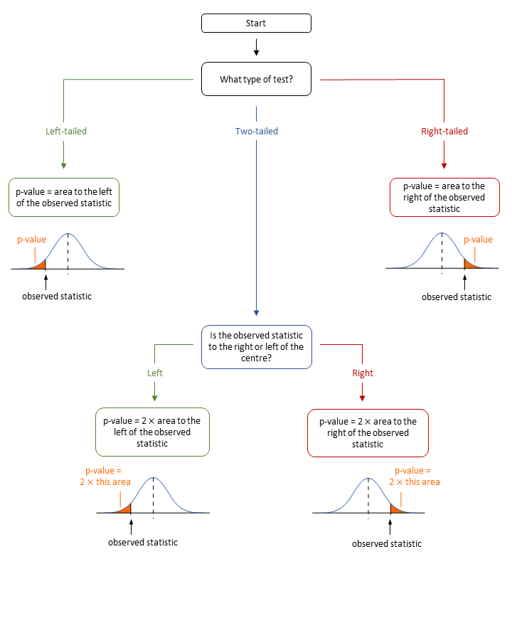
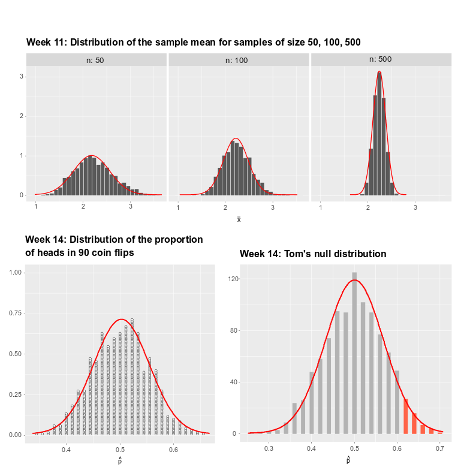

```{r, echo=FALSE}
HIDDEN_SOLS=FALSE
set.seed(15732)
ggplot2::theme_set(ggplot2::theme_gray(base_size=13))

library(tidyverse)
```

# Normal distribution & probability {#chap-normal}


<div class="lo">
#### Instructions {-}
  
- In this two-hour lab we will go through worked examples in the first hour, and you will attempt to answer some questions in the second hour.
- The Rmarkdown file for this week is [here](https://uoe-psychology.github.io/uoe_psystats/dapr1/labsheets/week_14_practice.Rmd).


#### Learning outcomes {-}

**LO1.** Understand the normal distribution

**LO2.** Compute probabilities using the uniform and normal density functions

**LO3.** Assess normality

#### Reading {-}


</div>


## Recap

```{r recap-pvalues, echo=FALSE, out.width='100%', fig.align='center'}

```


## Walkthrough

In the past four weeks, we plotted many histograms and dotplots. All these plots showed how, in different scenarios, a given statistic varied due to sampling variation:

- [Week 11](#chap-sampling-distributions) displayed the variability due to sampling from the population (_sampling distribution_)
- [Week 12](#bootstrapping-and-confidence-intervals) displayed the variability due to sampling with replacement from the only available sample (_bootstrap distribution_)
- [Week 13](#chap-hyp-test) displayed the variability when sampling from a population assuming the null hypothesis to be true (_null distribution_)

Pretty much all of the distributions we saw were bell-shaped. Figure \@ref(fig:normal-fits) shows some of the distributions we plotted in the past four weeks, with a red curve superimposed on top. Note how the red curve closely approximates the histograms.

```{r normal-fits, echo=FALSE, out.width='100%', fig.align='center'}

```

If you recall, the histograms from Week 11 show how many statistics fall in a given interval, e.g. the count of sample means between 2.0 and 2.1.


---

**From counts to densities**


---

As the red curve closely approximates the histograms, we will use the red curve to **model** the proportion of statistics in a given interval. This will let us calculate the probability of obtaining a statistic between two given values such as 3 and 3.2, say.

You can divide the counts by the total number of statistics that we have, obtaining the proportion (a.k.a. __relative frequency__) of sample means which are between 2.0 and 2.1, say, and this relative frequency is an estimate of the probability.


In mathematics, a model is an equation or a graph which is used to describe and recreate the behavior of something happening in reality.
The red curve in Figure \@ref(fig:normal-fits) is known as the **normal curve**, and it is used to describe the typical values we would see for continuous variables which are said to be **normally distributed**.


### Example: IQ scores

An example of a continuous random variable whose distribution is symmetric and bell-shaped is IQ scores.
The following histogram shows the IQ scores of 10,000 randomly selected UK adults:
```{r}
set.seed(1)
n <- 10000
iq_sample <- tibble(ID = 1:n, IQ = rnorm(n, mean = 100, sd = 15) %>% round(2))
write_csv(iq_sample, '../data/iq_sample.csv')
```

```{r}
library(tidyverse)
data <- read_csv('../data/iq_sample.csv', col_names = TRUE)
data

ggplot(data, aes(x = IQ)) +
  geom_histogram(color = 'white')
```


- how many times do you look at your phone in a day? 


a lot of distributions we have seen have looked like this.
this is not a coincidence.

under general circumstancesm distribution of many statistics will follow this pattern. 

we have talked about the properties of these shapes, and described them as symettric and bellshaped. 

an example  


```{r}
tibble(x=rnorm(1000,0,1)) %>%
  ggplot(aes(x=x))+
  geom_histogram(alpha=.6)+
  theme_light()
```


### density curves

theoretical model for a distribution is a density curve 

```{r}
tibble(x=rnorm(1000,0,1)) %>%
  ggplot(aes(x=x))+
  geom_histogram(aes(y=..density..),alpha=.6)+
  geom_density()+
  theme_light()+
  scale_y_continuous(NULL, breaks=NULL)
```


*calculating from a known distribution*: the proportion of samples which have a mean of less than 60. 
hint (we know that there are 1000 means... )
```{r, echo=FALSE}
breaks=seq(25,125,by=5)

tibble(x=rnorm(1000,75,15)) %>%
  ggplot(aes(x=x))+
  geom_histogram(aes(y=..count..),alpha=.6, breaks=breaks, col="white")+
  stat_bin(geom="text", aes(label=round(..count..,2), y=..count..), 
           breaks=breaks, colour="black", vjust = -.5 ) +
  theme_light()+
  scale_x_continuous(breaks=breaks)+
  labs(title="1000 means", x=~bar("x"))
```

We can count how *many* samples have a mean of <60. We can sum up the counts in all the bars below 60.
3+4+10+26+50+68 = 161
161/1000 = 0.161, so 16% of the means are <60. 


*estimating about a theoretical distribution* 
proportion of ...  which are:

less than 100
```{r echo=FALSE, fig.width=5}
x=rnorm(10000,100,25)
d<-tibble(dx=density(x)$x,dy=density(x)$y)

ggplot(d, aes(x=dx,y=dy))+
  geom_line(lwd=1)+
  geom_ribbon(data=subset(d,dx<100),
              aes(ymax=dy),ymin=0,
              fill="red",colour=NA,alpha=0.5)+
  theme_light()+
  scale_x_continuous(breaks=seq(0,200,by=10))
```

between x and y
```{r echo=FALSE, fig.width=5}
x=rnorm(10000,60,5)
d1<-tibble(dx=density(x)$x,dy=density(x)$y)

ggplot(d1, aes(x=dx,y=dy))+
  geom_line(lwd=1)+
  geom_ribbon(data=subset(d1,dx<70 & dx>65),
              aes(ymax=dy),ymin=0,
              fill="red",colour=NA,alpha=0.5)+
  theme_light()
```

### normal but different

density curves can take any shape, but the normal density curve has a special form which looks bellshaped.

take a look back at the previous two curves.. they look pretty similar, but that's just because of the axes of the graph changing..

```{r}
ggplot()+
  geom_line(data=d, aes(x=dx,y=dy),lwd=1)+
  geom_line(data=d1, aes(x=dx,y=dy),lwd=1)+
  theme_light()
```

### parameters


applet?

$$
N(\mu, \sigma)
$$


percentiles probabilities of normal curves 

### standard normal  

transforming $N(\mu,\sigma)$ to $N(0,1)$

steps 
+ minus the mean from each value
+ divide by the standard deviation  

the values are now..

### z-scores  

$$
z = \frac{x-\mu}{\sigma}
$$

we can use z-scores to identify which scores are more unusual than others. 


people walk 10000 steps a day. SD of 3000.
So this means that 95% of people walk between 4100 and 15900 steps per day. 

people drink 2500ml of water a day, SD of 500. 
95% of people drink between 1520ml and 3480ml of water a day  

is it more unusual for someone to walk only 6000 steps a day, or for someone to drink only 1700ml of water a day? 


```{r}
z1 = (6000-10000)/3000
z2 = (1700-2500)/500
z1;z2
```


### In-class activity


---

## Lab


