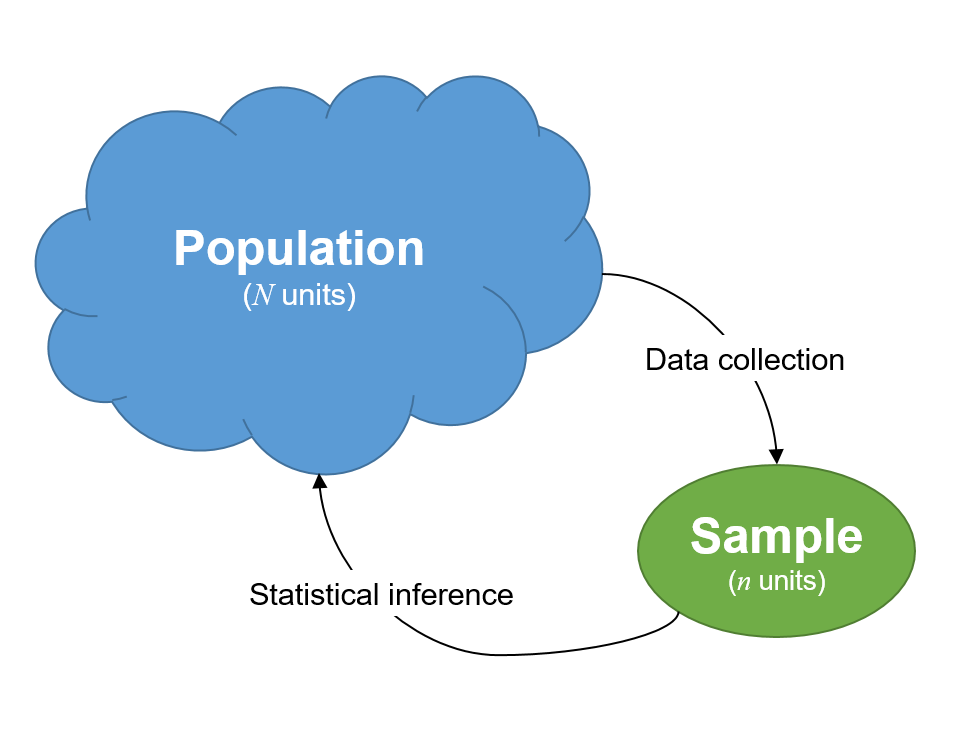

```{r, echo=FALSE}
HIDDEN_SOLS=FALSE
set.seed(15732)
ggplot2::theme_set(ggplot2::theme_gray(base_size=13))

library(tidyverse)
```

# One Sample Mean


<div class="lo">
#### Instructions {-}
  
- In this two-hour lab we will go through worked examples in the first hour, and you will attempt to answer some questions in the second hour.
- The Rmarkdown file for this week is [here](https://uoe-psychology.github.io/uoe_psystats/dapr1/labsheets/week_16_practice.Rmd).


#### Learning outcomes {-}

**LO1.** 

**LO2.** 

#### Reading {-}


</div>


## Recap

Over the last 5 weeks, we have started to look at how we can use samples from a population to draw infereces about a population. 

Some key things which we have learned:  
+ **Week 11:** We introduced the distinction between a population and a sample.
```{r echo=FALSE, out.width="400px"}

```

We then began to talk about sampling variability: how statistics will vary from sample to sample.
We introduced the idea of a **sampling distribution** of a statistic. This is the distribution of the values that a statistic takes for all possible samples of the same size from the same population.  
Crucially, we quantified this random variability by calculating the standard deviation of this distribution. This we call the **standard error** of the statistic.  

+ In **Week 12** we talked about the fact that in practice we cannot take lots of samples in order to build up a picture of the sampling distribution of a statistic. We discussed how we can approximate this process by **bootstrap resampling** our original sample.

+ Then, in **Weeks 13 and 14**, we introduced hypothesis testing, statistical significance and statistical power. These all relied on us having some measure of sampling variability. We were *simulating* sampling distributions under different hypothetical paramaters, against which we could then compare an observed statistic.
```{r echo=FALSE, out.width="400px"}

```


+ Finally, in **Week 15**, things got a bit abstract.  
Up until this point, we had been *generating* sampling distributions in order to test hypotheses or construct confidence intervals.  
We could only do this because we had a computer which could simulate 1000's of samples really quickly. 
We learned that we could also do these things theoretically. If we *assumed* that the sampling distribution was "symmetric and bell-shaped", we could estimate the standard error using a formula: 
$$SE(\bar{x}) = \frac{\sigma}{\sqrt{n}}$$

So we've got two ways of doing things now:
1- traditional, theoretical way, assuming SE = sigma/sqrt(n). assumes normal shaped sampling dist
2- computationally heavy, simulated way. bootstrap SE

image
sampling distributon standard error
approximated by - 
bootstrap disribution standard error
a theoretically "normal distributio", s/sqrt(n)


For the next couple of weeks, we are going to learn about some specific statistical tests we can perform, when we would use them, and how to calculate them.

For now, we are going to focus on the theoretical approach, and use formulae for the standard error. 
This week, we're going to look at the one sample mean test. 


## Walkthrough

The "one sample mean test" does pretty much what it says - if you have one sample and you have a mean, you can perform a statistical test in order to evaluate how likeliy it is that the population mean (which the sample mean is your estimate of) is equal to a specific value.  

Example questions: 
+ Is the average weight of all dogs 20kg?  
+ Is the mean body temperature 37 degrees C?  
+ On the Bedeck Depression Inventory (BDI), a score of >25 is considered clinical diagnosis of depression. Is the average score of people with --- significantly above this cutoff?


### hypotheses

Null hypothesis:  
The population mean ($\mu$) is equal to some pre-specified number (denoted $\mu_{H_0}$).
$H_0: \mu = \mu_{H_0}$

Alternative hypothesis:  
The population mean ($\mu$) is not equal to/is less than/is greater than some pre-specified number (denoted $\mu_{H_0}$).  
$H_1: \mu \neq \mu_{H_0}$
$H_1: \mu > \mu_{H_0}$
$H_1: \mu < \mu_{H_0}$


### Example 1 

Is the average salary of NFL players more than $1m?  

We have data on our entire population:  
```{r}
nfl <- read_tsv('https://edin.ac/2TexAFA')
```


Null hypothesis:  
The mean salary of NFL players in 2015 is equal to $1m.
$H_0: \mu = 1,000,000$

Alternative hypothesis:  
The population mean is is greater than $1m.  
$H_1: \mu > 1,000,000$

Test the hypothesis.
- are we making a statistical inference here? 
- no, we're actually just asking a question about a population which we can directly answer because we have data on the entire population. remember that inferencing is when we use sample statistics to make claims about a population parameter.  

$\mu = 35?$
$30 = 35?$


example 2 -??

suppose we have a population of ?

and we have a sample of 50
mean = ?


our hypothesis is about $\mu$. the population parameter.
$\mu = ..$
and to investigate this, we are asking: 
is our mean of our sample significantly different from ---.

so..
difference is xbar - mu_0.

instead of directly calculating $\mu$, we have to use our sample statistic $\bar{x}$ (the mean of our sample) as our best estimate.  


Q - is xbar-mu_0 a big difference? 
A - depends. it might seem like a big difference.. 
BUT.. is it just random sampling? do we just happen to have got a sample from the population with a mean far away from mu_0?


this brings uncertainty. we don't know how good $\bar{x}$ is as an estimate of $\mu$. 

the extra piece of the puzzle we need to know:
 - how much do the means of samples of size 50 vary?

if we were to take lots of samples of size 50 and calculate the mean,
how spread out would they be?
we've seen this idea recurrring over and over agin.
this is the standard error of the sample statistic.


<!-- why? -->
<!-- well, imagine the following scenario:  -->
<!-- population mean is 20, have a sample of 50, for which the standard error of the mean is 2.  -->
<!-- - if we take lots of samples of size 50, some would have mean 16, some 22. 95% of the samples we take will have a mean between 16 and 24 (rounded up from 1.96*SE) -->
<!-- - remember that the standard error is the standard deviation of the sampling distribution.   -->


<!-- now lets imagine we are testing $H_0: \mu = 20$ -->
<!-- we have a sample of 50, and the mean is 23.  -->
<!-- 23-20 = 3 -->
<!-- is this difference big enough?  -->
<!-- by dividing this difference by the standard error, we get an idea how big this distance is (from xbar to 20) in terms of standard deviations of the sampling distribution.  -->

<!-- (23-20)/2 = 3/2 = 1.5  -->
<!-- so this 1.5 refers to distance from our sample mean and our null parameter, in terms of the spread of the sample means  -->


we can't actually sample lots of times from the population in order to find the standard error. 
remember what we can do? we can either
- resample with replacement (bootstrap) to find an estimate of the SE
- use our formula se = sigma/sqrt(n)


- 

- bootstrapping

- traditional 

- comparison


- random variables (T when null is true looks like ...)
- our question "how surprising is bar(x)?" is now turned into "how surprising is T?". 
- df


### In-class activity

`r msmbstyle::question_begin()`
```{r echo=FALSE, out.width="600px"}

```
`r msmbstyle::question_end()`
`r msmbstyle::solution_begin(hidden=FALSE)`


```{r echo=FALSE, out.width="600px"}

```
`r msmbstyle::solution_end()`


---

## Lab


