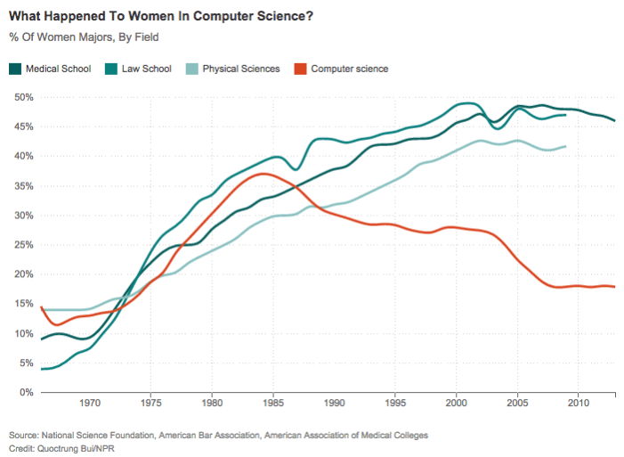

```{r, echo=FALSE}
HIDDEN_SOLS=TRUE
```

# Tidyverse & Markdown

This week, we're going to introduce you to some really nice packages and tools which will help you to make your analysis and reporting more **efficient**, **aesthetically pleasing**, and (importantly) **reproducible**.  

`r msmbstyle::question_begin()`
If you haven't previously installed them, install the following packages

* tidyverse  
* rmarkdown  
* haven (*this one is just for reading in data from other software like SPSS or SAS*)  
`r msmbstyle::question_end()`

### Background & Reading {-}  

R for Data Science: [https://r4ds.had.co.nz/index.html](https://r4ds.had.co.nz/index.html)  

* Data visualization: Chapters 3 and 28  
* Data management (tidyverse): Chapters 5 and 12  
* R Markdown: Chapter 27  

Extras:  
  
* Kieran Healey has a brilliant book on getting started with ggplot: [Data Visualisation; a practical introduction](https://socviz.co/index.html)  
* Another great one is [Fundamentals of Data Visualisation](https://serialmentor.com/dataviz/) by Claus O. Wilke  

## Data Visualization with `ggplot`  

For plotting, you may be familiar with the popular `ggplot2` package from some of the USMR labs last semester. We're going to be using this more and more, so the first part of today's lab will focus on `ggplot`.  

**Visualization is the first step in analysis**  

<!--  -->

### Geoms   

To learn about some of the different functionalities of `ggplot`, we're first going to need some data...  

`r msmbstyle::question_begin()`
Load the ggplot2 package, read in the data using `load()` and `url()`, and extract some summary statistics.    
The data can be found at [https://edin.ac/2Erg9ZW](https://edin.ac/2Erg9ZW).  
`r msmbstyle::question_end()`

`r msmbstyle::solution_begin(hidden=FALSE)`
```{r}
library(ggplot2)
load(url("https://edin.ac/2Erg9ZW"))
summary(speech_ses)
```
`r msmbstyle::solution_end()`

<div class="lo">
**Data overview**  

Kraus et al. (2019) *Evidence for the reproduction of social class in brief speech*, Proc. Natl. Acad. Sci. U.S.A. (Study 1)  

* N=189 speakers from the International Dialects of (North American) English Archive. Narrative speech and reading stories.
* Extracted 7 individual words that were produced by all speakers: "And", "From", "Thought", "Beautiful", "Imagine", "Yellow", and "The".
* Participants (N=229, from AMT)
    + Listened to the 7 one-word clips
    + Estimated the speaker’s race, gender, age, and educational attainment
    + Each participant completed this for a random subset of 27 speakers
</div>


`r msmbstyle::question_begin()`
Make a summary plot showing mean accuracy for each category of judgment  
**hint:** try `?stat_summary`  
`r msmbstyle::question_end()`  

`r msmbstyle::solution_begin(hidden=HIDDEN_SOLS)`
```{r}
#one way of doing this:
ggplot(speech_ses, aes(x = Category, y = Accuracy, fill = Category)) +
  stat_summary(fun=mean, geom="bar")
```
`r msmbstyle::solution_end()`
```{r echo=FALSE}
#one way of doing this:
ggplot(speech_ses, aes(x = Category, y = Accuracy, fill = Category)) +
  stat_summary(fun=mean, geom="bar")
```

`r msmbstyle::question_begin()`
Explore the different ways of showing variability. Construct a plot using each of the following geoms:
`r msmbstyle::question_end()`

`r msmbstyle::solution_begin(hidden=HIDDEN_SOLS)`
```{r, eval=FALSE}
# * Boxplot
ggplot(speech_ses, aes(x = Category, y = Accuracy, fill = Category)) +
  geom_boxplot()
# * Jitter
ggplot(speech_ses, aes(x = Category, y = Accuracy, colour = Category)) +
  geom_jitter(width=0.2, alpha=0.5)
# * Violin plot
ggplot(speech_ses, aes(x = Category, y = Accuracy, fill = Category)) +
  geom_violin()
# * Errorbar
ggplot(speech_ses, aes(x = Category, y = Accuracy, colour = Category)) +
  stat_summary(fun.data=mean_se, geom="errorbar")
# * Pointrange
ggplot(speech_ses, aes(x = Category, y = Accuracy, colour = Category)) +
  stat_summary(fun.data=mean_se, geom="pointrange")

```
`r msmbstyle::solution_end()`

```{r echo=FALSE}
# * Boxplot
p1 = ggplot(speech_ses, aes(x = Category, y = Accuracy, fill = Category)) +
  geom_boxplot()+
  labs(title="Boxplot")+theme(legend.position = "none")
# * Jitter
p2 = ggplot(speech_ses, aes(x = Category, y = Accuracy, colour = Category)) +
  geom_jitter(width=0.2, alpha=0.5)+
  labs(title="Jitter")+theme(legend.position = "none")
# * Violin plot
p3 = ggplot(speech_ses, aes(x = Category, y = Accuracy, fill = Category)) +
  geom_violin()+
  labs(title="Violin")+theme(legend.position = "none")
# * Errorbar
p4 = ggplot(speech_ses, aes(x = Category, y = Accuracy, colour = Category)) +
  stat_summary(fun.data=mean_se, geom="errorbar")+
  labs(title="Errorbar")+theme(legend.position = "none")
# * Pointrange
p5 = ggplot(speech_ses, aes(x = Category, y = Accuracy, colour = Category)) +
  stat_summary(fun.data=mean_se, geom="pointrange")+
  labs(title="Pointrange")+theme(legend.position = "none")

library(patchwork)
p2 / (p1 | p3 ) / (p4 | p5)

```


`r msmbstyle::question_begin()`
Combine two of the geoms used above to create a visualization of the mean accuracy, a measure of variability, and all of the data points.
`r msmbstyle::question_end()`

`r msmbstyle::solution_begin(hidden=HIDDEN_SOLS)`
```{r}
ggplot(speech_ses, aes(x = Category, y = Accuracy, colour = Category)) +
  geom_jitter(width=0.2, alpha=0.5) + 
  stat_summary(fun.data=mean_se, geom="errorbar", 
               colour="black", width=0.4, size=1.5)
```
`r msmbstyle::solution_end()`


`r msmbstyle::question_begin()`
Refine the plot by, for example, removing unnecessary elements, adding useful annotations (e.g., chance performance = 50%), selecting a good color scheme, etc.  
**tip:** This is where google becomes really helpful, <a href="https://lmgtfy.com/?q=remove+a+legend+in+ggplot2" target="_blank">for example</a>  
`r msmbstyle::question_end()`

`r msmbstyle::solution_begin(hidden=HIDDEN_SOLS)`
```{r}
ggplot(speech_ses, aes(x = Category, y = Accuracy, colour = Category)) +
  geom_jitter(width=0.2, alpha=0.5) + 
  stat_summary(fun.data=mean_se, geom="errorbar", 
               colour="black", width=0.4, size=1.5) +
  guides(colour = FALSE) + theme_bw() +
  scale_color_brewer(palette = "Set1") +
  geom_hline(yintercept=50, linetype="dashed")
  
```
`r msmbstyle::solution_end()`


### Recreating a plot   

`r msmbstyle::question_begin()`
Recreate the graph below using `ggplot` (if you like, try to make it better!).
`r msmbstyle::question_end()`

  

The data (in .csv format) can be downloaded from [https://edin.ac/2qYA0wr](https://edin.ac/2qYA0wr). You can use `read.csv(url("https://edin.ac/2qYA0wr"))` to read it directly into R.  

`r msmbstyle::solution_begin(hidden=HIDDEN_SOLS)`
```{r}
women_cs<-read.csv(url("https://edin.ac/2qYA0wr"))
ggplot(women_cs, aes(x=date, y=pct_women_majors, color=field))+
  labs(x=NULL,y=NULL, title="What happened to women in computer science?")+
  geom_line()+
  scale_color_manual(values=c('#11605E', '#17807E', '#8BC0BF','#D8472B'))+
  scale_y_continuous(label=scales::percent)+
  theme_minimal(base_family="Helvetica")+
  theme(legend.title=element_blank())
# If you want to get fancier, and add the labels at the end of the lines, check out the gghighlight package!
```
`r msmbstyle::solution_end()`

## Data management with the Tidyverse  

A collection of `R` packages known as the `tidyverse` provides so many incredibly useful functions that can speed up your workflow. They are often contrasted to `Base R` (which is what you have been working with so far) in that they provide an *alternative grammar* which is aimed at being more predictable and consistent. Some people find the tidyverse a lot more intuitive, but others don't, and the transition can sometimes be difficult!  

### Piping!   

It may look a bit weird (`%>%`), but the pipe operator in R is incredibly useful. Its fundamental role is to 'chain' functions together. Previously we wrapped functions around one another, with lots of brackets, but with `%>%` we can link the intermediate output of one function and take it as the input of another.  
  
The two functions `f` and `g`, when used in combination like `g(f(x))`, can now be written as `x %>% f() %>% g()`.  You don't even always need the brackets, and coulde write `x %>% f %>% g`!  

The default behaviour of `%>%` is to put the output of the LHS (left hand side) in as the first argument in the RHS. However, you can change this by using `%>%` in combination with a `.`, to specify which argument you want it to be inputted as:  
  
* `100 %>% rnorm(10, ., 1)` is equal to `rnorm(10, 100, 1)`
* The default behaviour: `100 %>% rnorm(0, 1)` is implicitly saying `100 %>% rnorm(., 0, 1)`, which is equal to `rnorm(100, 0, 1)`.

`r msmbstyle::question_begin()`
Translate the following statements between Base R and sequences of pipes. The first is shown for you.
`r msmbstyle::question_end()`
  
##### 1 {-}  
Base R: 
```{r echo=TRUE,eval=FALSE}
round(mean(rnorm(100,0,1)))
```
Pipes :
```{r echo=TRUE,eval=FALSE}
rnorm(100,0,1) %>% 
  mean() %>% 
  round()
```

##### 2 {-}    
Base R: 
```{r echo=TRUE,eval=FALSE}
x<-10:100
round(exp(diff(log(x))), 2)
```
Pipes:
`r msmbstyle::solution_begin(hidden=HIDDEN_SOLS)`
```{r eval=FALSE}
10:100 %>% log() %>%
    diff() %>%
    exp() %>%
    round(2)
```
`r msmbstyle::solution_end()`

##### 3 {-}  
Pipes: 
```{r echo=TRUE, eval=FALSE}
6 %>% round(pi, digits=.)
```
  
Base R: 
`r msmbstyle::solution_begin(hidden=HIDDEN_SOLS)`
```{r eval=FALSE}
round(pi, digits=6)
```
`r msmbstyle::solution_end()`

### Grouping, summarising, filtering, mutating and selecting   

Tidyverse also gives us really useful functions for wrangling data. There are many, but some of the key ones we'll learn here are:  
 
* `select()` extracts columns  
* `filter()` subsets data based on conditions  
* `mutate()` adds new variables    
* `group_by()` group related rows together  
* `summarise()`/`summarize()` reduces values down to a single summary  

For a quick example, if we want to calculate the median accuracy for each category, but only after removing those with an accuracy <50, we could use:
```{r echo=TRUE, eval=FALSE}
speech_ses %>% 
  filter(Accuracy>50) %>%
  group_by(Category) %>% 
  summarise(
    mdn_accuracy = median(Accuracy)
  )
```
And if we wanted to also calculate the mean accuracy for each category, we could add:  
```{r echo=TRUE, eval=FALSE}
speech_ses %>% 
  group_by(Category) %>% 
  summarise(
    n = n(),
    mean_acc = mean(Accuracy)
  )
```


`r msmbstyle::question_begin()`
Load the tidyverse, and haven package, and read in the data using `read_sav()` (.sav is the type of file which comes out of another stats software, SPSS).   
You can download the data from [https://edin.ac/34n6AWA](https://edin.ac/34n6AWA) to your computer, and then read it in.  
`r msmbstyle::question_end()`

```{r echo=TRUE, warning=FALSE,message=FALSE}
library(tidyverse)
exam <- haven::read_sav("data/exam.sav") 
```

Using the `exam.sav` data:

`r msmbstyle::question_begin()`
Calculate the mean score for each exam
`r msmbstyle::question_end()`

`r msmbstyle::solution_begin(hidden=HIDDEN_SOLS)`
```{r}
exam %>% group_by(exam) %>% 
  summarize(M = mean(scores))
```
`r msmbstyle::solution_end()`

`r msmbstyle::question_begin()`
Calculate the mean score for each exam for female students only
`r msmbstyle::question_end()`

`r msmbstyle::solution_begin(hidden=HIDDEN_SOLS)`
```{r}
exam %>% 
  filter(gender=="f") %>%
  group_by(exam) %>% 
  summarize(M = mean(scores))
```
`r msmbstyle::solution_end()`

`r msmbstyle::question_begin()`
Make a new dataframe containing only the exam scores for males for exam number 1, with a new variable indicating whether they passed or not (pass = a score of 40)
`r msmbstyle::question_end()`

`r msmbstyle::solution_begin(hidden=HIDDEN_SOLS)`
```{r}
exam_m1 <- exam %>% 
  filter(exam == 1, gender == "m") %>%
  mutate(pass = ifelse(scores>40,"pass","fail"))
```
`r msmbstyle::solution_end()`

`r msmbstyle::question_begin()`
Calculate the average score for each exam for male and female students")`
`r msmbstyle::question_end()`

`r msmbstyle::solution_begin(hidden=HIDDEN_SOLS)`
```{r}
exam %>% group_by(exam, gender) %>% 
  summarize(M = mean(scores))

#    use spread() to make it easier to compare
exam %>% group_by(exam, gender) %>% 
  summarize(M = mean(scores)) %>% 
  spread(gender, M)
```
`r msmbstyle::solution_end()`


### Reshaping  

The same data can be represented in many different ways. We often discern between *long* and *wide* formats, and each of these are useful in different ways. 
Consider, the below example, showing the same data in *long* format on the left, and in *wide* on the right. 


There are some useful functions which we can use to move between these formats: `gather()` and `spread()`. Check out the explanation of them [in the reading, section 12.3](https://r4ds.had.co.nz/tidy-data.html#spreading-and-gathering)[^1]

[^1]: A newer version of these are `pivot_longer()` and `pivot_wider()`, but `gather()` and `spread()` will continue to be available.  


<div class="lo">
**Data overview**  

The `USArrests` data set (comes with R) contains violent crime arrests (per 100,000 residents) in each of the 50 states in the USA in 1973 and the percent of the population of each state that lived in urban areas.
You can see it by just typing `USArrests` in R.
</div>

`r msmbstyle::question_begin()`
Convert the USArrests data set from a wide to a long format so that instead of separate variables for each crime type (Murder, Assault, Rape), there is one variable that identifies the crime type and one variable that contains the rates for each crime type for each state.
`r msmbstyle::question_end()`

`r msmbstyle::solution_begin(hidden=HIDDEN_SOLS)`
```{r}
x <- gather(USArrests, key="CrimeType", value="Rate", 
            Murder, Assault, Rape)
```
`r msmbstyle::solution_end()`


`r msmbstyle::question_begin()`
Make a scatterplot showing the relationship between each type of violent crime rate and percent of population living in urban areas.
`r msmbstyle::question_end()`

`r msmbstyle::solution_begin(hidden=HIDDEN_SOLS)`
```{r fig.height=3}
ggplot(x, aes(UrbanPop, Rate)) + 
  facet_wrap(~CrimeType, scales="free", nrow=1) + 
  geom_point() + stat_smooth(method="lm")
```
`r msmbstyle::solution_end()`


### Less guidance {-}  
<div class="lo">  
**Data overview**  

The `ability` data set in the `psych` package contains accuracy of 1525 subjects on 16 multiple choice IQ-test-type questions. The questions are of 4 types: basic reasoning, letter sequence, matrix reasoning, and spatial rotation. There are four questions of each type.  
You can see the by typing `psych::ability` (those `::` are just a way of accessing something from inside a package without loading it). 
</div>

`r msmbstyle::question_begin()`
Tidy the data and make a graph of average accuracy for each question type.  
**Hint:** the `separate()` function may come in handy at some point.  
`r msmbstyle::question_end()`

`r msmbstyle::solution_begin(hidden=HIDDEN_SOLS)`
```{r fig.height=4, warning=FALSE}
iq <- as_tibble(psych::ability) %>% 
  gather(key="Item", value="Correct", 1:16) %>%
  separate(Item, c("Domain", "Number"))

ggplot(iq, aes(Domain, Correct)) + 
  stat_summary(fun = mean, geom="bar")
```
`r msmbstyle::solution_end()`

## Reproducible research with RMarkdown  

We're also going to start to use `RMarkdown`. This is a really useful means of making a report reproducible. Essentially, it is a combination of `R` code and normal text. It will require learning a few new formatting rules (the "markdown" bit), but it means that in one file you can read in and analyse your data, and compile it to a pdf. Which essentially means that if your data or analysis changes, then the results you report change too without having to edit them! 

### Convert a script into a R Notebook   

Open your script from the exercises so far. Compile a HTML report from that script.

<!--  -->

`r msmbstyle::question_begin()`
Create a new `R Notebook` file, fill it in with the content of your script from the exercises so far.")`   
**Hint:** R code goes into R chunks, add some text in between chunks.

*  Add formatting to make it look nicer: headers, bold, italics, etc ([see the cheat-sheet](https://rstudio.com/wp-content/uploads/2015/02/rmarkdown-cheatsheet.pdf))  
*  Add chunk options to suppress extraneous messages and warnings, and to control the size of figures.  

`r msmbstyle::question_end()`

`r msmbstyle::question_begin()`
Knit the notebook into a HTML file.
`r msmbstyle::question_end()`


