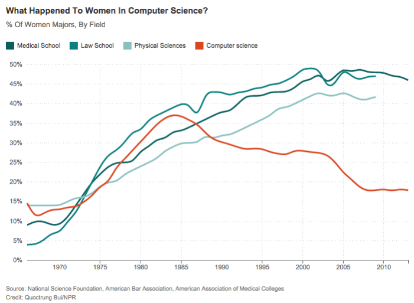

```{r, echo=FALSE}
solution=TRUE
```


# Week 1 Solutions {-}  

## Data Visualization with `ggplot`  

### Geoms   

`r task()`Load the `ggplot2` package, read in the data using `load()` and `url()` from [https://edin.ac/2Erg9ZW](https://edin.ac/2Erg9ZW) and extract some summary statistics.  

```{r echo=solution, include=FALSE}
library(ggplot2)
load(url("https://edin.ac/2Erg9ZW"))
summary(speech_ses)
```

`r task()`Make a summary plot showing mean accuracy for each category of judgment  
**hint:** try `?stat_summary`

```{r echo=solution}
#one way of doing this:
ggplot(speech_ses, aes(x = Category, y = Accuracy, fill = Category)) +
  stat_summary(fun=mean, geom="bar")
```

`r task()`Explore the different ways of showing variability. Construct a plot using each of the following geoms:  
```{r, echo=solution, eval=FALSE}
# * Boxplot
ggplot(speech_ses, aes(x = Category, y = Accuracy, fill = Category)) +
  geom_boxplot()
# * Jitter
ggplot(speech_ses, aes(x = Category, y = Accuracy, colour = Category)) +
  geom_jitter(width=0.2, alpha=0.5)
# * Violin plot
ggplot(speech_ses, aes(x = Category, y = Accuracy, fill = Category)) +
  geom_violin()
# * Errorbar
ggplot(speech_ses, aes(x = Category, y = Accuracy, colour = Category)) +
  stat_summary(fun.data=mean_se, geom="errorbar")
# * Pointrange
ggplot(speech_ses, aes(x = Category, y = Accuracy, colour = Category)) +
  stat_summary(fun.data=mean_se, geom="pointrange")

```

```{r echo=FALSE}
# * Boxplot
p1 = ggplot(speech_ses, aes(x = Category, y = Accuracy, fill = Category)) +
  geom_boxplot()+
  labs(title="Boxplot")+theme(legend.position = "none")
# * Jitter
p2 = ggplot(speech_ses, aes(x = Category, y = Accuracy, colour = Category)) +
  geom_jitter(width=0.2, alpha=0.5)+
  labs(title="Jitter")+theme(legend.position = "none")
# * Violin plot
p3 = ggplot(speech_ses, aes(x = Category, y = Accuracy, fill = Category)) +
  geom_violin()+
  labs(title="Violin")+theme(legend.position = "none")
# * Errorbar
p4 = ggplot(speech_ses, aes(x = Category, y = Accuracy, colour = Category)) +
  stat_summary(fun.data=mean_se, geom="errorbar")+
  labs(title="Errorbar")+theme(legend.position = "none")
# * Pointrange
p5 = ggplot(speech_ses, aes(x = Category, y = Accuracy, colour = Category)) +
  stat_summary(fun.data=mean_se, geom="pointrange")+
  labs(title="Pointrange")+theme(legend.position = "none")

library(patchwork)
p2 / (p1 | p3 ) / (p4 | p5)
```

`r task()`Combine two of the geoms used above to create a visualization of the mean accuracy, a measure of variability, and all of the data points. 

```{r echo=solution, include=solution}
ggplot(speech_ses, aes(x = Category, y = Accuracy, colour = Category)) +
  geom_jitter(width=0.2, alpha=0.5) + 
  stat_summary(fun.data=mean_se, geom="errorbar", 
               colour="black", width=0.4, size=1.5)
```


`r task()`Refine the plot by, for example, removing unnecessary elements, adding useful annotations (e.g., chance performance = 50%), selecting a good color scheme, etc.  
**tip:** This is where google becomes really helpful, <a href="https://lmgtfy.com/?q=remove+a+legend+in+ggplot2" target="_blank">for example</a>
```{r echo=solution, include=solution}
ggplot(speech_ses, aes(x = Category, y = Accuracy, colour = Category)) +
  geom_jitter(width=0.2, alpha=0.5) + 
  stat_summary(fun.data=mean_se, geom="errorbar", 
               colour="black", width=0.4, size=1.5) +
  guides(colour = FALSE) + theme_bw() +
  scale_color_brewer(palette = "Set1") +
  geom_hline(yintercept=50, linetype="dashed")
  
```

### Recreating a plot   

`r task()` Pick one of the graphs below, and recreate it using `ggplot` (if you like, try to make it better!). 

#### Option A {-}    
  

The data (in .csv format) can be downloaded from [https://edin.ac/2qYA0wr](https://edin.ac/2qYA0wr). You can use `read.csv(url("https://edin.ac/2qYA0wr"))` to read it directly into R.  

```{r echo=solution, include=solution, eval=FALSE}
women_cs<-read.csv(url("https://edin.ac/2qYA0wr"))
ggplot(women_cs, aes(x=date, y=pct_women_majors, color=field))+
  labs(x=NULL,y=NULL, title="What happened to women in computer science?")+
  geom_line()+
  scale_color_manual(values=c('#11605E', '#17807E', '#8BC0BF','#D8472B'))+
  scale_y_continuous(label=scales::percent)+
  theme_minimal(base_family="Helvetica")+
  theme(legend.title=element_blank())
# If you want to get fancier, and add the labels at the end of the lines, check out the gghighlight package!
```

#### Option B {-}    

image

The .csv can be downloaded from [LINK](LINK).

## Data management with the Tidyverse  

### Piping!   

`r task()`Translate the following statements between Base R and sequences of pipes. The first is shown for you.  
  
##### 1 {-}  
Base R: 
```{r echo=TRUE,eval=FALSE}
round(mean(rnorm(100,0,1)))
```
Pipes :
```{r echo=TRUE,eval=FALSE}
rnorm(100,0,1) %>% 
  mean() %>% 
  round()
```

##### 2 {-}    
Base R: 
```{r echo=TRUE,eval=FALSE}
x<-10:100
round(exp(diff(log(x))), 2)
```
Pipes:  
```{r echo=solution,eval=FALSE}
10:100 %>% log() %>%
    diff() %>%
    exp() %>%
    round(2)
```
   
##### 3 {-}  
Pipes: 
```{r echo=TRUE, eval=FALSE}
6 %>% round(pi, digits=.)
```
Base R:  
```{r echo=solution, eval=FALSE}
round(pi, digits=6)
```

### Grouping, summarising, filtering, mutating and selecting   

`r task()`Load the tidyverse, and haven package, and read in the data using `read_sav()` (.sav is the type of file which comes out of another stats software, SPSS). You can download the data from [https://edin.ac/34n6AWA](https://edin.ac/34n6AWA) to your computer, and then read it in. 
```{r echo=TRUE, warning=FALSE,message=FALSE}
library(tidyverse)
exam <- haven::read_sav("data/exam.sav") 
```

`r task()`Calculate the mean score for each exam
```{r echo=solution, include=solution}
exam %>% group_by(exam) %>% 
  summarize(M = mean(scores))
```

`r task()`Calculate the mean score for each exam for female students only
```{r echo=solution, include=solution}
exam %>% 
  filter(gender=="f") %>%
  group_by(exam) %>% 
  summarize(M = mean(scores))
```

`r task()`Make a new dataframe containing only the exam scores for males for exam number 1, with a new variable indicating whether they passed or not (pass = a score of 40)  
```{r echo=solution, include=solution}
exam_m1 <- exam %>% 
  filter(exam == 1, gender == "m") %>%
  mutate(pass = ifelse(scores>40,"pass","fail"))
```

`r task()`Calculate the average score for each exam for male and female students
```{r echo=solution, include=solution}
exam %>% group_by(exam, gender) %>% 
  summarize(M = mean(scores))

#    use spread() to make it easier to compare
exam %>% group_by(exam, gender) %>% 
  summarize(M = mean(scores)) %>% 
  spread(gender, M)
```

### Reshaping   

wide, long, "tidy" data..

`r task()`Convert the USArrests data set from a wide to a long format so that instead of separate variables for each crime type (Murder, Assault, Rape), there is one variable that identifies the crime type and one variable that contains the rates for each crime type for each state.
```{r echo=solution, include=solution}
x <- gather(USArrests, key="CrimeType", value="Rate", 
            Murder, Assault, Rape)
```

`r task()`Make a scatterplot showing the relationship between each type of violent crime rate and percent of population living in urban areas. 
```{r echo=solution, include=TRUE, fig.height=3}
ggplot(x, aes(UrbanPop, Rate)) + 
  facet_wrap(~CrimeType, scales="free", nrow=1) + 
  geom_point() + stat_smooth(method="lm")
```

### Less guidance {-}  

`r task()`Tidy the data and make a graph of average accuracy for each question type.  
**Hint:** the `separate()` function may come in handy at some point.  
```{r echo=solution,include=solution,fig.height=4, warning=FALSE}
iq <- as_tibble(psych::ability) %>% 
  gather(key="Item", value="Correct", 1:16) %>%
  separate(Item, c("Domain", "Number"))

ggplot(iq, aes(Domain, Correct)) + 
  stat_summary(fun = mean, geom="bar")
```
