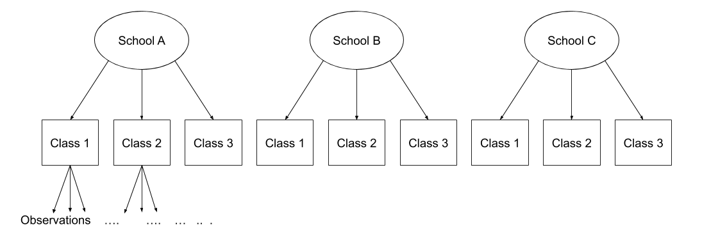

```{r, echo=FALSE}
HIDDEN_SOLS=FALSE
```

# Recap & Individual differences 

### Packages {-}  

+ lme4  

```{r}
require(tidyverse)
require(lme4)
require(patchwork)
source("plottingmixedmods.R")
```


### Lecture Slides {-}  

+ Coming soon  

## A broad overview {-} 

In a simple linear regression, there is only considered to be one source of random variability: any variability left unexplained by a set of predictors (which are modelled as fixed estimates) is captured in the model residuals.  
<br>
Multi-level (or 'mixed-effects') approaches involve modelling more than one source of random variability - as well as variance resulting from taking a random sample of observations, we can identify random variability across different groups of observations. For example, if we are studying a patient population in a hospital, we would expect there to be variability across the our sample of patients, but also across the doctors who treat them. 
<br>
We can account for this variability by allowing the outcome to be lower/higher for each group (a random intercept) and by allowing the estimated effect of a predictor vary across groups (random slopes).  
<br>
The first part of this lab will guide you through a walkthrough of these concepts, before you tackle some exercises.  


## Simple regression

<div class="noteBox">
**Formula:**  
  
+ $Y_i = \beta_0 + \beta_1 X_i + \epsilon_i$  
  
**R command:**  
  
+ `lm(outcome ~ predictor, data = dataframe)`  
  
*Note:* this is the same as `lm(outcome ~ 1 + predictor, data = dataframe)`. The `1 +` is always there unless we specify otherwise (e.g., by using `0 +`).
</div>
<br>
```{r echo=FALSE}
plot_data + plot_lm
```

<!-- This sort of regression can be solved using *Ordinary Least Squares (OLS)*, to find the values of $\beta_0$ and $\beta_1$ which minimise the sum of the squared residuals (the distance from the predicted values of $y$ to the observed values of $y$).   -->

<!-- We saw in USMR that we could extend the principles of linear regression to non-numeric outcomes such as a binomial variable. In this case, we modelled the log-odds: -->
<!-- $$ -->
<!-- log(\frac{p_i}{1-p_i}) = \beta_0 + \beta_1 X_i + \epsilon_i -->
<!-- $$ -->
<!-- In this case, we left OLS behind in favour of *Maximum Likelihood Estimation (MLE)*. MLE can only be found by *numerical optimization*. In its simplest form, optimsation consists of maximising/minimising a function through iteration (choosing a set of input values, computing the output of the function, and refitting).  

Estimation as iterative algorithms.

1. Begin with some an initial guess (start values) for parameter values.
1. Compute the log-likelihood, and adjust the guess at parameter values. (Each time this is done is an *iteration*)
1. Recompute the likelihood.
1. Repeat until improvements in likelihood value are neglible across iterations

-->


## Clustered (multi-level) data structures 

When our data is clustered (or 'grouped') such that datapoints are no longer independent, but belong to some grouping such as that of multiple observations from the same subject, we have multiple sources of random variability. A simple regression does not capture this.  

If we separate out our data to show an individual plot for each subject, we can see how the fitted regression line from `lm()` is assumed to be the same for each subject.  
  
```{r echo=FALSE}
plot_lm_fac
```

## Random intercept models  

By including a random-intercept term, we are letting our model estimate random variability around an average parameter (represented by the fixed effects) for the clusters.

<div class="noteBox">
**Formula:**  
Level 1:  
  
+ $Y_{ij} = \beta_{0j} + \beta_{1j}X_{ij} + \epsilon_{ij}$  
  
Level 2:  
  
+ $\beta_{0j} = \gamma_{00} + u_{0j}$   
  
We can now see that the $\beta_0$ estimate for a particular group $j$ is represented by the combination of a mean estimate for the parameter ($\gamma_{00}$) and a random effect for that group ($u_{0j}$)

**R command:**  
  
+ `lmer(outcome ~ predictor + (1 | grouping), data = dataframe)`  
  
</div>

Notice how the fitted line of the random intercept model has an adjustment for each subject.  
Each subject's line has been moved up or down accordingly. 

```{r echo=FALSE,fig.width=12, fig.height=8}
plot_lm_fac + plot_ri_fac
```

<div class="lo">

### Shrinkage {-}  

If you think about it, we might have done a similar thing with the tools we already had at our disposal, by using `lm(y~x+subject)`.  
This would give us a coefficient for the difference between each subject and the reference level intercept.  
  
However, the estimate of these models will be slightly different:  

```{r echo=FALSE}
plot_shrinkage
```

**Why?** One of the benefits of multi-level models is that our cluster-level estimates are shrunk towards the average depending on a) the level of across-cluster variation and b) the number of datapoints in clusters. 

</div>

## Random slopes  


<div class="noteBox">
**Formula:**  
Level 1:  
  
+ $Y_{ij} = \beta_{0j} + \beta_{1j}X_{ij} + \epsilon_{ij}$  
  
Level 2:  
  
+ $\beta_{0j} = \gamma_{00} + u_{0j}$  
+ $\beta_{1j} = \gamma_{10} + u_{0j}$  
  
  
As with the intercept $\beta_0$, the slope of the predictor $\beta_1$ is now modelled by a mean and a random effect for each group ($u_{0j}$)

**R command:** 
  
+ `lmer(outcome ~ predictor + (1 + predictor | grouping), data = dataframe)`  
  
*Note:* this is the same as `lmer(outcome ~ predictor + (predictor | grouping), data = dataframe)` . Like in the fixed-effects part, the `1 +` is assumed in the random-effects part.
</div>

```{r echo=FALSE, fig.width=12, fig.height=8}
plot_ri_fac + plot_rs_fac
```


## Extending to more levels 

The plots below show the fitted values from each model for each subject: 

```{r echo=FALSE,fig.width=12,fig.height=8}
plotdata2<-
  ggplot(dat, aes(x=x1,y=outcome, col=subject))+
  geom_point(alpha=0.5)+geom_path(alpha=0.5)+
  theme_classic()+
  theme(plot.title = element_text(hjust = 0.5), legend.position = "none")+
  scale_y_continuous(breaks=NULL)+scale_x_continuous(breaks=NULL)+
  labs(title="- The data (by subject) - ", y="y", x="x")+
  NULL

#(plot_data + plotdata2 ) / (plot_lm2 + plot_ri + plot_rs)
plot_lm2 + plot_ri + plot_rs
```

In the random-intercept model (center panel), the differences from each of the subjects' intercepts to the fixed intercept (thick green line) have mean 0 and standard deviation $\sigma_u$.  The standard deviation (and variance, which is $\sigma_u^2$) is what we see in the random effects part of our model summary. In the random-slope model (right panel), the same is true for the differences from each subjects' slope to the fixed slope.  

This same principle can be extended to clustering at different levels (for instance, observations are clustered within subjects, which are in turn clustered within groups). 


## Nested and crossed random-effects  

`r msmbstyle::question_begin()`
Consider the example where we have observations for each student in every class within a number of schools:  

```{r echo=FALSE, fig.width=10}

```

Is "Class 1" in "School 1" the same as "Class 1" in "School 2"? 
`r msmbstyle::question_end()` 
`r msmbstyle::solution_begin(hidden=FALSE, toggle=FALSE)`
No.  
The classes in one school are distinct from the classes in another *even though they are named the same*.  
  
The classes-within-schools example is a good case of **nested random effects** - one factor level (one group in a grouping varible) appears *only within* a particular level of another grouping variable.  
  
In R, we can specify this using:  
`(1 | school) + (1 | class:school)`  
or, more succinctly:  
`(1 | school/class)`  

`r msmbstyle::solution_end()` 


`r msmbstyle::question_begin()`
Consider another example, where we administer the same set of tasks at multiple time-points for every participant.  
Are tasks nested within participants?  
`r msmbstyle::question_end()` 
`r msmbstyle::solution_begin(hidden=FALSE, toggle=FALSE)`
No - tasks are seen by multiple participants (and participants see multiple tasks).  

We could visualise this as the below:  
```{r echo=FALSE, fig.width=10}
knitr::include_graphics("images/structure_crossed.png")
```

In the sense that these are not nested, they are **crossed** random effects.  
  
In R, we can specify this using:  
`(1 | subject) + (1 | task)`  


<div class="red">
#### Definitions {-}  
*Nested:* Each group belongs uniquely to a higher-level group.   

*Crossed:* Not-nested. 
</div>
`r msmbstyle::solution_end()` 


Note that if we had changed the schools and class example such that the classes had unique IDs (e.g., see below), then the structures `(1 | scool) + (1 | class)` and `(1 | school/class)` give the same results.  
```{r}
knitr::include_graphics("images/structure_nested.png")
```


