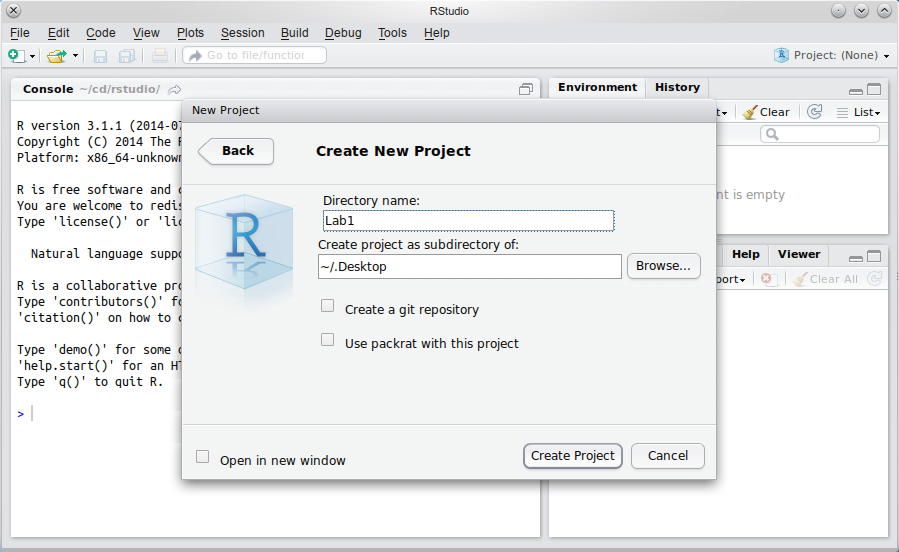
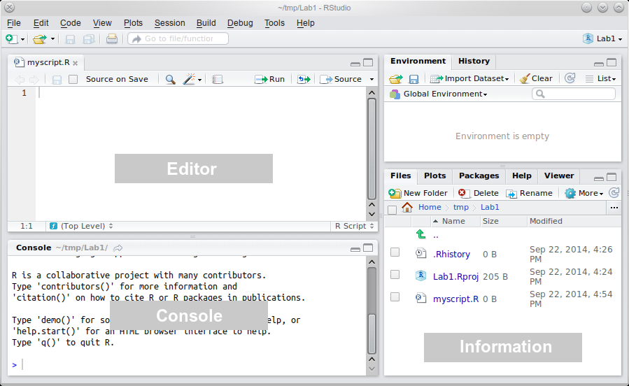

Welcome to the first Univariate statistics and Methodology in `R` lab. The labs are designed to give you an opportunity to learn and practice working with `R` as well as manipulating, visualising, and analysing data. Over the next 11 weeks, you will be given various tasks that will gently guide you through the process. These labs are the best time for you to make sure you understand the material covered and keep on top of things. So please, if you have any questions, ask the lecturers or the tutors. We are all keen to help!

\ 

The aim of this first lab is to help you get started with the programming language. So, first of all, let us know if you had any installation problems with:

- `R`, the programming language core
- RStudio, the integrated development environment for programming in `R`
- Swirls, little interactive `R` lessons (not compulsory, but can be useful to practice)

The installation instructions are in the "Lecture notes" tab of the course's LEARN page, but you can also check the Navarro book, Part II, Chapter 3.1. If you have not installed `R` on your laptop yet, do it now.


# Let's get going!

Now that you have `R` installed on your machine, you can practice creating your first `R` project and writing your own first `R` script. A script is simply a text file, where you write some `R` commands that the `R` engine then executes for you. Again, instructions on how to run `R` code along with useful tips and tricks can be found on LEARN. Do check them out!

## RStudio
`r task()`First of all, let's get organised: Create a folder called "Univariate" somewhere sensible on your computer (*e.g.,* in My Documents). You will use this folder to create `R` scripts and store data for these labs. It may also be a good idea to keep other documents related to this course in there. Make a choice where you want this folder to sit and stick to it. Moving it later on will cause more hassle than it's worth so **don't do it**!

`r task()`Start RStudio. Select the <kbd>Project</kbd> drop-down (top right) and create a new empty project in a new directory called "Lab1" (see Figure\ 1) within your "Univariate" folder.

\ 


<p class="caption">**Fig. 1:** Creating a new project in a directory called *Lab1*.</p>

\ 

**Tip: **If you're not familiar with the idea of a directory (also sometimes called a folder), read Navarro, pp.\ 81-84, for an explanation. If, for example, you wanted the folder to be on your Desktop, you would create the project as a subdirectory of ~/Desktop (Mac) or ~/../Desktop (PC). Don't do it though. Instead create the project in your [whatever location]/Univariate/ folder.

**Pro tip: **Before you do anything else, go to the <kbd>View</kbd> menu and zoom in or out to your satisfaction. RStudio will remember this setting when it next starts.

`r task()`Select <kbd>File</kbd> > <kbd>New File</kbd> > <kbd>R Script</kbd>. In the window that appears, click on the [floppy disk](https://en.wikipedia.org/wiki/Floppy_disk)[^1] icon ({width=25px}) just below *Untitled1* and save the (blank) script as `myscript.R`

[^1]:That was before the glorious era of the MiniDisc

Your RStudio window should now look like the one in Figure\ 2 (we've added some labels to the various windows for ease of reference).


<p class="caption">**Fig. 2:** `myscript.R` ready to edit.</p>

<p class="why">Projects are handy for several reasons. For instance, when you create a project, the default working directory will be set in the project's folder[^2]. That means that, unless you tell it otherwise, `R` will look in the project folder for any files you tell it to access. Projects are also easily connected with version control software (*e.g.,* Git) and are great for collaborative scripts and documents. Additionally, `R` can be configured to have different default settings for each project which can be very useful. These topics may be somewhat advanced but it is a good idea to get into the habit of using RStudio projects. **We strongly recommend you create a separate project within the Univariate folder for each lab.**</p>

[^2]:You can have `R` print out the path to the current working directory by running the command `getwd()`.

## Console
The "heart of `R`" is the *Console* window. This is where instructions are sent to `R`, and its responses are given. The console is, almost exclusively, the way of talking to `R` in RStudio.

`r task()`Click on the console and type `1 + 1` (then hit <kbd>&#8629;Enter</kbd>).

You should see something like the following:
``` {r baby, prompt = TRUE}
1 + 1
``` 


The *Information* area (all of the right-hand side of RStudio) shows you useful information about the state of your project. At the moment, you can see some relevant files in the bottom pane, and an empty "Global Environment" at the top. The global environment is a virtual storage of all objects you create in `R`. So, for example, if you read in some data into `R` (more on that later), this is where they will be put and where `R` will look for them if you tell it to manipulate or analyse the data.

`r task()`Click on the console and type `x <- 1 + 1` and see what happens. Look at the Environment tab, in particular.

As you can see, the tab now contains a "**Values**" section and, within it, there is a `x` and it's associated value of `2` (the result of the `1 + 1` operation). What happened here is that you told `R` to run the `1 + 1` command and store its result inside an *object* labelled `x`. In, other words, you *assigned* the value resulting from the `1 + 1` command to the object `x` using the *assignment operator* `<-` (think of it as an arrow pointing the result of the right-hand side command to the left-hand side object).

`r task()`Hit <kbd>Ctrl</kbd> + <kbd>&uarr;</kbd> (<kbd>&#8984;</kbd> + <kbd>&uarr;</kbd> on Mac). Highlight the `x <- 1 + 1` line and press <kbd>&#8629;Enter</kbd> (this will rewrite it to the console). Edit it so that it reads `x <- x + 1`. What will this do? Press <kbd>&#8629;Enter</kbd> to confirm your guess.

If you look in at the Environment tab, you will see that `x` now stores the value of `3`. Though it may look like the `x` object simply got incremented by 1, let not that deceive you. What `R` really did was it took whatever was inside the `x` object and added `1` to it, storing the result of the operation in a different object. It then took the `x` label from the old object and put it on the new one, immediately forgetting all about the original object. It may seem to you like a distinction without a difference but, as will become clear later on, it is an important one.

`r task()`Try running the command `y <- c(1, 2, 3, 4, 5)`. What happens? What kind of thing is `y`?

Anything you put on the right-hand side of the `<-` must be a valid `R` command and, as such, must be able run on its own. So, if you're not sure what `c(1, 2, 3, 4, 5)` does, just type it into the console and press <kbd>&#8629;Enter</kbd>...

As you can see `R` returned a **vector** of numbers. A vector is just a fancy name for an ordered sequence of elements. In this case, since the elements are all numbers, the result is a *numeric vector* of five numbers (1-5).

An important habit to get into is to think of commands in terms of their output and of objects in terms of their content. If someone asks you what the command `c(1, 2, 3, 4, 5)` does, you should say: "It returns a numeric vector of length 5 with values 1, 2, 3, 4, and 5."

Similarly, the answer to the question what is `y` should be the similar: "An object containing a numeric vector of length 5 with values 1, 2, 3, 4, and 5." This mode of thinking and talking about commands and objects is not self-serving and will become crucial later on, when you are doing more complex things[^3] in `R`.

[^3]: For example: `df$total_score <- rowMeans(df[ , grep("item", names(df))], na.rm = T)`

`r task()`Try `y <- y * 2` and guess what will happen before you press <kbd>&#8629;Enter</kbd>.

`r task()`Type `y` followed by <kbd>&#8629;Enter</kbd>. This is one way you can get `R` to print out a value into the console.

As you can see, each element of `y` was multiplied by 2. This means, that addition (as well as other arithmetic operations) in `R` is a *vectorised* function - it gets applied to each element of a vector.

`r task()`You can also perform arithmetic operations on two vectors. Try running the command `y / c(1, 2, 3, 4, 5)`.

Here we performed a series of divisions: the first element of `y` (2) was divided by the first element of the vector `c(1, 2, 3, 4, 5)` (1), then the second elements of these vectors (4 and 2, respectively) were used for the division, and so on. The result is a numeric vector of length 5 containing five twos.

If the vectors given to such a vectorised function differ in length, the shorter vector gets *recycled*

`r task()`Try `y + c(2, 3)` to see how that works.

Right, so we added 2 to the first element of `y`, 3 to the 2^nd^, 2 again to the 3^rd^ element, then 3 to the 4^th^ and, once again, 2 to the last element of `y`. The ever so helpful `R` also warned us that the length of the longer of the two added vectors isn't a whole number multiple of the shorter one and so the recycling was not complete.

<p class="why">Being able to perform all sorts of calculations and manipulations of objects is crucial for data processing and analysis. For instance, you might need to calculate a total score based on certain columns of your data representing items on a questionnaire. Some of these items might also be reverse-scored, meaning that you need to flip the values of that variable around[^4]. Imagine, you have such a variable - a numeric vector of numbers between 1 and 5. Reverse-scoring means, that you want to turn 1s into 5s, 2s into 4, 4s into 2s, and 5s into 1s (3s stay as they are). The easiest, and most elegant, way of doing this is simply subtracting this vector from 6. Try it out by hand on a few numbers to convince yourself that this does indeed do the trick.</p>

[^4]:Including such items is considered important good practice in psychometrics. For example, when measuring extraversion on a scale where low scores indicate introversion and high scores indicate extraversion, you may ask your participants to express their agreement with given statements on a scale from 1 ("Strongly disagree") to 5 ("Strongly agree"). If one of the statements is, let's say, "Usually, I would rather stay at home and read a book than go to a wild party.", the participants' scores on this item need to be reversed because strong extraverts will score low and strong introverts will get high scores.

\ 

Moving on...

`r task()`Try `plot(y, y + 3)`. You should see a simple scatterplot appear in the bottom right panel, where information is shown.

A scatterplot is a type of graph that shows a relationship between two numeric variables. Here, the x axis represents the `y` variable and the y axis shows `y + 3`. Both `y` and `y + 3` are numeric vectors (remember, think about commands in terms of their result!). Imagine them side by side as two columns, like this:

```{r, echo = F}
y <- 1:5 * 2
cbind(y, `y + 3` = y + 3)
```

Each point on the plot represents one row of this table, *e.g.,* the point in the bottom left corner is the first row with a `y` value of 2 and `y + 3` value of 5. The plot shows a positive relationship: as `y` gets larger, so does `y + 3`. Moreover, the relationship is perfectly linear (in case you're wondering, yes, it *is* obvious).

Note that RStudio has automatically *switched tab* to show the *Plots* tab, since you've just created a plot. Previously, it showed the *Files* tab. Finally, the *Packages* tab lists all the packages that you have installed and are available to be loaded using the `library()` command.

**Tip: **Click on *Zoom* to see your plot on a larger scale. Remember to close the pop-up window once you're done admiring the plot.

`r task()`Type `?plot` into the Console. What happens?

This is the generic way of getting help on any function (such as `plot()`). `R` help can range from very useful to quite esoteric; once you're familiar with `R`, the help will become more intelligible. In the meantime, the Web is often your friend.

---

**An aside on functions**

Every operation on a value, vector, object, and other structures in `R` is done using functions. You've already used several: `c()` is a function, as are `<-`, `+`, `-`, `*`, *etc.* A function is a special kind of object that takes some arguments and uses them to run the code contained inside of it. Every function has the form `function.name()`[^5] and the arguments are given inside the brackets. Arguments *must be separated with a comma*. Different functions take different number of various arguments. The help file brought up by the `?...` gives a list of arguments used by the given function along with the description of what the arguments do and what legal values they take.

In the help file for `plot()`, we can see that, apart from the x and y coordinates of the points to plot, the function takes an entire host of graphical parameters. For instance, if we add the `main =` argument and give it a legal value (*i.e.,* a string of characters, such as `"My first plot"`), the value will be used as a title of the plot. It is crucial to understand what arguments can be accepted by the functions you use and what the legal values of these arguments are.

Functions are extremely useful and you will learn how to write your own later.

---

[^5]: Some functions have an additional *infix* form: `x <- 1 + 2` is just a shorthand for the basic (prefix) form  <code>&#96;<-&#96;(x, &#96;+&#96;(1, 2))</code>. 

\ 

*The next exercise is a little harder:* Imagine you like your scatterplot but you don't like the open circles it uses to mark each point. Instead, you want to use filled squares.

`r task()`Open a web browser, and search the web for something like "change shape of points in R plot". Using the links returned, see if you can reproduce the plot in Task\ 12 but make the points come out as filled squares.
If that turns out to be easy, try red filled squares. Then try each square a different colour.

**Tip: **There are a lot of ways to do this! The simplest is to look for a *graphical parameter* to do with plot characters and add the appropriate argument to your `plot()` command.

<p class="why">Often a picture is worth a thousand words. A good plot will communicate important information in a clear and concise way both to you as the analyst and your intended audience. Data visualisation is one of `R`'s main strengths.</p>

## Editor
So far you've been entering simple instructions into the Console. But this can be a pain, for two reasons:

  1. As you change commands like `plot()`, it would be nice to be able to edit what you have already typed in.
  2. It would be good to keep a record of what you've done, so that you can do it again at a later stage, perhaps with changes.

Instead of using the console, you can use the *Editor* to type commands. The Editor is used to write your script that then gets interpreted by `R` in a line by line fashion. Since the script is basically a plain text file (with some nice colours added by RStudio to improve readability) the commands you type in can be edited, added, or deleted just like if you were writing an ordinary document. You can run them again later, or build up complex commands and functions over several lines of text.

`r task()`In the Editor, type `x <- seq(-3.5, 3.5)` and hit <kbd>&#8629;Enter</kbd>. What happens?

`r task()`Click on the line you just typed in, and hit <kbd>Ctrl</kbd> + <kbd>&#8629;Enter</kbd> (<kbd>&#8984;</kbd> + <kbd>&#8629;Enter</kbd> if you're on a Mac). What happens now?

```{r, eval=solution, echo = F}
x <- seq(-3.5, 3.5)
```

This is an important practical distinction between the Console and the Editor: In the Console, <kbd>&#8629;Enter</kbd> runs the command. In the Editor, it just adds a new line. The purpose of this is to facilitate writing scripts without running each line of code. It also enables you to beak down your commands over multiple lines so that you don't end up with a line that's hundreds of characters long. For example:

```{r, eval = F}
poisson_model <- glm( # R knows that an open bracket can't be the end of command...
  n_events ~ gender + scale(age) + scale(n_children) + # ...nor can a plus...
    I(SES - min(SES)) * scale(years_emp, , F), # ...or a comma
  df, family = "poisson") # closing bracket CAN be the end
```

`r task()`What does `x` become? What does `seq()` do?

Since `seq` is followed by a set of brackets, you know it's a function. Whenever you encounter an unknown function, it is a good idea to look at its documentation by calling the `?...` command.

`r task()`Add the following lines to the script in the Editor: 

```{r, eval = solution}
y <- dnorm(x)
# plot normal distribution
plot(x, y, type = 'l')
``` 

`r task()`Click on `y <- dnorm(x)`, and hit <kbd>Ctrl</kbd> + <kbd>&#8629;Enter</kbd> (<kbd>&#8984;</kbd> + <kbd>&#8629;Enter</kbd>). Press the keys twice more to pass the other lines to the console. What does `#` do? What is the end result?

The hash (`#`) marks everything to the right of it as comment. Comments are useful for annotating the code so that you can remember what it means when you return to your code months later (it will happen!). It also improves code readability if you're working on a script in collaboration with others. Comments should be clear but also concise. There is no point in paragraphs of verbose commentary.

You might not be very satisfied with your end result (not a very curvy curve!). This is probably because we calculated values of the normal distribution (in `y`) for too few values of `x`. Maybe we can fix that...

`r task()`Change the first line of your script in the editor so that it reads:
```{r, eval = solution} 
x <- seq(-3.5, 3.5, length.out = 49)
``` 

```{r, echo=F, eval=solution}
y <- dnorm(x)
```

`r task()`select your entire script using the mouse (or <kbd>Ctrl</kbd> + <kbd>A</kbd>), and press <kbd>Ctrl</kbd> + <kbd>&#8629;Enter</kbd> (<kbd>&#8984;</kbd> + Enter</kbd>). What happens? Look both at the plot and at the Global Environment above it.

`r task()`change the last line of your script so that it reads:
```{r, eval = solution}
# that's a small L, not a one
plot(x, y, type = 'l', lwd = 3, lty = 2, col = 'red')
``` 

`r task()`Create a new plot. Do you need to run just the `plot()` line or the whole script? Why? What does the plot look like now?

Since the edited `plot(...)` line has the same first two arguments (`x` and `y`) as the version before, and since these two variables have already been created, there is no need to re-run anything but this particular line.

`r task()`Advanced task: Using [www.rseek.org](www.rseek.org) and/or `R` help, try and edit your plot command to produce a plot similar to that in Fig.\ 3, including the title and axis labels

```{r nor, fig.cap="**Fig. 3:** Distribution produced using `seq()`, `dnorm()`, and `plot()`.", echo=solution, class="solution"}
x <- seq(-3.5, 3.5, length.out = 49)
# notice how a long line of code can be wrapped over several lines
# in the editor to improve readability.
plot(x, dnorm(x), main = 'The Normal Distribution',
     ylab = 'Density', xlab = 'SDs from the Mean',
     lwd = 4, col = 'red', type = 'l')
``` 

`r task()`Save `myscript.R` (click on the disk icon).

<p class="why">Writing (and saving) scripts has just too many advantages over coding in the console to list and it it is crucial that you learn how to do it. It will enable you to write reproducible code you can rerun whenever needed, reuse chunks of code you created for a previous project in your analysis, and, when you realise you made a mistake somewhere (when, not if, because this too will happen!), you'll be able to edit the code and recreate your analysis in a small fraction of the time it would take you to analyse your data anew without a script.</p>


# A simple analysis

The point of this section is to get you used to playing with `R`, including loading, creating, plotting, and analysing data. What follows isn't necessarily meaningful or the 'best' way of doing things; all of the numbers are made up and the techniques used are a bit cumbersome. They should, however, give you a flavour of some of the things you can do. Don't worry if you're not familiar with all of the statistical concepts yet (although many of you will be); these will all be explained as the course progresses.

`r task()`Open a new blank script; save it as `iq.R` (see Task\ 2)

`r task()`Type in the following and execute the commands:

```{r, eval = solution}
## compare iqs
library(foreign)
df <- read.spss('http://is.gd/iqs_spss', to.data.frame = TRUE)
``` 

`r task()`You should see a new variable `df` in the Global environment. Click on this. You should get something like figure\ 4.


<p class="caption">**Fig. 4:** Viewing the data in `df`.</p>

`df` is some data in a *data frame*, roughly equivalent to an Excel spreadsheet or worksheet in SPSS. As you've seen, you can inspect it by clicking it in the Global Environment, but it's not editable (through point and click); we'll get on to editing *etc.,*\ later in the course.

The two lines of script you've run have done a huge amount of work, in fact. They've connected to the internet and downloaded an SPSS `.sav` data file, and converted it to `R` format. If you look at the Console, you will see some (harmless) warnings reflecting the fact that the data was created in a recent version of SPSS.

The data is supposed to represent the IQs of a particular football team, Fulchester United (11 players plus one substitute). We'd like to know whether Fulchester's mean IQ is higher than what you might expect from a totally 'average' football team, drawn indiscriminately from the general population.

`r task()`Type the following in to `iq.R` (you might need to click on the tab first):

```{r, eval = solution}
# draw 12 random IQs from the `general population'
# assuming mean population IQ is 100 and SD is 15
iqs <- rnorm(12, mean = 100, sd = 15)
``` 

`r task()`What does `iqs` contain? (You might want to type `iqs` into the Console to see all of the values without affecting your script)

`r task()`Type `summary(iqs)` into the Console for some useful further information

`r task()`look at your neighbour's Console, if they're at roughly the same stage as you. Why is their output for `summary(iqs)` different?

`r task()`Now add the following lines to your script and run them

```{r, eval = solution} 
# create new data frame with labels
df2 <- data.frame(ID = LETTERS[13:24], IQ = iqs)
``` 

`r task()`Look at `df2` and see if you can work out what you've created

**Pro tip: **`LETTERS[13:24]` is an example of *subscripting*. Go the console and type `LETTERS`. What do you get? On the next line, type `13:24` and see what that returns. Now run `LETTERS[13:24]`. Can you see what it's doing? Try `LETTERS[c(13, 1, 18, 20, 9, 14)]`

`r task()`Type the following in to the `iq.R` script (`rbind()` binds by rows) and run it:

```{r, eval = solution}
# bind the two data frames together
df <- rbind(df, df2)
``` 

`r task()`What has happened to `df`? (If you want to click on `df` but the tab is already open, close the tab first)

Note that `df` contains all of the IQs in one column. We need to add another column to *index* which sample the IQs come from (called a *factor* in `R`).

`r task()`Add the following to your script and run it:

```{r, eval = solution}
# add a factor
df$source <- gl(2, 12, labels = c('Fulchester', 'Random'))
``` 

`gl()` stands for 'generate levels' (of a factor). The first number gives the number of levels; the second, how many times each level is repeated; the `labels =` argument allows us to call the levels something more useful than `c(1, 2)` (which would be the default).

`r task()`Look at `df` again (you might need to close the tab and reopen it). What have you just added?

**It's time to do some statistics!** This is a very simple test, and the results will vary depending on the random sample you created earlier, but let's compare the Fulchester sample with our random sample:

`r task()`Add the following to your script and run it:

**Tip: **`IQ ~ source` can be read as "`IQ` is predicted by `source`". There are other ways of specifying a t-test but this way makes it clear what you are expecting to affect what

``` {r, eval = solution}
# run a t-test
t.test(IQ ~ source, data = df)
``` 

`r task()`The output of the t-test should be in the Console below. What can you say about your totally fake data?

## Last Things

`r task()`Exit the project (<kbd>Lab1</kbd> > <kbd>Close Project</kbd>, save anything when asked)

You should get an empty RStudio. You can create a different project for different work (using the *Project* drop-down), or you can re-open *Lab1* and you should be exactly where you were before.

When you restart RStudio next time, you can go straight to the *Projects* tab to open an existing project (RStudio will remember where the relevant files are), or you can create a brand new project in a new directory (and switch between projects at will at any time).

\ 

#### That's it for today! We would really appreciate you feedback on this and future labs and on whether you feel you learnt anything.
